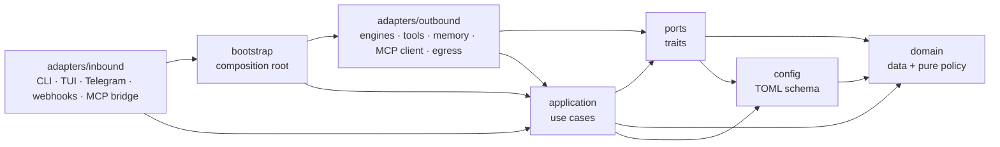

# Code map — where everything lives and how to extend it

> Index into the codebase. Interactive knowledge graph: [`code-map.html`](code-map.html) (open in a browser).
> Freshness is enforced: `tests/code_map.rs` fails if a source file is missing below or the graph in the `.html` is stale
> (regenerate: `TENGU_REGEN_CODE_MAP=1 cargo test --test code_map`). Deeper reads: [`architecture-2026-04-27.md`](architecture-2026-04-27.md) (per-turn flow), [`tools.md`](tools.md), [`context-management-2026-04-27.md`](context-management-2026-04-27.md).

## 1. Layers

| Layer | Path | May import | Enforced by |
|---|---|---|---|
| domain | `src/domain/` | `domain` only, no IO crates | `tests/layering_lint.rs` `RULES` |
| ports | `src/ports/` | domain, config | `RULES` |
| config | `src/config/` | domain | `RULES` |
| application | `src/application/` | domain, ports, config (std IO allowed) | `RULES` |
| outbound | `src/adapters/outbound/` | all but `adapters::inbound`, `bootstrap` | `FORBIDDEN` |
| bootstrap | `src/bootstrap/` | all but `adapters::inbound` | `FORBIDDEN` |
| inbound | `src/adapters/inbound/` | everything | — |

A use case needs something outside? Add a trait in `src/ports/`, implement it in `src/adapters/outbound/`, inject it in `src/bootstrap/`.

## 2. Where does X live

| Concern | File(s) |
|---|---|
| CLI subcommands (`chat status doctor telegram webhooks eval secret prune mcp-bridge agentic-memory-server skill run-agent`) | `src/adapters/inbound/cli/mod.rs` (`Commands` + `run`), bodies in `cli/{run_agent,skill,doctor}.rs` |
| Config schema, defaults, validation, loading | `src/config/mod.rs` (`Config`, `AgentConfig`, `impl Default for Config`, `default_*` fns, `validation_errors`, `validate_agent`, `Config::load`) |
| `[egress]` schema / runtime policy | `src/config/egress.rs` / `src/adapters/outbound/egress.rs` |
| Config file resolution + `TENGU_HOME` | `src/config/paths.rs`, `src/bootstrap/sandbox.rs`, `cli/mod.rs::run` |
| Tool trait, contexts | `src/ports/tool.rs` (`Tool`, `ToolPlugin`, `ToolCtx`, `PluginCtx`, `ToolDirectory`) |
| Tool catalog (every built-in tool) | `src/adapters/outbound/tools/mod.rs` (`catalog`, `register_catalog`, `advertised_defs`) |
| Tool permissions | `src/domain/scope.rs` (`ToolScope`), `src/bootstrap/tools.rs` (`resolve_tool_scopes`, `permissive_scope`) |
| Opt-in tool names | `src/domain/tools.rs` (`WORKSPACE_TOOLS`) |
| Tool dispatch | `src/application/tools/registry.rs` (`ToolRegistry`, `PluginToolExecutor`) |
| Executor wiring (catalog + skills + MCP + scopes) | `src/bootstrap/tools.rs` |
| Engine trait | `src/ports/engine.rs` (`Engine`, `EngineContext`, `ToolExecutor`) |
| Engines + factory | `src/adapters/outbound/engines/{mod,openrouter,claude_code}.rs` (`build_engine`) |
| Inner tool loop | `src/application/chat/tool_loop.rs` (`collect_engine_response`, `run_single_engine_turn`) |
| One chat turn | `src/application/chat/service.rs` (`ChatRuntimeService::process_user_text`) |
| Planner / plan / DAG / replan | `src/application/orchestrator/{planner,executor,replan,retry}.rs`, `src/domain/plan.rs` |
| Orchestrator wiring | `src/bootstrap/orchestrator.rs` (`build_orchestrator`) |
| Plan-step subprocess | parent `src/adapters/outbound/subprocess_runner.rs` → child `src/adapters/inbound/cli/run_agent.rs` |
| Planner registry file | `src/application/orchestrator/shared_files.rs` → `TENGU_PLANNER_REGISTRY.md` |
| Memory (ports / manager / stores / Postgres) | `src/ports/memory.rs`, `src/application/memory/`, `src/adapters/outbound/memory/`, `src/adapters/outbound/tools/agentic_memory/` |
| MCP client / bridge server | `src/adapters/outbound/mcp_client/` / `src/adapters/inbound/mcp_bridge.rs` (env contract `src/adapters/outbound/bridge_env.rs`) |
| Skills registry / lifecycle | `src/application/skills/registry.rs` / `src/application/skills/lifecycle/` |
| Secrets vault / redaction | `src/adapters/outbound/secrets.rs` / `src/domain/secrets.rs` |
| Metrics records / bus | `src/domain/metrics.rs` / `src/application/metrics.rs` |
| Channels | `src/adapters/inbound/{tui/,telegram.rs,webhooks.rs}` + shared `channel.rs` |

## 3. Config — where it lives, how it resolves

| # | Source | Used when |
|---|---|---|
| 1 | `sandboxes/<name>/config.toml` | `--sandbox <name>` on `chat`, `doctor`, `telegram`, `webhooks`, `skill evolve`, `skill doctor` — replaces the base config wholesale (`bootstrap/sandbox.rs::load_sandbox_or`). `eval --sandbox` overrides the skill's `evals/config.toml`; `prune --sandbox` also clears that sandbox's workspace state |
| 2 | `-c/--config <path>` | given |
| 3 | `$TENGU_CONFIG` | set (the CLI pins it to the file actually used, so children see the same one) |
| 4 | `<TENGU_HOME>/config.toml` | default; `TENGU_HOME` defaults to `~/.tengu` (`config/paths.rs`) |
| 5 | `Config::default()` | no file found — one `main` agent, `openrouter`, `anthropic/claude-sonnet-4.6` |

| Also loaded | Where |
|---|---|
| `.env` in cwd | first thing in `cli/mod.rs::run` (dotenvy) |
| Secrets vault `<TENGU_HOME>/secrets.vault` → env | `outbound/secrets.rs::load_secrets_into_env` (`tengu secret …`; password `TENGU_MASTER_PASSWORD` or prompt) |
| `${VAR}` in any config value | `Config::load` substitutes before parsing |
| `$VAR` in `[[mcp_servers]]` `env` / `auth.token` | resolved when the server is spawned (`mcp_client/client.rs`) |
| Documented example (never loaded) | `config.example.toml` |

`Config::load` = read → `${VAR}` substitution → TOML parse → `validate()` → `fold_default_scopes()`. `run-agent` children get the sandbox name over IPC and the resolved egress policy as `TENGU_EGRESS`.

| Section | Struct (`src/config/`) | Read by | Unknown keys |
|---|---|---|---|
| `runtime_profile` | `Config` | `RuntimeProfile` in `config/mod.rs` | top level: ignored |
| `[agents.<name>]` | `AgentConfig` (+ `LimitsConfig`, `FlowConfig`, `IdentityConfig`, `LensConfig`, `PromptBudgetConfig`, `AgentClaudeCodeConfig`) | `outbound/engines/mod.rs` (engine, model, limits), `bootstrap/tools.rs` (tools, scopes, workspace_tools), `outbound/subprocess_runner.rs` (limits), `application/orchestrator/shared_files.rs` (description) | **error** (`deny_unknown_fields`) |
| `[orchestrator]` | `OrchestratorConfig` | `bootstrap/orchestrator.rs` | ignored |
| `[memory]` | `MemoryConfig` | `bootstrap/memory.rs`, `application/orchestrator/planner.rs`, `bootstrap/tools.rs` | ignored |
| `[egress]` | `EgressConfig` (`config/egress.rs`) | `outbound/egress.rs` | **error** |
| `[[mcp_servers]]` | `McpServerConfig` | `outbound/mcp_client/`, `bootstrap/tools.rs`, `outbound/engines/claude_code.rs`, `inbound/mcp_bridge.rs` | ignored |
| `[default_scopes.<tool>]` | `ToolScope` (`domain/scope.rs`) | folded into every agent by `Config::fold_default_scopes` | ignored |
| `[claude_code]` | `ClaudeCodeConfig` | `outbound/engines/mod.rs` | ignored |
| `[telegram]` / `[webhooks]` | `TelegramConfig` / `WebhookConfig` | `inbound/telegram.rs` / `inbound/webhooks.rs` | ignored |
| `[scaffold]` | `ScaffoldConfig` | `outbound/scaffold.rs` | ignored |
| `[skill_lifecycle]` | `SkillLifecycleConfig` (`config/skill_lifecycle.rs`) | `inbound/evolve.rs`, `inbound/eval.rs` | ignored |
| `[hub]` | `HubConfig` | validation + `tengu status` display only | ignored |

## 4. Recipes

### Add a tool (Rust)

| Step | Where |
|---|---|
| 1. `impl Tool` + a `ToolPlugin` + `tool_defs()`; first line of `execute` is `ctx.scope.check_*` or `// scope: pure-compute` | `src/adapters/outbound/tools/<name>/mod.rs` |
| 2. `pub(crate) mod <name>;` + one `ToolEntry` row in `catalog()` | `src/adapters/outbound/tools/mod.rs` |
| 3. Opt-in only: add the name | `src/domain/tools.rs::WORKSPACE_TOOLS` |
| 4. Give it to an agent: `tools = ["<name>"]` (+ `[agents.<a>.scopes.<name>]`) | `sandboxes/<sandbox>/config.toml` |
| 5. Test | `cargo test --bin tengu catalog && cargo test --test scope_lint` |

No Rust: HTTP API → a skill that teaches `http_request`; existing tool server → `[[mcp_servers]]` (tools appear as `<server>__<tool>`). Details: [`tools.md`](tools.md).

### Add an inference engine (new provider / backend)

| Step | Where |
|---|---|
| 1. `impl Engine` — `id`, `context_window`, `supports_tool_use`, `manages_own_workspace`, `available_models`, `run` → stream of `StreamEvent` (`TextDelta`, `ToolCallStart/Delta/End`, `Usage`, `Done`/`Error`). The engine only streams tool calls; `application/chat/tool_loop.rs` executes them | `src/adapters/outbound/engines/<name>.rs` |
| 2. HTTP only through `egress::policy().llm_api_client(..)` (Tor / allowlist / audit); a subprocess engine follows `claude_code.rs` (`claude_cli_env`) | `src/adapters/outbound/egress.rs` |
| 3. `pub(crate) mod <name>;` + a match arm in `build_engine` (and `build_planner_engine` if it may plan). Unknown names currently fall through to OpenRouter — validation is what rejects them | `src/adapters/outbound/engines/mod.rs` |
| 4. Allow the name: `require_one_of("agents.<id>.engine", …, &["openrouter", "claude_code", …])` in `validate_agent` | `src/config/mod.rs` |
| 5. Heavy deps → a cargo feature + `#[cfg(feature = …)]` on the module and match arm | `Cargo.toml` `[features]` |
| 6. Tests: mock HTTP server like `openrouter.rs` tests; `tengu status` shows `diagnostics()` | engine file |
| 7. Docs | `docs/engine-backends.md`, `config.example.toml` |

### Adjust inference (no code)

| Knob | Where | Default |
|---|---|---|
| Backend / model | `[agents.<a>] engine`, `model` (OpenRouter slug `anthropic/claude-sonnet-4-6`; Claude Code bare `claude-sonnet-4-6`) | `openrouter` |
| OpenAI-compatible endpoint | env `OPENROUTER_BASE_URL` (+ `OPENROUTER_API_KEY`) | `https://openrouter.ai/api` |
| Context / output / timeouts | `[agents.<a>.limits] context_window`, `max_output_tokens_per_turn`, `request_timeout_secs`, `stream_event_timeout_secs` | 1_000_000 / derived / 600 / 120 |
| Tool loop | `limits.max_tool_rounds`, `max_tool_result_chars`, `compact_result_limit`, `max_mcp_result_chars` | 70 / 300_000 / 200 / 50_000 |
| Flow budget | `limits.max_tokens_per_flow`, `[agents.<a>.flow]` compaction | 100_000 |
| Subagent step | `limits.max_tool_rounds`, `limits.step_timeout_secs` | 70 / 600 |
| Claude Code | `[claude_code] cli_path`, `timeout_secs`; `[agents.<a>.claude_code] builtin_tools_profile` (`none`/`read_only`/`editor`/`editor_shell`) | `claude` / 120 / `editor_shell` |
| Planner | `[orchestrator] agent`, `max_attempts_per_step`, `max_replans` (use an OpenRouter agent) | — / 3 / 2 |
| LLM traffic over Tor | `[egress] route_llm_api` | true under `network = "tor"` |
| Embeddings | `[memory] embedding_model` — pinned: Postgres column is `vector(1536)` | `text-embedding-3-small` |

### Extend config

| Change | Steps |
|---|---|
| New field in an existing section | Add `pub <field>: T` with a doc comment and `#[serde(default)]` or `#[serde(default = "default_<field>")]` + `fn default_<field>()`; update that struct's `impl Default`; add checks in `validation_errors` / `validate_agent` (`ValidationErrors::require*`); read it in the consuming adapter / bootstrap |
| New agent key | Same, on `AgentConfig` — it is `deny_unknown_fields`, so configs using the key fail to load until the field exists; update `impl Default for Config`'s `main` agent literal |
| New top-level section | `#[derive(Debug, Clone, Serialize, Deserialize, Default)] pub struct XConfig` (consider `deny_unknown_fields`), `#[serde(default)] pub x: XConfig` on `Config`, add to `impl Default for Config` |
| Always | Update `config.example.toml` and every `sandboxes/*/config.toml` that should use it; add a `validate_*` test in `src/config/mod.rs`; `cargo test --bin tengu config` |

### Other recipes

| Task | Steps |
|---|---|
| Add a port | Trait in `src/ports/<area>.rs` → impl in `src/adapters/outbound/` → construct + inject in `src/bootstrap/` → use from `src/application/` via `Arc<dyn Trait>` |
| Add a channel (Slack, …) | `src/adapters/inbound/<name>.rs`; build executor / memory / orchestrator through `src/bootstrap/{tools,memory,orchestrator}.rs`; share `inbound/channel.rs`; add a `Commands` variant in `cli/mod.rs`; feature-gate in `Cargo.toml` |
| Add a CLI subcommand | `Commands` variant + match arm in `src/adapters/inbound/cli/mod.rs`; body in `cli/<name>.rs` |
| Add a memory backend | `impl VectorStore` / `MemoryProvider` / `RecallStore` (`src/ports/memory.rs`) in `src/adapters/outbound/memory/`; select it in `src/bootstrap/memory.rs` (or `planner_recall_store` in `bootstrap/orchestrator.rs`) |
| Add a skill-eval metric kind | `src/application/skills/lifecycle/metric_kinds/<kind>.rs` implementing `MetricKind` (`lifecycle/metrics.rs`) |
| Add an agent / skill | TOML / SKILL.md only — `CLAUDE.md` § How to add a new agent / skill |

## 5. Runtime files and environment

| File | Written by | Purpose |
|---|---|---|
| `<TENGU_HOME>/config.toml` | you | base config |
| `<TENGU_HOME>/secrets.vault` | `tengu secret` | AES-GCM vault, loaded into env at start |
| `<TENGU_HOME>/logs/egress.jsonl` | `outbound/egress.rs` | network audit |
| `~/.tengu/skills/`, `<workspace>/.tengu/skills/`, `skills/` | you / `tengu skill install` | three skill tiers (`application/skills/registry.rs`) |
| `<workspace>/.tengu/memory.bin`, `<workspace>/.tengu/cache.db` | memory tools / `shared_cache` | disk vector store / SQLite cache |
| `TENGU_PLANNER_REGISTRY.md`, `TENGU_PLAN.md` (repo root) | `application/orchestrator/shared_files.rs` | planner registry / debug copy of the plan |
| Postgres `agentic_memory` | `outbound/tools/agentic_memory/` | Open Brain (feature `postgres_memory`) |

| Env var | Meaning |
|---|---|
| `TENGU_HOME`, `TENGU_CONFIG` | config home / config file (see §3) |
| `OPENROUTER_API_KEY`, `OPENROUTER_BASE_URL`, `OPENROUTER_REFERER`, `OPENROUTER_TITLE` | OpenRouter engine + embedder |
| `TENGU_MEMORY_DATABASE_URL`, `TENGU_WIKI_COMPILER_MODEL` | Postgres Open Brain / wiki compiler model |
| `TENGU_MASTER_PASSWORD` | secrets vault password |
| `TENGU_TOR_PROXY` | Tor proxy when `[egress].proxy` unset |
| `TENGU_EGRESS` | resolved egress policy handed to children (wins over their config) |
| `TENGU_SESSION_ID`, `TENGU_AGENT_NAME`, `TENGU_AGENT_IPC` | set for `run-agent` children (session key, agent, IPC mode) |
| `TENGU_BRIDGE_WORKSPACE`, `TENGU_BRIDGE_TOOLS`, `TENGU_BRIDGE_MAX_RESULT_CHARS`, `TENGU_BRIDGE_SCOPES`, `TENGU_BRIDGE_MCP_SERVERS` | Claude Code engine → `tengu mcp-bridge` contract |
| `TENGU_PERSISTENT_STORE_CHUNK_SIZE`, `TENGU_PERSISTENT_STORE_CHUNK_OVERLAP` | forwarded to the bridge |
| `TELEGRAM_BOT_TOKEN`, `TENGU_TELEGRAM_ALLOWED_USERS` | Telegram channel |
| `PRIVY_APP_ID`, `PRIVY_APP_SECRET`, `PRIVY_WALLET_ID` | crypto tools |
| `TENGU_TUI_METRICS`, `TENGU_TUI_RAG_DEBUG`, `TENGU_GPU_HINT`, `RUST_LOG` | TUI panels / runtime profile / logging |
| `ANTHROPIC_API_KEY` | removed from the Claude CLI child env (it uses its own login) |

## 6. Tests and lints

| Test | Guards |
|---|---|
| `cargo test --bin tengu` | unit tests (in-file `#[cfg(test)]` modules; no `[lib]` target) |
| `tests/layering_lint.rs` | layer dependency rules (§1) |
| `tests/scope_lint.rs` | every `Tool::execute` starts with a scope check |
| `tests/code_map.rs` | this file lists every source file; `code-map.html` graph is current |
| `tests/run_agent_ipc.rs` | `tengu run-agent` IPC boundary |
| `tests/mcp_bridge_external.rs` | bridge proxies `[[mcp_servers]]` (fixture `tests/fixtures/fake_mcp_server.sh`) |

## 7. Every source file

### Entry (2 files)

| File | Lines | What it is |
|---|---:|---|
| `src/adapters/mod.rs` | 11 | Adapters — everything that talks to the outside world. |
| `src/main.rs` | 14 | Tengu binary entry point. Layers: `domain` ← `ports` ← `application` ← |

### domain — data + pure policy (11 files)

| File | Lines | What it is |
|---|---:|---|
| `src/domain/memory.rs` | 61 | Shared types for memory retrieval results. |
| `src/domain/message.rs` | 209 | Messages, tool calls/definitions, stream events, and the precision `Lens` |
| `src/domain/metrics.rs` | 293 | Metrics — context/token consumption telemetry. |
| `src/domain/mod.rs` | 14 | Domain — plain data and pure policy. Imports nothing from the rest of the |
| `src/domain/plan.rs` | 276 | Plan types and topology helpers. |
| `src/domain/scope.rs` | 407 | `ToolScope` — default-deny, per-tool access control. Pure policy logic; |
| `src/domain/secrets.rs` | 46 | `SecretRegistry` — secret values to redact from tool output, transcripts |
| `src/domain/session.rs` | 58 | Chat/flow session state — per-session prompt assembly and loop state. |
| `src/domain/token.rs` | 43 | Shared token-estimation helpers. |
| `src/domain/tools.rs` | 22 | Names of the opt-in workspace tools — the values `[agents.<name>]` |
| `src/domain/usage.rs` | 34 | Token-usage bookkeeping from engine `StreamEvent::Usage` frames: per-turn |

### ports — traits (8 files)

| File | Lines | What it is |
|---|---:|---|
| `src/ports/engine.rs` | 97 | Engine port — the AI backend powering an agent (OpenRouter, Claude Code, |
| `src/ports/memory.rs` | 153 | Memory ports — `MemoryProvider` (harness-level memory backends driven by |
| `src/ports/mod.rs` | 10 | Ports — traits the application layer depends on; adapters implement them. |
| `src/ports/orchestration.rs` | 172 | Orchestration ports — what the orchestrator needs from the outside world |
| `src/ports/shell.rs` | 8 | Port for executing shell commands in a workspace directory. |
| `src/ports/skill_source.rs` | 7 | Port for discovering skill.md files from the workspace. |
| `src/ports/tool.rs` | 123 | Tool port — the per-tool trait, plugin grouping, and the borrowed contexts |
| `src/ports/tool_activity.rs` | 8 | Output port for publishing tool activity events to the UI/log layer. |

### config — TOML schema (4 files)

| File | Lines | What it is |
|---|---:|---|
| `src/config/egress.rs` | 203 | `[egress]` — network policy schema and validation. The runtime policy |
| `src/config/mod.rs` | 1674 | Config layer — the TOML schema (`sandboxes/<name>/config.toml`), its |
| `src/config/paths.rs` | 37 | Filesystem locations the config layer resolves: `TENGU_HOME`, the default |
| `src/config/skill_lifecycle.rs` | 83 | Config for the skill-lifecycle subsystem. Parses the `[skill_lifecycle]` |

### application — use cases (41 files)

| File | Lines | What it is |
|---|---:|---|
| `src/application/chat/flow.rs` | 271 | Flow management: key resolution, history turn limits, compaction policy, and compaction. |
| `src/application/chat/mod.rs` | 7 | Chat use cases — one user turn (`service`), flow/session budgeting |
| `src/application/chat/prompt_budget.rs` | 91 | Prompt budgeting helpers for runtime turns. |
| `src/application/chat/service.rs` | 498 | Chat subsystem: types, slash-commands, and per-turn orchestration. |
| `src/application/chat/tool_loop.rs` | 363 | The inner tool loop — run engine rounds, execute the model's tool calls |
| `src/application/memory/fencing.rs` | 86 | `<memory-context>` fenced block helpers. |
| `src/application/memory/injector.rs` | 70 | Pre-turn memory injection. |
| `src/application/memory/manager.rs` | 337 | `MemoryManager` — holds one built-in provider plus at most one external. |
| `src/application/memory/mod.rs` | 33 | Harness-owned memory subsystem — the **in-process, file/disk** layer. |
| `src/application/memory/writer.rs` | 67 | Post-turn memory writes — spawned, non-blocking. |
| `src/application/metrics.rs` | 90 | Metrics sink — the process-global broadcast bus every LLM / embedding |
| `src/application/mod.rs` | 10 | Application — use cases (chat turn, orchestration, memory, skills, tool |
| `src/application/orchestrator/events.rs` | 87 | `OrchestratorEvent` + broadcast channel. |
| `src/application/orchestrator/executor.rs` | 243 | DAG executor: parallel step dispatch with retry escalation. |
| `src/application/orchestrator/mod.rs` | 197 | Harness-owned orchestration. |
| `src/application/orchestrator/planner.rs` | 942 | Planner — runs the orchestrator agent's LLM call, returns Plan or direct response. |
| `src/application/orchestrator/replan.rs` | 306 | Replan outer loop: on step exhaustion, re-invoke the planner. |
| `src/application/orchestrator/retry.rs` | 156 | Per-step retry policy. |
| `src/application/orchestrator/shared_files.rs` | 498 | Planner context shared by planner and subagents. |
| `src/application/orchestrator/wiring.rs` | 118 | Wiring: `OrchestratorChatPort` backed by a pluggable `ChatServiceFactory` |
| `src/application/skills/lifecycle/approval_gate.rs` | 158 | Terminal approval gate — prints baseline→best delta + unified diff, |
| `src/application/skills/lifecycle/audit.rs` | 170 | Append-only audit log for skill lifecycle ops (`install`, `remove`, `export`). |
| `src/application/skills/lifecycle/evolve.rs` | 573 | EvolveSession — bounded rewrite→rescore loop. |
| `src/application/skills/lifecycle/fixtures.rs` | 283 | `evals/prompts.yaml` read/write + mechanical transcript→fixture extraction. |
| `src/application/skills/lifecycle/learner_state.rs` | 302 | Per-learner skill state — sidecar JSON at `skills/<name>/state/<learner_id>.json`. |
| `src/application/skills/lifecycle/metric_kinds/description_trigger.rs` | 669 | `description_trigger` — re-expressed Cowork `run_loop.py` pattern. |
| `src/application/skills/lifecycle/metric_kinds/dialog_replay.rs` | 444 | `dialog_replay` — score a skill against the *current* conversation slice |
| `src/application/skills/lifecycle/metric_kinds/llm_judge.rs` | 234 | `llm_judge` — LLM-scored rubric evaluation, prefilled to force JSON. |
| `src/application/skills/lifecycle/metric_kinds/mod.rs` | 15 | Metric kind implementations. One file per kind. |
| `src/application/skills/lifecycle/metric_kinds/script.rs` | 161 | `script` — invoke `sh <path>` with env vars, parse stdout JSON `{pass, score, notes?}`. |
| `src/application/skills/lifecycle/metric_kinds/shell_check.rs` | 209 | `shell_check` metric kind — run a command, match exit code + stdout regex. |
| `src/application/skills/lifecycle/metric_kinds/tool_assertion.rs` | 192 | `tool_assertion` — dispatch a registered workspace tool and assert on its output. |
| `src/application/skills/lifecycle/metrics.rs` | 363 | Metric types shared across kinds. `MetricKind` trait is the dispatch seam. |
| `src/application/skills/lifecycle/mod.rs` | 17 | Skill lifecycle — distillation, metric measurement, and bounded evolution. |
| `src/application/skills/lifecycle/scanner.rs` | 647 | Tengu-scoped threat scanner for skill directories. |
| `src/application/skills/lifecycle/scratch_worktree.rs` | 219 | Scratch git worktree for evolve cycles. Falls back to a plain directory |
| `src/application/skills/lifecycle/storage.rs` | 504 | Metric storage: rolling `metrics.json`, append-only `history.jsonl`, per-run reports. |
| `src/application/skills/mod.rs` | 5 | Skills — registry + system-prompt assembly (`registry`) and the |
| `src/application/skills/registry.rs` | 1313 | Skill subsystem — types, parsing, registry, filesystem discovery, |
| `src/application/tools/mod.rs` | 4 | Tool dispatch — `ToolRegistry` + `PluginToolExecutor` (the `ToolExecutor` |
| `src/application/tools/registry.rs` | 239 | Tool registry + `PluginToolExecutor` — dispatches a model's tool call to |

### bootstrap — composition root (5 files)

| File | Lines | What it is |
|---|---:|---|
| `src/bootstrap/memory.rs` | 123 | Memory wiring — builds the `MemoryManager` (builtin provider + disk vector |
| `src/bootstrap/mod.rs` | 9 | Bootstrap — the composition root. Builds concrete adapters and hands them |
| `src/bootstrap/orchestrator.rs` | 496 | Orchestrator wiring — the `ChatServiceFactory` that runs one agent turn, |
| `src/bootstrap/sandbox.rs` | 39 | Sandbox resolution — picks `sandboxes/<name>/config.toml` over the base |
| `src/bootstrap/tools.rs` | 724 | Tool wiring — builds the `PluginToolExecutor` an agent runs with: the tool |

### adapters/outbound — driven adapters (53 files)

| File | Lines | What it is |
|---|---:|---|
| `src/adapters/outbound/bridge_env.rs` | 11 | Env contract between the Claude Code engine (writes it into the CLI's |
| `src/adapters/outbound/egress.rs` | 773 | Egress policy — the one choke point for LLM-initiated network traffic. |
| `src/adapters/outbound/engines/claude_code.rs` | 800 | Claude Code engine — runs agents through the local Claude CLI subprocess. |
| `src/adapters/outbound/engines/mod.rs` | 144 | Engine adapters — implementations of `ports::engine::Engine` and the |
| `src/adapters/outbound/engines/openrouter.rs` | 535 | OpenRouter engine — OpenAI-compatible chat completions with streaming |
| `src/adapters/outbound/mcp_client/client.rs` | 418 | Outbound MCP client — stdio and http transports over JSON-RPC 2.0. |
| `src/adapters/outbound/mcp_client/mod.rs` | 339 | MCP client — tengu connects to the `[[mcp_servers]]` in the sandbox |
| `src/adapters/outbound/mcp_client/protocol.rs` | 60 | JSON-RPC 2.0 wire types plus the MCP-specific `tools/list` response shapes. |
| `src/adapters/outbound/mcp_client/proxy_tool.rs` | 121 | `McpProxyTool` — forwards an `execute` call to a remote MCP server. |
| `src/adapters/outbound/memory/builtin.rs` | 190 | `BuiltinMemoryProvider` — MEMORY.md + identity + daily logs + vector. |
| `src/adapters/outbound/memory/disk_vector.rs` | 372 | Disk-backed `VectorStore` — bincode file at `<workspace>/.tengu/memory.bin`. |
| `src/adapters/outbound/memory/embedder.rs` | 220 | Text embedding client. |
| `src/adapters/outbound/memory/mod.rs` | 9 | Memory adapters — `BuiltinMemoryProvider` (MEMORY.md, identity files, |
| `src/adapters/outbound/mod.rs` | 15 | Outbound (driven) adapters — implementations of `crate::ports` and the |
| `src/adapters/outbound/noop.rs` | 37 | Shared no-op implementations of small ports / executors. |
| `src/adapters/outbound/prune.rs` | 235 | `tengu prune` — wipe all cached/ephemeral state while preserving config, |
| `src/adapters/outbound/scaffold.rs` | 77 | Workspace scaffold — creates directories and seed files before agents start. |
| `src/adapters/outbound/secrets.rs` | 385 | Secrets management: encrypted vault storage + runtime redaction. |
| `src/adapters/outbound/shell.rs` | 81 | Shell execution adapter for running skill commands. |
| `src/adapters/outbound/subprocess_runner.rs` | 530 | Subprocess runner — the `WorkerHandle` that runs each plan step. |
| `src/adapters/outbound/tools/agentic_memory/mod.rs` | 1423 | `agentic_memory` — Postgres-backed Open Brain + LLM Wiki memory surface. |
| `src/adapters/outbound/tools/args.rs` | 118 | Shared helpers for `Tool::execute`: JSON argument extraction and |
| `src/adapters/outbound/tools/cache/mod.rs` | 81 | Cache plugin — SQLite-backed shared workspace cache for agent coordination. |
| `src/adapters/outbound/tools/cache/shared_cache.rs` | 272 | `shared_cache` tool — SQLite-backed workspace cache for agent data exchange. |
| `src/adapters/outbound/tools/crypto/abi_encode.rs` | 122 | `abi_encode` tool — pure-compute Solidity ABI encoder. |
| `src/adapters/outbound/tools/crypto/helpers.rs` | 346 | Shared Privy + ABI helpers used by the crypto plugin tools. |
| `src/adapters/outbound/tools/crypto/hex_to_uint256.rs` | 92 | `hex_to_uint256` tool — pure-compute hex → decimal uint256 converter. |
| `src/adapters/outbound/tools/crypto/mod.rs` | 81 | Crypto plugin — EVM transaction signing, message signing, and ABI helpers. |
| `src/adapters/outbound/tools/crypto/sign_message.rs` | 82 | `sign_message` tool — EIP-191 personal_sign via Privy. |
| `src/adapters/outbound/tools/crypto/sign_tx.rs` | 165 | `sign_and_send_transaction` tool — submit an EVM transaction via Privy. |
| `src/adapters/outbound/tools/crypto/wallet_address.rs` | 67 | `get_wallet_address` tool — return the Privy-managed wallet address. |
| `src/adapters/outbound/tools/http/mod.rs` | 37 | HTTP plugin — generic outbound HTTP client for skill-driven API calls. |
| `src/adapters/outbound/tools/http/request.rs` | 818 | `http_request` tool — generic HTTP client for skill-driven API calls. |
| `src/adapters/outbound/tools/manage_skill/mod.rs` | 1366 | `manage_skill` LLM-callable tool — unified write-side counterpart to |
| `src/adapters/outbound/tools/memory/ingest.rs` | 155 | `memory_ingest` tool — ingest a document or fact into vector memory. |
| `src/adapters/outbound/tools/memory/mod.rs` | 311 | Memory plugin — vector-memory-backed tools. |
| `src/adapters/outbound/tools/memory/persistent_store.rs` | 766 | `persistent_store` tool — chunked file storage with vector semantic search. |
| `src/adapters/outbound/tools/memory/search.rs` | 306 | `memory_search` tool — targeted vector read of the memory store. |
| `src/adapters/outbound/tools/mod.rs` | 301 | Tools — one directory per tool (or tool group). Each implements |
| `src/adapters/outbound/tools/skill/mod.rs` | 96 | Skill plugin — dispatch for shell skills. |
| `src/adapters/outbound/tools/skill/shell_tool.rs` | 171 | Reusable `SkillShellTool` — executes a shell skill template. |
| `src/adapters/outbound/tools/skill_lifecycle/apply_improver_proposal.rs` | 262 | `apply_improver_proposal` — LLM-callable tool used by `skill-improver-inline` |
| `src/adapters/outbound/tools/skill_lifecycle/compress_and_store.rs` | 56 | `compress_and_store` — the harness-enforced "step is done" signal. |
| `src/adapters/outbound/tools/skill_lifecycle/distill.rs` | 739 | `skill_distill` LLM-callable tool — writes a new skill directory from |
| `src/adapters/outbound/tools/skill_lifecycle/mod.rs` | 48 | Skill-lifecycle plugin — registers the `skill_distill` LLM-callable tool. |
| `src/adapters/outbound/tools/skill_resource/mod.rs` | 391 | Skill-resource plugin — `skill_resource` tool. |
| `src/adapters/outbound/tools/view_skill/mod.rs` | 887 | View-skill plugin — `view_skill` tool. |
| `src/adapters/outbound/tools/workspace/list_directory.rs` | 119 | `list_directory` tool — list the entries of a directory in the workspace. |
| `src/adapters/outbound/tools/workspace/mod.rs` | 56 | Workspace plugin — filesystem and shell primitives scoped to a workspace. |
| `src/adapters/outbound/tools/workspace/read_file.rs` | 143 | `read_file` tool — read a file from the workspace, with PDF text extraction. |
| `src/adapters/outbound/tools/workspace/run_command.rs` | 117 | `run_command` tool — execute a shell command in the workspace. |
| `src/adapters/outbound/tools/workspace/test_support.rs` | 79 | Shared test harness for workspace tool unit tests. |
| `src/adapters/outbound/tools/workspace/write_file.rs` | 135 | `write_file` tool — write content to a file in the workspace. |

### adapters/inbound — driving adapters (15 files)

| File | Lines | What it is |
|---|---:|---|
| `src/adapters/inbound/activity.rs` | 96 | Human-readable tool-activity lines shown by the TUI and Telegram. |
| `src/adapters/inbound/channel.rs` | 231 | Helpers shared by the chat channels (TUI, Telegram): loop-state factory, |
| `src/adapters/inbound/cli/doctor.rs` | 199 | `tengu status` / `tengu doctor` (incl. `--tor` exit check). |
| `src/adapters/inbound/cli/mod.rs` | 601 | `tengu` CLI — clap definitions and command dispatch. `main.rs` only calls |
| `src/adapters/inbound/cli/run_agent.rs` | 655 | `tengu run-agent` — the plan-step subprocess. Reads `AgentIpcInput` from |
| `src/adapters/inbound/cli/skill.rs` | 1131 | `tengu skill …` — list, doctor, install, remove, export, seed, eval, evolve. |
| `src/adapters/inbound/eval.rs` | 2673 | Skill eval runner — `tengu eval <skill>`. |
| `src/adapters/inbound/evolve.rs` | 444 | `tengu skill evolve` — the evolve loop driver: baseline eval, improver |
| `src/adapters/inbound/mcp_bridge.rs` | 555 | Stdio MCP bridge — exposes Tengu tools to Claude Code via the MCP protocol. |
| `src/adapters/inbound/mod.rs` | 15 | Inbound (driving) adapters — what turns outside input into use-case calls |
| `src/adapters/inbound/telegram.rs` | 2079 | Telegram adapter — pipe, commands, and runtime in one module. |
| `src/adapters/inbound/tui/app.rs` | 40 | TUI application state model — pure data, no widget state. |
| `src/adapters/inbound/tui/mod.rs` | 943 | Full-screen TUI runtime for interactive chat using cursive. |
| `src/adapters/inbound/tui/view.rs` | 399 | Cursive view builders and UI update helpers. |
| `src/adapters/inbound/webhooks.rs` | 746 | Inbound webhook listener — `tengu webhooks --sandbox <name>`. |
