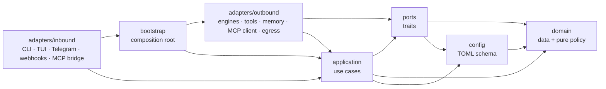

# Code map — where everything lives and how to extend it

> Index into the codebase. Interactive knowledge graph: [`code-map.html`](code-map.html) (open in a browser).
> Freshness is enforced: `tests/code_map.rs` fails if a source file is missing below or the graph in the `.html` is stale
> (regenerate: `TENGU_REGEN_CODE_MAP=1 cargo test --test code_map`). Deeper reads: [`architecture-2026-04-27.md`](architecture-2026-04-27.md) (per-turn flow), [`tools.md`](tools.md), [`context-management-2026-04-27.md`](context-management-2026-04-27.md).

## 1. Layers

```mermaid
graph LR
  inbound["adapters/inbound<br/>CLI · TUI · Telegram · webhooks · MCP bridge"] --> bootstrap["bootstrap<br/>composition root"]
  inbound --> application
  bootstrap --> outbound["adapters/outbound<br/>engines · tools · memory · MCP client · egress"]
  bootstrap --> application["application<br/>use cases"]
  outbound --> ports
  outbound --> application
  application --> ports["ports<br/>traits"]
  ports --> domain["domain<br/>data + pure policy"]
  application --> domain
  application --> config["config<br/>TOML schema"]
  ports --> config
  config --> domain
```

| Layer | Path | May import | Enforced by |
|---|---|---|---|
| domain | `src/domain/` | `domain` only, no IO crates | `tests/layering_lint.rs` `RULES` |
| ports | `src/ports/` | domain, config | `RULES` |
| config | `src/config/` | domain | `RULES` |
| application | `src/application/` | domain, ports, config (std IO allowed) | `RULES` |
| outbound | `src/adapters/outbound/` | all but `adapters::inbound`, `bootstrap` | `FORBIDDEN` |
| bootstrap | `src/bootstrap/` | all but `adapters::inbound` | `FORBIDDEN` |
| inbound | `src/adapters/inbound/` | everything | — |

A use case needs something outside? Add a trait in `src/ports/`, implement it in `src/adapters/outbound/`, inject it in `src/bootstrap/`.

## 2. Where does X live

| Concern | File(s) |
|---|---|
| CLI subcommands (`chat status doctor telegram webhooks run decide history backtest risk eval secret prune mcp-bridge agentic-memory-server skill run-agent`) | `src/adapters/inbound/cli/mod.rs` (`Commands` + `run`), bodies in `cli/{run_agent,skill,doctor,history,backtest,risk}.rs` |
| Hidden test commands `tengu tool list` (catalog names) · `tengu tool call` (one or a `--batch` of calls through the executor a `run-agent` child builds, `--transcript` = the conversation: bridge conformance) · `tengu tool turn` (one engine turn as any agent, private exec agents included — the `@<agent>` chat path; Claude Code tools through the real bridge: engine-matrix xm legs) | `src/adapters/inbound/cli/tool.rs` |
| Config schema, defaults, validation, loading | `src/config/mod.rs` (`Config`, `AgentConfig`, `impl Default for Config`, `default_*` fns, `validation_errors`, `validate_agent`, `Config::load`) |
| `[egress]` schema / runtime policy | `src/config/egress.rs` / `src/adapters/outbound/egress.rs` |
| Config file resolution + `TENGU_HOME` | `src/config/paths.rs`, `src/bootstrap/sandbox.rs`, `cli/mod.rs::run` |
| Tool trait, contexts | `src/ports/tool.rs` (`Tool`, `ToolPlugin`, `ToolCtx`, `PluginCtx`, `ToolDirectory`) |
| Tool catalog (every built-in tool) | `src/adapters/outbound/tools/mod.rs` (`catalog`, `register_catalog`, `advertised_defs`) |
| Tool permissions | `src/domain/scope.rs` (`ToolScope`, `resolve_path`, `protected_write` — what writers refuse, `shell_command_binary` — what `shell_bins` gates; `protected_write_in` — plus the system-prompt files in a hardened sandbox, `AgentConfig::hardened`), `src/bootstrap/tools.rs` (`resolve_tool_scopes`, `permissive_scope`, `grant_workspace_root`, `compose_agent`, `workspace_or_temp` — a step / one-shot turn without `workspace` runs in a temp dir) |
| Opt-in tool names | `src/domain/tools.rs` (`WORKSPACE_TOOLS`) |
| Tool dispatch | `src/application/tools/registry.rs` (`ToolRegistry`, `PluginToolExecutor`) |
| Executor wiring (catalog + skills + MCP + scopes) | `src/bootstrap/tools.rs` |
| Engine trait | `src/ports/engine.rs` (`Engine`, `EngineContext`, `ToolExecutor`) |
| Engines + factory | `src/adapters/outbound/engines/{mod,openrouter,claude_code}.rs` (`build_engine`) + `local.rs` |
| Inner tool loop | `src/application/chat/tool_loop.rs` (`collect_engine_response`, `run_single_engine_turn`) |
| One chat turn | `src/application/chat/service.rs` (`ChatRuntimeService::process_user_text`) |
| Planner / plan / DAG / replan | `src/application/orchestrator/{planner,executor,replan,retry}.rs`, `src/domain/plan.rs` |
| Orchestrator wiring | `src/bootstrap/orchestrator.rs` (`build_orchestrator`) |
| Plan-step subprocess | parent `src/adapters/outbound/subprocess_runner.rs` → child `src/adapters/inbound/cli/run_agent.rs` |
| Planner registry file | `src/application/orchestrator/shared_files.rs` → `TENGU_PLANNER_REGISTRY.md` |
| Memory (ports / manager / stores / Postgres) | `src/ports/memory.rs`, `src/application/memory/`, `src/adapters/outbound/memory/`, `src/adapters/outbound/tools/agentic_memory/` |
| MCP client / bridge server | `src/adapters/outbound/mcp_client/` / `src/adapters/inbound/mcp_bridge.rs` (env contract `src/adapters/outbound/bridge_env.rs`) |
| Skills registry / lifecycle | `src/application/skills/registry.rs` / `src/application/skills/lifecycle/` |
| Secrets vault / redaction | `src/adapters/outbound/secrets.rs` / `src/domain/secrets.rs` |
| Metrics records / bus | `src/domain/metrics.rs` / `src/application/metrics.rs` |
| Decision loop (Jev picks, tools execute) | `src/application/decision_loop/` · config `src/config/decision_loop.rs` · execution maps `src/config/execution_map.rs` (skill `skills/execution-map/`) · client `src/adapters/outbound/decisions.rs` · wiring `src/bootstrap/decision.rs` · replay (`SimClock`, terminal-only loop, `Verdict`) + decision cache `src/adapters/outbound/decision_cache.rs` · backtest gate arm `src/application/backtest/gate.rs` + `src/domain/backtest/gate.rs` (`build_gate`; `docs/xlab-2026-10-01.md` § 7) |
| Typed tool observations + TTL cache | `src/domain/observation.rs` (`Observation`, `Observed`, `Field`, `CachePolicy`) · port `src/ports/observation.rs` · `src/application/observe.rs` (`observe`) · store `src/adapters/outbound/observations.rs` (`<workspace>/.tengu/observations.db`) · loop `world` `src/application/decision_loop/world.rs` |
| Solana LP tools (`sol_price` … `lp_swap_plan` … `lp_decide`; live-capable writes `solana_close_token_accounts` …) | interfaces `src/adapters/outbound/tools/solana/defs.rs` · plugin + families `src/adapters/outbound/tools/solana/` · RPC / accounts `src/adapters/outbound/solana/` · pure types + policy `src/domain/solana.rs`, `src/domain/lp/` · tx wire format `src/domain/solana_tx.rs` |
| `tengu run` (loops, feeds, lease, heartbeat, `doctor --live`) | `src/adapters/inbound/run.rs` · `src/bootstrap/runtime.rs` · `src/application/runtime/{mod,loops,health,feeds}.rs` · `src/domain/runtime.rs` · fire times `src/domain/schedule.rs` · lease `src/adapters/outbound/runtime_store.rs` · `[runtime]` `src/config/runtime.rs` · `[feeds.<n>]` `src/config/feeds.rs` · doc `docs/runtime-2026-09-30.md` |
| Sandbox sections tools read (`[xmarket]`, `[risk]`, `[paper]`, calendars, `[rate_limits]`, `[recorder]`, `[xmarket.weekend_fade]`) | `src/config/sections.rs` (`AgentConfig::sandbox`) · `src/config/{xmarket,risk,rate_limits,recorder,hardening}.rs` |
| Hyperliquid tools (`hl_ctx`, `hl_book`) + market rows + costs + ledger math | interfaces `src/adapters/outbound/tools/hyperliquid/defs.rs` · plugin + tools `src/adapters/outbound/tools/hyperliquid/` · decoders `src/domain/hl/` · `/info` client `src/adapters/outbound/hyperliquid/info.rs` · `src/domain/market.rs` · `src/domain/book.rs` · `src/domain/xm/{cost,ledger}.rs` |
| Risk gate + paper fills + ledger + kill switch (`[risk]` limits → `RiskVerdict` → `ledger.db`) | gate `src/domain/xm/risk.rs` (`evaluate`) · halts `src/domain/xm/risk_state.rs` · limits + load rules `src/config/risk.rs` (`RiskConfig::limits`), `src/config/hardening.rs` · fill engine `src/domain/xm/paper.rs` + latency and the ledger closure `src/application/paper.rs` · exec orders `src/domain/xm/exec.rs` + `src/adapters/outbound/tools/xm/exec_common.rs` (`run_exec`) · ledger math `src/domain/xm/ledger.rs` · ledger port `src/ports/paper.rs` + store `src/adapters/outbound/paper_store.rs` · tools `src/adapters/outbound/tools/xm/` (`risk_status`, `paper_positions`, exec tools `paper_order` / `paper_close` / `xm_exits` / `xm_weekend_fade`) · exit rules `src/domain/xm/exits.rs` + `tools/xm/exits.rs` · shadow gate `evaluate_shadow` (`src/domain/xm/risk.rs`) · CLI `src/adapters/inbound/cli/risk.rs` · doc `docs/xmarket-risk-paper-2026-09-30.md` |
| Weekend fade (rule W: window, signals, capped + shadow ledgers, replay) | pure rule + rows `src/domain/xm/weekend_fade.rs` · exec tool `src/adapters/outbound/tools/xm/weekend_fade.rs` · knobs + load rules `src/config/xmarket.rs` (`WeekendFadeConfig`) · golden `tests/fixtures/xmarket/weekend_2026-09-26_*.json` (test helpers `weekend_fade::golden`) · the weekend run `sandboxes/xmarket-weekend/config.toml` (runbook at its top; its replay test `config::xmarket::tests::weekend_sandbox_replays_the_golden`) · doc `docs/xmarket-risk-paper-2026-09-30.md` § Weekend fade, `docs/runtime-2026-09-30.md` § Weekend run |
| History recorder, budgets, backoff, time | `src/adapters/outbound/history_sqlite.rs` + `open_observation_store` (`outbound/observations.rs`) · `src/adapters/outbound/rate_limit.rs` · `src/domain/backoff.rs` · `src/adapters/outbound/http_class.rs` · `src/domain/{tz,calendar}.rs` · `src/ports/clock.rs` |
| Market-data warehouse + backfill (xlab: `tengu history backfill / events / import-hl-archive / import-json / coverage`) | types `src/domain/marketdata.rs` · decoders `src/domain/marketdata_decode.rs` (SEC EDGAR: `src/domain/sec.rs`) · port `src/ports/market_data.rs` · store `src/adapters/outbound/market_data.rs` (`<state dir>/market.db`) · fetchers + importers `src/adapters/outbound/backfill/` · CLI `src/adapters/inbound/cli/history.rs` · `[backtest]` universes `src/config/backtest.rs` · doc `docs/xlab-2026-10-01.md` § 4, § 10 |
| Backtests (xlab: `tengu backtest`, strategy specs, arms, run dirs) | engine (pure) `src/domain/backtest/` (`spec`, `kinds`, `labels`, `engine`, `fills`, `costs`, `features`, `stats`, `report`) · share splits `StockSplit` in `src/domain/marketdata.rs` · use case `src/application/backtest/mod.rs` (`resolve` → `prepare` → [gate: `run_gate` → `evaluate_gated`] → `evaluate`) + run dir `run_dir.rs` (`<state dir>/backtests/<run id>/`) · spec hash `src/domain/canonical.rs` · `[backtest]` (+ `splits`) + strategy-library load rules `src/config/backtest.rs` · CLI `src/adapters/inbound/cli/backtest.rs` (`--gate`, `--max-decisions`, `--concurrency`, `--offline`) · library `sandboxes/xlab/config.toml` · doc `docs/xlab-2026-10-01.md` § 5–7, § 10 |
| Engine matrix (every engine × model runs tool sets; every catalog tool, a shell skill and an `[[mcp_servers]]` proxy in a set) | live legs `tests/engine_matrix.rs` + fixtures `tests/fixtures/engine_matrix/` (hardened, `[risk]`) and `tests/fixtures/engine_matrix/open/` (memory, shell, `token_mcp_server.sh`), fixture skill `tests/fixtures/skills/matrix_cat` (exec tools on private `xm_*` agents via `tengu tool turn`, `src/adapters/inbound/cli/tool.rs`) · `tengu doctor --engines` `src/adapters/inbound/cli/doctor.rs` (`doctor_engines`) + `src/domain/engine_smoke.rs` · activity: `StreamEvent::ToolRan` → `EngineResponse.tool_runs` / IPC `AgentIpcOutput.tools` · doc `docs/engine-backends.md` § Engine matrix |
| Source records (O2: facts from approved sources — SEC EDGAR, EU TED — with full provenance) | types (pure) `src/domain/source/record.rs` (`SourceRecord` `source_record/1`, `Fact` incl. `withdrawn`, `NativeAmount`, `Place`, `Origin`, `Inference`, `SourceClass`, `Trust`; `validate`, `with_identity`, `withdrawal`) · per-class rules + registry policy `src/domain/source/rules.rs` · two-clock as-of view `src/domain/source/asof.rs` · evidence packet `source_asof/1` + untrusted-text fence `src/domain/source/packet.rs` · split-world checks `src/domain/source/checks.rs` (+ `testkit.rs`) · module table `src/domain/source/mod.rs` · SEC filing → record `src/domain/source/sec_records.rs` · store port `src/ports/source_store.rs` (`SourceStore`) · store `src/adapters/outbound/sources/store.rs` (`sources.db`) · SEC fetch `src/adapters/outbound/sources/sec.rs` (+ `mod.rs`: `fetch_gate`) · TED notice → record `src/domain/source/ted.rs` · TED fetch + import `src/adapters/outbound/sources/ted.rs` (fixtures `tests/fixtures/ted/`) · as-of use case + retention `src/application/sources.rs` · CLI `tengu sources` `src/adapters/inbound/cli/sources.rs` (list, fetch, import, asof, terms, purge, disable / enable) · registry `[sources]` `src/config/sources.rs` · sandbox `sandboxes/soe/config.toml` (rows disabled, closed world) · content hash `src/domain/canonical.rs` · page `docs/tutorial/source-evidence.html` |
| Lineage registry (`tengu lineage`: experiments, variants, episodes, capabilities, generations, `[generation]` binding) | records `lineage/` (README) · types + checks + queries (pure) `src/domain/lineage/` · loader + `[generation]` `src/config/lineage.rs` · ports `src/ports/lineage.rs` · verify `src/application/lineage/` · probe / resolver / run dirs `src/adapters/outbound/lineage/` · CLI `src/adapters/inbound/cli/lineage.rs` · fixture `tests/fixtures/lineage/` · doc `docs/lineage-2026-10-06.md` |
| Software Opportunity Engine (SOE, offline: O0 + O1 values, records, economics, gates, ranking, eval set, `tengu soe`; O3 / O4 pure domain: observe, proposals, challenges, allocation, memo, forecast log, review packet, ops; O3 weekly cycle + its infrastructure (`[soe]`, adapters, the weekly job) + its stage tools, sandbox, skills and the SOE-G0 generation; O4 replay, grades, forecast resolution, Review #2 packet) | values (pure) `src/domain/soe/value.rs` · records (pure) `src/domain/soe/{record,profile,opportunity,risk,experiment,episode,portfolio}.rs` · economics (three scenarios) `src/domain/soe/economics.rs` · PRD § 7.2 hard gates `src/domain/soe/gates.rs` · capability fit `src/domain/soe/matching.rs` · ranking primitives + `HOLD` / unallocated week `src/domain/soe/rank.rs` · eval cases `src/domain/soe/eval.rs` + `tests/fixtures/soe/` (synthetic profile, 16 cases, example week) · O3 observe (O2 packet → views + evidence index) `src/domain/soe/observe.rs` · Architect proposal `src/domain/soe/proposal.rs` · Critic challenge `src/domain/soe/challenge.rs` · allocation — the one portfolio builder — + `decide_week` `src/domain/soe/allocate.rs` · memo `src/domain/soe/memo.rs` · O4 forecast log `src/domain/soe/forecast.rs` · Review #2 packet + stop flags `src/domain/soe/review.rs` · cycle ops `src/domain/soe/ops.rs` · O4 replay set + scoring `src/domain/soe/replay.rs` · module rules `src/domain/soe/mod.rs` · cycle ports (stage runner, cycle store) `src/ports/soe.rs` · O3 weekly cycle `src/application/soe/cycle.rs` (+ stage window `submit.rs`, `freeze.rs` incl. `verify_state`, tests `tests.rs` + synthetic cycle cases `tests/fixtures/soe/cycles/`) · O4 replay `src/application/soe/replay.rs` · grades + forecast resolution `src/application/soe/grade.rs` · Operator Review #2 packet `src/application/soe/review.rs` · private profile + record-dir + cited-views loader + the `[soe]` section and its closed-world load rules `src/config/soe.rs` · cycle adapters `src/adapters/outbound/soe/` (`FsCycleStore`, `SubprocessStageRunner`, `CachedStageRunner`) · the `soe_cycle` job `src/application/soe/job.rs` (feed kind `job`, `src/config/feeds.rs`) + its composition `src/bootstrap/soe.rs` · stage tools `soe_view` / `soe_propose` / `soe_challenge` `src/adapters/outbound/tools/soe/` (fixture state root `tests/fixtures/soe/state/` + `drafts/`) · sandbox `sandboxes/soe/config.toml` (`[soe]`, `soe_architect` / `soe_critic` on `claude_code` with built-ins off, `[feeds.soe_week]`, deny-all side-effect scopes, bound to SOE-G0) · skills `skills/soe-architect/`, `skills/soe-critic/` · public hash-only lineage `lineage/generations/SOE-G0.toml`, `lineage/capabilities/intel.soe_{view,propose,challenge}.toml`, `lineage/families/soe.toml` · CLI `tengu soe init\|check\|portfolio\|sensitivity\|eval` `src/adapters/inbound/cli/soe.rs` + `tests/soe_cli.rs` · doc `docs/soe-2026-10-08.md` (gates, operator-contract field names, sources, threat model, ranking, eval set, the command) · tutorial `docs/tutorial/soe.html` |
| Channels | `src/adapters/inbound/{tui/,telegram.rs,webhooks.rs}` + shared `channel.rs` |

## 3. Config — where it lives, how it resolves

| # | Source | Used when |
|---|---|---|
| 1 | `sandboxes/<name>/config.toml` | `--sandbox <name>` on `chat`, `doctor`, `telegram`, `webhooks`, `run`, `decide`, `history`, `backtest`, `risk`, `tool call` / `tool turn`, `skill evolve`, `skill doctor` — replaces the base config wholesale (`bootstrap/sandbox.rs::load_sandbox_or`). `eval --sandbox` overrides the skill's `evals/config.toml`; `prune --sandbox` also clears that sandbox's workspace state |
| 2 | `-c/--config <path>` | given |
| 3 | `$TENGU_CONFIG` | set (the CLI pins it to the file actually used, so children see the same one) |
| 4 | `<TENGU_HOME>/config.toml` | default; `TENGU_HOME` defaults to `~/.tengu` (`config/paths.rs`) |
| 5 | `Config::default()` | no file found — one `main` agent, `openrouter`, `anthropic/claude-sonnet-4.6` |

| Also loaded | Where |
|---|---|
| `.env` in cwd | first thing in `cli/mod.rs::run` (dotenvy) |
| Secrets vault `<TENGU_HOME>/secrets.vault` → env | `outbound/secrets.rs::load_secrets_into_env` (`tengu secret …`; password `TENGU_MASTER_PASSWORD` or prompt) |
| `${VAR}` in any config value | `Config::load` substitutes before parsing |
| `$VAR` in `[[mcp_servers]]` `env` / `auth.token` | resolved when the server is spawned (`mcp_client/client.rs`) |
| Documented example (never loaded) | `config.example.toml` |

`Config::load` = read → `${VAR}` substitution → TOML parse → `validate()` → `fold_default_scopes()`. `run-agent` children get the sandbox name over IPC and the resolved egress policy as `TENGU_EGRESS`.

| Section | Struct (`src/config/`) | Read by | Unknown keys |
|---|---|---|---|
| `runtime_profile` | `Config` | `RuntimeProfile` in `config/mod.rs` | top level: **error** (`deny_unknown_fields`) |
| `[agents.<name>]` | `AgentConfig` (+ `LimitsConfig`, `FlowConfig`, `IdentityConfig`, `LensConfig`, `PromptBudgetConfig`, `AgentClaudeCodeConfig`) | `outbound/engines/mod.rs` (engine, model, limits), `bootstrap/tools.rs` (tools, scopes, workspace_tools), `outbound/subprocess_runner.rs` (limits), `application/orchestrator/shared_files.rs` (description) | **error** (`deny_unknown_fields`) |
| `[orchestrator]` | `OrchestratorConfig` | `bootstrap/orchestrator.rs` | ignored |
| `[memory]` | `MemoryConfig` | `bootstrap/memory.rs`, `application/orchestrator/planner.rs`, `bootstrap/tools.rs` | ignored |
| `[egress]` | `EgressConfig` (`config/egress.rs`) | `outbound/egress.rs` | **error** |
| `[[mcp_servers]]` | `McpServerConfig` | `outbound/mcp_client/`, `bootstrap/tools.rs`, `outbound/engines/claude_code.rs`, `inbound/mcp_bridge.rs` | ignored |
| `[default_scopes.<tool>]` | `ToolScope` (`domain/scope.rs`) | folded into every agent by `Config::fold_default_scopes` | ignored |
| `[claude_code]` | `ClaudeCodeConfig` | `outbound/engines/mod.rs` | ignored |
| `[telegram]` / `[webhooks]` | `TelegramConfig` / `WebhookConfig` | `inbound/telegram.rs` / `inbound/webhooks.rs` (`tool_approvals` / `approve_only`: read by nobody — not implemented, `Config::load` warns) | ignored |
| `[decision_loops.<n>]` | `DecisionLoopConfig` (`config/decision_loop.rs`) | `bootstrap/decision.rs`, `inbound/webhooks.rs` (`loop = "<n>"`), `cli/decide.rs` | **error** |
| `[scaffold]` | `ScaffoldConfig` | `outbound/scaffold.rs` | ignored |
| `[xmarket]` | `XmarketConfig` (`config/xmarket.rs`) | `Config::fold_default_scopes` → `AgentConfig::sandbox` (`config/sections.rs`) | **error** |
| `[risk]` / `[paper]` | `RiskConfig` / `PaperConfig` (`config/risk.rs`) | `AgentConfig::sandbox` → the exec tools' gate and fill engine | **error** |
| `[rate_limits.<name>]` | `RateLimitConfig` (`config/rate_limits.rs`) | `outbound/rate_limit.rs` (feeds, `hl-info-client`, `info-fetch`, backfill: `hyperliquid`, `geckoterminal`, `sec`) | **error** |
| `[runtime]` | `RuntimeConfig` (`config/runtime.rs`) | `bootstrap/runtime.rs`, `inbound/run.rs` | **error** |
| `[feeds.<n>]` | `FeedConfig` (`config/feeds.rs`) | `bootstrap/runtime.rs::start_feeds` → `application/runtime/feeds.rs` (`tengu run`) | **error** |
| `[recorder]` | `RecorderConfig` (`config/recorder.rs`) | `outbound/observations.rs::open_observation_store` (every typed-tool store) | **error** |
| `[sources]` | `SourcesConfig` + `[sources.registry.<id>]` `SourceEntry` (`config/sources.rs`) | `Config::fold_default_scopes` → `AgentConfig::sandbox` (`sources`, `sources_state_dir`); `SourceEntry::policy` → `domain/source/asof.rs`; `SourceEntry::fetch_stamp` → the source fetchers (`outbound/sources/sec.rs`); `sources_state_dir` → `outbound/sources::open_source_store`; `tengu sources` (`cli/sources.rs`) reads every row (`source_evidence` lands with O2 C9) | **error** |
| `[soe]` | `SoeConfig` (`config/soe.rs`) | `Config::fold_default_scopes` → `AgentConfig::sandbox` (`soe`); a `kind = "job"` `soe_cycle` feed → `bootstrap/soe.rs::soe_cycle_job` → `application/soe/job.rs`; `bootstrap/runtime.rs::LeasePlan` (`state:<[sources] state>`); hardens the sandbox (`config/hardening.rs`) | **error** |
| `[skill_lifecycle]` | `SkillLifecycleConfig` (`config/skill_lifecycle.rs`) | `inbound/evolve.rs`, `inbound/eval.rs` | ignored |
| `[hub]` | `HubConfig` | validation + `tengu status` display only | ignored |

## 4. Recipes

### Add a tool (Rust)

| Step | Where |
|---|---|
| 1. `impl Tool` + a `ToolPlugin` + `tool_defs()`; first line of `execute` is `ctx.scope.check_*` or `// scope: pure-compute` | `src/adapters/outbound/tools/<name>/mod.rs` |
| 2. `pub(crate) mod <name>;` + one `ToolEntry` row in `catalog()` | `src/adapters/outbound/tools/mod.rs` |
| 3. Opt-in only: add the name | `src/domain/tools.rs::WORKSPACE_TOOLS` |
| 4. Give it to an agent: `tools = ["<name>"]` (+ `[agents.<a>.scopes.<name>]`) | `sandboxes/<sandbox>/config.toml` |
| 5. Test | `cargo test --bin tengu catalog && cargo test --test scope_lint` |

No Rust: HTTP API → a skill that teaches `http_request`; existing tool server → `[[mcp_servers]]` (tools appear as `<server>__<tool>`). Details: [`tools.md`](tools.md).

### Add an inference engine (new provider / backend)

| Step | Where |
|---|---|
| 1. `impl Engine` — `id`, `context_window`, `supports_tool_use`, `manages_own_workspace`, `available_models`, `run` → stream of `StreamEvent` (`TextDelta`, `ToolCallStart/Delta/End`, `Usage`, `Done`/`Error`; `ToolRan` for a tool the engine ran itself, e.g. Claude Code through the bridge). The engine only streams tool calls; `application/chat/tool_loop.rs` executes them | `src/adapters/outbound/engines/<name>.rs` |
| 2. HTTP only through `egress::policy().llm_api_client(..)` (Tor / allowlist / audit); a subprocess engine follows `claude_code.rs` (`claude_cli_env`) | `src/adapters/outbound/egress.rs` |
| 3. `pub(crate) mod <name>;` + a match arm in `build_engine` (and `build_planner_engine` if it may plan). Unknown names currently fall through to OpenRouter — validation is what rejects them | `src/adapters/outbound/engines/mod.rs` |
| 4. Allow the name: `require_one_of("agents.<id>.engine", …, &["openrouter", "claude_code", "local", …])` in `validate_agent` | `src/config/mod.rs` |
| 5. Heavy deps → a cargo feature + `#[cfg(feature = …)]` on the module and match arm | `Cargo.toml` `[features]` |
| 6. Tests: mock HTTP server like `openrouter.rs` tests; `tengu status` shows `diagnostics()`; live: a fixture + legs in `tests/engine_matrix.rs`, `tengu doctor --engines` | engine file |
| 7. Docs | `docs/engine-backends.md`, `config.example.toml` |

### Adjust inference (no code)

| Knob | Where | Default |
|---|---|---|
| Backend / model | `[agents.<a>] engine` (`openrouter` \| `local` \| `claude_code`), `model` (OpenRouter slug `anthropic/claude-sonnet-4-6`; Claude Code bare `claude-sonnet-4-6`; local = server's id) | `openrouter` |
| Local model server | `[agents.<a>.local] base_url`, `api_key_env` | `http://127.0.0.1:8888` (Unsloth), `UNSLOTH_API_KEY` |
| OpenAI-compatible endpoint | env `OPENROUTER_BASE_URL` (+ `OPENROUTER_API_KEY`) | `https://openrouter.ai/api` |
| Context / output / timeouts | `[agents.<a>.limits] context_window`, `max_output_tokens_per_turn`, `request_timeout_secs`, `stream_event_timeout_secs` | 1_000_000 / derived / 600 / 120 |
| Tool loop | `limits.max_tool_rounds`, `max_tool_result_chars`, `compact_result_limit`, `max_mcp_result_chars` | 70 / 300_000 / 200 / 50_000 |
| Flow budget | `limits.max_tokens_per_flow`, `[agents.<a>.flow]` compaction | 100_000 |
| Subagent step | `limits.max_tool_rounds`, `limits.step_timeout_secs` | 70 / 600 |
| Claude Code | `[claude_code] cli_path`, `timeout_secs`; `[agents.<a>.claude_code] builtin_tools_profile` (`none`/`read_only`/`editor`/`editor_shell`) | `claude` / 120 / `editor_shell` |
| Planner | `[orchestrator] agent`, `max_attempts_per_step`, `max_replans` (use an OpenRouter agent) | — / 3 / 2 |
| LLM traffic over Tor | `[egress] route_llm_api` | true under `network = "tor"` |
| Embeddings | `[memory] embedding_model` — pinned: Postgres column is `vector(1536)` | `text-embedding-3-small` |

### Extend config

| Change | Steps |
|---|---|
| New field in an existing section | Add `pub <field>: T` with a doc comment and `#[serde(default)]` or `#[serde(default = "default_<field>")]` + `fn default_<field>()`; update that struct's `impl Default`; add checks in `validation_errors` / `validate_agent` (`ValidationErrors::require*`); read it in the consuming adapter / bootstrap |
| New agent key | Same, on `AgentConfig` — it is `deny_unknown_fields`, so configs using the key fail to load until the field exists; update `impl Default for Config`'s `main` agent literal |
| New top-level section | `#[derive(Debug, Clone, Serialize, Deserialize, Default)] pub struct XConfig` (consider `deny_unknown_fields`), `#[serde(default)] pub x: XConfig` on `Config`, add to `impl Default for Config` |
| Always | Update `config.example.toml` and every `sandboxes/*/config.toml` that should use it; add a `validate_*` test in `src/config/mod.rs`; `cargo test --bin tengu config` |

### Other recipes

| Task | Steps |
|---|---|
| Add a port | Trait in `src/ports/<area>.rs` → impl in `src/adapters/outbound/` → construct + inject in `src/bootstrap/` → use from `src/application/` via `Arc<dyn Trait>` |
| Add a channel (Slack, …) | `src/adapters/inbound/<name>.rs`; build executor / memory / orchestrator through `src/bootstrap/{tools,memory,orchestrator}.rs`; share `inbound/channel.rs`; add a `Commands` variant in `cli/mod.rs`; feature-gate in `Cargo.toml` |
| Add a CLI subcommand | `Commands` variant + match arm in `src/adapters/inbound/cli/mod.rs`; body in `cli/<name>.rs` |
| Add a memory backend | `impl VectorStore` / `MemoryProvider` / `RecallStore` (`src/ports/memory.rs`) in `src/adapters/outbound/memory/`; select it in `src/bootstrap/memory.rs` (or `planner_recall_store` in `bootstrap/orchestrator.rs`) |
| Add a skill-eval metric kind | `src/application/skills/lifecycle/metric_kinds/<kind>.rs` implementing `MetricKind` (`lifecycle/metrics.rs`) |
| Add an agent / skill | TOML / SKILL.md only — `CLAUDE.md` § How to add a new agent / skill |

## 5. Runtime files and environment

| File | Written by | Purpose |
|---|---|---|
| `<TENGU_HOME>/config.toml` | you | base config |
| `<TENGU_HOME>/secrets.vault` | `tengu secret` | AES-GCM vault, loaded into env at start |
| `<TENGU_HOME>/logs/egress.jsonl` | `outbound/egress.rs` | network audit; `agent` / `session` / `call_id` of the call (a `tengu run` feed or loop call: `AttributedExecutor`) |
| `<TENGU_HOME>/logs/decisions.jsonl` | `application/decision_loop/mod.rs` | one line per Jev decisions call — failed calls too (`outcome = "error"`); one `write_all` per line; `ts_ms`, `latency_ms`, `sandbox`, `act_at`, `call_id` of a tool step (`outcome = "refused"` when the risk gate denied it) |
| `<state dir>/backtests/<YYYYMMDDTHHMMSSZ>-<strategy>[-N]/` | `application/backtest/run_dir.rs` (`tengu backtest`) | one run: `report.json` (`backtest/1:<run id>`), `report.md`, `trades-<arm>.jsonl`, `candidates.jsonl`, `skips.json`, the gate's `decisions.jsonl`; the id claimed with `create_dir` |
| `<state dir>/backtests/decision-cache.db` | `outbound/decision_cache.rs` | replay-deterministic Jev answers (key = sha256 hex of the canonical `{model, state, questions}`); only misses call Jev. A replay's audit lines go to the run's `decisions.jsonl` (`trigger = "backtest"`, `ts_ms` = the simulated decision time), never `logs/decisions.jsonl` |
| `<TENGU_HOME>/logs/risk.jsonl` | `outbound/paper_store.rs` | one line per risk verdict — mirror of `ledger.db` `risk_decisions` (canonical); joins `decisions.jsonl` by `call_id` (`docs/xmarket-risk-paper-2026-09-30.md` § Audit) |
| `<TENGU_HOME>/state/<xmarket.state>/` | `tengu run` + xmarket stores | `runtime.db` (leases `runtime:<sandbox>` + `state:<dir>`), `run-<sandbox>.json` (heartbeat), `history/<YYYYMMDD>.db` (`[recorder]`), `ledger.db` (paper ledger, `outbound/paper_store.rs`), `market.db` (market-data warehouse, `outbound/market_data.rs`); `catalog` / `events` / `audit` / `spend` `.db` reserved — layout + load rules in `config/xmarket.rs`, `docs/runtime-2026-09-30.md` § State layout; `tengu prune` never deletes it; `<TENGU_HOME>/state/` without `[xmarket]` |
| `<TENGU_HOME>/state/<sources.state>/sources.db` | the source store (`outbound/sources/store.rs`, O2) | append-only (0600): raw snapshots by sha256 (+ the reviewed terms pages, `tengu sources terms`), source records, coverage, cursors, purge tombstones, runtime switches (`tengu sources disable` / `enable`) — never `market.db`; the dir outside every fs root and workspace (`config/sources.rs`) |
| `<TENGU_HOME>/state/<sources.state>/` (SOE state root, with `[soe]`) | the SOE cycle (`outbound/soe/`, `application/soe/`) | `operator.toml` (the signed profile, 0600), `cycles/<ISO week>/` (live, frozen read-only), `replays/<run id>/`, `stage-cache/<key>.jsonl` (recorded stages), state logs `candidates.jsonl` · `episodes.jsonl` · `forecast-log.jsonl` · `grades.jsonl` · `holdout-reads.jsonl`, `runtime.db` + `run-<sandbox>.json` under `tengu run` (lease `state:<dir>`) |
| `~/.tengu/skills/`, `<workspace>/.tengu/skills/`, `skills/` | you / `tengu skill install` | three skill tiers (`application/skills/registry.rs`) |
| `<workspace>/memory/vectors.bin` (no workspace: `[memory] store_path`, default `~/.tengu/memory/`), `<workspace>/.tengu/storage/`, `<workspace>/.tengu/cache.db` | memory tools (`bootstrap/memory.rs::resolve_memory_store_path`) / `persistent_store` / `shared_cache` | disk vector store / stored files / SQLite cache |
| `TENGU_PLANNER_REGISTRY.md`, `TENGU_PLAN.md` (repo root) | `application/orchestrator/shared_files.rs` | planner registry / debug copy of the plan |
| Postgres `agentic_memory` | `outbound/tools/agentic_memory/` | Open Brain (feature `postgres_memory`) |

| Env var | Meaning |
|---|---|
| `TENGU_HOME`, `TENGU_CONFIG` | config home / config file (see §3) |
| `OPENROUTER_API_KEY`, `OPENROUTER_BASE_URL`, `OPENROUTER_REFERER`, `OPENROUTER_TITLE` | OpenRouter engine + embedder |
| `TENGU_MEMORY_DATABASE_URL`, `TENGU_WIKI_COMPILER_MODEL` | Postgres Open Brain / wiki compiler model |
| `TENGU_MASTER_PASSWORD` | secrets vault password |
| `TENGU_TOR_PROXY` | Tor proxy when `[egress].proxy` unset |
| `TENGU_EGRESS` | resolved egress policy handed to children (wins over their config) |
| `TENGU_SESSION_ID`, `TENGU_AGENT_NAME`, `TENGU_AGENT_IPC` | set for `run-agent` children (session key, agent, IPC mode) |
| `TENGU_BRIDGE_WORKSPACE`, `TENGU_BRIDGE_TOOLS`, `TENGU_BRIDGE_MAX_RESULT_CHARS`, `TENGU_BRIDGE_SCOPES`, `TENGU_BRIDGE_MCP_SERVERS` (server names), `TENGU_BRIDGE_AGENT`, `TENGU_BRIDGE_GRANT_WORKSPACE`, `TENGU_BRIDGE_SUMMARY_FILE`, `TENGU_BRIDGE_TRANSCRIPT_FILE` (the run's conversation) (+ `TENGU_CONFIG`, absolute) | Claude Code engine → `tengu mcp-bridge` contract (`src/adapters/outbound/bridge_env.rs`) |
| `TENGU_PERSISTENT_STORE_CHUNK_SIZE`, `TENGU_PERSISTENT_STORE_CHUNK_OVERLAP` | forwarded to the bridge |
| `TELEGRAM_BOT_TOKEN`, `TENGU_TELEGRAM_ALLOWED_USERS` | Telegram channel |
| `PRIVY_APP_ID`, `PRIVY_APP_SECRET`, `PRIVY_WALLET_ID` | crypto tools |
| `HL_API_URL`, `GECKO_API_URL`, `SOLANA_RPC_URL` | Hyperliquid info / GeckoTerminal / Solana RPC base URL overrides (a tool reads one only when its scope lists it in `env_reads`; the CLI backfill grants its own; the RPC URL is never rendered) |
| `SEC_USER_AGENT` | the `User-Agent` of every SEC EDGAR request (`tengu history events`, `outbound/backfill/sec.rs`; a `[sources]` `sec_edgar` row names its variable in `auth = "user_agent_env:<VAR>"`, `outbound/sources/sec.rs`; required — "Name email"; never logged or stored) |
| `UNSLOTH_API_KEY` | default `api_key_env` of `engine = "local"` (`[agents.<n>.local]`) |
| `TENGU_RISK_RESUME_SECRET_FILE` | 0600 file whose content `tengu risk resume` asks for |
| `TENGU_TUI_METRICS`, `TENGU_TUI_RAG_DEBUG`, `TENGU_GPU_HINT`, `RUST_LOG` | TUI panels / runtime profile / logging |
| `ANTHROPIC_API_KEY` | removed from the Claude CLI child env (it uses its own login) |

## 6. Tests and lints

| Test | Guards |
|---|---|
| `cargo test --bin tengu` | unit tests (in-file `#[cfg(test)]` modules; no `[lib]` target) |
| `tests/layering_lint.rs` | layer dependency rules (§1) + subtree rows (`domain/soe` ↔ `domain/xm` / the backtest engine / `config::risk`, `domain/source` → never `domain/soe`); grouped and multi-line `use` statements expanded leaf by leaf |
| `tests/scope_lint.rs` | every `Tool::execute` calls a scope check within its first 30 lines (or says `// scope: pure-compute`) |
| `tests/code_map.rs` | this file lists every source file; `code-map.html` graph is current |
| `tests/tutorial_map.rs` | the visual tutorial `docs/tutorial/`: every `src/` file is explained by a page in `sources.toml` (or `[glue]`), no dead paths, `nav.js` = `sources.toml`, pages well-formed (`docs/tutorial/AUTHORING.md`) |
| `tests/run_agent_ipc.rs` | `tengu run-agent` IPC boundary |
| `tests/mcp_bridge_external.rs` | bridge proxies `[[mcp_servers]]` (fixture `tests/fixtures/fake_mcp_server.sh`) |
| `tests/bridge_conformance.rs` | every catalog tool gives the same text + store rows in-process (`tengu tool call`) and through a real `tengu mcp-bridge`; fails for a catalog tool without a case (convention 20); also a shell skill (+ none under `[risk]`), `[[mcp_servers]]` tools in / out of `tools`, the Privy egress gate; two bridge sessions never replay each other's paper order |
| `tests/engine_matrix.rs` | `#[ignore]` live: one scripted turn per engine × model × tool set (16 sets: workspace, hyperliquid, xlab, xlab_holdout, soe, shell, memory, skills, util, privy_off, privy, solana_read / decide / write, agentic_memory via `tengu run-agent`; xm — exec tools — via `tengu tool turn` on a private agent) on `tests/fixtures/engine_matrix/` + `open/` — OpenRouter, the Claude CLI, local over the LAN (`TENGU_MATRIX_LOCAL_BASE_URL`); not ignored: the local path against a scripted mock server (workspace, shell, xm, xlab, xlab_holdout, soe), fixture checks, every catalog tool in a set (`x-engine-matrix-smoke`, `x-engine-parity-audit`) |

## 7. Every source file

### Entry (2 files)

| File | Lines | What it is |
|---|---:|---|
| `src/adapters/mod.rs` | 11 | Adapters — everything that talks to the outside world. |
| `src/main.rs` | 14 | Tengu binary entry point. Layers: `domain` ← `ports` ← `application` ← |

### domain — data + pure policy (60 files)

| File | Lines | What it is |
|---|---:|---|
| `src/domain/memory.rs` | 61 | Shared types for memory retrieval results. |
| `src/domain/backoff.rs` | 399 | Backoff per `ErrorClass` (`next_delay`: retry / park / stop, full jitter, Retry-After), `TokenBucket` (weights, exec reserve), `CircuitBreaker` — pure, time injected. |
| `src/domain/backtest/mod.rs` | 33 | Backtests (xlab) — pure: spec → `candidates` → arms → report; module table. |
| `src/domain/backtest/checks.rs` | 337 | Backtest cross-kind checks (tests only): time integrity on worlds at 15m across both spring-forward switches, 1h (every kind), 4h and 1d (bar kinds), 1h / 1d with a split (one inside a day bar) — under every move after t (next bar ×1.5, all later bars / funding / ctx moved, the next bar deleted, everything cut) candidates and skips at or before t unchanged, per arm the admissions by t and the trades closed by t unchanged; `data_asof_ms ≤ decided_at_ms` everywhere; no mixed split bar or fake move; labels (Phase 7): events after t deleted / moved to t + 1 ms / flooded, coverage ending at t + 1 ms, `cut_after(t)` change no label or decision at or before t, an event at exactly t counts; the rule W golden (= `weekend_fade::replay`, gross converted to simple returns). |
| `src/domain/backtest/costs.rs` | 192 | Backtest cost model `CostSpec`: taker fee, half-spread (`fixed` / `abdi_ranaldo` / `ctx`; unknown keys refused, as in the cost), slippage, funding on / off; `cost_for` = longest `[backtest.costs]` prefix. |
| `src/domain/backtest/engine.rs` | 1184 | Backtest engine: `candidates` (checks, then `kinds.rs`; `max_candidates` guard) → `simulate` per arm: decision-time drops (`future_data`, `no_costs`) before any cap, then the capped book as of the decision, then the fill — research: censors plans the data cannot finish, drawdown in bps of a trade; `[risk]`-capped ledger: an instant's candidates by descending \|signal\|, order clamp, gross / net exposure, daily / total loss halts (equity once per exit instant), an unfilled exit holds its slot (`missing_exit`), refusals by rule, drawdown % of cash — `MarketData` (+ `adjust_for_splits`: a straddling bar dropped), `RunParams`, `Candidate`, `ExitPlan::horizon_ms`, `Trade` (the audit row), `ArmResult`, `SkipReason` (+ `label_skipped`), `Skip` (+ `seq` on arm drops, `info_label`; `count_key` `label_skipped:<CLASS>`); `MarketData::info` (the labels' events, coverage, first bars — cut by `cut_after`, events in `newest_ms`), `Candidate::info_label`. |
| `src/domain/backtest/evaluation.rs` | 560 | Decision evaluation (Phase 6, G6): one row per candidate of a gated run (`candidates.jsonl` + `trades-research.jsonl` + `decisions.jsonl` by `seq`; `JevCall::from_audit_line` classifies as the gate), rules · Jev · HOLD scored on the same candidates, per-candidate CIs + the per-trade lens, calibration, latency, cost, `JevStatus` (PROVEN only when jev beats rules and hold per candidate; REJECTED only when its takes lose money). |
| `src/domain/backtest/features.rs` | 327 | Features as-of t for the Jev gate: returns 1 / 24 / 168 h, 24 h vol, volume ratio, trades, funding APR, half-spread, hour of week — only rows observable at t, missing ⇒ absent. |
| `src/domain/backtest/fills.rs` | 607 | Backtest fills: gross = a linear perp's simple return side × (exit / entry − 1); cost per side (fee + half-spread fixed / Abdi–Ranaldo / ctx + slippage), funding over a hold (settlement hours, complete flag), exits (TP / SL / hold on the simple return, funding under the exit APR, pair \|z\|), the pair spread series. |
| `src/domain/backtest/gate.rs` | 845 | The Jev gate arm's pure half: `gate_event` (strategy, instrument, side, signal, decided_at, features — rounded, nothing after the decision), `GateClass` of a `Verdict` (take / skip / ask_architect / unsure / rejected / error), `p_take`, `GateSummary` (counts, take rate, cache, est. cost at `COST_PER_DECISION_USD` $0.00004, calibration, jev − rules) + its `report.md` section, CLI lines and `jev_*` row features. |
| `src/domain/backtest/kinds.rs` | 1339 | Decisions of the six strategy kinds as-of t: rule W windows (`fade_window`, `signal_of`, `select_capped`), daily windows (a day whose anchor / entry / exit fall out of order in UTC — a DST gap — skipped with a note; the anchor read in `data_asof_ms`), move triggers, funding carry, pair spread, event windows; `min_entry_trades` (`thin_entry` before ranking / cooldown / position); the `max_candidates` stop; skips and data notes; `weekend_window` `labels`: each name labelled before `top_n` ranking, a skipped class → `label_skipped`, the class-count data note. |
| `src/domain/backtest/labels.rs` | 548 | Phase 7 point-in-time information labels of `weekend_window` names: `InfoLabel` NEWS > UNCERTAIN > NOISE over [anchor − `lookback_mins`, decision] (a material event — `forms` filter on filings, splits / listings always — or a `[backtest.splits]` split ⇒ NEWS; no single covered `EventCoverage` row spanning the window, or a first bar < `new_listing_days` old ⇒ UNCERTAIN); `LabelSpec` (the spec's `labels` table: `skip`, `lookback_mins` 240, `new_listing_days` 14, `forms`; bounds named); `InfoData` (events, coverage, first bars, splits; `cut_after` for `--data-through`); `count_note`. |
| `src/domain/backtest/report.rs` | 908 | `BacktestReport` = `report.json` + row `backtest/1:<run id>` (≤ 32 features, line 1 ids whole; `max_drawdown_bps`, `capped_max_drawdown_pct`, the gate's `jev_*`), `report.md` (summary with drawdown units, split, per instrument, the Jev gate, limits), compact text ≤ 3 KB; `gate` = the `GateSummary` when the gate ran. |
| `src/domain/backtest/spec.rs` | 1397 | Strategy specs: six kinds, `deny_unknown_fields`, bounds naming the field, `min_entry_trades`, `weekend_window` `labels` (absent ⇒ canonical JSON and `spec_sha256` unchanged), `to_value`, `data_range`; `SplitSpec` (`time:` / `instruments:`). |
| `src/domain/backtest/stats.rs` | 894 | Backtest statistics: `per_candidate_diff_ci` (two policies on the same candidates), `paired_diff_ci_of` (the per-trade difference over (period, net)), `Summary` (mean / median / hit, t clustered by period (CR1; `t_stat_iid` kept, labelled), USD, drawdown once per exit instant — USD + % of cash (capped) / bps of a trade (research), Sharpe annualised by the rate of periods with trades over the arm's decision range, seeded splitmix64 cluster-bootstrap CI, robustness, per instrument), `paired_diff_ci` (none unless each arm traded in ≥ 2 periods and ≥ 99 % of resamples hold both), `calibration` + Brier. |
| `src/domain/backtest/testkit.rs` | 292 | Backtest test fixtures (tests only): clocks, bars, the NYSE `us_equity` calendar, run params, hand-made trades, a seeded random market (hourly; `random_intraday` at 1m–1h; `aggregate` re-cuts to 4h / 1d). |
| `src/domain/book.rs` | 853 | Venue-neutral L2 book (`L2Level`, `L2Book`, validated), depth walk by qty / notional (VWAP, slippage vs mid / touch, unfilled), `depth_within`, imbalance. |
| `src/domain/canonical.rs` | 101 | Canonical JSON (object keys sorted at every depth) + sha256 hex: a backtest run's `spec_sha256`, the decision cache key. |
| `src/domain/calendar.rs` | 636 | Session calendars: exchange sessions with holidays / early closes, weekly windows (trade[XYZ], RH tokenization), 24x7; weekend clock (anchor / entry / exit) for rule W. |
| `src/domain/evidence.rs` | 370 | Evidence classes (`DEVELOPMENT` … `LIVE_PRODUCTION`, `NONE`), provenance (`LIVE_RECORDED`, `BACKFILLED`, `MISSING`, `NOT_APPLICABLE`, `DERIVED`, `REPORTED`), the snapshot record `lineage/evidence/<id>.toml` (vault items + sha256), the dir tree hash. |
| `src/domain/evidence_coverage.rs` | 521 | Evidence coverage (pure): cadence slots of a window on the epoch grid, covered slots per key (`ok` / `partial` rows), sweep gaps (no key recorded), key gaps, the second source (backfilled 1 m bars, `n = 0` counted flat) → a `LIVE_RECORDED` / `BACKFILLED` / `MISSING` timeline (`tengu evidence coverage`). |
| `src/domain/lineage/mod.rs` | 115 | Lineage registry (pure): module table, the `validate` code table, `Finding` / `Severity`. |
| `src/domain/lineage/value.rs` | 853 | Ids, `Time` (instant · UTC day · `UNKNOWN`; `order`, `windows_overlap`), `Count`, `Precision`, `Integrity`, `RecordKind`, `Locator` (`repo:` `run:` `vault:` `state:` `git:` `record:` `url:`), `EvidenceRef`, `PinTarget` (dotted paths, quoted segments), `Binding`. |
| `src/domain/lineage/family.rs` | 75 | `lineage/families/<id>.toml`: hypothesis, role, status, origin, `preceded_by`, `controls`, `[prior_search]`. |
| `src/domain/lineage/variant.rs` | 108 | `lineage/variants/<id>.toml`: parent, `[[changed]]`, preregistered, status, `[spec]` (exactly one shape). |
| `src/domain/lineage/experiment.rs` | 201 | `lineage/experiments/<id>.toml`: kind, windows, results (`extract`), verdict, validity; `outcome_at` (seal rule). |
| `src/domain/lineage/episode.rs` | 280 | `lineage/episodes/<id>.toml` (Experience): context, information, alternatives, decision, action, outcome, quality, lesson; derived `Quadrant` (lucky bad, good unlucky) — the rule is `quadrant_of(decision, outcome)`, also read by the SOE `OpportunityEpisode`. |
| `src/domain/lineage/incident.rs` | 79 | `lineage/incidents/<id>.toml`: class, times, strategy impact, `[[data_impact]]`. |
| `src/domain/lineage/capability.rs` | 68 | `lineage/capabilities/<id>.toml`: class, version, permission, lifecycle, contract, bindings. |
| `src/domain/lineage/generation.rs` | 246 | `lineage/generations/<id>.toml` (status, sandboxes, `[code]`, capabilities, decision policy, models, pins) + `GenerationScope` (`tool_refusal`, `kind_refusal`: the `[generation]` binding's rules). |
| `src/domain/lineage/locks.rs` | 46 | `lineage/locks.toml`: `[[frozen]]` manifests, `[[sealed]]` preregistrations; `sealed_row`. |
| `src/domain/lineage/registry.rs` | 821 | `Registry` (records by kind + id, locks, file digests), `frozen_digest` (a generation file + its listed capability records), `locator_uses`, `first_outcome` (forward: window start), `validate`; the minimal-registry tests of every code. |
| `src/domain/lineage/validate.rs` | 892 | The checks behind `Registry::validate`: ids, references, shapes, `future_leakage`, holdout / forward rules, `binding_conflict`, `capability_version_missing`, `frozen_manifest_changed`, `seal_mismatch`. |
| `src/domain/lineage/query.rs` | 918 | `trace` (any record → family → variants → experiments → evidence → verdict → episodes → incidents), `attempt_rows` (run dir → variant or UNREGISTERED), `family_report` (variant tree + search accounting). |
| `src/domain/lineage/acceptance.rs` | 821 | The 21 Rule-W acceptance answers (handoff § 57), each from named record fields; `UNKNOWN` with the reason. |
| `src/domain/lineage/pins.rs` | 150 | Record digests (`toml_digest`: canonical JSON of the TOML), `config:` / `spec:` / `tool_schema:` / file pins. |
| `src/domain/decision.rs` | 283 | Decision-model data — `Question` / `Answer` / `Decision` (Jev wire shape, round-trips through JSON), `HistoryEntry` (+ `obs` meta), `StepOutcome` (incl. `Refused` by the risk gate), `Verdict` (a terminal-only loop's decision: action, confidence, p per action, below `act_at`). |
| `src/domain/engine_smoke.rs` | 221 | `tengu doctor --engines` smoke turn (pure): prompt, `SMOKE_TOOLS`, verdict (every tool called, none failed, token in the answer), "tools called" cell. |
| `src/domain/hl/book.rs` | 608 | `hl_book` decoders (pure): `l2Book` (≤ 20 levels a side, validated) + `recentTrades` → `hl_book/1` (touch, spread, depth 10 / 50 bps, imbalance, slippage vs mid per notional via `domain/book.rs`, last trade). |
| `src/domain/hl/ctx.rs` | 1426 | `hl_ctx` decoders (pure): `metaAndAssetCtxs` / `spotMetaAndAssetCtxs` / `perpDexs` / `perpCategories` / `perpsAtOpenInterestCap` → `mkt_ctx/1` + `mkt_instrument/1` rows, side rows `hl_perp_meta/1`, `hl_at_oi_cap/1`, summary `hl_sweep/1`. |
| `src/domain/hl/mod.rs` | 215 | Hyperliquid wire rules (pure): coin naming (perp / HIP-3 / spot / outcome), dex labels, asset ids, hourly funding, collateral → quote, paper fee basis. |
| `src/domain/lp/dlmm.rs` | 2506 | Meteora DLMM — LbPair / PositionV2 / BinArray decoders, pool + position typed outputs, share and fee math. |
| `src/domain/lp/dlmm_ix.rs` | 490 | Meteora DLMM write instructions — `initialize_position`, `initialize_bin_array`, `add_liquidity_by_strategy2`, `remove_liquidity_by_range2`, `claim_fee2`, `claim_reward2`, `close_position_if_empty` (SDK-golden). |
| `src/domain/lp/gates.rs` | 1987 | LP gates: reentry, storm hysteresis, trend + regime confirm, composition/imbalance, wallet 50/50, reserve-aware deposit swap plan, bin math, 70-bin centered range, DLMM fee rate, swap oracle gate. |
| `src/domain/lp/hedge.rs` | 1247 | Hedge controller port (`decide`, LP clamp regimes, auto notional cap, `auto_band_sol`, `js_to_fixed`); replays 1027 production vectors (`tests/fixtures/hedge-vectors.jsonl`). |
| `src/domain/lp/market.rs` | 1835 | Market typed outputs — `sol_price` oracle price and `dlmm_pools` pool list. |
| `src/domain/lp/mod.rs` | 12 | Solana LP policy + typed outputs — pure, no IO; one file per family. |
| `src/domain/lp/perps.rs` | 2275 | Jupiter perps — Position / Custody / JLP pool decoders, borrow APR, accrued fee, liquidation price. |
| `src/domain/lp/perps_ix.rs` | 301 | Jupiter perps keeper-request instructions — increase / decrease market requests, request PDA (Anchor-golden). |
| `src/domain/lp/snapshot.rs` | 5034 | `lp_snapshot` + `hedge_decide` / `lp_decide` envelopes composed from the family builders; `PerpsOrder` (a hedge action as `jup_perps_order` args, `data.order`). |
| `src/domain/lp/wallet.rs` | 1977 | Wallet typed outputs — `solana_wallet` inventory and `solana_tx` status. |
| `src/domain/market.rs` | 1289 | Cross-venue market rows keyed by instrument id (`<venue>:<native id>`): `mkt_instrument/1` + `mkt_ctx/1` (`Observed`), normalisers. |
| `src/domain/marketdata.rs` | 691 | Market data for history-first research (xlab): `Interval`, `Bar`, `FundingPoint`, `CtxPoint`, `BarSeries` / `FundingSeries` / `CtxSeries` (a bar observable only at its close: `close_at`, `bar_ending_at`, `observable_at`), `StockSplit` + `adjust_for_split` (bars closed before a split / ctx rows before it: prices ÷ ratio, volume / OI × ratio; a bar straddling the split dropped — `SplitAdjusted`), `parse_time` / `fmt_time`. |
| `src/domain/marketdata_decode.rs` | 678 | Market-data decoders (xlab): HL `candleSnapshot` / `fundingHistory`, GeckoTerminal OHLCV (newest first, seconds), HL archive `asset_ctxs` CSV rows, JSON dataset files → bars / funding / ctx; a bad row is an error naming its row and time; `closed_bars`, `hl_coin`. |
| `src/domain/marketdata_stats.rs` | 662 | Market-history statistics + the `mkt_history/1` row (xlab, `market_history`): `bar_stats` (ret / vol / max drawdown in bps, avg volume — too few bars ⇒ omitted), `funding_mean_apr_pct`, `sample_indices` (even, both ends kept), `closed_slots` / `gap_count`, `MarketHistory` (`Observed`: ok / partial / absent / error; `notes` = the share splits the reader applied, `splits_applied`). |
| `src/domain/message.rs` | 209 | Messages, tool calls/definitions, stream events, and the precision `Lens` |
| `src/domain/metrics.rs` | 298 | Metrics — context/token consumption telemetry. |
| `src/domain/mod.rs` | 40 | Domain — plain data and pure policy. Imports nothing from the rest of the |
| `src/domain/observation.rs` | 697 | Typed tool observations — `Observation` envelope (LLM text, decision-loop features, cache row), `Observed`, `Field<T>`, `ObsStatus`, `CachePolicy`. |
| `src/domain/plan.rs` | 276 | Plan types and topology helpers. |
| `src/domain/runtime.rs` | 933 | `tengu run` pure data — the single-runner leases (`runtime:<sandbox>`: one runner per sandbox; `state:<dir>`: one owner per `[xmarket]` state dir); `now_ms` always an input. |
| `src/domain/schedule.rs` | 804 | Feed fire times — `next_fire`: UTC-grid interval, local-time windows (own interval), at-ticks in a zone (DST-safe), jitter, late grace; missed slots skipped. |
| `src/domain/sec.rs` | 844 | SEC EDGAR decoders (Phase 7, `tengu history events`): `company_tickers.json` → ticker → CIK (10 digits), submissions JSON (`filings.recent` + older pages, `older_pages_to_read`), the filing index page's `Accepted` (New York wall clock → UTC via `tz::Zone::NewYork` = `published_ms`; `Last-Modified` cross-check), `json_clock` (`acceptanceDateTime` is true UTC or + the New York offset, per CIK file — never the time), `SEC_FORMS`, 8-K item titles (`filing_title_full` whole for a source record, `filing_title` cut for an event), `filing_event`. |
| `src/domain/scope.rs` |  | `ToolScope` — default-deny, per-tool access control. Pure policy logic; `shell_command_binary` — the first command word `shell_bins` gates (leading `NAME=value` skipped). |
| `src/domain/secrets.rs` | 123 | `SecretRegistry` — secret values to redact from tool output, transcripts, typed observations (`redact_value`, `redact_observation`); `is_env_secret` — which env credentials (`*_API_KEY`, `*_SECRET`, `*_TOKEN`, `*_PASSWORD`, `*_PRIVATE_KEY`) register, never a public on-chain id |
| `src/domain/session.rs` | 58 | Chat/flow session state — per-session prompt assembly and loop state. |
| `src/domain/soe/allocate.rs` | 1402 | O3 Allocate — the one portfolio builder (C4): `allocate(head, candidates, profile, cited)` → validated `WeeklyPortfolio` + a `Note` per candidate: `REJECT` → `REPRICE { min_price }` (binary search on the O1 gates over the RECURRING / ONE_OFF price; contribution + payback rejections only) or `REJECT`; `HOLD` with a deal question → `DILIGENCE { questions, max_next_tranche ≤ tranche }`; `HOLD` only on `BELOW_TARGET_WITH_PATH` / `SINGLE_DEMAND_SIGNAL` → `CHEAP_TEST` while the budget has room (C5); `PASS` ranked by the profile's `rank_order` → `CONTINUE_ACTIVE` (active `Track`) / `CHEAP_TEST` / `HOLD` under `Budget::of` (weekly owner hours + validation tranche); novelty never read; `inputs_sha256` over ids, versions, inputs, gate labels, tracks. `decide_week(WeekInput)` = observe → proposal / challenge checks → `challenge::apply` → `rank::assess` + blocks → `allocate` → `Week`. |
| `src/domain/soe/challenge.rs` | 768 | O3 Critic: `ChallengeDraft` (target, `ChallengeKind` — disconfirming evidence, hidden labour, dependency failure, base rate, legal access, transferability, duplicate source —, claim, evidence ids, `Effect` `WIDEN` / `BLOCK_GATE` / `NONE`) → `Challenge` (`soe.challenge/1`, `Provenance` stamped); `challenge_from_json` (computed keys refused); `check` (target, packet ids, field, values); `apply` merges only toward the conservative side (`direction` per input: each end only adverse, `UNKNOWN` wins, an unknown stays unknown) → `Applied` (challenged opportunity, changes, ignored parts, `BLOCK_GATE` holds for `GateVerdict::with_holds`). |
| `src/domain/soe/economics.rs` | 1594 | Deterministic economics (PRD § 7.1, integer only): `scenarios(opportunity, profile)` → downside / base / upside `ScenarioMetrics` in the profile currency — revenue collected, cash contribution, owner hours + time cost (`shadow_hourly_rate`), time-adjusted contribution, initial capital, cash + time-adjusted `Payback` (running sum, ≤ 600 months, else `NOT_REACHED`), ONE_OFF occupied months; run-rate month = `max_payback_months`; RECURRING customer base in thousandths, ACQUISITION churned revenue, REVENUE_SHARE; `Metric` = known or the input fields it lacks (never 0); FX through `economics.fx` (else `economics.fx` unknown); `expected_loss` range; `inputs_sha256` (canonical); `ECONOMICS_VERSION`; `to_currency`. |
| `src/domain/soe/episode.rs` | 246 | `OpportunityEpisode` (`soe.opportunity_episode/1`, private): opportunity + version, `profile_sha256`, verdict, actions (`ApprovalKind`, not before `decided_at`), spend, hours, forecast vs actual (`Est`), evidence strength; lineage `Quality` / `Lesson`; `quadrant()` = `lineage::episode::quadrant_of`. |
| `src/domain/soe/eval.rs` | 550 | O0 eval set: `EvalCase` (`soe.eval_case/1`: dated `as_of`, `CaseClass` `GOOD` `BAD` `STALE` `CONTRADICTORY` `HOLD` `BOUNDARY` `LOOKAHEAD`, `synthetic`, the `profile` id it holds for, `[[cited]]` `CitedRecord` views, `[[candidates]]` opportunities, `[expected]` verdicts / gates / ranked / next information / versions — cross-checked) + `run_case` (diffs vs the `Answer`, a no-look-ahead replay without the records not knowable at `as_of`, a valid `HOLD` week; `profile_mismatch` under another profile). |
| `src/domain/soe/forecast.rs` | 648 | O4 forecast log: `ForecastItem` (`Observable` `EVIDENCE_APPEARS` / `ASSUMPTION_WITHIN` / `OPERATOR_RESOLVES`, probability bps, `resolve_by` after the decision), `Forecast` (`soe.forecast/1`, `freeze` with the portfolio's sha256 + `inputs_sha256`), `horizon_problems` (the cap is the caller's), hash-chained `LogLine` (`log_line`, `GENESIS`, `verify_chain`: edits, drops, reorders, repeats), `Resolution` → `resolve` (evidence surely after the freeze; hit by `resolve_by`, miss after it), integer-bps `calibration` (bins, Brier × 10⁸). |
| `src/domain/soe/gates.rs` | 1509 | PRD § 7.2 hard gates before ranking: `gates(opportunity, cited, profile, as_of)` → `GateVerdict` (`REJECT` on any known violation, else `HOLD` on anything unknown, else `PASS`; failures one per code + field, `UNKNOWN_INPUT:<field>` labels, `next_information`). Codes: cash cap, tranche, contribution (+ `BELOW_TARGET_WITH_PATH`), payback, delivery length, four bounds, evidence (`NO_TESTABLE_EVIDENCE`, `SINGLE_DEMAND_SIGNAL`, `CONTRADICTED_EVIDENCE`), legal / diligence / red flag, jurisdictions, staged stop rule, downside, mechanism. `CitedRecord` = a cited source record's kind, knowable time, freshness, contradiction (no look-ahead; `knowable` / `fresh` / `contradicted` / `supports`, `cited_views` shared with ranking; `cited_problems` checks a list of views). Refuses an unsigned profile or a decision before the opportunity. `GateVerdict::with_holds` adds an O3 Critic's blocks as `HOLD` failures (never lifts one). |
| `src/domain/soe/matching.rs` | 208 | Capability fit (C7: the one rule, reused by O3): `active_at` (capability `as_of` surely not after the decision, `valid_until` covering its day), `fit(opportunity, profile, at)` → per required skill `FitLevel` `PROVEN` > `CLAIMED` > `STALE` > `MISSING` (+ the capability id), the opportunity's level = its weakest skill; `UNSTATED` when it requires none. |
| `src/domain/soe/experiment.rs` | 227 | `ExperimentSpec` (inside an opportunity): hypothesis, metric, `Threshold` (`GE` / `LE`), deadline ≤ expiry, owner-hour cap, stop rule, `ApprovalKind` (PRD § 9), stages (cash, recoverable ≤ cash, hours, stop rule); `total_cash`, `first_spend`. |
| `src/domain/soe/memo.rs` | 618 | O3 Report: `render_memo(MemoInput)` → private Markdown: verdict + notes, facts (cited record ids in full, class, source / copy origin, times, independent confirmations), inference (fenced `why`, model, generation), computed (portfolio fields only), unsupported claims, unknowns (with reasons), challenges (what moved, what was ignored, holds; fenced claim), next information; one `FENCE_NOTE`, `|` escaped. |
| `src/domain/soe/mod.rs` | 66 | Software Opportunity Engine domain (pure): file table + rules (exact money, unknown stays unknown, rounding never flatters, no built-in operator parameter, schema / id / version on every record, provenance in `domain/source/`, private records stay private, a model writes data — never a computed field). |
| `src/domain/soe/observe.rs` | 372 | O3 Observe — the cycle's only fact input is an O2 `EvidencePacket`: `EvidenceIndex::of` (per record: event, source, class, trust, state, url, times, origin, event confidence + independent confirmations = `EventRow.origins`, C6) and `cited_views` → `CitedRecord`s (knowable at `visible_ms`, `valid_until`, contradicted when a conflict naming it became visible; `TRIGGER` for trigger-only, issue-flagged or single non-primary origins, `DEMAND` for customer demand, else `FACT`). |
| `src/domain/soe/opportunity.rs` | 999 | `Opportunity` (`soe.opportunity/1`): customer, pain, `Mechanism` (12, closed), alternatives, skills, source record ids, `Jurisdictions`, `EconomicInputs` (currency, fx, `RevenueModel` `RECURRING` / `ONE_OFF` / `ACQUISITION` / `REVENUE_SHARE` — every input an `Assumption`; costs, hours, ramp, initial capital, revenue quality, tax review; `input_states`), risk, experiment, `DealReview`, ordinal tiers; rules `fake_recurring`, `revenue_model_mismatch`, `deal_review_missing`, `future_leakage` (an assumption or the `fx` rate dated after `as_of`). Every input by its dotted field: `EconomicInputs::inputs` / `input` / `input_mut` (`Input`: evidence, known, unknown reason, value text; `InputMut`) — the closed set O3 proposals and challenges name. |
| `src/domain/soe/ops.rs` | 193 | O4 cycle ops: `Stage` (`OBSERVE` `ARCHITECT` `CHALLENGE` `ALLOCATE` `REPORT`), `StageRun` (latency, tokens, ok), `cycle_ops` → `CycleOps` (totals, failed stages, source failures, `Cost` `KNOWN` from `TokenPrices` — each part ceiled — or `UNKNOWN` without prices). |
| `src/domain/soe/portfolio.rs` | 598 | `WeeklyPortfolio` (`soe.weekly_portfolio/1`): `IsoWeek` (`IsoWeek::of` a time), hashes, ranked (`RankValue` keys) / held / rejected rows with a `PortfolioAction` (`CHEAP_TEST` `CONTINUE_ACTIVE` `HOLD` `DILIGENCE` `REPRICE` `REJECT`, each allowed in its lists; no `LAUNCH`), allocation, `HOLD` rationale, next information; `PublicBrief` (`soe.public_brief/1`): `PUBLIC_BRIEF_KEYS` only, `url:` facts only (`private_locator`). |
| `src/domain/soe/profile.rs` | 428 | `OperatorProfile` (`soe.operator_profile/1`, private, signed — `UNSIGNED` template): every knob required, no serde default, no salary field; money / count / list rules; `RankKey` (8, `better()`), `rank_order`; `OperatorCapability` (level, proof, capacity, cost, dependencies, validity). Test profile: `tests/fixtures/soe/profile.synthetic.toml`. |
| `src/domain/soe/proposal.rs` | 660 | O3 Architect: `ProposalDraft` (model-written: a `soe.opportunity/1`, per-input `InputBasis` `Basis` `FACT` evidence ids / `INFERENCE` why, `novelty` recorded never read, `ForecastItem`s) → `MechanismProposal` (`soe.mechanism_proposal/1`, `Provenance` agent / model / engine / skill sha256 / generation / call id stamped by the tool); `COMPUTED_KEYS` + `computed_keys` / `draft_from_json` (`computed_field` per path); `check` against the `EvidenceIndex` (`unsupported_evidence`, `fact_without_evidence`, `untraced_evidence` — a locator must be the url of a cited record —, `unknown_field`, `future_leakage`, forecast rules); `unsupported` = known inputs without a basis. |
| `src/domain/soe/rank.rs` | 1579 | Ranking primitives (C4: no allocation here): `assess` (gates + economics + fit + the eight `RankKey` values as `KeyValue`, `inputs_sha256`), `evidence_confidence` (copies = one `event_key`), `days_to_decisive_evidence`; `rank` (`PASS` only, the profile's `rank_order`, id tie-break; unknown last), `compare`, `explain_order` → `RankReason`; `rank_moves` → `RankMove` (`ENTERED` `LEFT` `CROSSED` `SHIFTED`); `perturb` / `sensitivity` / `tornado` (`PerturbInput` `OWNER_HOURS` `CONVERSION` `CHURN` `PRICE`); week blocks `current_versions`, `ranked_row`, `gated_rows`, `week_next_information`, `portfolio_inputs_sha256`, `hold_rationale`, `hold_week` (`WeekHead`), `unallocated_week` (what `tengu soe portfolio` prints until it moves to `allocate.rs`: the `PASS` candidates ranked, each `HOLD`, nothing allocated, `NOT_ALLOCATED`; else the `HOLD` week), `same_decision`. |
| `src/domain/soe/record.rs` | 329 | What every SOE record shares: `SoeRecord` (schema / id / version header), `from_toml` / `from_json` / `validate` (every problem listed, `<code>: <field>: <why>`), `Problems` helpers, `stated`, `Tier`, `Verdict`. |
| `src/domain/soe/replay.rs` | 602 | O4 historical replay set: `ReplaySet` (`soe.replay_set/1`, private unless `synthetic`: the profile id it holds for, `[[cases]]` `ReplayCase` — a known `decided_at`, its ISO `week`, `Split` `DEVELOPMENT` / `HOLDOUT`, `Label` `GOOD` `BAD` `STALE` `CONTRADICTORY` `HOLD`, `good` / `bad` ids, `outcome_note`, optional recorded `[[proposals]]` / `[[challenges]]` drafts); scoring: `WeekAnswer`, `agrees` (`GOOD` ⇔ a ranked week), `score_case` (missed, false positives), `summarize` (agreement, `HOLD` precision / recall, unsupported claims, stability — integer bps), `rank_stability` (every decided candidate re-assessed under each `rank::tornado` row, the Critic's holds kept: stable when the ranked ids and order hold). |
| `src/domain/soe/review.rs` | 741 | O4 Operator Review #2: `CycleGrade` (`soe.cycle_grade/1`: six 1..=5 grades, correction minutes, research hours, `changed_decision`, `Miss` + `FailureClass`), `SourceTerms`, `CycleInput`; `stop_flags` (roadmap § 14: correction burden, repeated unsupported economics, unclear source terms, no decision value after `MIN_LIVE_CYCLES`, acquisition downside unstated) with responses; `ReviewPacket::of` (cycle rows, calibration of resolved forecasts, misses by class, ops totals — cost unknown when any cycle's is —, sources, `Lane` `O6A` / `O6B` by mechanism, decisions `STOP` `REWORK` `AUTHORIZE_O5`). |
| `src/domain/soe/risk.rs` | 247 | `RiskAssessment`: `MaxLoss` (cash, hours, reputation, dependency; `unstated()`), risks (`RiskKind`, probability / impact `Est`, control, status; `is_legal`), concentration (dimension, name, share bps; `concentration_max`), `Bounds` (`BOUNDED` `UNBOUNDED` `UNKNOWN`). |
| `src/domain/soe/value.rs` | 1588 | SOE values: `Minor` (integer hundredths from decimal text, never `f64`), closed `Currency` set, `Money`, `Bps` (0..=10 000), `FxRate` + `Converted` (native, rate, result apart), `Flow` rounding (inflow floor, outflow ceil), `Est` (`UNKNOWN` · `UNKNOWN: <reason>` · `{ low, base, high }`) + `Assumption`, `Scenario` picks, `SchemaTag` (`soe.<record>/1`); refusal codes in `codes` (values, records, gates, eval, O3 proposals / challenges / forecast). |
| `src/domain/solana.rs` | 876 | Solana primitives — `Pubkey` / `Signature` (hand-rolled base58), PDA derivation, program ids, account reads. |
| `src/domain/solana_tx.rs` | 735 | Transaction wire format — instructions, legacy compile + serialize, legacy / v0 parse (signer slot), System / SPL / ATA / ComputeBudget ix (web3.js-golden). |
| `src/domain/solana_write.rs` | 485 | Write results + send policy — `WriteResult` (`write/1`, never cached), `WriteStatus` → obs status, `TxReport`, `Check`, `Lease`, `PendingSend`, CU limit / price rules. |
| `src/domain/source/mod.rs` | 50 | Source layer (O2) — pure provenance types for facts read from approved external sources and the as-of evidence view over them; module table + re-exports (`domain::source::{SourceRecord, EvidencePacket, AsOfMode, SourcePolicy, …}`); imports go soe → source only. |
| `src/domain/source/record.rs` | 1496 | `SourceRecord` (`source_record/1`, PRD §5.2 lossless): ids in full, `record_id = <source_id>:<native_id>:<content_hash>` (sha256 of what the source said, never fetch / parse metadata), three source clocks + `observed_ms` / `parsed_ms`, snapshots, `parser_version`, terms + hash, `supersedes`, `origin` (syndication); `Fact` (`sec_filing` · `ted_notice` · `unparsed` · `withdrawn` — an item gone or moved upstream, `SourceRecord::withdrawal`), `NativeAmount` (decimal text + ISO 4217, never a float), `Place` (role × ISO 3166 / NUTS), `Inference` (never a fact), `SourceClass` × `Trust` rule (PRD §5.1), parse status rule; `SourceStamp` (what a registry row stamps on its records); `validate` lists every problem. A TED notice may name no procedure (`procedure_id` optional; event `ted_notice_key`). |
| `src/domain/source/rules.rs` | 275 | Per-class rules (PRD §5.1) as `Issue`s, never drops: `law_regulator` needs an ISO 3166 / `EU` jurisdiction (`valid_jurisdiction`), `registry_marketplace` a listing read within its row's max age, `customer_demand` aggregates (`DemandStatus`: one post = `single_signal`, `MIN_DEMAND_EVENTS` 2); `Revision` (`immutable` · `in_place`) + `SourcePolicy` (what the as-of view needs from a registry row). |
| `src/domain/source/asof.rs` | 876 | Two-clock as-of view: `AsOfMode` `captured` (`max(published, observed, parsed)`) · `knowable` (`immutable` items from `published`, edits / `in_place` / withdrawals from their read); per item the newest visible version, corrections by `supersedes` within an event, states (in force · pending · expired · withdrawn · unparsed), class issues, confidence per event over independent origins (copies count once), conflicts (same stage and lot set); `Coverage`, `Purge`, `visibility`. |
| `src/domain/source/packet.rs` | 1385 | `EvidencePacket` `source_asof/1` (`Observed`): facts / pending / expired / withdrawn / unparsed, superseded, events, conflicts, issues, demand, freshness per source and query (last fetch, age, covered span, gaps, failed fetches, parse failures, purges at or before t), citations, inferences apart (never filled here); `AsOfQuery` filters; `render_text` with every free text inside one `<source-text>` fence (`fence_untrusted`, `clean_untrusted`, `FENCE_NOTE`). |
| `src/domain/source/sec_records.rs` | 324 | SEC EDGAR filing → `SourceRecord` (`sec-submissions/1`): accession = native id + event `sec:filing:<accession>` (an amendment is its own), entity `sec:cik:<10 digits>`, public index-page url, `published_ms` = the index `Accepted` (`FilingTime::Accepted`); index unread or undecodable ⇒ `partial` with `conservative_published_ms` (later of the JSON clock and the end of `filingDate` in New York — never before the acceptance). |
| `src/domain/source/ted.rs` | 1208 | EU TED Search notice → `SourceRecord` (`ted-search/1`): `search_body` (the row's query for one publication day, `YYYYMMDD`, `TED_FIELDS` allow-list — no contact field, `scope = ALL`, `PAGE_NUMBER`; `TED_MAX_LIMIT` 250, `TED_MAX_WINDOW` 15 000), `query_key` (`query:<sha256 of the template>`), `day_span` / `day_of` (Europe/Paris publication days), `decode_page` (a bad notice is `partial` / `unparsed`, a notice without a publication number an error — never a dropped page), `notice_record` (published = the end of its date in its offset; event `ted:procedure:<id>`, else `ted:notice:<publication number>`; buyer entities; deadline = the earliest lot's; value as written), `change_target` (a change notice `supersedes` the named publication, else the newest earlier notice of the procedure with its type and a shared lot, then down its corrections). Field names pinned from live replies (`tests/fixtures/ted/`). |
| `src/domain/source/checks.rs` | 614 | Tests only: split-world no-lookahead checks — three worlds, moves after t (delete, next ms, flood, coverage, reparse, purge), byte-identical packets per mode, boundaries, append-only corrections, no early edits in knowable mode, not vacuous. |
| `src/domain/source/testkit.rs` | 823 | Tests only: fixture sources (`Src`), record builders (`rec`, `edited`, `reparsed`, `correction_of`, `copy_of`, `unparsed_of`, `gone`), the `sec` / `ted` / `in_place` worlds. |
| `src/domain/token.rs` | 43 | Shared token-estimation helpers. |
| `src/domain/tools.rs` | 185 | Names of the opt-in workspace tools (incl. the Solana LP observe/plan and live-write tools) — the values `[agents.<name>]`; the SOE closed world `SOE_ALLOWED` + `SIDE_EFFECT_TOOLS` (`config/soe.rs`) |
| `src/domain/tz.rs` | 277 | Civil time in `America/New_York` / `Europe/Paris` / UTC with hand-rolled DST rules (xmarket clocks, calendars). |
| `src/domain/usage.rs` | 34 | Token-usage bookkeeping from engine `StreamEvent::Usage` frames: per-turn |
| `src/domain/xm/mod.rs` | 25 | xmarket pure policy — costs, ledger, gate, paper fills, exits, strategies. |
| `src/domain/xm/cost.rs` | 915 | HL price / size rules + rounding, fee schedules (tiers, staking, HIP-3 deployer scale, growth mode), funding carry, gas, round-trip cost, edge after costs. |
| `src/domain/xm/exec.rs` | 869 | Exec-tool orders (pure): `client_order_id` rule (arg else call id, never random; an arg never takes a reserved prefix `exit:` `fade:` `fade-shadow:` `feed:` `mcp:` `chat:`), the request `order_fingerprint` a replay must match, the exit IOC ceiling `MAX_EXIT_SLIPPAGE_BPS` (500), venue facts from `mkt_instrument/1` + `mkt_ctx/1` (HL perp, `sz_decimals`, the paper fee) and the facts a close keeps (`HeldFacts`, `order_venue_facts`: a reduce-only order falls back to them without the row), rows `paper_fill/1:<account>:<client_order_id>` and `paper_close/1` (close all). |
| `src/domain/xm/exits.rs` | 956 | Exit rules (pure): `exit_due` — deadline (`exit_at_ms`), max hold, a fired stop-loss / take-profit (`ExitTrigger`, due until the position closes), TP / SL at a fresh mark (`tp_sl_due`; a stale one ⇒ `xm_exits` judges the live book) — the exit idempotency key `exit:<account>:<instrument>:<reason>:<opened_ms>[:<n>]`, the retry rule `exit_retry` (backoff 15 s … 15 min after a rejection, never again after a final one), row `xm_exits/1:<account>`. |
| `src/domain/xm/grade.rs` | 1377 | Forward grade (pure, `tengu evidence grade`): a paper ledger's raw rows (`LedgerRows`, schema of binary 6fcb455 on) → per account trades (flat → flat, flips split), totals (gross, fees, funding, net, mean bps on filled entry notional, hit rate), risk verdict counts and 12 reconciliation checks (cash sum, trades vs cash, funding formula, flat at end, verdicts, cash journal, fills chain, orders vs fills, positions table, chronology, funding qty vs the fills chain, every held funding hour booked or owed); `grade_account` for a future `ledger:<account>` lineage source. |
| `src/domain/xm/ledger.rs` | 1664 | Paper ledger math: positions (average cost, flip), HL hourly funding settled at the size held (`settle_funding`: booked at a fresh rate, else owed — `OwedHour` — until one is known, also after a close), marks (missing ⇒ error, never 0), row ages `stamp_age_ms` (a stamp > 1 s ahead = stale), `PaperPositions` → `paper_positions/1:<account>`, per-position exit deadline. |
| `src/domain/xm/paper.rs` | 1422 | Paper fill engine (pure): market / IOC order against an L2 book — IOC bound, depth-walk fills, partial / rejected with HL codes (Tick, MinTradeNtl, ReduceOnly, IocCancel, MarketOrderNoLiquidity, Oracle, OI cap). |
| `src/domain/xm/regrade.rs` | 1201 | Book replay (pure, `tengu evidence regrade`): rule W or a variant from recorded rows — `mkt_ctx/1` prices as of each instant (the signal at the entry or a separate `signal_ms`) (`ctx_price`, `signal_of`), `select_capped`, depth-walk fills of recorded `hl_book/1` books (as of / next), flat or recorded fees, funding per hour (recorded, else `market.db` rate × 1 m close, else MISSING); `look_ahead` (a signal after the entry), `check_signals` (a prereg's signal lines), `compare_with_ledger` (trades opened in [entry, exit]). |
| `src/domain/xm/risk.rs` | 3190 | Pre-trade risk gate (pure): `OrderIntent` + `RiskContext` + `RiskLimits` ⇒ `RiskVerdict` — every §28 rule a `Check` (permission, caps after the fill, leverage, losses, kill switch, halt, min edge — the opportunity row backs the order's side, strategy and size —, depth / slippage, hedge + skew, freshness — a row stamped > 1 s ahead is stale —, order rate of entries: exits never rate-limited), fail closed `missing:<field>`, reduce-only exits under `allow_reduce_degraded`; the shadow ledger's gate `evaluate_shadow` (`GateKind`); §29 `Lifecycle`, `HaltReason`. |
| `src/domain/xm/weekend_fade.rs` | 1958 | Weekend-fade rule W (pure): the Sat + Sun window (`fade_window`, DST-safe, a mid-week holiday skipped), `mkt_ctx/1` mid-else-mark prices, signal / fade side / eligibility, `select_capped`, the order ids, the 5 m candle `replay` (golden in `tests/fixtures/xmarket/`; test module `golden` shared with the weekend sandbox test), rows `xm_weekend/1:<anchor date>` (phases, snapshot, P&L once flat with funding booked) and `xm_weekend_signal/1:<anchor date>:<id>`. |
| `src/domain/xm/risk_state.rs` | 671 | Account risk state (pure): halts (`daily_loss` clears 00:00 UTC; `total_loss` / `operator` / `file` only by resume), UTC day roll + day-start equity, `valuation_trips`, `RiskStatus` → `risk_state/1:<account>`. |

### ports — traits (22 files)

| File | Lines | What it is |
|---|---:|---|
| `src/ports/engine.rs` | 137 | Engine port — the AI backend powering an agent (OpenRouter, Claude Code, local); `ToolExecutor` (+ default `execute_typed`) |
| `src/ports/evidence.rs` | 161 | Evidence IO ports (sync, read-only readers): `RunDirSource` (a gated backtest run dir → `RunFiles`), `Vault` (the one write path — create once, copy + hash, `MANIFEST.json`, seal), `LedgerSource`, `RecordedHistory` (recorder day files), `BackfillSource` (`market.db`); impls `outbound/evidence/`. |
| `src/ports/history.rs` | 73 | `HistoryStore` — append-only observation history (`append`, `range`, `asof`); impl `outbound/history_sqlite.rs`. |
| `src/ports/market_data.rs` | 81 | `MarketDataStore` — the market-data warehouse (bars, funding, contexts per full instrument id; `coverage`); impl `outbound/market_data.rs` (`<state dir>/market.db`). |
| `src/ports/lineage.rs` | 87 | `ContractProbe` (pin target → sha256, tool / kind exists, a sandbox's `[generation]`), `EvidenceResolver` (locator → `Resolution`), `ResultSource` (`extract` → recomputed figures, plug and play), `AttemptSource` (run dirs, holdout reads); impls `outbound/lineage/`. |
| `src/ports/decision.rs` | 52 | Decision-loop ports — `DecisionEngine` (Jev; `cache_stats` → `CacheStats` for a caching engine), `Escalator` (low confidence → orchestrator). |
| `src/ports/clock.rs` | 93 | `Clock` — wall time + sleeping (`now_ms`, `sleep_until_ms`) for feeds, fill latency and replay; `SimClock` settable time (the decision loop's replay clock; `ManualClock` in tests). |
| `src/ports/book.rs` | 188 | `BookSource` — a fresh L2 book per instrument (`BookRead`), live or replayed; `ScriptedBooks` test fake. |
| `src/ports/memory.rs` | 153 | Memory ports — `MemoryProvider` (harness-level memory backends driven by |
| `src/ports/mod.rs` | 12 | Ports — traits the application layer depends on; adapters implement them. |
| `src/ports/observation.rs` | 32 | `ObservationStore` — the TTL cache typed tools read through and decision loops read `world` from. |
| `src/ports/orchestration.rs` | 172 | Orchestration ports — what the orchestrator needs from the outside world |
| `src/ports/paper.rs` | 277 | `PaperLedger` — paper accounts (cash, positions + kept venue facts + fired TP / SL, orders, fills, funding + funding owed, gate verdicts with call id + tool + session id); `place` = funding settled + gate + fill + write in one transaction through a pure `Decide` closure, idempotent per `client_order_id`; `settle_funding`, `trigger_exit`; account owners (a sandbox's handle claims an unowned account, is refused another sandbox's: `account_owner_mismatch`). |
| `src/ports/runtime.rs` | 49 | Runtime ports: `RuntimeStore` (`runtime.db` in the state dir: the single-runner lease; later feed cursors, seen-set, timers) and `RuntimeJob` (a `kind = "job"` feed's named job: `run(slot_ms, run_id)` → `JobOutcome` `Done` / `Failed { class }`) |
| `src/ports/shell.rs` | 8 | Port for executing shell commands in a workspace directory. |
| `src/ports/skill_source.rs` | 7 | Port for discovering skill.md files from the workspace. |
| `src/ports/soe.rs` | 257 | SOE cycle ports (O3 / O4): `StageRunner` (one model stage — `ARCHITECT` / `CHALLENGE` — as an agent; its tools write the drafts, the runner returns `StageReply`: ok, summary, error, latency, metrics) and `CycleStore` (the private SOE state: `RunDir` `cycles/<cycle id>/` · `replays/<run id>/` · `reviews/<id>/` claimed once, `RunStatus`, write-once files, `proposals.jsonl` / `challenges.jsonl` appends, `freeze` = `MANIFEST.json` + read-only; append-only `StateLog`s `candidates` · `episodes` · `forecast-log` · `grades` · `holdout-reads` · `resolutions` · `replays` · `reviews`). |
| `src/ports/solana_signer.rs` | 13 | `SolanaSigner` — public key + ed25519 signature over message bytes (the write tools' signer). |
| `src/ports/solana_writes.rs` | 35 | `SolanaWriteStore` — per-wallet lease, in-flight send record, write fence (shared by every process). |
| `src/ports/source_store.rs` | 237 | `SourceStore` — the append-only source store (O2): `commit` (snapshots + records + coverage + cursor in one transaction, every record validated, every named snapshot known), `records` (seeds `min(published, observed) ≤ t` by source / entity / event, then whole items and events to a fixed point), coverage, cursor, `cursors`, snapshot, `purge` (raw / record retention + tombstone), purges, `set_switch` / `switches` (the runtime kill switch, critic U10: appended, the newest per source wins — `SourceSwitch`, `switched_off`); `Snapshot` (`response` · `terms`), `Batch`, `RecordQuery`, `PurgeRequest`. |
| `src/ports/tool.rs` | 141 | Tool port — the per-tool trait, plugin grouping, `ToolOutput { text, observation }`, and the borrowed contexts |
| `src/ports/tool_activity.rs` | 8 | Output port for publishing tool activity events to the UI/log layer. |

### config — TOML schema (15 files)

| File | Lines | What it is |
|---|---:|---|
| `src/config/backtest.rs` | 569 | `[backtest]` — history-first research knobs (xlab): `notional_usd`, `bootstrap`, `seed`, `costs."<prefix>"`, `universes`, `strategies` (raw specs), `splits."<id>"` (share splits `{at, ratio}` → `stock_splits()`), `gate`, `max_candidates` (50 000: a run past it stops before any arm or file), `keep_runs` (100: run-dir retention, 0 = all); needs `[xmarket]`. Load rules: every strategy parses (`StrategySpec::from_value`), its `@universe` exists, its calendar is an exchange `[xmarket.calendars]` row, every id it trades has a costs prefix (or the spec's costs) — errors start `backtest.strategies.<name>:`; splits: full id, RFC 3339, ratio > 0 ≠ 1, sorted — `backtest.splits."<id>"`; `max_candidates` 1–1 000 000, `keep_runs` 0 or ≥ 10; `strategy(name)`, `spec_instruments`. |
| `src/config/egress.rs` | 203 | `[egress]` — network policy schema and validation. The runtime policy |
| `src/config/decision_loop.rs` | 688 | `[decision_loops.<name>]` — Jev control loop: goal, agent, actions, `sequence` (`SeqStep`), slots (static / history / observation / event; list or one bound value — `SlotMode`), caps, reducers, `dry_run`, `world`, `requires`. |
| `src/config/execution_map.rs` | 340 | Execution map — an Architect's JSON run of one loop (`loop`, `event`, `goal`, `sequence`, `actions`, `caps`, `max_steps`, `act_at`, `dry_run`) that can only narrow it; `apply` lists every refusal; identity = canonical sha256. |
| `src/config/feeds.rs` | 877 | `[feeds.<name>]` — `tool` / `tick` / `job` feeds: schedule (`every_secs`, `windows`, `at`, `tz`, `jitter_pct`, `run_on_start`), fan-out `each`, health; validated against agents' tools and loops; `kind = "job"` names one of the closed `JOBS` (`soe_cycle`, needs `[soe]`) and takes no tool / tick key |
| `src/config/lineage.rs` | 415 | `load_registry` (`lineage/<dir>/<id>.toml` + `locks.toml`; stem = id; errors name the file; digests — `toml_files` + `parse` shared with `config/soe.rs`), `sandbox_pin` (`config:` / `spec:` from `<repo>/sandboxes/<s>/config.toml`), `[generation] id, registry` + `binding_errors` (at `Config::load`: the generation lists the sandbox; every agent / feed / loop tool and strategy kind inside its capabilities, opt-in tools closed-world; a FROZEN generation's lock and `config:` / `spec:` pins) → `GenerationScope`. |
| `src/config/lineage_tests.rs` | 379 | Tests of `config/lineage.rs`: the loader on the fixture and broken copies; the `[generation]` binding (W1 loads, W2-only tools / kinds / loops / feeds refused naming the capability, unlisted sandboxes, frozen drift, W2-SIM leaves W1's manifest, lock, spec pin and rule-W golden replay unchanged). |
| `src/config/hardening.rs` | 600 | Hardened sandboxes (`[solana]` signer, `[risk]` or `[soe]`, one code path): `claude_code` agents only with `builtin_tools_profile = "none"` (that CLI runs without settings files, hooks, plugins, skills, CLAUDE.md), no `[[mcp_servers]]`, no shell scope, the signer key / `<TENGU_HOME>/state` / kill-switch file / the config file outside every fs root and workspace; no-shell fallback; a plan step's `compose` only narrows. |
| `src/config/mod.rs` | 2339 | Config layer — the TOML schema (`sandboxes/<name>/config.toml`), its |
| `src/config/paths.rs` | 37 | Filesystem locations the config layer resolves: `TENGU_HOME`, the default config file, `~` expansion; `sandbox_of_config_file` (`sandboxes/<name>/config.toml` → `<name>`, the ledger owner) |
| `src/config/rate_limits.rs` | 166 | `[rate_limits.<name>]` — request budgets (per_minute, burst, reserve), validated; reach tools via `AgentConfig::sandbox`; a test keeps xlab's HL bucket inside HL's per-IP 1200 / min next to the xmarket runs. |
| `src/config/recorder.rs` | 209 | `[recorder]` — observation history: schemas, keep_data, change_only + heartbeat, min_interval, retention; needs `[xmarket]`. |
| `src/config/risk.rs` | 1078 | `[risk]` + `[paper]` — the $100 paper budget's limits (every field required), `[risk.exits]` (take-profit / stop-loss bps, max hold) and the paper fill engine's knobs; load rules. |
| `src/config/runtime.rs` | 181 | `[runtime]` — `tengu run` knobs: `shutdown_grace_secs`, `max_decisions_in_flight`, `max_queued_per_loop` (64), `heartbeat_secs`; `state_dir` = the `[xmarket]` state dir, else the `[sources]` one (SOE state root), else `<TENGU_HOME>/state` |
| `src/config/skill_lifecycle.rs` | 83 | Config for the skill-lifecycle subsystem. Parses the `[skill_lifecycle]` |
| `src/config/soe.rs` | 1130 | SOE files + the `[soe]` section (O3). Loaders: `default_profile_path` (`<TENGU_HOME>/state/soe/operator.toml`), `load_profile` (missing ⇒ `operator_profile_missing`, never a default; `synthetic` refused unless allowed; a real one inside a git work tree ⇒ `profile_in_repo`, group / other mode bits ⇒ `profile_mode`; unsigned ⇒ `operator_profile_unsigned`; digest = `toml_digest`) + `load_profile_with_text`, `load_opportunity`, `load_record_dir` (`<id>.toml`, stem = id, sorted by id, every error names its file), `load_cited`. `SoeConfig` (`architect`, `critic`, `max_proposals`, `forecast_max_weeks`, `token_prices`; every key required) + `validation_errors`: `[sources]` present, every agent's tools listed and inside `domain::tools::SOE_ALLOWED`, deny-all `[default_scopes.<t>]` for `SIDE_EFFECT_TOOLS`, no loops / non-job feeds / trading, signing or inbound sections, `[egress] allow_hosts` ⊆ the registry rows' hosts (non-empty when open), the state root outside any git work tree, `operator.toml` there 0600 — metadata reads only |
| `src/config/solana.rs` | 373 | `[solana] signer_key_file` + signing-sandbox rules (no Claude Code / MCP / shell, key outside fs roots, wallet grants only on a private agent). |
| `src/config/sections.rs` | 86 | `SandboxSections` — sandbox-level sections tools read at call time, shared by every agent via `AgentConfig::sandbox`; `owner()` = the sandbox of the config file (else `default`); `generation` = the `[generation]` scope (`config/lineage.rs`); `sources` + `sources_state_dir` = `[sources]`; `soe` = `[soe]` |
| `src/config/sources.rs` | 944 | `[sources]` — the source registry (O2): `state` (`<TENGU_HOME>/state/<state>/sources.db`) + `[sources.registry.<id>]` rows (`kind` sec_edgar · ted_search, class × trust, `revision`, `enabled`, hosts, auth, rate limit, terms + hash + review date, retention, `listing_max_age_days`, kind fields); load rules: enabled ⇒ reviewed terms + retention, hosts inside `[egress] allow_hosts`, a named `[rate_limits]` budget, PRD §5.1 class rules, the state dir outside every fs root and workspace; `SourceEntry::policy` → the as-of view; `SourceEntry::fetch_stamp` — a fetcher's gate (enabled + license + terms hash) and the `SourceStamp` its records carry. |
| `src/config/xmarket.rs` | 1566 | `[xmarket]` — state dir `<TENGU_HOME>/state/<state>` and its layout (`ledger_db`, `runtime_db`, `history_dir`, reserved store names) + session calendars `[xmarket.calendars.<id>]` (built into `SandboxSections.calendars`) + `[xmarket.weekend_fade]` (`WeekendFadeConfig`, its load rules against `[risk]`, `[recorder]` and the agents); xmarket load rules: `[risk]` needs `[xmarket]`, one shared workspace for feed / loop / xmarket-tool agents (`XM_TOOLS`), with `[risk]` a workspace on every agent, the state dir outside every fs root and workspace. |

### application — use cases (65 files)

| File | Lines | What it is |
|---|---:|---|
| `src/application/backtest/gate.rs` | 1119 | The Jev gate arm on history: `run_gate` (the first `--max-decisions` candidates by seq, the rest counted as cut; K workers, each a replay loop + `SimClock`, on one queue; results by seq, identical for any K; failed calls = class error), `gate_arms` (rules vs jev arms, research + capped, calibration, paired diff → `GateSummary`), `GateArms::add_to_report` / `add_to_run` (one source of truth for the arms), `GateAudit` (temp audit, removed on drop, lines by seq → `decisions.jsonl`), `evaluate_gated` (`tengu backtest --gate`'s step 3). |
| `src/application/backtest/mod.rs` | 1183 | Backtest use case (xlab): `resolve` (spec from `[backtest.strategies]` or JSON — `spec_of`: every problem, the `backtest` tool's spec check —, universe, instruments minus `exclude`, `spec_sha256`) → `prepare` (default from = earliest stored bar / to = now, series over `data_window`, `[backtest.splits]` applied + noted, a labelled spec's `InfoData` loaded (`load_info`: events, event coverage, earliest bar, splits; cut by `--data-through`) + an uncovered-instruments note, `RunParams` (+ `max_candidates`: past it the run stops here), `engine::candidates`, `RiskCaps`, run id proposed) → [the Jev gate arm: `run_gate` + `gate::evaluate_gated`] → `evaluate` (research, capped with `[risk]` + `[paper]`, extra arms over a candidate subset compared with their base arm) → `write_run_dir` (then `keep_runs` retention); IO injected (`BacktestEnv`: store, sections, run-dir root, now); `capability_refusal` (`[generation]`: a kind outside it → `capability_unavailable`). |
| `src/application/lineage/mod.rs` | 15 | Lineage use cases: module table (`verify`, `attempts`). |
| `src/application/lineage/verify.rs` | 419 | `tengu lineage verify`: `Registry::validate` + `--pins` (`pin_drift`, `pin_unresolved`, `unknown_binding`, `sandbox_unbound`; variant spec hashes) + `--evidence` (`evidence_missing` / `_mismatch`, `mutable_evidence`, `result_mismatch` ± 0.05 bps / 0.005 USD, `extract_unsupported`); `pin_status` (OK / DRIFT / UNRESOLVED). |
| `src/application/lineage/attempts.rs` | 33 | `scan`: every run dir and holdout read of the given state dirs through `AttemptSource`. |
| `src/application/lineage/tests.rs` | 670 | Lineage tests on the fixture: clean; each code on a broken copy; verify through fake ports; trace (G4), search accounting, the 21 acceptance answers. |
| `src/application/backtest/run_dir.rs` | 239 | A backtest's run dir `<state dir>/backtests/<YYYYMMDDTHHMMSSZ>-<strategy>[-N]/`: run id (claimed with `create_dir`), `report.json`, `report.md`, `trades-<arm>.jsonl`, `candidates.jsonl`, `skips.json` (compact; `.jsonl` + it streamed), extra files (the gate's `decisions.jsonl`); `prune_runs` = `[backtest] keep_runs` retention (oldest run dirs first, never the run just written, the decision cache or a name that is not a run id). |
| `src/application/chat/flow.rs` | 271 | Flow management: key resolution, history turn limits, compaction policy, and compaction. |
| `src/application/chat/mod.rs` | 7 | Chat use cases — one user turn (`service`), flow/session budgeting |
| `src/application/chat/prompt_budget.rs` | 91 | Prompt budgeting helpers for runtime turns. |
| `src/application/chat/service.rs` | 498 | Chat subsystem: types, slash-commands, and per-turn orchestration. |
| `src/application/chat/tool_loop.rs` | 363 | The inner tool loop — run engine rounds, execute the model's tool calls |
| `src/application/memory/fencing.rs` | 86 | `<memory-context>` fenced block helpers. |
| `src/application/memory/injector.rs` | 70 | Pre-turn memory injection. |
| `src/application/memory/manager.rs` | 337 | `MemoryManager` — holds one built-in provider plus at most one external. |
| `src/application/memory/mod.rs` | 33 | Harness-owned memory subsystem — the **in-process, file/disk** layer. |
| `src/application/memory/writer.rs` | 67 | Post-turn memory writes — spawned, non-blocking. |
| `src/application/metrics.rs` | 90 | Metrics sink — the process-global broadcast bus every LLM / embedding |
| `src/application/decision_loop/mod.rs` | 2366 | Decision loop — Jev picks action + slot args, tools execute (typed via `execute_typed`), history feeds back; `requires` gate / dry-run / escalate / audit (`call_id` per tool step; a `[risk]` denial is outcome `refused`; `trigger` when set); time from an optional `Clock` (`with_clock`); `decide_terminal` → `Verdict` (replay). |
| `src/application/decision_loop/reduce.rs` | 164 | Reducers — JSON path projection (`/data/*/{a,b}`) + tool output parsing for loop state. |
| `src/application/decision_loop/slots.rs` | 443 | Argument slots — static / history- / observation- / event-sourced candidates (lists, or one bound value: no question, unresolved ⇒ illegal), caps, `{slot}` arg rendering. |
| `src/application/decision_loop/world.rs` | 232 | `state.world` — `world` aliases read from the observation store; fresh / stale / missing / error rendering. |
| `src/application/evidence.rs` | 976 | Evidence use cases: `evaluate` (a gated run dir → rows + `EvalSummary`), `snapshot` (plan record → sources checked → vault created once → copies hashed → `MANIFEST.json` → `chmod a-w` → captured record), `verify` (MATCH / MISMATCH / ABSENT / EXTRA), `coverage`, `grade`, `regrade` (rows read around each instant). |
| `src/application/mod.rs` | 15 | Application — use cases (chat turn, orchestration, memory, skills, tool |
| `src/application/observe.rs` | 182 | `observe()` — cache-or-fetch for typed tools (fresh rows only, `Error` never cached, store failure → live). |
| `src/application/paper.rs` | 519 | `fill_with_latency` — sleep the `[paper]` latency on the `Clock`, then read the book, then fill against it (convention 16); `decide` — the exec tools' gate (or the shadow gate) + fill closure run inside the ledger transaction (an entry re-probes the kill-switch file there). |
| `src/application/sources.rs` | 259 | Source evidence use cases (O2): `evidence_as_of` (`AsOfRequest` → the store read seeded by source, coverage, tombstones, the registry's policies → `EvidencePacket`; no store yet = an empty packet; an unknown source refused) and `purge_request` (a row's retention as cutoffs; 0 or unset = forever). |
| `src/application/soe/mod.rs` | 47 | SOE weekly cycle use cases (O3 / O4): module table; refusal codes `cycle_already_frozen`, `cycle_unfinished`, `stage_closed`, `generation_mismatch`, `too_many_proposals`, `cycle_not_frozen`, `stale_grade`, `holdout_empty`, `replay_run_exists`. |
| `src/application/soe/cycle.rs` | 1159 | `run_cycle(CycleEnv, CycleParams)` → `CycleOutcome`: refuse (frozen / unfinished run, unsigned profile, broken forecast log) → observe (`evidence_as_of`: `captured` live, `knowable` replay) → carry (previous frozen cycle's non-rejected candidates + their challenges, verbatim, re-checked) → Architect / Critic (`StageRunner`, goals = ids + packet sha256 only; fail-soft) → `decide_week` → `decided.json`, `portfolio.json`, `memo.md` (+ cycle section), `forecast.json` (frozen at `decided_at`), `inputs.json` (packet / profile / policy / generation sha256), `stages.json`, `ops.json`, `candidates.jsonl` + `episodes.jsonl` (one `OpportunityEpisode` per decided candidate, C20) → freeze → live: state logs + hash-chained forecast line; a failure after the claim writes `failed.json`. |
| `src/application/soe/submit.rs` | 384 | The stage window: `head.json` (`RunHead`, `GenerationPin`), `packet.json`, `carried.json` (`Carried`, `Dropped`), phase markers (`Phase` `PROPOSE` → `CHALLENGE` → `CLOSED`, forward only); the tools' writes `submit_proposal` (draft parsed + checked against the packet, horizon, generation, cap, duplicate → `<cycle>.pNN`) / `submit_challenge` (→ `<cycle>.cNN`); `candidates` (new + carried not re-proposed). |
| `src/application/soe/freeze.rs` | 352 | `freeze` (every run file hashed → `MANIFEST.json` → read-only), `verify` (`MATCH` / `MISMATCH` / `ABSENT` / `EXTRA`), `decision_sha256` (every file but `ops.json`), `verify_state` → `StateCheck` (every frozen run dir — cycles, the replay and review dirs their logs name — re-hashed; open runs listed; `forecast-log.jsonl` `verify_chain`; per frozen cycle `LogState` `MATCH` / `MISMATCH` / `MISSING` (stopped between freeze and append) / `ORPHAN`). |
| `src/application/soe/job.rs` | 283 | `SoeCycleJob` — the `soe_cycle` job (`ports::runtime::RuntimeJob`): the slot's ISO week in the feed's zone, decided at the slot; a frozen week ⇒ `Done`, nothing written; the profile loaded each run (missing / unsigned / synthetic ⇒ `Failed` before anything is created); `SourceOpener` (no `sources.db` = an empty packet); any cycle error ⇒ `Failed` (`fatal`) |
| `src/application/soe/grade.rs` | 766 | O4 operator answers on a frozen live cycle (`cycle_not_frozen` otherwise): `grade_cycle` (the operator's `soe.cycle_grade/1` TOML checked — `graded_at` after the decision, a `FALSE_POSITIVE` a decided candidate, version 1 first, a regrade the same id at the latest version + 1 (`stale_grade`) — → one `grades.jsonl` line), `grades` / `current_grades`; `resolve_cycle` (frozen `forecast.json` + its sha256; `EVIDENCE_APPEARS` from the source store's `knowable` view after the freeze — hit by `resolve_by`, miss once past it —, `ASSUMPTION_WITHIN` / `OPERATOR_RESOLVES` from the operator's `Answers`; each through `forecast::resolve`; once per item → `resolutions.jsonl`, `soe.forecast_resolution/1`). |
| `src/application/soe/replay.rs` | 966 | O4 historical replay: `run_replay(CycleEnv, SetIn, ReplayParams)` — refuse (profile, ids, `holdout_empty`, `replay_run_exists`) → claim `replays/<run id>/` → each case a `run_cycle` under `replays/<run id>.<case id>/` (`knowable` clock; `RecordedStages` submits the case's drafts through `submit_*`, stamped `recorded`; else the caller's runner; none = a `HOLD` week); `HOLDOUT` cases only with `holdout` → one `holdout-reads.jsonl` line (`soe.holdout_read/1`, read `#n` per set sha256) before the report → `report.json` (`soe.replay_report/1`: case rows, scores, stability, unsupported claims; development + holdout summaries) + `report.md`, frozen → `replays.jsonl`. |
| `src/application/soe/review.rs` | 741 | O4 Operator Review #2: `build_review(store, clock, ReviewRange)` → frozen live cycles of the period (portfolio, decided candidates' mechanisms + unsupported claims, packet sources' terms, ops, latest grade), resolutions of the frozen forecasts (another forecast text = a finding), `replays.jsonl`, `freeze::verify_state` → `domain::soe::review::ReviewPacket::of` → `reviews/<day>/packet.json` (`soe.review_packet/1`) + `packet.md` (the six roadmap sections, replays, integrity, § 14 stop flags, `STOP` · `REWORK` · `AUTHORIZE_O5`, the `STOP_LINE` last), frozen, one `reviews.jsonl` line. |
| `src/application/soe/tests.rs` | 1905 | Cycle tests on in-memory fakes (`MemCycleStore`, `MemSourceStore`, `ScriptedRunner`, `FnRunner`) and the synthetic cycle cases `tests/fixtures/soe/cycles/` (`soe.cycle_case/1`): acceptance cases, `HOLD` end to end, byte-identical rerun, no look-ahead, unknown stays unknown, budget, frozen / unfinished refused, fail-soft stages, weekly rerun, packet-only goals, replay dir, tool window, verify. |
| `src/application/orchestrator/events.rs` | 87 | `OrchestratorEvent` + broadcast channel. |
| `src/application/runtime/mod.rs` | 391 | `tengu run` supervisor — named tasks on one stop signal, SIGINT/SIGTERM drain with grace, early task death fails the run. |
| `src/application/runtime/loops.rs` | 520 | `LoopDispatch` — one event at a time per loop (FIFO), `max_decisions_in_flight` across loops, ≤ `max_queued_per_loop` waiting per loop (`Refused::QueueFull` past it), drain on shutdown; `submit_tracked` for feed ticks; used by `tengu run` and `tengu webhooks`. |
| `src/application/runtime/health.rs` | 473 | `HealthBoard` — heartbeat task (`<state dir>/run-<sandbox>.json`), `loop/1:<name>` rows, `feed/1:<name>` writers for feeds. |
| `src/application/runtime/feeds.rs` | 1644 | Feed runner — one task per `[feeds.<n>]` on a `Clock`: tool calls (`feed:<name>:<slot ms>:<i>` call ids, fan-out), loop ticks or a job run (`RuntimeJob`, settled like one call), one run in flight, backoff on error rows (an at-tick slot retries any failure for 15 min), `feed/1` health. |
| `src/application/orchestrator/executor.rs` | 243 | DAG executor: parallel step dispatch with retry escalation. |
| `src/application/orchestrator/mod.rs` | 197 | Harness-owned orchestration. |
| `src/application/orchestrator/planner.rs` | 942 | Planner — runs the orchestrator agent's LLM call, returns Plan or direct response. |
| `src/application/orchestrator/replan.rs` | 306 | Replan outer loop: on step exhaustion, re-invoke the planner. |
| `src/application/orchestrator/retry.rs` | 156 | Per-step retry policy. |
| `src/application/orchestrator/shared_files.rs` | 498 | Planner context shared by planner and subagents. |
| `src/application/orchestrator/wiring.rs` | 118 | Wiring: `OrchestratorChatPort` backed by a pluggable `ChatServiceFactory` |
| `src/application/skills/lifecycle/approval_gate.rs` | 158 | Terminal approval gate — prints baseline→best delta + unified diff, |
| `src/application/skills/lifecycle/audit.rs` | 170 | Append-only audit log for skill lifecycle ops (`install`, `remove`, `export`). |
| `src/application/skills/lifecycle/evolve.rs` | 572 | EvolveSession — bounded rewrite→rescore loop. |
| `src/application/skills/lifecycle/fixtures.rs` | 283 | `evals/prompts.yaml` read/write + mechanical transcript→fixture extraction. |
| `src/application/skills/lifecycle/learner_state.rs` | 330 | Per-learner skill state — sidecar JSON at `skills/<name>/state/<learner_id>.json`. |
| `src/application/skills/lifecycle/metric_kinds/description_trigger.rs` | 669 | `description_trigger` — re-expressed Cowork `run_loop.py` pattern. |
| `src/application/skills/lifecycle/metric_kinds/dialog_replay.rs` | 444 | `dialog_replay` — score a skill against the *current* conversation slice |
| `src/application/skills/lifecycle/metric_kinds/llm_judge.rs` | 234 | `llm_judge` — LLM-scored rubric evaluation, prefilled to force JSON. |
| `src/application/skills/lifecycle/metric_kinds/mod.rs` | 15 | Metric kind implementations. One file per kind. |
| `src/application/skills/lifecycle/metric_kinds/script.rs` | 161 | `script` — invoke `sh <path>` with env vars, parse stdout JSON `{pass, score, notes?}`. |
| `src/application/skills/lifecycle/metric_kinds/shell_check.rs` | 209 | `shell_check` metric kind — run a command, match exit code + stdout regex. |
| `src/application/skills/lifecycle/metric_kinds/tool_assertion.rs` | 192 | `tool_assertion` — dispatch a registered workspace tool and assert on its output. |
| `src/application/skills/lifecycle/metrics.rs` | 363 | Metric types shared across kinds. `MetricKind` trait is the dispatch seam. |
| `src/application/skills/lifecycle/mod.rs` | 17 | Skill lifecycle — distillation, metric measurement, and bounded evolution. |
| `src/application/skills/lifecycle/scanner.rs` | 647 | Tengu-scoped threat scanner for skill directories. |
| `src/application/skills/lifecycle/scratch_worktree.rs` | 219 | Scratch git worktree for evolve cycles. Falls back to a plain directory |
| `src/application/skills/lifecycle/storage.rs` | 504 | Metric storage: rolling `metrics.json`, append-only `history.jsonl`, per-run reports. |
| `src/application/skills/mod.rs` | 5 | Skills — registry + system-prompt assembly (`registry`) and the |
| `src/application/skills/registry.rs` |  | Skill subsystem — types, parsing, registry, filesystem discovery, |
| `src/application/tools/mod.rs` | 4 | Tool dispatch — `ToolRegistry` + `PluginToolExecutor` (the `ToolExecutor` |
| `src/application/tools/registry.rs` | 292 | Tool registry + `PluginToolExecutor` — dispatches a model's tool call to |

### bootstrap — composition root (7 files)

| File | Lines | What it is |
|---|---:|---|
| `src/bootstrap/memory.rs` | 123 | Memory wiring — builds the `MemoryManager` (builtin provider + disk vector |
| `src/bootstrap/decision.rs` | 523 | Decision-loop wiring — `JevClient` + the loop agent's tool executor (`agent_tool_executor`: `SanitizedToolExecutor`, caller's `SecretRegistry`; also each tool feed's) + observation store → `DecisionLoop`; audit path. Replay: `build_replay_loop` (terminal-only, no history, caller's clock, run-dir audit, no tools / store / escalator), `cached_decision_engine` (`<state dir>/backtests/decision-cache.db` over `JevClient`, or offline), `build_gate` (the gate arm: cached engine + K replay loops, each on its own `SimClock`). |
| `src/bootstrap/mod.rs` | 10 | Bootstrap — the composition root. Builds concrete adapters and hands them |
| `src/bootstrap/orchestrator.rs` | 496 | Orchestrator wiring — the `ChatServiceFactory` that runs one agent turn, |
| `src/bootstrap/runtime.rs` | 1304 | `tengu run` composition — the leases (`LeasePlan` / `OwnerLeases`: `runtime:<sandbox>` + `state:<dir>` for an `[xmarket]` state dir + `state:<[sources] state>` with `[soe]`; `tengu webhooks` takes the same), `runtime.db` in the `[xmarket]` / `[sources]` state dir, every `[decision_loops.*]` built once, every `[feeds.*]` started (`start_feeds`, `SystemClock`, executors under `egress::AttributedExecutor`; `job_for` → `bootstrap/soe.rs`), webhook routes via `Runtime::spawn` |
| `src/bootstrap/sandbox.rs` | 39 | Sandbox resolution — picks `sandboxes/<name>/config.toml` over the base |
| `src/bootstrap/soe.rs` | 289 | SOE composition: `soe_cycle_job` (`FsCycleStore` on the `[sources]` state dir, `sources.db` opened each run, `stage_runner`, `generation_pin`, `<root>/operator.toml`, the feed's zone), `stage_runner` (`CachedStageRunner` online / offline over `SubprocessStageRunner`; identities = model + `skill_sha256`), `generation_pin` (bound ⇒ the generation record's `toml_digest`; unbound ⇒ `UNBOUND` + the config file's); its tests hold § 13's `soe_sandbox_has_no_side_effect_surface` (the shipped sandbox: every agent's tools in `SOE_ALLOWED`, side-effect scopes deny-all, built-ins off, no shell, no widening compose, egress = the registry's hosts) |
| `src/bootstrap/tools.rs` | 724 | Tool wiring — builds the `PluginToolExecutor` an agent runs with (catalog, shell skills, `[[mcp_servers]]`, scopes); `within_generation`: no tool outside a bound `[generation]` is registered or advertised (warned). |

### adapters/outbound — driven adapters (110 files)

| File | Lines | What it is |
|---|---:|---|
| `src/adapters/outbound/backfill/mod.rs` | 578 | Backfill into `market.db` (xlab): module table (SEC, HL, Gecko, archive, JSON), `Retry` (`next_delay`, Retry-After; `BACKFILL` for operators, `TOOL` for `market_history`), `ReportRow` (`fail`: text + class per error) / `BackfillReport` (full ids, rendered table), `missing_ranges` (resume: head + tail), `text_table`. |
| `src/adapters/outbound/backfill/hl.rs` | 488 | HL `candleSnapshot` (newest 5 000 bars: start clamped + noted; open bar dropped) and `fundingHistory` (paged by `last.time + 1`) through `HlInfo` (egress, `[rate_limits.hyperliquid]`, audit); `operator_hl` for the CLI. |
| `src/adapters/outbound/backfill/gecko.rs` | 641 | `GeckoClient` — GeckoTerminal pool OHLCV over the egress tool client (`check_url`, scope, audit `gecko_ohlcv`), `[rate_limits.geckoterminal]`, `http_class` errors; paged backwards; `source = gecko:<network>:<pool>`; `$GECKO_API_URL` override (a tool's only through its scope's `env_reads`: `api_url`). |
| `src/adapters/outbound/backfill/hl_archive.rs` | 220 | HL S3 archive import: local `asset_ctxs` `*.csv.lz4` (LZ4 frame, `lz4_flex`) / `*.csv` files → `ctx` (`hl-archive:asset_ctxs`); a bad file is a run error, the rest import. |
| `src/adapters/outbound/backfill/sec.rs` | 1040 | `SecClient` — SEC EDGAR over the egress tool client (`check_url`, scope `www.sec.gov` + `data.sec.gov`, audit `sec_edgar`, `[rate_limits.sec]`, `$SEC_USER_AGENT` required — `operator_sec` refuses without it); `sec_ticker_map`, `sec_filings` (submissions + older pages → one index read per new filing → `events` `sec` + `event_coverage`: no CIK ⇒ not covered; a stored accession keeps its time; a touching covered span joins); raw `Reply` accessors (`submissions_reply`, `older_page_reply`, `index_reply`), `with_budget`, `user_agent_from` for the source store. |
| `src/adapters/outbound/backfill/json.rs` | 159 | JSON dataset import (`[{instrument, interval, source?, bars?, funding?}]`) → `bars` / `funding`; every row checked before anything is written. |
| `src/adapters/outbound/bridge_env.rs` | 11 | Env contract between the Claude Code engine (writes it into the CLI's |
| `src/adapters/outbound/clock.rs` | 40 | `SystemClock` — OS wall time, tokio sleep (`ports::clock::Clock`). |
| `src/adapters/outbound/evidence/mod.rs` | 155 | Evidence adapters: `open_read_only` (`file:<path>?immutable=1`, read-only + URI flags — no `-wal` / `-shm`, no migration; a non-empty `<db>-wal` refused), `live_wal`, `columns`. |
| `src/adapters/outbound/evidence/ledger_reader.rs` | 283 | `SqliteLedgerReader` — `LedgerSource` over a paper `ledger.db`, read-only; old schema (no `funding_owed`, `sandbox`, `fingerprint`) tolerated. |
| `src/adapters/outbound/evidence/recorded.rs` | 285 | `DayFiles` — `RecordedHistory` over recorder day files of one or more dirs; `MarketDb` — `BackfillSource` over `market.db` bars + funding; both read-only. |
| `src/adapters/outbound/evidence/run_dir.rs` | 79 | `FsRunDir` — `RunDirSource` over a backtest run dir (live or a vault copy): `report.json` run id + strategy, the three `.jsonl` files; no `decisions.jsonl` ⇒ refused (not a gated run). |
| `src/adapters/outbound/evidence/vault.rs` | 346 | `FsVault` — `<TENGU_HOME>/state/evidence/<vault>/`: create once, `std::fs::copy` (APFS clone) with source = copy sha256 check, list, hash, `MANIFEST.json` (new file), `seal` = `chmod a-w`. |
| `src/adapters/outbound/egress.rs` | 977 | Egress policy — the one choke point for LLM-initiated network traffic; the JSONL audit (`AttributedExecutor` / `CallScope`: a feed or loop call's agent, session and call id on its lines). |
| `src/adapters/outbound/http_class.rs` | 478 | HTTP status / transport error → `ErrorClass` (`HttpError`), credential `Scrubber`, `display_url`; shared by Solana, Hyperliquid and feeds. |
| `src/adapters/outbound/history_sqlite.rs` | 531 | `SqliteHistoryStore` — `<state dir>/history/<YYYYMMDD>.db` UTC day files (WAL), range / asof across days, retention sweeper. |
| `src/adapters/outbound/hyperliquid/mod.rs` | 6 | Hyperliquid outbound — the `POST /info` client (`info.rs`). |
| `src/adapters/outbound/hyperliquid/info.rs` | 833 | `HlInfo` — Hyperliquid `POST /info` over the scoped egress client, request weights from `[rate_limits.hyperliquid]`, HL error mapping (`500 null` ⇒ not applicable, 403 ⇒ geo / WAF); a keyed `HL_API_URL` path never renders (`redacted_path`, `Scrubber::for_keyed_path`). |
| `src/adapters/outbound/decision_cache.rs` | 436 | `CachedDecisionEngine` — replay-deterministic `DecisionEngine` over SQLite (`<state dir>/backtests/decision-cache.db`, WAL): key = sha256 hex of the canonical `{model, state, questions}` (keys sorted at every depth — `domain/canonical.rs`), hit = the stored `Decision`, miss = inner call + store, offline miss = error naming the key; `CacheStats` hits / misses / errors. |
| `src/adapters/outbound/decisions.rs` | 363 | `JevClient` — `DecisionEngine` over OpenRouter `/api/alpha/decisions` (egress `llm_api_client`). |
| `src/adapters/outbound/engines/claude_code.rs` | 800 | Claude Code engine — runs agents through the local Claude CLI subprocess. |
| `src/adapters/outbound/engines/mod.rs` | 163 | Engine adapters — implementations of `ports::engine::Engine` and the |
| `src/adapters/outbound/engines/local.rs` | 448 | Local engine — Unsloth / Ollama / llama.cpp via OpenAI-compatible `/v1/chat/completions`, direct (no proxy) |
| `src/adapters/outbound/engines/openrouter.rs` | 535 | OpenRouter engine — OpenAI-compatible chat completions with streaming |
| `src/adapters/outbound/lineage/ledger.rs` | 55 | `LedgerGrade` (`ResultSource` `ledger:<account>`): a paper `ledger.db` (vault copy) graded by `domain::xm::grade`; an account that does not reconcile is an error. |
| `src/adapters/outbound/lineage/mod.rs` | 27 | Lineage adapters (read-only): module table; `result_sources()` — the `ResultSource` list `verify` asks. |
| `src/adapters/outbound/lineage/probe.rs` | 141 | `RepoProbe` (`ContractProbe`): `tool_schema:` from the catalog's input schemas, `config:` / `spec:` from `<repo>/sandboxes/<s>/config.toml`, `skill:` / `repo:` file bytes. |
| `src/adapters/outbound/lineage/resolver.rs` | 381 | `FsResolver` (`EvidenceResolver`): repo / run (`keep-`, vault copy) / vault (record item or `MANIFEST.json` sha256, dir tree hash) / state (mutable) / git (`git cat-file -e` when asked). |
| `src/adapters/outbound/lineage/runs.rs` | 284 | `RunDirs` (`AttemptSource`: `backtests/*/report.json`, `keep-*`, `holdout-reads.jsonl`) and `ReportJson` (`ResultSource`: `arm:<name>[/in_sample\|/holdout]`, `gate`). |
| `src/adapters/outbound/market_data.rs` | 640 | `SqliteMarketData` — `MarketDataStore` over `<state dir>/market.db` (WAL, `WITHOUT ROWID` tables `bars` / `funding` / `ctx`, `INSERT OR REPLACE` upserts, half-open reads, `GROUP BY` coverage); `open_market_data` refused without `[xmarket]`. |
| `src/adapters/outbound/mcp_client/client.rs` | 418 | Outbound MCP client — stdio and http transports over JSON-RPC 2.0. |
| `src/adapters/outbound/mcp_client/mod.rs` | 339 | MCP client — tengu connects to the `[[mcp_servers]]` in the sandbox |
| `src/adapters/outbound/mcp_client/protocol.rs` | 60 | JSON-RPC 2.0 wire types plus the MCP-specific `tools/list` response shapes. |
| `src/adapters/outbound/mcp_client/proxy_tool.rs` | 121 | `McpProxyTool` — forwards an `execute` call to a remote MCP server. |
| `src/adapters/outbound/memory/builtin.rs` | 190 | `BuiltinMemoryProvider` — MEMORY.md + identity + daily logs + vector. |
| `src/adapters/outbound/memory/disk_vector.rs` | 372 | Disk-backed `VectorStore` — bincode `<store dir>/vectors.bin` (`<workspace>/memory`, else `[memory] store_path`). |
| `src/adapters/outbound/memory/embedder.rs` | 220 | Text embedding client. |
| `src/adapters/outbound/memory/mod.rs` | 9 | Memory adapters — `BuiltinMemoryProvider` (MEMORY.md, identity files, |
| `src/adapters/outbound/mod.rs` | 28 | Outbound (driven) adapters — implementations of `crate::ports` and the |
| `src/adapters/outbound/noop.rs` | 37 | Shared no-op implementations of small ports / executors. |
| `src/adapters/outbound/observations.rs` | 774 | `SqliteObservationStore` — `<workspace>/.tengu/observations.db`; slot-monotonic upsert, `Error` rows never stored, 7-day purge. |
| `src/adapters/outbound/paper_store.rs` | 2658 | `SqlitePaperLedger` — `<xm_state_dir>/ledger.db` (WAL, `BEGIN IMMEDIATE` per order): accounts, cash journal, positions (+ exit deadline, kept venue facts, fired TP / SL), orders `UNIQUE(account, client_order_id)` + request `fingerprint` (a replay asking for another order is refused), the order rate counting entries only, fills, funding + `funding_owed` (settled before every fill at the size held), `risk_decisions` (+ call id, tool, session id; older ledgers gain added columns and tables on open), each verdict mirrored to `<TENGU_HOME>/logs/risk.jsonl` (one `write_all` per line); `accounts.sandbox` = the owner (every write claims an unowned account, refuses another sandbox's: `account_owner_mismatch`); refused without `[xmarket]`. |
| `src/adapters/outbound/prune.rs` | 343 | `tengu prune` — wipe all cached/ephemeral state while preserving config, secrets, skills and project files; never `<TENGU_HOME>/state` beyond `state/flows`. |
| `src/adapters/outbound/runtime_store.rs` | 257 | `SqliteRuntimeStore` — `<state dir>/runtime.db`: single-runner lease (acquire / renew / release, TTL takeover). |
| `src/adapters/outbound/rate_limit.rs` | 365 | Process-wide named request budgets from `[rate_limits.<name>]` (async weighted `acquire`, `charge`, 429 `penalize`); unconfigured = unlimited. |
| `src/adapters/outbound/scaffold.rs` | 77 | Workspace scaffold — creates directories and seed files before agents start. |
| `src/adapters/outbound/secrets.rs` | 459 | Secrets management: encrypted vault storage + runtime redaction (`SanitizedToolExecutor` redacts text, observations and errors); `process_secret_registry` — vault names, master password and env credentials by name, one registry for every surface. |
| `src/adapters/outbound/shell.rs` | 81 | Shell execution adapter for running skill commands. |
| `src/adapters/outbound/soe/mod.rs` | 14 | SOE adapters (O3 / O4): the cycle ports over the private SOE state root `<TENGU_HOME>/state/<sources.state>/` and the `run-agent` machinery; module table |
| `src/adapters/outbound/soe/store.rs` | 526 | `FsCycleStore` — `CycleStore`: `cycles/<id>/` · `replays/<id>/` claimed once with `create_dir` (0700), write-once files (`create_new`, 0600), `proposals.jsonl` / `challenges.jsonl` `O_APPEND` lines, freeze = `MANIFEST.json` then `chmod a-w`, state logs with `#n` = newlines up to the append's offset |
| `src/adapters/outbound/soe/runner.rs` | 346 | `SubprocessStageRunner` — `StageRunner` as one `tengu run-agent` child per stage (`SubprocessRunner::run_with_timeout`: session = run id, step = stage, the agent's `max_tool_rounds` / `step_timeout_secs`; an agent without a description spawns nothing); `reply_of` (a failed child keeps its metrics); `skill_sha256` (the stage skill identity over the agent's `skill_packages`); `skill_sha256_of` — the same identity over a package list, what the `soe_*` tools stamp |
| `src/adapters/outbound/soe/cache.rs` | 451 | `CachedStageRunner` — `StageRunner` recording each stage in `<root>/stage-cache/<key>.jsonl` (key = canonical sha256 of `{agent, model, skill_sha256, stage, goal}`, the goal's `run:` line left out; `stage_key`); a hit re-submits the drafts through `submit_*` and returns the recorded reply; online miss = run + record once; offline miss = `stage_cache_miss` naming the key in full |
| `src/adapters/outbound/solana/accounts.rs` | 374 | `fetch_accounts` — cache-through account reads (`acct/1:<pubkey>` rows + one getMultipleAccounts for the rest). |
| `src/adapters/outbound/solana/http_json.rs` | 256 | `fetch_json` — scoped, egress-checked JSON GET for Jupiter / Meteora datapi. |
| `src/adapters/outbound/solana/layouts.rs` | 11 | SPL Mint + SPL Token account decoders (owner check + minimum length). |
| `src/adapters/outbound/solana/mod.rs` | 7 | Solana outbound — JSON-RPC client, cache-through account reads, SPL decoders, JSON HTTP fetch. |
| `src/adapters/outbound/solana/plan.rs` | 1163 | Read planning for the LP glue — `read_pool` (2 cache-through reads), `discover_positions` (gPA + `dlmm_discovery/1` row 60 s/300 s), `perps_keys`, `oracle_usd`, `failed_observation`. |
| `src/adapters/outbound/solana/rpc.rs` | 1821 | `SolanaRpc` — JSON-RPC 2.0 over the tool HTTP client, with error classification into `ErrorClass`. |
| `src/adapters/outbound/solana/send.rs` | 934 | Send pipeline — keyless `simulate`; `SendSession`: lease → resolve earlier send → simulate → CU → sign → pending record → send once → confirm / expire → fence. |
| `src/adapters/outbound/solana/signer.rs` | 374 | `LocalKeypair` (ed25519-dalek) — `[solana] signer_key_file` loader (0600, no-echo errors), one-shot position keys, `sign_transaction`. |
| `src/adapters/outbound/solana/test_chain.rs` | 157 | Test-only fake cluster for the write path (simulate, send modes, statuses, block height, routed / fixed reads). |
| `src/adapters/outbound/solana/writes_store.rs` | 269 | `SqliteWriteStore` — `<TENGU_HOME>/state/solana-writes.db` (leases, pending_sends, fences); one statement per mutation. |
| `src/adapters/outbound/sources/mod.rs` | 107 | Source adapters (O2): module table; `open_source_store` / `sources_state_dir` (refused without `[sources]`: `sources_state_missing`); `fetch_gate` (the row's kind, `fetch_stamp`, not switched off at runtime — every fetch and import). |
| `src/adapters/outbound/sources/sec.rs` | 1097 | A `sec_edgar` row → records keyed by CIK: `source_sec_client` (row hosts, budget, User-Agent variable), `sec_source_fetch` (row gate `fetch_gate`; submissions + older pages + one index read per filing without a stored `ok` record; every reply a snapshot; index answered without a time ⇒ `partial` record + incomplete coverage; other failures stop the CIK; batches of 25, coverage `cik:<cik10>` + cursor = newest accession in the last, only when complete). |
| `src/adapters/outbound/sources/store.rs` | 1520 | `SqliteSourceStore` — `<state dir>/sources.db` (0600, WAL, `user_version` 2): `snapshots` (sha256, body when kept, purge mark), `records` (+ `record_entities`), `coverage`, `cursors`, `purges`, `switches` (the runtime kill switch, an append log); `INSERT OR IGNORE` only on records (first read kept), raw purge keeps hashes, terms pages never purged; the read closure behind `SourceStore::records`. |
| `src/adapters/outbound/sources/ted.rs` | 1508 | A `ted_search` row → records per notice: `TedClient` (anonymous `POST /v3/notices/search`: `check_url` + scope = the row's hosts, the row's budget, 429 drains it, audit `ted_search`; `timedOut` = transient), `ted_source_fetch` (publication days that ended by `min(to, now)`, no `from` = the day after the cursor, whole days skipped; pages of 250 until every match is read, `page_step`; each page a snapshot `search:<sha>:<YYYYMMDD>:<page>:<limit>`, committed per page; coverage `query:<sha256>` per day, cursor = the newest whole day; a failed request stops later days), `ted_import` (a saved reply read as if fetched at a time; no coverage). |
| `src/adapters/outbound/subprocess_runner.rs` |  | Subprocess runner — the `WorkerHandle` that runs each plan step. |
| `src/adapters/outbound/tools/agentic_memory/mod.rs` | 1423 | `agentic_memory` — Postgres-backed Open Brain + LLM Wiki memory surface. |
| `src/adapters/outbound/tools/args.rs` | 118 | Shared helpers for `Tool::execute`: JSON argument extraction and |
| `src/adapters/outbound/tools/cache/mod.rs` | 81 | Cache plugin — SQLite-backed shared workspace cache for agent coordination. |
| `src/adapters/outbound/tools/cache/shared_cache.rs` | 272 | `shared_cache` tool — SQLite-backed workspace cache for agent data exchange. |
| `src/adapters/outbound/tools/crypto/abi_encode.rs` | 122 | `abi_encode` tool — pure-compute Solidity ABI encoder. |
| `src/adapters/outbound/tools/crypto/helpers.rs` | 346 | Shared Privy + ABI helpers used by the crypto plugin tools; every Privy / EVM RPC request through the egress gate (`check_url` + `net_hosts`, env via `env_reads`, audit). |
| `src/adapters/outbound/tools/crypto/hex_to_uint256.rs` | 92 | `hex_to_uint256` tool — pure-compute hex → decimal uint256 converter. |
| `src/adapters/outbound/tools/crypto/mod.rs` | 81 | Crypto plugin — EVM transaction signing, message signing, and ABI helpers. |
| `src/adapters/outbound/tools/crypto/sign_message.rs` | 82 | `sign_message` tool — EIP-191 personal_sign via Privy. |
| `src/adapters/outbound/tools/crypto/sign_tx.rs` | 165 | `sign_and_send_transaction` tool — submit an EVM transaction via Privy. |
| `src/adapters/outbound/tools/crypto/wallet_address.rs` | 67 | `get_wallet_address` tool — return the Privy-managed wallet address. |
| `src/adapters/outbound/tools/http/mod.rs` | 37 | HTTP plugin — generic outbound HTTP client for skill-driven API calls. |
| `src/adapters/outbound/tools/http/request.rs` |  | `http_request` tool — generic HTTP client for skill-driven API calls. |
| `src/adapters/outbound/tools/hyperliquid/book.rs` | 777 | `hl_book` — one coin's L2 book through the cache (re-walked per call's notionals), optional last trade; `fresh_book` / `HlBookSource` = the exec tools' live `BookSource` (never cached). |
| `src/adapters/outbound/tools/hyperliquid/ctx.rs` | 1217 | `hl_ctx` — a perp dex sweep or ≤ 64 coins through the cache: one ctx read per dex (+ at-cap, perp meta), `mkt_ctx/1` + `mkt_instrument/1` for every coin, `hl_sweep/1` summary. |
| `src/adapters/outbound/tools/hyperliquid/defs.rs` | 99 | The Hyperliquid family's interface — names, descriptions, JSON input schemas. |
| `src/adapters/outbound/tools/hyperliquid/mod.rs` | 241 | Hyperliquid tool family — `HyperliquidPlugin` (observation store once, `[paper]` fee basis), `HlShared`, cache `policy` / `store_live`, a test `POST /info` server. |
| `src/adapters/outbound/tools/xlab/defs.rs` | 151 | The xlab research family's interface — names, descriptions, JSON input schemas (`market_history`, `backtest`: `spec` a free-form object whose description names the format; `holdout`, and `run_id` / `view` / `arm` / `limit` for a stored run's rows). |
| `src/adapters/outbound/tools/xlab/history.rs` | 1170 | `market_history` — strict args (window default 7 days, ≤ 100 000 bars, `points` 1–200), optional fetch first (`hl_bars` + `hl_funding_history` / `gecko_bars`, `Retry::TOOL`, failures as classed error fields), the read from `market.db` with the sandbox's `[backtest.splits]` applied as a backtest applies them (`MarketData::adjust_for_splits`, a note each), `mkt_history/1` (ttl 0) and its text: line 1 + features + split notes + a ≤ 48-row bar table + one line per stored series (fits a local model's cap). |
| `src/adapters/outbound/tools/xlab/holdout.rs` | 436 | `backtest`'s holdout discipline: a split hidden by default (`hide`: a time split ends the decisions at it; `leave_out`: an instruments split's candidates dropped after `prepare`, renumbered), `holdout: true` a read (`check_readable`), the append-only ledger `<state dir>/backtests/holdout-reads.jsonl` (`record`: #n per spec and per split, counted up to the append's own offset), the tool's lines (`hidden_line`, `read_line`, `split_label`). |
| `src/adapters/outbound/tools/xlab/mod.rs` | 219 | xlab tool family — `XlabPlugin` (market-data store + observation store once), `XlabShared` (`market` / `market_arc`), `state_dir_missing` / `market_data_unavailable` refusals, the family's strict-argument helpers (`object_args`, `opt_str`, `opt_time`, `whole`). |
| `src/adapters/outbound/tools/xlab/rows.rs` | 927 | `backtest` with `run_id` — a stored run's rows by run id (a plain name inside `backtests/`, never a path; no symlink): `periods` / `instruments` / `trades` (streamed from `trades-<arm>.jsonl`; the `limit` best and worst by Σ net USD, as self-describing `#<rank> field=value` rows fitted to 4 000 chars) and `notes` (`report.json`); a split run's holdout rows hidden unless `holdout: true` (a counted read). |
| `src/adapters/outbound/tools/xlab/run.rs` | 1840 | `backtest` — a `[backtest.strategies]` name or an inline spec (strict args; every spec problem in one error: `spec_of`, `@universe`, exchange calendar; `backtest_config_missing` without `[backtest]`; `run_id` routes to `rows.rs`) through `application/backtest/` (`prepare` → the holdout hidden or checked (`holdout.rs`) → at most `MAX_TOOL_ROWS` candidates / skips → `evaluate` + `write_run_dir` on a blocking thread; rules arms, no Jev gate, no network), `backtest/1:<run id>` (ttl 0; `holdout_reads` on a read) and its text: line 1 + features + errors, `render_compact`'s lines, best / worst periods, the hidden-holdout or holdout-read line, the window, `no_costs` ids (full, bounded), `spec_sha256`, the rows hint by run id — never the run dir's path (fits a local model's cap). |
| `src/adapters/outbound/tools/xm/defs.rs` | 229 | The xmarket risk / paper family's interface — names, descriptions, JSON input schemas. |
| `src/adapters/outbound/tools/xm/exec_common.rs` | 1613 | `run_exec` / `exec` — the `[risk]` gate (or a shadow account's, `ExecGate` — paper only via `PaperFills`, never the `[risk]` account) inside every exec tool: private-agent + idempotency-key refusals, `hedge_not_supported` (a `require_hedge_for` entry: no hedge leg is placed yet), fingerprint-checked replays, the exit IOC ceiling, replay without latency, store-only market rows (a close falls back to the kept venue facts), funding owed, `fill_with_latency` on the live `HlBookSource`, TP / SL judged on that book (`tp_sl_on_book`), gate + fill + ledger write in one `place` transaction, `paper_fill/1` row. |
| `src/adapters/outbound/tools/xm/exits.rs` | 1216 | `xm_exits` (exec tool, `x-exit-rules`) — books the account's funding, then closes every due position of the `[risk]` account through `run_exec` (reduce-only IOC of the whole position) under its deterministic exit id (next unstored attempt after a rejected / partial one; `plan_exit`: backoff after a rejection, `stuck` after a final one); a fired TP / SL recorded first and kept; a stale mark ⇒ TP / SL on the live book; `xm_exits/1:<account>`. |
| `src/adapters/outbound/tools/xm/mod.rs` | 150 | xmarket risk / paper tool family — `XmPlugin` (observation store + history reader + paper ledger once, `[risk]` / `[paper]` / `[xmarket.weekend_fade]`), `XmShared`, `risk_config_missing` / `state_dir_missing` / `ledger_unavailable` refusals. |
| `src/adapters/outbound/tools/xm/paper.rs` | 883 | `paper_order`, `paper_close` (exec tools through `run_exec`: strict args, one position or all) and `paper_positions` (`paper_positions/1:<account>`: funding owed first — closed positions owing hours too —, fresh marks, exit deadlines). |
| `src/adapters/outbound/tools/xm/risk_status.rs` | 386 | `risk_status` — `risk_state/1:<account>`: marks from fresh `mkt_ctx/1` rows, kill-switch file, UTC day roll + trips in one ledger transaction. |
| `src/adapters/outbound/tools/xm/weekend_fade.rs` | 2057 | `xm_weekend_fade` (exec tool, `x-weekend-fade-strategy`) — one idempotent step of rule W's window per call on the `Clock`: funding (closed positions owing hours too), shadow exits past the deadline, the previous window closing, the entry snapshot (history anchor, store entry, compare-and-swap) then capped fades (`[risk]` gate) and shadow fades (shadow gate) under deterministic ids; `xm_weekend/1:<anchor date>`. |
| `src/adapters/outbound/tools/manage_skill/mod.rs` | 1367 | `manage_skill` LLM-callable tool — unified write-side counterpart to |
| `src/adapters/outbound/tools/memory/ingest.rs` | 155 | `memory_ingest` tool — ingest a document or fact into vector memory. |
| `src/adapters/outbound/tools/memory/mod.rs` | 311 | Memory plugin — vector-memory-backed tools. |
| `src/adapters/outbound/tools/memory/persistent_store.rs` | 766 | `persistent_store` tool — chunked file storage with vector semantic search. |
| `src/adapters/outbound/tools/memory/search.rs` | 306 | `memory_search` tool — targeted vector read of the memory store. |
| `src/adapters/outbound/tools/mod.rs` | 487 | Tools — one directory per tool (or tool group). Each implements |
| `src/adapters/outbound/tools/schema_lint.rs` | 392 | Every engine-facing tool schema stays in the subset OpenRouter providers, local OpenAI-compatible servers and Claude accept (`x-tool-schema-lint`): CI over the catalog, skills and a fixture MCP server; at runtime `mcp_client::linted_tool` drops a violating `[[mcp_servers]]` tool. |
| `src/adapters/outbound/tools/skill/mod.rs` | 96 | Skill plugin — dispatch for shell skills. |
| `src/adapters/outbound/tools/skill/shell_tool.rs` | 171 | Reusable `SkillShellTool` — executes a shell skill template. |
| `src/adapters/outbound/tools/skill_lifecycle/apply_improver_proposal.rs` | 262 | `apply_improver_proposal` — LLM-callable tool used by `skill-improver-inline` |
| `src/adapters/outbound/tools/skill_lifecycle/compress_and_store.rs` | 56 | `compress_and_store` — the harness-enforced "step is done" signal. |
| `src/adapters/outbound/tools/skill_lifecycle/distill.rs` |  | `skill_distill` LLM-callable tool — writes a new skill directory from |
| `src/adapters/outbound/tools/skill_lifecycle/mod.rs` | 48 | Skill-lifecycle plugin — registers the `skill_distill` LLM-callable tool. |
| `src/adapters/outbound/tools/skill_resource/mod.rs` | 391 | Skill-resource plugin — `skill_resource` tool. |
| `src/adapters/outbound/tools/soe/challenge.rs` | 144 | `soe_challenge` — flat strict args (`target`, `kind`, `claim`, `evidence[]`, `effect` `WIDEN` · `BLOCK_GATE` · `NONE` + only its fields) built into the nested `ChallengeDraft` JSON → `submit::submit_challenge` (open run, `CHALLENGE` phase, a week's candidate, evidence in the packet; every refusal listed, nothing written) → `<cycle>.cNN`; with `[soe]` only `soe.critic` writes |
| `src/adapters/outbound/tools/soe/defs.rs` | 156 | The SOE family's interface — `soe_view` (`run`, `view` head · packet · candidates · proposals · challenges · history, `offset`, `limit` 1–20), `soe_propose` (`run`, `proposal` a free-form object, also taken as a string), `soe_challenge` (flat) — in the schema-lint subset |
| `src/adapters/outbound/tools/soe/mod.rs` | 271 | SOE tool family — `SoePlugin` (`FsCycleStore` on `SandboxSections::sources_state_dir`, else `soe_state_missing`), `SoeShared`, `Stamp` (the calling agent: `TENGU_AGENT_NAME` > `TENGU_BRIDGE_AGENT`, read once; none ⇒ `stage_agent_unknown`; with `[soe]` the stage's agent only ⇒ `stage_agent_mismatch`; `provenance`: model, engine, the step's exported `TENGU_AGENT_SKILL_SHA256` else `runner::skill_sha256_of` — the stage cache key's identity —, generation (`[generation]` id or `UNBOUND`), call id, now), `run_arg` (`RunDir::parse`: `cycles/<id>` · `replays/<id>` only), `refused` (every `submit_*` problem one line), `TEXT_BUDGET` 6 000 bytes |
| `src/adapters/outbound/tools/soe/propose.rs` | 202 | `soe_propose` — the draft (object or JSON string) → `submit::submit_proposal` → `<cycle>.pNN`; with `[soe]` only `soe.architect`; then the read-only preview `assess_in_run` (`rank::assess` under the run's `profile.toml` at its decision over the packet's `cited_views`: verdict, every failed gate, the eight rank keys), unsupported claims, unknown inputs |
| `src/adapters/outbound/tools/soe/tests.rs` | 1026 | The tools inside a real `run_cycle` (`ToolStages`: a stage runner calling them as an agent; in-memory and on-disk stores): one row per proposal, closed windows refused, the preview writes nothing, unknown targets and effect fields refused, the packet view shows the cycle's packet only, history as of the decision, stage agents named and in role; the fixture state root `tests/fixtures/soe/state/` + drafts + the Architect skill's example, regenerated by `fixture_state_is_current` (`TENGU_REGEN_SOE_STATE=1`) |
| `src/adapters/outbound/tools/soe/view.rs` | 764 | `soe_view` — the row `soe_view/1:<run>:<view>` (ttl 0, `data` = ids and counts only): head (status, phase, pin, limits, counts), packet (`packet_page`: the packet cut to its current records `[offset, offset + n)`, events / conflicts / issues / citations following them; `EvidencePacket::render_text`), candidates (inputs `low..base..high` + basis, the verdict computed now, customer / pain / whys fenced), proposals, challenges (+ carried), history (`prior_episodes`: version-1 `episodes.jsonl` lines decided strictly before the run, newest first); fitted under `TEXT_BUDGET`, the next call named; `run_not_found` |
| `src/adapters/outbound/tools/solana/defs.rs` | 687 | The Solana LP family's interface — names, descriptions and JSON input schemas, including reserve-aware `lp_swap_plan`. |
| `src/adapters/outbound/tools/solana/dlmm.rs` | 928 | `dlmm_pool` + `dlmm_positions` — Meteora DLMM pool and position state from RPC account reads. |
| `src/adapters/outbound/tools/solana/lp.rs` | 2359 | `lp_snapshot` + `lp_swap_plan` + `hedge_decide` + `lp_decide` — composed snapshot and pure execution plans/decisions. |
| `src/adapters/outbound/tools/solana/mod.rs` | 133 | Solana LP tool family — `SolanaPlugin` (opens the observation store once), `SolanaShared`. |
| `src/adapters/outbound/tools/solana/perps.rs` | 394 | `jup_perps` — Jupiter perps long / short positions and custody rates. |
| `src/adapters/outbound/tools/solana/pools.rs` | 343 | `dlmm_pools` — Meteora DLMM pool search (datapi). |
| `src/adapters/outbound/tools/solana/price.rs` | 893 | `sol_price` — USD oracle price (Jupiter price v3) + optional DLMM pool price. |
| `src/adapters/outbound/tools/solana/wallet.rs` | 870 | `solana_wallet` + `solana_tx` — wallet inventory and transaction status. |
| `src/adapters/outbound/tools/solana/write_dlmm.rs` | 1294 | `dlmm_close_position` (remove + claims + close + unwrap, chunked, split > 1232 B, optional re-entry arm) and `dlmm_open_position` (centred ≤ 70 bins, rent / SOL budget, no second position, divergence gate, bin arrays first when too large). |
| `src/adapters/outbound/tools/solana/write_common.rs` | 225 | Write-tool runner — `mode` (simulate default / send), per-agent signer gate (`wallets` grant + key file), `WriteBuilder` → checks → simulate or send. |
| `src/adapters/outbound/tools/solana/write_perps.rs` | 699 | `jup_perps_order` — keeper-request market order (increase / decrease / close, slippage-bounded also on close); no second open request; notional cap; records `lp_state.last_hedge_action` (request-aware cooldown). |
| `src/adapters/outbound/tools/solana/write_swap.rs` | 932 | `jupiter_swap` — Jupiter Ultra order → simulate as-is → sign our slot → `/execute` (`UltraSubmitter`); SOL↔USDC send, worst-fill oracle gate, no gasless, no open keeper request. |
| `src/adapters/outbound/tools/solana/write_tokens.rs` | 550 | `solana_close_token_accounts` — close empty, unprotected, own token accounts (8 per tx, independent batches). |
| `src/adapters/outbound/tools/view_skill/mod.rs` | 887 | View-skill plugin — `view_skill` tool. |
| `src/adapters/outbound/tools/workspace/list_directory.rs` | 119 | `list_directory` tool — list the entries of a directory in the workspace. |
| `src/adapters/outbound/tools/workspace/mod.rs` | 56 | Workspace plugin — filesystem and shell primitives scoped to a workspace. |
| `src/adapters/outbound/tools/workspace/read_file.rs` | 143 | `read_file` tool — read a file from the workspace, with PDF text extraction. |
| `src/adapters/outbound/tools/workspace/run_command.rs` | 117 | `run_command` tool — execute a shell command in the workspace. |
| `src/adapters/outbound/tools/workspace/test_support.rs` | 79 | Shared test harness for workspace tool unit tests. |
| `src/adapters/outbound/tools/workspace/write_file.rs` | 135 | `write_file` tool — write content to a file in the workspace. |

### adapters/inbound — driving adapters (21 files)

| File | Lines | What it is |
|---|---:|---|
| `src/adapters/inbound/activity.rs` | 96 | Human-readable tool-activity lines shown by the TUI and Telegram. |
| `src/adapters/inbound/channel.rs` | 231 | Helpers shared by the chat channels (TUI, Telegram): loop-state factory, |
| `src/adapters/inbound/cli/doctor.rs` | 557 | `tengu status` / `tengu doctor` (incl. `--tor` exit check, `--live` runner health, `--engines` smoke turn per agent: `list_directory` + `read_file` on its own engine + model; a loopback `local` agent on macOS is skipped, never contacted). |
| `src/adapters/inbound/cli/evidence.rs` | 893 | `tengu evidence snapshot\|verify\|coverage\|grade\|regrade\|evaluate` — preserve and grade forward evidence (lineage P0): no config, no network, read-only readers, the new vault the only write; `--format text\|json`; exit 1 on a failed verify / reconciliation. |
| `src/adapters/inbound/cli/backtest.rs` | 578 | `tengu backtest --sandbox <s> (--strategy <name> \| --spec <file.json>) [--from] [--to] [--split time:… \| instruments:…] [--format table\|json] [--fetch] [--gate [<loop>] [--max-decisions 500] [--concurrency 4] [--offline]]` — the rules arms on `market.db`: compact summary + run dir, or `report.json`; `--fetch` = `history::backfill` of the run's HL instruments first; `--gate` = the Jev gate arm (`build_gate` before any work, `run_gate`, `evaluate_gated`; no value = `[backtest] gate`; failed calls on stderr). |
| `src/adapters/inbound/cli/decide.rs` | 119 | `tengu decide --sandbox <s> --loop <name> [--event f.json]` — one event through a decision loop; `--map <file\|->` runs an execution map (kept in `<TENGU_HOME>/logs/maps/`, audit `trigger = "map:<sha256>"`). |
| `src/adapters/inbound/cli/lineage.rs` | 584 | `tengu lineage verify [--pins] [--evidence] \| show \| trace \| family \| attempts \| report <family> --forward <x> \| capabilities \| generation \| seal` — no config or secrets; `--registry` (default `lineage`), `--format text\|json`; verify exits 1 on an Error. |
| `src/adapters/inbound/cli/soe.rs` | 927 | `tengu soe init\|check\|portfolio\|sensitivity\|eval` — the Software Opportunity Engine offline (no config, secrets, egress or LLM): `init` writes the UNSIGNED profile template (PRD § 14 proposed values) at `<TENGU_HOME>/state/soe/operator.toml`, 0600, never over a file or inside a git work tree; the rest load the signed profile (`--profile`, `--allow-synthetic` for fixtures) and print a verdict + three scenarios + rank keys (`check`), the unallocated week as canonical JSON (`portfolio --as-of [--week]`), the tornado (`sensitivity --scale-bps`) or expected vs answered per eval case (`eval`, exit 1 on a FAIL); `--cited` record views, `--format text\|json`. |
| `src/adapters/inbound/cli/history.rs` | 697 | `tengu history range\|asof` (recorder day files) and the `market.db` commands `backfill` (HL bars + funding, Gecko pool bars; `@<universe>`, `<id>@<pool>`; resumes; run table, exit 1 on a failed row; `backfill` is also `tengu backtest --fetch`'s), `events` (SEC EDGAR filings of `hyperliquid:xyz:<TICKER>` ids → `events` + `event_coverage`; `$SEC_USER_AGENT`; run table, exit 1 on a failed row), `import-hl-archive`, `import-json`, `coverage` — no LLM; traffic through the installed `[egress]` policy. |
| `src/adapters/inbound/cli/risk.rs` | 642 | `tengu risk status|halt|resume` — ledger risk state (no LLM; verdict lines name the exec tool and call id; positions with a fired TP / SL; funding owed; each account's owner); halt / resume only at a TTY and never under `TENGU_AGENT_IPC` / `TENGU_AGENT_NAME`; resume asks for the account name (+ the secret of an optional 0600 `TENGU_RISK_RESUME_SECRET_FILE`), refused while the kill-switch file exists. |
| `src/adapters/inbound/cli/mod.rs` | 990 | `tengu` CLI — clap definitions and command dispatch. `main.rs` only calls |
| `src/adapters/inbound/cli/run_agent.rs` | 655 | `tengu run-agent` — the plan-step subprocess. Reads `AgentIpcInput` from stdin; one workspace per step (the agent's, else a temp dir: `bootstrap::tools::workspace_or_temp`); results capped / compacted as in chat; exports `TENGU_AGENT_SKILL_SHA256` (`soe::runner::skill_sha256` of the step: what the `soe_*` tools stamp, its bridge included) |
| `src/adapters/inbound/cli/skill.rs` | 1125 | `tengu skill …` — list, doctor, install, remove, export, seed, eval, evolve. |
| `src/adapters/inbound/cli/sources.rs` | 1035 | `tengu sources list\|fetch\|import\|asof\|terms\|purge\|disable\|enable` — the source layer of a `[sources]` sandbox, no LLM: registry rows + runtime switch + cursors + newest fetches; `fetch` (TOML gate, then `fetch_gate`; SEC per CIK, TED per day; audited `cli` · `sources-fetch:<ms>` · `<source>:<entity>`; exit 1 on a failed row); `import` (TED, offline); `asof` (canonical packet JSON or `--text`); `terms` (the reviewed page, sha256 checked, stored whole — critic U9); `purge` (retention, tombstones); `disable` / `enable` (the kill switch — critic U10). Readers create no `sources.db`. |
| `src/adapters/inbound/cli/tool.rs` | 394 | Hidden `tengu tool list|call|turn` — catalog names; one or a `--batch` of tool calls through the executor a `run-agent` child builds, `--transcript` the conversation (bridge conformance harness); one engine turn as any agent, private ones included (engine matrix xm set). |
| `src/adapters/inbound/eval.rs` | 2673 | Skill eval runner — `tengu eval <skill>`. |
| `src/adapters/inbound/evolve.rs` | 444 | `tengu skill evolve` — the evolve loop driver: baseline eval, improver |
| `src/adapters/inbound/mcp_bridge.rs` | 1640 | Stdio MCP bridge — exposes Tengu tools to Claude Code via the MCP protocol; each call gets the run's conversation (`call_conversation`), `[[mcp_servers]]` by name from the loaded config. |
| `src/adapters/inbound/run.rs` | 178 | `tengu run [--sandbox <s>]` — the long-running process: loops, feeds, webhook routes (feature `webhooks`), lease, graceful shutdown; file + stderr logs. |
| `src/adapters/inbound/mod.rs` | 15 | Inbound (driving) adapters — what turns outside input into use-case calls |
| `src/adapters/inbound/telegram.rs` |  | Telegram adapter — pipe, commands, and runtime in one module. |
| `src/adapters/inbound/tui/app.rs` | 40 | TUI application state model — pure data, no widget state. |
| `src/adapters/inbound/tui/mod.rs` | 943 | Full-screen TUI runtime for interactive chat using cursive. |
| `src/adapters/inbound/tui/view.rs` | 399 | Cursive view builders and UI update helpers. |
| `src/adapters/inbound/webhooks.rs` |  | Inbound webhook listener — `tengu webhooks --sandbox <name>`: the leases `tengu run` takes, graceful SIGINT / SIGTERM. |
