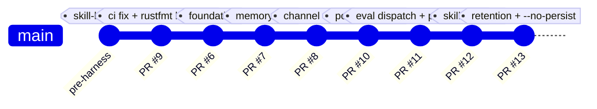
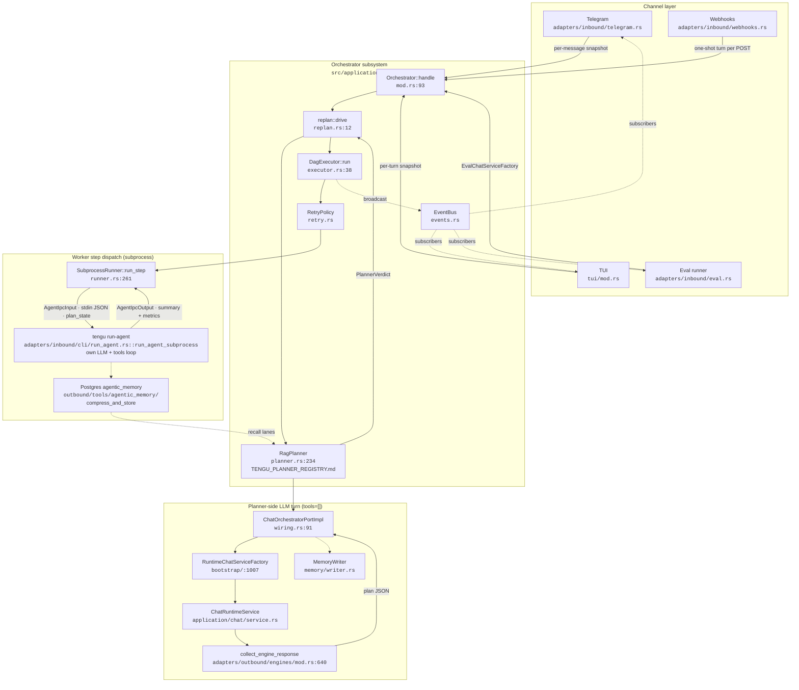
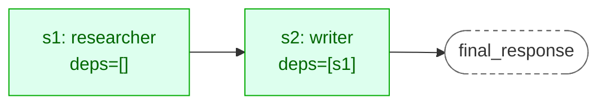
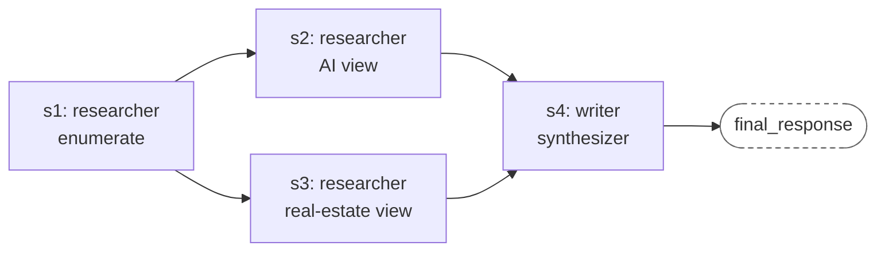
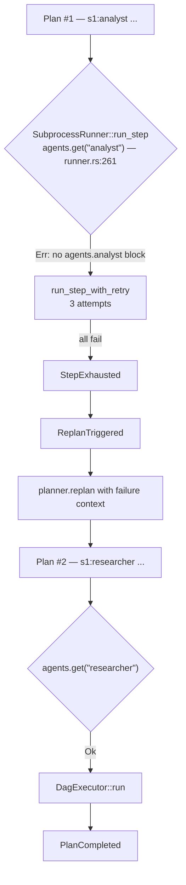
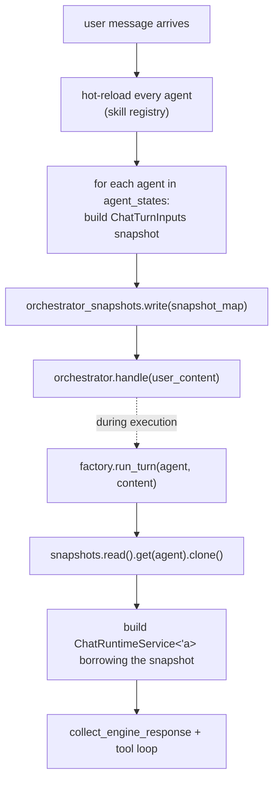
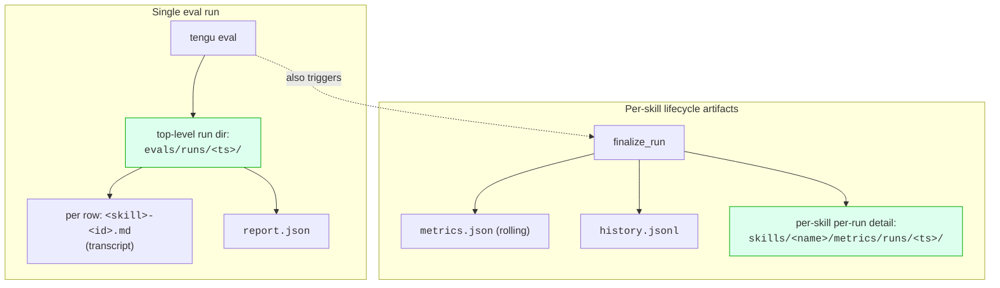
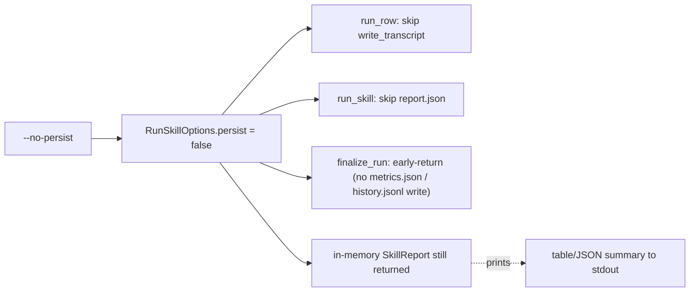

# Orchestrator Pipeline — Diagrams + Code References

Precise map of how orchestration was built, how it runs, and where every piece lives in source. Mermaid diagrams render on GitHub; ASCII mirrors for terminal viewing.

Covers: construction history, runtime pipeline, parallel + sequential + diamond execution, retention.

Current shape (post-#13): planner = `RagPlanner` (file-backed `TENGU_PLANNER_REGISTRY.md`), worker = `SubprocessRunner` (one `tengu run-agent` child per step), step memory = Postgres `agentic_memory` (`postgres_memory`). `OrchestratorAgentPlanner`, in-process `ChatWorker`, `roster.rs`, `telemetry.rs`, `orchestrator/config.rs`, `vector/qdrant.rs` are gone. Line numbers below are as of 2026-09-18.

---

## 1. How this was built — PR timeline



| PR | SHA on main | Net LOC | What it delivered |
|---|---|---|---|
| #9 | `6139d78` | −3 | Removed dead CI step + rustfmt baseline |
| #6 | `e76c08d` | +10,252 / −12,226 | `orchestrator/` + `memory/` subsystems, Phases 0–9 |
| #7 | `9667ea3` | +575 / −1,175 | Retired `MemoryService` + 3 old files |
| #8 | `1533c48` | +570 / −58 | Telegram + TUI route through `Orchestrator::handle` |
| #10 | `18711e1` | +~400 / −~50 | Fixed 6 limitations (batch embed, delete, clear_all, stats, `@role:` toggle, activity) |
| #11 | `1002957` | +~500 | 20-scenario runbook + eval orchestrator dispatch + prose-JSON parser |
| #12 | `f14bfc6` | +~1200 | Skill lifecycle (metrics + distill + evolve) |
| #13 | `695f19d` | +~600 | Retention, `--no-persist`, TUI memory config, validation checklist |
| post-#13 | see `docs/SESSION_HANDOFF.md` | — | Phases 4–7: `RagPlanner` + `SubprocessRunner` (`tengu run-agent`) replaced `OrchestratorAgentPlanner` + `ChatWorker`; single sandbox config (`agents/*.toml` removed); Tor-by-default egress |

---

## 2. System architecture (top-level)



**ASCII mirror** (same graph, text only):

```
┌────────────── Channels ──────────────┐
│ Telegram │ TUI │ Webhooks │ Eval     │
└────┬───────┬───────┬────────┬────────┘
     │       │       │        │
     ▼       ▼       ▼        ▼   (each provides a ChatServiceFactory for the planner turn)
┌────────────────────────────────────────┐
│   Orchestrator::handle                 │   orchestrator/mod.rs:93
│    └─▶ replan::drive                   │   orchestrator/replan.rs:12
│         ├─▶ RagPlanner::plan           │   orchestrator/planner.rs:638
│         │    ├ ensure_planner_registry │   orchestrator/shared_files.rs:80
│         │    ├ ChatOrchestratorPortImpl│   orchestrator/wiring.rs:91 (tools=[])
│         │    └ parse_verdict           │   orchestrator/planner.rs:109
│         ├─▶ set_active_plan + TENGU_PLAN.md   shared_files.rs:39 / :128
│         └─▶ DagExecutor::run           │   orchestrator/executor.rs:38
│              ├─▶ RetryPolicy           │   orchestrator/retry.rs:37
│              └─▶ SubprocessRunner      │   runner.rs:261
│                   └ tengu run-agent    │   main.rs:635 (own LLM + tools loop)
│                        └ compress_and_store → Postgres agentic_memory
└────────────────────────────────────────┘
        │
        └─▶ EventBus (broadcast) ─▶ subscribers render progress
```

---

## 3. Request lifecycle — a single user message

```mermaid
sequenceDiagram
    participant User
    participant Channel as Channel<br/>(TG/TUI/Webhook/Eval)
    participant Orch as Orchestrator
    participant Plan as RagPlanner
    participant LLM as Planner LLM<br/>(tools=[])
    participant Exec as DagExecutor
    participant Retry as RetryPolicy
    participant Runner as SubprocessRunner
    participant Child as tengu run-agent
    participant Mem as agentic_memory<br/>(Postgres)

    User->>Channel: prompt
    Channel->>Channel: build orchestrator_snapshots<br/>(one ChatTurnInputs per agent)
    Channel->>Orch: handle(prompt)
    Orch->>Plan: plan(prompt)
    Plan->>Plan: ensure_planner_registry<br/>(regenerate TENGU_PLANNER_REGISTRY.md)
    Plan->>Mem: recall lanes (postgres_memory)
    Plan->>LLM: run_turn_with_system<br/>(skills/orchestrator/SKILL.md, tools=[])
    LLM-->>Plan: JSON verdict
    Plan->>Plan: parse_verdict<br/>(raw → fences → prose → Direct fallback)
    Plan-->>Orch: PlannerVerdict::Plan{steps}
    Orch->>Orch: set_active_plan(session_id) + write TENGU_PLAN.md
    Orch->>Exec: run(plan, worker, cancel)
    Orch-->>Channel: emit PlanCreated

    loop Each ready step
        Exec->>Exec: plan.ready_steps(&completed)
        Exec->>Exec: tokio::spawn per ready step
        Exec-->>Channel: emit StepStarted
        Exec->>Retry: run_step_with_retry
        Retry->>Runner: run_step(step, step_inputs)
        Runner->>Runner: agents.get(step.agent) — fail fast if unknown
        Runner->>Child: spawn; AgentIpcInput on stdin<br/>(goal + step_inputs, plan_state, sandbox_config)
        Child->>Child: LLM + tools loop (max_tool_rounds)
        Child->>Mem: compress_and_store / summary backstop
        Child-->>Runner: AgentIpcOutput (summary, metrics) on stdout
        Runner-->>Retry: Ok(summary) or Err (step_timeout_secs)
        Retry-->>Exec: StepOutcome::Ok | Exhausted
        Exec-->>Channel: emit StepSucceeded/Failed
    end

    alt all succeed
        Exec-->>Orch: ExecResult::Done{leaf_output}
        Orch-->>Channel: emit PlanCompleted
    else step exhausted
        Exec-->>Orch: ExecResult::NeedsReplan
        Orch-->>Channel: emit ReplanTriggered
        Orch->>Plan: replan(prompt, prior_plan, failed_id, error)
        Plan-->>Orch: new verdict
        Orch->>Exec: re-run (bounded by max_replans)
    end

    Channel-->>User: final_response
```

**Reference points (file:line):**

| Step in diagram | File | Line |
|---|---|---|
| Channel builds snapshots | `adapters/inbound/telegram.rs::execute_orchestrator_turn` | 1420 (loop 1451, publish 1538, handle 1551) |
|  | `tui/mod.rs` | ~189 (construct), 798 (snapshot write), 804 (handle) |
|  | `adapters/inbound/webhooks.rs` | 257 |
| `Orchestrator::handle` | `orchestrator/mod.rs` | 93 |
| `replan::drive` | `orchestrator/replan.rs` | 12 |
| `RagPlanner::plan` / `parse_verdict` | `orchestrator/planner.rs` | 638 / 109 |
| Registry + active plan | `orchestrator/shared_files.rs` | `ensure_planner_registry` 80, `routable_agents` 168, `set_active_plan` 39 |
| `DagExecutor::run` | `orchestrator/executor.rs` | 38 |
| `ready_steps` | `orchestrator/plan.rs` | 91 |
| `tokio::spawn` per step | `orchestrator/executor.rs` | 74 |
| `render_step_inputs` | `orchestrator/executor.rs` | 136 |
| `run_step_with_retry` | `orchestrator/retry.rs` | 37 |
| `SubprocessRunner::run_step` / `run_with_timeout` | `runner.rs` | 261 / 183 |
| `run_agent_subprocess` (child) | `main.rs` | 635 |
| `ChatOrchestratorPortImpl` (planner LLM turn) | `orchestrator/wiring.rs` | 91 |
| `ChatServiceFactory` trait | `orchestrator/wiring.rs` | 49 |
| `MemoryWriter::sync_turn` (planner turn only) | `memory/writer.rs` | 11 |
| `collect_engine_response` | `adapters/outbound/engines/mod.rs` | 640 |

---

## 4. Sequential execution — example

### Prompt
> "Look up the HTTP status codes for 200 and 404, then write a two-sentence summary contrasting them."

### Plan emitted

```json
{
  "kind": "plan",
  "steps": [
    {"id": "s1", "agent": "researcher", "goal": "Gather concise descriptions of HTTP status codes 200 and 404", "depends_on": []},
    {"id": "s2", "agent": "writer",     "goal": "Write a two-sentence summary contrasting 200 and 404 from s1 output", "depends_on": ["s1"]}
  ]
}
```

### DAG shape



### Timeline (as observed in logs)

```
T+0.0s   orchestrator:plan_created  steps=[s1:researcher(deps=[]), s2:writer(deps=[s1])]
T+0.1s   orchestrator:step_started  s1:researcher
T+0.1s   http_request  GET https://developer.mozilla.org/.../Status/200
T+1.4s   http_request  GET https://developer.mozilla.org/.../Status/404
T+14.2s  orchestrator:step_succeeded  s1   ← waits for s1 before starting s2
T+14.3s  orchestrator:step_started  s2:writer
T+22.8s  orchestrator:step_succeeded  s2
T+22.9s  orchestrator:plan_completed  cancelled=false
```

### Key invariant proved

`s2` starts **only after** `s1 succeeds` (gap between lines 4 and 5 above). `DagExecutor::run` at `executor.rs:38` loops:

1. `let ready = plan.ready_steps(&completed)` — `s2` is NOT in ready while `s1` is in-flight (its dep isn't completed).
2. When s1 succeeds, `completed.insert(s1)`, next iteration includes s2 in ready.
3. `render_step_inputs` at `executor.rs:136` builds `<step-input from="s1">...</step-input>` and prepends to s2's goal (sent to the `tengu run-agent` child as `AgentIpcInput.goal`).

### Code reference

`orchestrator/plan.rs:91` — `Plan::ready_steps`:
```rust
pub fn ready_steps(&self, completed: &HashSet<StepId>) -> Vec<&Step> {
    self.steps
        .iter()
        .filter(|s| {
            !completed.contains(&s.id) && s.depends_on.iter().all(|d| completed.contains(d))
        })
        .collect()
}
```

This is THE entire sequential-vs-parallel logic. Sequential works because `s2.depends_on = [s1]` — `ready_steps` returns `[s1]` only while `s1` runs, then `[s2]` after it completes.

---

## 5. Parallel execution — example

### Prompt
> "In parallel, give a one-line definition of each of: unicorn startup, decacorn startup, hectocorn startup, zebra startup. Then list all four with their definitions."

### Plan emitted

```json
{
  "kind": "plan",
  "steps": [
    {"id": "s1", "agent": "researcher", "goal": "Define 'unicorn startup' in one sentence", "depends_on": []},
    {"id": "s2", "agent": "researcher", "goal": "Define 'decacorn startup' in one sentence", "depends_on": []},
    {"id": "s3", "agent": "researcher", "goal": "Define 'hectocorn startup' in one sentence", "depends_on": []},
    {"id": "s4", "agent": "researcher", "goal": "Define 'zebra startup' in one sentence", "depends_on": []},
    {"id": "s5", "agent": "writer",     "goal": "List all four terms with their definitions from s1-s4", "depends_on": ["s1","s2","s3","s4"]}
  ]
}
```

### DAG shape


### Timeline — proof of parallelism

```
T+0.0s   orchestrator:plan_created  steps=[s1:r(deps=[]), s2:r(deps=[]), s3:r(deps=[]), s4:r(deps=[]), s5:w(deps=[s1,s2,s3,s4])]
T+0.1s   orchestrator:step_started  s1:researcher  ┐
T+0.1s   orchestrator:step_started  s2:researcher  │ all four start
T+0.1s   orchestrator:step_started  s3:researcher  │ within ~100ms
T+0.1s   orchestrator:step_started  s4:researcher  ┘
T+0.2s   http_request  ... (for s3, interleaved)
T+0.3s   http_request  ... (for s1, interleaved)
T+0.3s   http_request  ... (for s4, interleaved)
T+0.4s   http_request  ... (for s2, interleaved)
...
T+8.9s   orchestrator:step_succeeded  s2
T+9.2s   orchestrator:step_succeeded  s3
T+9.5s   orchestrator:step_succeeded  s1
T+9.8s   orchestrator:step_succeeded  s4  ← s5 can now start
T+9.9s   orchestrator:step_started  s5:writer
T+15.1s  orchestrator:step_succeeded  s5
T+15.2s  orchestrator:plan_completed
```

### Key invariant proved

**Interleaving of tool calls** is the signature of true concurrency. If one researcher had done all four sequentially, tool calls would be grouped by researcher (all of s1's calls, then all of s2's, etc.). The interleaving visible in timeline rows 5–8 = `tokio::spawn` ran them concurrently — each step is its own `tengu run-agent` child, so the tool calls come from four processes.

### Code reference

`orchestrator/executor.rs:62` — the loop (spawn at `:74`):
```rust
for step in plan.ready_steps(&completed) {
    if in_flight.contains(&step.id) {
        continue;
    }
    let step_inputs = render_step_inputs(step, &completed_outputs);
    // ... clone worker / policy / events / step ...
    in_flight.insert(step.id.clone());
    let _ = events.send(OrchestratorEvent::StepStarted { step_id: step.id.clone(), agent: step.agent.clone() });
    futures.push(tokio::spawn(async move {
        let outcome = run_step_with_retry(&step_clone, &step_inputs, worker, &policy, &events).await;
        (step_clone.id, outcome)
    }));
}
```

Every ready step gets its own `tokio::spawn`. `FuturesUnordered` awaits whichever completes first — no ordering between parallel siblings.

---

## 6. Mixed (diamond) execution — example

### Prompt
> "First enumerate two plausible interpretations of the question 'what is an agent?'. Then, in parallel, research each interpretation — one from the AI/LLM perspective, one from the real-estate broker perspective. Finally, write a short note acknowledging both meanings exist."

### Plan emitted

```json
{
  "kind": "plan",
  "steps": [
    {"id": "s1", "agent": "researcher", "goal": "Enumerate two plausible interpretations of 'what is an agent?'", "depends_on": []},
    {"id": "s2", "agent": "researcher", "goal": "Research the AI/LLM interpretation from s1 output", "depends_on": ["s1"]},
    {"id": "s3", "agent": "researcher", "goal": "Research the real-estate broker interpretation from s1 output", "depends_on": ["s1"]},
    {"id": "s4", "agent": "writer",     "goal": "Write a short note acknowledging both meanings based on s2 and s3", "depends_on": ["s2","s3"]}
  ]
}
```

### DAG shape (the diamond)



### Timeline

```
T+0.0s   plan_created  s1→(s2,s3)→s4
T+0.1s   step_started  s1
         (s2 and s3 NOT yet started — waiting for s1)
T+6.3s   step_succeeded  s1
T+6.4s   step_started  s2     ┐ parallel fan-out
T+6.4s   step_started  s3     ┘ after s1 complete
T+14.1s  step_succeeded  s2
T+14.9s  step_succeeded  s3
T+15.0s  step_started  s4     ← waits for BOTH s2 and s3
T+20.2s  step_succeeded  s4
T+20.3s  plan_completed
```

### Two invariants proved

1. **s2 and s3 don't start until s1 succeeds** — `ready_steps` excludes them while `s1.id ∉ completed`.
2. **s4 doesn't start until both s2 AND s3 succeed** — `depends_on.iter().all(...)` requires ALL deps completed.

### Code reference

Same `ready_steps` logic as before, but exercising the `.all()` predicate:

```rust
s.depends_on.iter().all(|d| completed.contains(d))  // s4 waits for both
```

---

## 7. Replan — example

### Prompt
> (Same as diamond above)

### Observed replan scenario

The planner's first plan was valid topology but used an invented agent name `analyst`:

```json
{"steps": [
  {"id": "s1", "agent": "analyst", "goal": "...", "depends_on": []},  ← "analyst" not in roster
  ...
]}
```

### Flow



### Timeline

```
T+0.0s   plan_created  steps=[s1:analyst(deps=[]), ...]   ← bad agent
T+0.1s   step_started  s1:analyst
T+0.2s   step_failed   s1 attempt=1 err=step s1: agent "analyst" has no `[agents.analyst]` block ...
T+0.3s   step_failed   s1 attempt=2 err=(same)
T+0.4s   step_failed   s1 attempt=3 err=(same)
T+0.5s   step_exhausted  s1
T+0.5s   replan_triggered  step s1: agent "analyst" has no `[agents.analyst]` block ...
T+3.2s   plan_created  steps=[s1:researcher(deps=[]), ...]   ← repaired plan
...continues normally
```

### Code reference

- Unknown agent fails fast (no spawn): `runner.rs::run_step` (`:261`) — `agents` = the parent config's `[agents.*]`; the planner only sees the `description`-bearing subset (`shared_files::routable_agents`). `plan.rs::validate` (`:104`) is topology-only and exercised by unit tests, not the runtime path.
- Retry at step level: `orchestrator/retry.rs::run_step_with_retry` (`:37`) — 3 attempts, backoff 1s/3s/9s, then `StepExhausted`
- Replan driver: `orchestrator/replan.rs::drive` (`:12`):

```rust
ExecResult::NeedsReplan { failed, error } => {
    if replans_left == 0 { /* bail */ }
    replans_left -= 1;
    events.emit(ReplanTriggered { reason: error.clone() });
    plan = planner.replan(user_msg, plan, failed, error).await?;
}
```

Bounded by `OrchestratorConfig.max_replans` (default 2).

---

## 8. How each channel provides the factory

The same `Orchestrator::handle` works for all four channels. They differ only in **how** they build the `ChatInputsFn` closure that `RuntimeChatServiceFactory::run_turn` calls — this feeds the **planner-side** turn only; worker steps are `tengu run-agent` subprocesses (`SubprocessRunner`) and never touch the snapshots.

### 8.1 Telegram (per-message snapshot)



**Code:** `adapters/inbound/telegram.rs:1420` — `execute_orchestrator_turn`. Snapshot loop at lines 1451–1536. Publish at 1538. Handle at 1551.

### 8.2 TUI (per-turn snapshot)

Same shape; the engine thread's `ChatRequest::UserMessage` branch (`tui/mod.rs:705`) writes snapshots (`:798`) before `rt.block_on(orch.handle(text))` (`:804`).

**Code:** `tui/mod.rs:189` — snapshots + `build_orchestrator`; `:798` — same snapshot pattern.

### 8.3 Eval (per-step factory closure)

The eval runner doesn't need snapshots — it rebuilds the per-agent ChatRuntimeService inside each `run_turn` call, using the `EvalRowAccum` to thread the row's stubs + observation tap across every worker step.

**Code:** `adapters/inbound/eval.rs::run_row_via_orchestrator` (`:1796`), `EvalChatServiceFactory` (`:1632`) — search for the comment "Shared state threaded through every worker step" (`:1803`). Row stubs apply to the planner turn; worker steps run as real `tengu run-agent` children and their metrics cross the IPC boundary (`AgentIpcOutput.metrics`).

### 8.4 Webhooks (one-shot turn per POST)

`adapters/inbound/webhooks.rs:257` — `build_orchestrator` per request, `session_id = webhook-<name>-<uuid>`. Canonical doc: `docs/webhooks-2026-05-11.md`.

---

## 9. Retention pipeline

How disk artifacts get bounded across many runs.

### 9.1 Sources of disk writes



### 9.2 Pruning rules

| Artifact | Retention knob | Default | Location |
|---|---|---|---|
| `evals/runs/<ts>/` | `--keep-runs N` | 10 | `adapters/inbound/eval.rs::prune_old_run_dirs` |
| `skills/<name>/metrics/runs/<ts>/` | `--max-runs N` | 10 | `adapters/inbound/eval.rs::finalize_run` (passed via `RunSkillOptions.max_per_run_reports`) |
| `metrics.json` | always kept (rolling) | — | — |
| `history.jsonl` | always appended | — | — |

### 9.3 `--no-persist` — skip all writes



### 9.4 Example — 100 runs, bounded

Without retention: 100 runs × ~9 rows × 1 transcript each + 100 report.json + 100 per-skill run dirs = ~1000+ files.

With default retention:
- `evals/runs/` → 10 dirs × 9 transcripts + 10 report.json = 100 files max
- `skills/<name>/metrics/runs/` → 10 dirs max
- `metrics.json` + `history.jsonl` → 2 files (rolling)

**Total bound: ~112 files regardless of run count.**

With `--no-persist`: **0 files written**.

### 9.5 `.gitignore` rules

```
/evals/runs/
/skills/*/metrics/runs/
```

So even if retention fires AFTER a run (pruning last time), nothing between runs shows up in `git status`.

---

## 10. Quick reference — how to use

### Just validate it works
```bash
./target/release/tengu eval orchestration-e2e --keep-runs 3
# Expect 9/9 pass, ~5 min, ~$0.40
```

### Iterate without polluting repo
```bash
./target/release/tengu eval orchestration-e2e --no-persist --filter parallel_fan_out
# Zero files written, single row, ~$0.05
```

### Interactive (TUI, orchestrated sandbox)
```bash
# aura sets [egress] network = "open"; any other sandbox needs `make tor` first (Tor is the default)
cargo run --features claude_code -- chat --sandbox aura
# researcher/writer scenarios: sandboxes/<name>/config.toml = config.example.toml + [orchestrator]
# + one [agents.<name>] block per worker with a `description` (only those are routable)
cargo run -- chat --sandbox <name>
# Then manually test scenarios from docs/orchestration-test-scenarios.md
```

### Inspect observations post-run
```bash
ls evals/runs/                                                    # retained dirs
cat evals/runs/<ts>/orchestration-e2e-parallel_fan_out.md         # tool calls + events + final text
```

---

## 11. Complete code reference table

| Concept | File | Key functions/types |
|---|---|---|
| **Orchestrator public API** | `src/application/orchestrator/mod.rs` | `Orchestrator::new`, `::handle`, `::subscribe`, `::cancel` |
| **Replan loop** | `src/application/orchestrator/replan.rs` | `drive(planner, msg, worker, policy, max_replans, events, cancel)` |
| **Planner** | `src/application/orchestrator/planner.rs` | `Planner` trait, `RagPlanner::{new,plan,replan}`, `parse_verdict`, `extract_balanced_json_object`, `load_orchestrator_skill_body` |
| **Planner registry + plan state** | `src/application/orchestrator/shared_files.rs` | `routable_agents`, `render_registry`, `ensure_planner_registry`, `set_active_plan`, `write_plan_state`, `enumerate_mcp_tools` |
| **DAG executor** | `src/application/orchestrator/executor.rs` | `DagExecutor::run`, `WorkerHandle` trait, `ExecResult`, `render_step_inputs` |
| **Worker (subprocess)** | `src/adapters/outbound/subprocess_runner.rs` | `SubprocessRunner::{new,run_step,run_with_timeout}`, `AgentIpcInput`, `AgentIpcOutput` |
| **Subagent child** | `src/main.rs` | `run_agent_subprocess` (loads parent config, `[agents.<name>]`, LLM + tools loop, `compress_and_store`) |
| **Retry** | `src/application/orchestrator/retry.rs` | `RetryPolicy`, `run_step_with_retry`, backoff `{1s, 3s, 9s}` |
| **Plan types + topology** | `src/domain/plan.rs` | `Step`, `StepId`, `Plan::ready_steps`, `Plan::validate`, `Plan::single_leaf` |
| **Events** | `src/application/orchestrator/events.rs` | `OrchestratorEvent`, `EventBus`, `new_bus()` |
| **ChatServiceFactory wiring** | `src/application/orchestrator/wiring.rs` | `ChatServiceFactory` trait, `ChatOrchestratorPortImpl` (planner turn; `ChatWorker` removed) |
| **Telegram channel dispatch** | `src/adapters/inbound/telegram.rs` | `execute_orchestrator_turn` (line 1420), orchestrator_snapshots field (line 514) |
| **TUI channel dispatch** | `src/adapters/inbound/tui/mod.rs` | orchestrator branch in engine thread (~line 798) |
| **Webhook channel dispatch** | `src/adapters/inbound/webhooks.rs` | `build_orchestrator` per POST (line 257) |
| **Eval channel dispatch** | `src/adapters/inbound/eval.rs` | `run_row_via_orchestrator`, `EvalChatServiceFactory` |
| **Eval retention** | `src/adapters/inbound/eval.rs` | `prune_old_run_dirs`, `EvalArgs::keep_runs` / `no_persist` / `max_per_run_reports` |
| **Memory provider** | `src/ports/memory.rs` | `MemoryProvider` trait |
| **Memory manager** | `src/application/memory/manager.rs` | `MemoryManager::{add_provider, prefetch_all, sync_all, ingest_one, ingest_batch, search, delete_entry, clear_all, stats}` |
| **Pre-turn injection** | `src/application/memory/injector.rs` | `for_turn(mgr, agent, query) -> PinnedMemoryBlock` |
| **Post-turn write** | `src/application/memory/writer.rs` | `sync_turn(mgr, agent, user, asst)` — spawned |
| **Fenced block** | `src/application/memory/fencing.rs` | `build_memory_context_block`, `sanitize_context` |
| **Builtin provider** | `src/adapters/outbound/memory/builtin.rs` | `BuiltinMemoryProvider` |
| **Vector store trait** | `src/ports/memory.rs` | `VectorStore` trait: `write`, `search`, `delete`, `clear_all`, `entry_count`, `storage_bytes` |
| **Disk store** | `src/adapters/outbound/memory/disk_vector.rs` | `DiskVectorStore`, bincode-backed |
| **Agentic memory (Postgres)** | `src/adapters/outbound/tools/agentic_memory/mod.rs` | `AgenticMemoryPlugin` (`postgres_memory` feature) — step summaries, planner recall lanes |
| **Embedder** | `src/adapters/outbound/memory/embedder.rs` | `Embedder::embed`, `::embed_batch` (single HTTP call for N inputs) |
| **Channel runtime helpers** | `src/bootstrap/` | `build_orchestrator`, `build_memory_manager`, `RuntimeChatServiceFactory`, `OrchestratorSnapshots`, `snapshots_inputs_fn`, `subagent_config`, `build_subprocess_tool_executor` |
| **Config schema** | `src/config/mod.rs` | `OrchestratorConfig` (agent, max_attempts_per_step, max_replans, route_explicit_agents, engine=`"rag"`); `AgentConfig.description` (routable subagent), `LimitsConfig.{max_tool_rounds,step_timeout_secs}` |

---

## 12. Related docs

| Doc | Purpose |
|---|---|
| `docs/architecture-2026-04-27.md` | Canonical per-turn walkthrough + file map |
| `docs/configuration.md` | Sandbox config reference (`[orchestrator]`, `[agents.*]`, `[egress]`) |
| `docs/harness-architecture.md` (superseded) | Historical (PR #6–#13) subsystem map; pre-`SubprocessRunner` |
| `docs/orchestration-test-scenarios.md` | 20 manual TUI/Telegram test scenarios (S-01 through S-20) |
| `docs/validation-checklist.md` | Top-to-bottom validation runbook (~30 min pass) |
| `config.example.toml` | Commented config template (uncomment `[orchestrator]` + `[agents.<name>]` with `description`) |
| `docs/superpowers/specs/2026-04-20-harness-orchestration-memory-design.md` | Original design spec (archived) |
| `docs/superpowers/plans/2026-04-20-harness-orchestration-memory.md` | Original implementation plan, archived (40 tasks) |
| `skills/orchestration-e2e/evals/prompts.yaml` | 9 automated eval rows |
| `skills/orchestration-e2e/evals/config.toml` | Eval-runner config (prompt + agents) |
