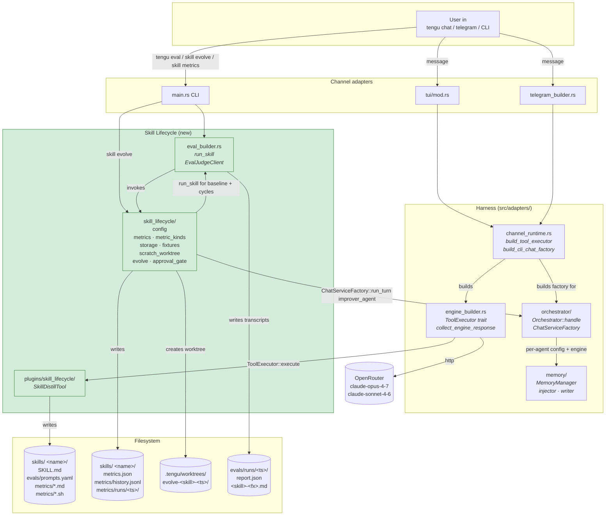
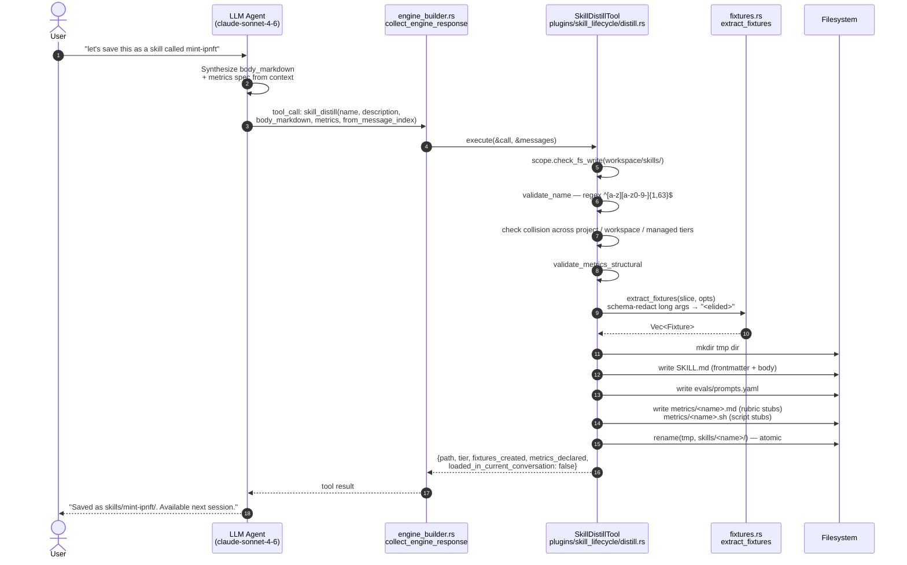
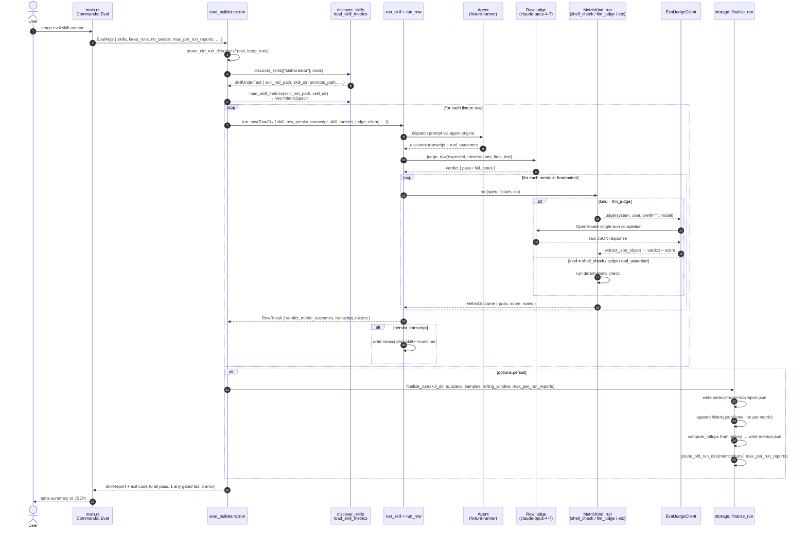
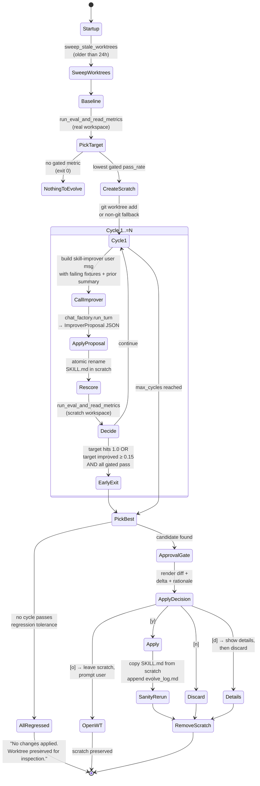
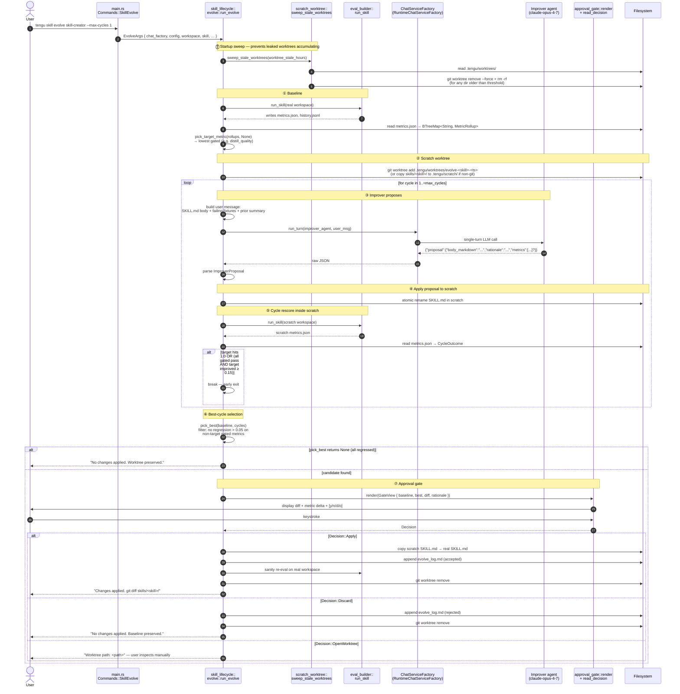
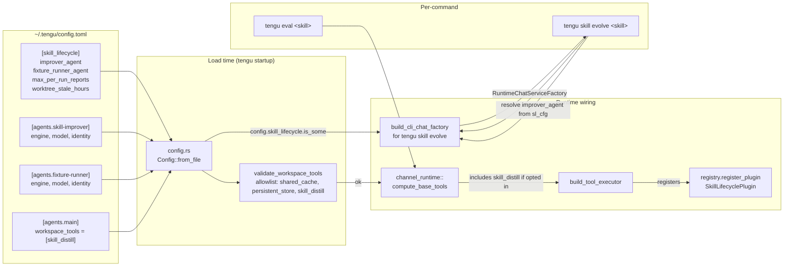

# Skill Lifecycle — Pipeline Diagrams

Precise visual + textual reference for how skill distillation, evaluation, metrics, and evolution are implemented and used. Every diagram links to the concrete code location (`file:line`) that realizes it.

**Audience:** developers checking what was built, how it fits together, and how to exercise it end-to-end.

All diagrams are Mermaid and render in GitHub, VSCode, Obsidian, and most markdown previewers.

---

## 1. System architecture (bird's-eye view)



**Key insights from the diagram:**

- **Two entry points for the subsystem** — agents call `skill_distill` via the normal tool loop (from a live chat), or the user runs `tengu eval / skill evolve` from the CLI.
- **`ChatServiceFactory::run_turn(agent, text)`** at [orchestrator/wiring.rs:30](../src/adapters/orchestrator/wiring.rs) is the one-call seam for evolve's skill-improver dispatch. No `Orchestrator` DAG needed for that — it's a single-turn RPC.
- **`eval_builder.rs` owns row execution** (per-row agent dispatch, per-row LLM judge); **`skill_lifecycle/` owns the typed `metrics:` contract** and rolling storage. Integration point: [eval_builder.rs:1215-ish](../src/adapters/eval_builder.rs) in `run_skill`, where `finalize_run` is called.

---

## 2. The three user flows

```mermaid
flowchart LR
    subgraph Distill["① Distill — author a skill from a live conversation"]
        d1[user says<br/>save this as a skill] --> d2[LLM agent calls<br/>skill_distill]
        d2 --> d3[atomic<br/>file write]
        d3 --> d4[skills/&lt;n&gt;/<br/>SKILL.md<br/>evals/prompts.yaml<br/>metrics/*]
    end

    subgraph Eval["② Eval — score the skill"]
        e1[tengu eval &lt;skill&gt;] --> e2[discover skill<br/>load metrics:<br/>frontmatter]
        e2 --> e3[for each<br/>fixture row]
        e3 --> e4[dispatch agent<br/>row-judge<br/>metric kinds]
        e4 --> e5[finalize_run:<br/>metrics.json<br/>history.jsonl<br/>runs/&lt;ts&gt;/]
    end

    subgraph Evolve["③ Evolve — improve a gated metric"]
        v1[tengu skill evolve &lt;skill&gt;] --> v2[baseline eval<br/>pick target]
        v2 --> v3[scratch git<br/>worktree]
        v3 --> v4[for N cycles]
        v4 --> v5[improver agent<br/>proposes diff]
        v5 --> v6[cycle rescore<br/>inside scratch]
        v6 --> v4
        v4 --> v7[best cycle<br/>selection]
        v7 --> v8[approval gate<br/>y/n/d/o]
        v8 --> v9[apply or<br/>discard]
    end

    d4 -.feeds.-> e1
    e5 -.gated metrics trigger.-> v1
    v9 -.updates.-> d4
```



The three flows form a **closed loop**: a distilled skill can be evaluated, a failing metric can be evolved, and the evolved skill can be re-evaluated to confirm improvement.

---

## 3. Distillation — sequence diagram

Trigger: the user finishes a workflow and says "save this as a skill." The agent (which has `skill_distill` in its `workspace_tools`) invokes the tool. The tool writes files atomically — no LLM call from inside the tool itself.



**Cache-discipline invariant:** the new skill does NOT activate in the current conversation — `loaded_in_current_conversation: false` is returned explicitly. This is enforced by not modifying the runtime's `ToolRegistry` post-skill-distill. The skill becomes available when the next session starts.

**Code pointers:**
- Tool def: [`plugins/skill_lifecycle/distill.rs`](../src/adapters/plugins/skill_lifecycle/distill.rs) — ~470 lines.
- Schema redaction logic: [`fixtures.rs::redact_args`](../src/adapters/skill_lifecycle/fixtures.rs).
- Plugin registration: [`channel_runtime.rs::build_tool_executor`](../src/adapters/channel_runtime.rs) — `if allowed_names.contains(SKILL_DISTILL_TOOL_NAME)` block.

---

## 4. Eval — sequence diagram

Trigger: `tengu eval <skill>`. Runs fixtures against the skill's configured agent, scores each row via (a) the pre-existing per-row LLM judge AND (b) any `metrics:` declared in SKILL.md frontmatter. Writes rolling `metrics.json` + appends to `history.jsonl`.



**Exit code semantics** — use these in CI:

| Code | Meaning | Typical cause |
|------|---------|---------------|
| 0 | All gated metrics pass | Skill is healthy |
| 1 | At least one gated metric failed | Candidate for `tengu skill evolve` |
| 2 | Runner error | Config missing, LLM unavailable, fixture file broken |

**Code pointers:**
- CLI dispatch: [`main.rs` `Commands::Eval`](../src/main.rs) (~line 290).
- Runner entry: [`eval_builder.rs::run`](../src/adapters/eval_builder.rs) (~line 68).
- Frontmatter loader: `eval_builder.rs::load_skill_metrics`.
- Integration point with `skill_lifecycle`: [`eval_builder.rs::run_skill`](../src/adapters/eval_builder.rs) (~line 1215, `finalize_run` call).
- Judge adapter: `eval_builder.rs::EvalJudgeClient` — wraps the existing `Arc<dyn Engine>` into the `JudgeClient` trait.

---

## 5. Evolve — sequence + state diagram

### 5.1 High-level evolve flow



### 5.2 Evolve sequence in detail



**Code pointers:**
- Orchestrator: [`skill_lifecycle/evolve.rs::run_evolve`](../src/adapters/skill_lifecycle/evolve.rs) (~line 217).
- Best-cycle logic: [`skill_lifecycle/evolve.rs::pick_best`](../src/adapters/skill_lifecycle/evolve.rs) (~line 79).
- Scratch worktree: [`skill_lifecycle/scratch_worktree.rs`](../src/adapters/skill_lifecycle/scratch_worktree.rs).
- Approval gate: [`skill_lifecycle/approval_gate.rs`](../src/adapters/skill_lifecycle/approval_gate.rs).
- Improver dispatch seam: [`orchestrator/wiring.rs::ChatServiceFactory`](../src/adapters/orchestrator/wiring.rs) line 30.

---

## 6. Data model

```mermaid
classDiagram
    class MetricSpec {
        <<enum, tag=kind>>
        +ShellCheck { name, cmd, expect_stdout_matches, expect_exit_code, min_pass_rate }
        +LlmJudge { name, rubric_file, judge_model, min_pass_rate }
        +ToolAssertion { name, tool, action, key, assert, min_pass_rate }
        +Script { name, path, min_pass_rate }
        +name() &rarr; &str
        +min_pass_rate() &rarr; Option&lt;f32&gt;
    }

    class MetricKind {
        <<trait>>
        +run(spec, fixture, ctx) &rarr; MetricOutcome
    }

    class MetricOutcome {
        +pass: bool
        +score: f32 [0..1]
        +notes: Option&lt;String&gt;
        +raw: serde_json::Value
    }

    class MetricRollup {
        +pass_rate: f32
        +n: u32
        +min_pass_rate: Option&lt;f32&gt;
        +gated: bool
    }

    class MetricsJson {
        +schema_version: u32
        +skill: String
        +last_run: String
        +last_run_ref: String
        +rolling_window: u32
        +metrics: BTreeMap&lt;String, MetricRollup&gt;
    }

    class RunSample {
        +fixture_id: String
        +outcomes: BTreeMap&lt;String, MetricOutcome&gt;
    }

    class HistoryLine {
        +ts: &str
        +metric: &str
        +pass_rate: f32
        +n: u32
        +run_ref: &str
    }

    class Baseline {
        +rollups: BTreeMap&lt;String, MetricRollup&gt;
        +target_metric: String
    }

    class CycleOutcome {
        +cycle_n: u32
        +rollups: BTreeMap&lt;String, MetricRollup&gt;
        +body_delta_lines_added: i32
        +rationale: String
        +new_body: String
        +new_metrics: Option&lt;Vec&lt;MetricSpec&gt;&gt;
    }

    class ImproverProposal {
        +proposal: ProposalBody
    }

    class ProposalBody {
        +body_markdown: String
        +metrics: Option&lt;Vec&lt;MetricSpec&gt;&gt;
        +rationale: String
    }

    class ShellCheckKind
    class LlmJudgeKind
    class ToolAssertionKind
    class ScriptKind

    MetricKind <|.. ShellCheckKind
    MetricKind <|.. LlmJudgeKind
    MetricKind <|.. ToolAssertionKind
    MetricKind <|.. ScriptKind
    MetricKind ..> MetricSpec : dispatches on
    MetricKind ..> MetricOutcome : produces
    MetricsJson o-- MetricRollup
    RunSample o-- MetricOutcome
    Baseline *-- MetricRollup
    CycleOutcome *-- MetricRollup
    CycleOutcome *-- MetricSpec
    ImproverProposal *-- ProposalBody
    ProposalBody *-- MetricSpec
```

**Code pointers:**
- `MetricSpec`, `MetricKind`, `MetricOutcome`, `FixtureContext`, `MetricRunCtx`, `JudgeClient`: [`skill_lifecycle/metrics.rs`](../src/adapters/skill_lifecycle/metrics.rs).
- `MetricsJson`, `MetricRollup`, `RunSample`, `HistoryLine`, `finalize_run`, `prune_old_run_dirs`: [`skill_lifecycle/storage.rs`](../src/adapters/skill_lifecycle/storage.rs).
- `Baseline`, `CycleOutcome`, `ImproverProposal`, `ProposalBody`, `pick_target_metric`, `pick_best`: [`skill_lifecycle/evolve.rs`](../src/adapters/skill_lifecycle/evolve.rs).

---

## 7. Filesystem layout

What lives where after a successful distill → eval → evolve cycle for a skill named `my-skill`:

```
workspace/
├── Cargo.toml
├── config.example.toml               # [skill_lifecycle] sample block
├── docs/
│   ├── skill-lifecycle-validation.md
│   ├── skill-lifecycle-pipeline-diagrams.md  # this file
│   ├── skills.md                     # Metrics & Evolution section
│   ├── configuration.md              # [skill_lifecycle] reference
│   ├── architecture.md               # Skill Lifecycle key abstraction
│   └── superpowers/
│       ├── specs/2026-04-20-skill-metrics-evolution-design.md
│       └── plans/{2026-04-20-...skill-metrics-evolution.md,
│                   2026-04-21-...skill-metrics-evolution-phase2.md}
│
├── src/
│   ├── main.rs                       # Commands::Eval / SkillEvolve / SkillMetrics / SkillAcceptProposal
│   └── adapters/
│       ├── eval_builder.rs           # run, run_skill, run_row, load_skill_metrics, EvalJudgeClient
│       ├── channel_runtime.rs        # build_tool_executor, compute_base_tools, build_cli_chat_factory
│       ├── config.rs                 # Config.skill_lifecycle field, workspace_tools validator
│       ├── orchestrator/wiring.rs    # ChatServiceFactory trait (the seam for improver dispatch)
│       ├── plugins/skill_lifecycle/
│       │   ├── mod.rs                # SkillLifecyclePlugin, tool_defs(), SKILL_DISTILL_TOOL_NAME
│       │   └── distill.rs            # SkillDistillTool
│       └── skill_lifecycle/
│           ├── config.rs             # SkillLifecycleConfig TOML schema
│           ├── metrics.rs            # MetricSpec, MetricKind, MetricOutcome, validate_metrics
│           ├── metric_kinds/
│           │   ├── shell_check.rs
│           │   ├── llm_judge.rs      # with extract_json_object prose tolerance
│           │   ├── tool_assertion.rs
│           │   └── script.rs
│           ├── storage.rs            # finalize_run, prune_old_run_dirs, MetricsJson
│           ├── fixtures.rs           # YAML read/write, extract_fixtures, redact_args
│           ├── evolve.rs             # run_evolve, pick_best, apply_proposal_to_skill_md
│           ├── approval_gate.rs      # render + read_decision
│           └── scratch_worktree.rs   # create/remove/sweep_stale_worktrees
│
├── skills/
│   ├── skill-creator/                # canonical dogfood
│   │   ├── SKILL.md                  # frontmatter: name, description, metrics: [distill_quality], body
│   │   ├── evals/
│   │   │   ├── config.toml           # per-skill eval agent config (skill-creator-agent with skill_distill)
│   │   │   └── prompts.yaml          # flat list: [{id, prompt, expected}, ...]
│   │   ├── metrics/
│   │   │   ├── distill_quality.md    # rubric text for the llm_judge metric
│   │   │   ├── history.jsonl         # append-only — one line per (run, metric)
│   │   │   ├── evolve_log.md         # append-only — one line per evolve attempt
│   │   │   └── runs/
│   │   │       └── 2026-04-21T20-15-30Z/
│   │   │           └── report.json   # per-run detail — capped at N by max_per_run_reports
│   │   └── metrics.json              # rolling snapshot, overwritten each run
│   └── my-skill/                     # a distilled skill
│       ├── SKILL.md
│       ├── evals/prompts.yaml
│       └── metrics/<rubric_name>.md
│
├── evals/runs/                       # global evals runs — capped at N by --keep-runs
│   └── 2026-04-21T20-15-30Z/
│       ├── report.json
│       ├── my-skill-f1.md
│       └── my-skill-f2.md
│
└── .tengu/
    ├── worktrees/                    # scratch git worktrees — swept at evolve startup
    │   └── evolve-my-skill-<ts>/     # only while evolve is running
    └── scratch/                      # non-git fallback
        └── evolve-my-skill-<ts>/
```

---

## 8. Configuration flow

How `tengu.toml` activates the subsystem at runtime:



**Missing any of these → clear error, not silent failure:**

| What's missing | Symptom |
|----------------|---------|
| `[skill_lifecycle]` block | `"[skill_lifecycle] config missing; needed for tengu skill evolve"` |
| `[agents.skill-improver]` | `"snapshots lock poisoned"` or improver dispatch fails |
| `"skill_distill"` not in `workspace_tools` | Agent sees no `skill_distill` in its tools list — describes the call in prose instead of invoking |
| `skill_distill` not in validator allowlist | Config load error: `"unknown tool 'skill_distill' (valid: shared_cache, persistent_store)"` |
| `SkillLifecyclePlugin` not registered in `build_tool_executor` | Agent sees the tool name but calling it fails: `"Tool 'skill_distill' is not available to this agent"` |

---

## 9. Walkthrough — concrete example

A user is building a crypto portfolio tool. They just got their workflow working. Now they want to turn it into a reusable skill.

### 9.1 The conversation

```
User: I want to check the balance of a wallet address on Ethereum mainnet.
      The address is 0xcaD88677CA87a7815728C72D74B4ff4982d54Fc1.

Agent: I'll fetch the balance from an RPC endpoint.
  [tool_call: http_request url="https://eth.llamarpc.com" method="POST"
              body='{"jsonrpc":"2.0","method":"eth_getBalance","params":["0xcaD88...","latest"],"id":1}']
  [tool_result: {"jsonrpc":"2.0","id":1,"result":"0x1bc16d674ec80000"}]

Agent: The raw result is 0x1bc16d674ec80000 wei. Converting...
  [tool_call: hex_to_uint256 hex="0x1bc16d674ec80000"]
  [tool_result: "2000000000000000000"]

Agent: That's 2 ETH. Let me also save this to persistent_store for later reference.
  [tool_call: persistent_store action="set" key="last_balance_0xcaD88" value='{"eth":2.0,"ts":"..."}']
  [tool_result: "ok: last_balance_0xcaD88 (45 bytes)"]

Agent: Confirmed: 2.0 ETH. Saved.

User: Let's save this as a skill called eth-balance-check.
```

### 9.2 Agent's synthesis

The agent (since it has `workspace_tools = ["skill_distill"]`) now invokes the distill tool:

```json
{
  "tool_call": "skill_distill",
  "arguments": {
    "name": "eth-balance-check",
    "description": "Use when checking the ETH balance of a specific wallet address on Ethereum mainnet via a public RPC endpoint, with the result converted to ETH decimals and optionally persisted.",
    "from_message_index": 0,
    "body_markdown": "## Overview\n\nThis skill fetches the current ETH balance of a wallet address on Ethereum mainnet, converts the raw wei result to ETH decimals, and optionally persists the result.\n\n## When to Use\n\n- The user wants to know the ETH balance of a specific address.\n- A public RPC endpoint (e.g. eth.llamarpc.com) is acceptable — no Alchemy/Infura key required.\n- The target chain is Ethereum mainnet (chain_id 1).\n\n## Procedure\n\n1. **Fetch raw balance.** Call `http_request` with a `POST` to a public Ethereum RPC. The JSON-RPC body must specify `eth_getBalance` with the address and `\"latest\"` as parameters.\n2. **Convert wei → ETH.** Parse the hex result. Use `hex_to_uint256` to get the decimal wei, then divide by 10^18 for ETH.\n3. **Persist (optional).** If the user wants the balance tracked across sessions, use `persistent_store` with `action: set`, key prefixed `last_balance_<short_address>`, and value JSON containing `{eth, ts}`.\n\n## Common Mistakes\n\n1. **Wrong chain ID.** This skill is mainnet-only. For testnets, use a different RPC endpoint and the appropriate chain_id.\n2. **Assuming latest ≠ confirmed.** `latest` returns unconfirmed state. For higher safety, use `finalized`.\n3. **Truncating wei manually.** `hex_to_uint256` is the correct conversion — do not attempt hex→decimal math inline.\n",
    "metrics": [
      {
        "kind": "shell_check",
        "name": "eth_balance_format",
        "cmd": "echo \"$PROMPT\" | grep -qE '[0-9]+\\.[0-9]+ ETH' && echo ok",
        "expect_stdout_matches": "^ok$",
        "min_pass_rate": 0.9
      },
      {
        "kind": "llm_judge",
        "name": "procedure_quality",
        "rubric_file": "metrics/procedure_quality.md",
        "min_pass_rate": 0.7
      }
    ],
    "fixture_hints": {
      "include_user_messages": true,
      "drop_tool_names": ["memory_search"]
    }
  }
}
```

### 9.3 Tool output

The `SkillDistillTool::execute` method (at `plugins/skill_lifecycle/distill.rs`):

1. Calls `ctx.scope.check_fs_write(ctx.workspace.join("skills"))` — scope check.
2. Validates the name against `^[a-z][a-z0-9-]{1,63}$` — passes.
3. Checks for name collisions in all 3 tiers — none.
4. Validates metric specs structurally — both pass.
5. Reads the agent's conversation slice `[0..current)` via `ctx.conversation`.
6. Calls `fixtures::extract_fixtures(slice, opts)`:
   - For each `(user_msg, assistant_msg)` pair, creates a fixture row.
   - Tool-call args are schema-redacted (strings > 32 chars → `"<elided>"`).
   - Dropped tools (`memory_search`) are filtered.
7. Writes files atomically via temp-dir + rename:

```
skills/eth-balance-check/
├── SKILL.md
│   (frontmatter: name, description, metrics: [2 specs]; body from body_markdown)
├── evals/
│   └── prompts.yaml
│       schema_version: 1
│       fixtures:
│         - id: f1
│           prompt: "I want to check the balance of..."
│           expected_tool_calls:
│             - tool: http_request
│               args_schema: {url: "<elided>", method: "POST", body: "<elided>"}
│             - tool: hex_to_uint256
│               args_schema: {hex: "0x1bc16d674ec80000"}
│             - tool: persistent_store
│               args_schema: {action: "set", key: "<elided>", value: "<elided>"}
│           metrics: [eth_balance_format, procedure_quality]
└── metrics/
    └── procedure_quality.md    (stub rubric — user fills in)
```

8. Returns:

```json
{
  "path": "skills/eth-balance-check/",
  "tier": "project",
  "fixtures_created": 1,
  "metrics_declared": 2,
  "loaded_in_current_conversation": false
}
```

**Invariant:** the skill does NOT activate in the current conversation. Next time the user starts `tengu chat`, the agent sees `eth-balance-check` in its skill registry (subject to `skill_packages` filtering).

### 9.4 Evaluate the new skill

```bash
tengu eval eth-balance-check
```

The runner:
1. Discovers `skills/eth-balance-check/` via `discover_skills`.
2. Loads 2 metrics from frontmatter via `load_skill_metrics`.
3. Uses `skills/eth-balance-check/evals/config.toml` if present (user may need to create one — it's not generated by `skill_distill` today — see Section 9.6).
4. Runs each fixture, scores via row-judge + 2 metrics, writes `metrics.json` + `history.jsonl` + per-run report.
5. Exit 0 if all gated metrics pass; 1 otherwise.

If `procedure_quality` comes back below 0.7, it's `gated: true` in `metrics.json`.

### 9.5 Evolve if needed

```bash
tengu skill evolve eth-balance-check --max-cycles 2
```

Flow (see Section 5):
1. Baseline eval → identifies `procedure_quality` as lowest gated metric.
2. Scratch worktree created.
3. Cycle 1: `skill-improver` (claude-opus-4-7) is handed the current SKILL.md body, failing fixture transcripts, and the rubric. It returns a revised `body_markdown` with rationale.
4. Cycle 1 rescore inside scratch.
5. Cycle 2 if target not yet healed.
6. `pick_best` selects the cycle with highest `procedure_quality` pass_rate + no regression > 0.05 on other gated metrics.
7. Approval gate shows diff + delta.
8. User accepts → `SKILL.md` updated; `evolve_log.md` appended; sanity re-eval runs.

### 9.6 Known gap: eval config for distilled skills

`skill_distill` does NOT generate `evals/config.toml` in v1 — the user must hand-write it before `tengu eval` will run against a distilled skill. Template:

```toml
runtime_profile = "cloud"

[agents.<skill-name>-agent]
default = true
engine = "openrouter"
model = "anthropic/claude-sonnet-4-6"
workspace = "{TMP_WORKSPACE}"
workspace_tools = []   # Add tools the fixtures need (e.g. http_request, persistent_store)

[agents.<skill-name>-agent.identity]
name = "<Skill Name> Eval Agent"
instructions = "Execute the fixture; call tools as needed."

[agents.<skill-name>-agent.limits]
max_tokens_per_flow = 50_000
```

This is on the backlog — the distill tool could seed a config.toml from the active agent's config. File an issue if it hurts.

---

## 10. Code-reference quick index

| Thing | File | Entry point |
|-------|------|-------------|
| `skill_distill` tool def | `plugins/skill_lifecycle/distill.rs` | `SkillDistillTool::execute` |
| Plugin registration | `channel_runtime.rs` | `build_tool_executor`, look for `SKILL_DISTILL_TOOL_NAME` |
| Config parsing | `skill_lifecycle/config.rs` | `SkillLifecycleConfig` |
| Workspace-tools allowlist | `config.rs` | `validate_workspace_tools` — include `"skill_distill"` |
| Metric types | `skill_lifecycle/metrics.rs` | `MetricSpec`, `MetricKind`, `JudgeClient` |
| `shell_check` metric | `skill_lifecycle/metric_kinds/shell_check.rs` | `ShellCheckKind::run` |
| `llm_judge` metric | `skill_lifecycle/metric_kinds/llm_judge.rs` | `LlmJudgeKind::run`, `extract_json_object` |
| `tool_assertion` metric | `skill_lifecycle/metric_kinds/tool_assertion.rs` | `ToolAssertionKind::run`, `assert_value` |
| `script` metric | `skill_lifecycle/metric_kinds/script.rs` | `ScriptKind::run` |
| Rolling storage | `skill_lifecycle/storage.rs` | `finalize_run`, `prune_old_run_dirs`, `compute_rollups` |
| Fixture YAML + extraction | `skill_lifecycle/fixtures.rs` | `extract_fixtures`, `redact_args`, `read_fixtures`, `write_fixtures` |
| Eval runner | `eval_builder.rs` | `run`, `run_skill`, `run_row`, `load_skill_metrics` |
| Judge adapter | `eval_builder.rs` | `EvalJudgeClient::judge` |
| Evolve core | `skill_lifecycle/evolve.rs` | `run_evolve`, `pick_target_metric`, `pick_best`, `apply_proposal_to_skill_md` |
| Approval gate | `skill_lifecycle/approval_gate.rs` | `render`, `read_decision` |
| Scratch worktree | `skill_lifecycle/scratch_worktree.rs` | `create_scratch`, `remove_scratch`, `sweep_stale_worktrees` |
| Improver dispatch seam | `orchestrator/wiring.rs` | `ChatServiceFactory::run_turn` |
| CLI factory | `channel_runtime.rs` | `build_cli_chat_factory` |
| CLI dispatch | `main.rs` | `Commands::Eval`, `Commands::SkillEvolve`, `Commands::SkillMetrics`, `Commands::SkillAcceptProposal` |

---

## 11. Related

- `docs/skill-lifecycle-validation.md` — step-by-step smoke + test guide with expected output.
- `docs/skills.md` — skill authoring + Metrics & Evolution reference.
- `docs/configuration.md` — full `[skill_lifecycle]` config reference.
- `docs/architecture.md` — Skill Lifecycle as a key abstraction.
- `docs/superpowers/specs/2026-04-20-skill-metrics-evolution-design.md` — original design spec + §15 implementation addendum.
- `docs/superpowers/plans/2026-04-21-skill-metrics-evolution-phase2.md` — consolidated task plan (phase 2, what shipped).
