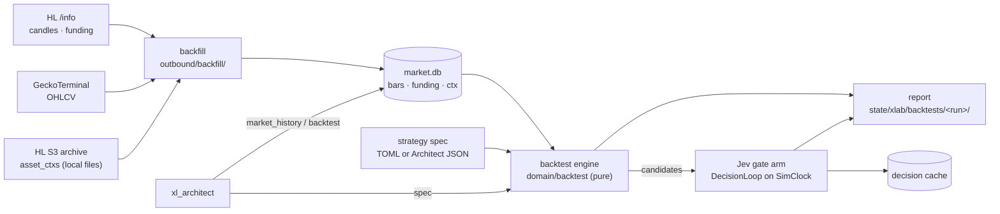

# xlab — history-first adaptive trading harness (2026-10-01)

The operator's PRD v0.5 ("Tengu Adaptive Autonomous Trading Harness": Architect + TypeSafe JEV + deterministic layer + risk + paper, on Robinhood Chain, Hyperliquid / HIP-3 and Solana) as its own sandbox, `sandboxes/xlab`. **History first:** every question is answered by backfilling public history and replaying it, not by waiting for live recording. xmarket / xmarket-weekend stay as they are.

| Question | Answer |
|---|---|
| Why not wait for the weekend run? | No need. Hourly bars for every xyz stock perp go back to 2026-03-07; rule W runs over ~30 weekends in seconds (`tengu backtest`). The weekend run adds only real Sunday-evening xyz order books, which no archive has (§ 1) — optional |
| What is new | `market.db` warehouse + backfill (§ 4), a strategy-spec DSL = the Architect's level-2 capabilities (§ 5), a deterministic backtest engine with costs, funding, risk caps and bootstrap stats (§ 6), Jev replayed on history with a decision cache (§ 7), tools `market_history` + `backtest` (§ 8), sandbox `xlab` (§ 9) |
| PRD baselines it measures now | A (rules) and C (rules + Jev) on identical history; E-ready (the Architect proposes specs through `backtest`) |

## 1. History that exists (verified 2026-10-01)

| Data | Source | Reach | In xlab |
|---|---|---|---|
| HL candles, every perp incl. HIP-3 `xyz:*` | `POST /info` `candleSnapshot` | the newest 5 000 bars per interval: 1m ≈ 3.5 d · 5m ≈ 17 d · 15m ≈ 52 d · 1h ≈ 208 d (xyz from 2026-03-07) · 4h ≈ 2.3 y · 1d | `bars` |
| HL funding, every perp incl. `xyz:*` | `fundingHistory` (≤ 500 rows / call) | since listing (`xyz:TSLA` from 2025-11-13) | `funding` |
| HL asset contexts per minute (funding, OI, mark, oracle, mid, impact bid / ask) | S3 `hyperliquid-archive/asset_ctxs/<YYYYMMDD>.csv.lz4` (requester pays) | main-dex perps only (234 coins, no `xyz:*`), years, updated daily | `ctx` (importer; download with `aws s3 cp`) |
| HL L2 books | S3 `hyperliquid-archive/market_data/<date>/<hour>/l2Book/<coin>.lz4` | main-dex perps only (178 coins, no `xyz:*`) | not imported yet (§ 12) |
| Solana / Robinhood Chain pool OHLCV (USD) | GeckoTerminal `/networks/{solana,robinhood}/pools/<pool>/ohlcv/<minute,hour,day>` | ≤ 1 000 bars / call, ~30 calls / min free | `bars` (`source = gecko:<network>:<pool>`) |
| xyz order books on a weekend | none | — | the weekend run's recorder / sampler only |

## 2. PRD v0.5 → tengu

| PRD | Tengu piece | State |
|---|---|---|
| §3 core loop, §28 fast path | `[decision_loops.*]` (Jev) + typed tools + `[risk]` gate + paper ledger | have (xmarket) |
| §4 Architect: researcher / analyst / strategist / critic | `xl_architect` agent + skill `xlab-research` + tools `market_history`, `backtest` | new |
| §5–7 dynamic capabilities, levels 1–3 | level 1 = `market_history` (+ skills over `http_request`); level 2 = strategy specs run by `backtest` (typed DSL, no code); level 3 = the existing exec tools only, never generated | new (1, 2) · have (3) |
| §8 ASK_ARCHITECT, §29 slow path | loop terminal action `ask_architect` (counted in replay; live escalation later) | partial |
| §23 deterministic layer | `domain/backtest/` (costs, funding, spread estimate, features as-of t) + `domain/xm/cost.rs` | new |
| §25 risk engine | `[risk]` caps applied inside the simulator (capped arm) + the live gate (paper) | new (sim) · have (live) |
| §30 paper trading | simulator fills (history); `paper_*` tools (forward) | new · have |
| §33 decision audit | backtest run dir: `report.json`, `trades-<arm>.jsonl`, `candidates.jsonl`, `skips.json`, `decisions.jsonl` (§ 6) | new |
| §37 JEV calibration | gate arm: reliability bins + Brier on history | new |
| §38 baselines | A rules · C rules + Jev now; B / D need the info layer; E = Architect specs | A, C new |
| §39 time integrity | bars observable only at close, `data_asof_ms ≤ decided_at_ms` asserted per trade | new |

## 3. Architecture



| Layer | File | Holds |
|---|---|---|
| domain | `src/domain/marketdata.rs` | `Interval`, `Bar`, `FundingPoint`, `CtxPoint`, decoders (HL candle / funding, Gecko OHLCV, archive CSV row), as-of helpers |
| domain | `src/domain/backtest/{mod,spec,engine,costs,features,stats,report}.rs` | strategy specs, simulator, cost model, features as-of t, statistics, report + `backtest/1` row |
| ports | `src/ports/market_data.rs` | `MarketDataStore` |
| config | `src/config/backtest.rs` | `[backtest]` (costs, universes, strategies, gate) → `SandboxSections.backtest` |
| application | `src/application/backtest/{mod,run_dir,gate}.rs` | resolve the spec → load series → candidates → arms → write the run dir; the Jev gate arm |
| domain | `src/domain/canonical.rs` | canonical JSON + sha256 (`spec_sha256`, the decision cache key) |
| application | `src/application/decision_loop/mod.rs` | + `Clock` (replay runs the real loop at simulated time) |
| outbound | `src/adapters/outbound/market_data.rs` | SQLite `<state dir>/market.db` |
| outbound | `src/adapters/outbound/backfill/{mod,hl,gecko,hl_archive}.rs` | fetchers + archive importer |
| outbound | `src/adapters/outbound/decision_cache.rs` | `CachedDecisionEngine` (SQLite, replay-deterministic) |
| outbound | `src/adapters/outbound/tools/xlab/{mod,defs,history,run}.rs` | tools `market_history`, `backtest` (plugin `xlab`) |
| inbound | `src/adapters/inbound/cli/{history,backtest}.rs` | `tengu history backfill / import-hl-archive / coverage`, `tengu backtest` |

## 4. Data layer — `market.db`

`<TENGU_HOME>/state/<[xmarket] state>/market.db` (WAL), reserved name in `config/xmarket.rs`; outside every fs root (tools' own state, like `ledger.db`).

| Table | Key | Columns |
|---|---|---|
| `bars` | (instrument, interval, t_open_ms) | o, h, l, c, v, n (trades, nullable), source, fetched_at_ms |
| `funding` | (instrument, t_ms) | rate_1h (HL per-hour rate; > 0 = longs pay), premium, source, fetched_at_ms |
| `ctx` | (instrument, t_ms) | mark, oracle, mid, impact_bid, impact_ask, oi, day_ntl_vlm, funding_1h, premium, source |

| Rule | Value |
|---|---|
| Instrument ids | convention 1: `hyperliquid:xyz:TSLA`, `hyperliquid:SOL`; DEX tokens `solana:<mint>`, `robinhood:<token address>` (new venue `solana`); the pool is the `source` (`gecko:solana:<pool>`), never part of the id. Full ids everywhere |
| Observable at | a bar at `t_open + interval` (its close), a funding row at `t_ms`, a ctx row at `t_ms` — never earlier (§ 39) |
| Partial bars | a bar not closed at fetch time is never stored — nor requested: a fetch ends at the open bar's start |
| Upsert | re-fetch replaces a row (same key); counts returned |
| Resume (as built) | bars from the bar after the last stored one, funding after the last stored `t_ms`; a `from` ≥ one bar (funding: 1 h — HL settles a few ms past the hour) before the first stored row also fetches that head; nothing new ⇒ no request |
| Bad rows (as built) | a row failing `Bar::validate`, off the interval's UTC grid or not a decimal is an error naming its row and time; that page is not written, that instrument stops, the next runs; the CLI exits 1 |
| Gecko `token` (as built) | the instrument's own address (`solana:<mint>` → `<mint>`), not `base`: its USD price whichever side of the pool it is on (verified 2026-10-01 on the USDC / SOL pool `Gf7sXMoP8iRw4iiXmJ1nq4vxcRycbGXy5RL8a8LnTd3v`: SOL ≈ 117.7, not USDC ≈ 1) |
| Budgets | HL: `[rate_limits.hyperliquid]` via `HlInfo` (candles weight 20 + 1 / 60 bars); Gecko: `[rate_limits.geckoterminal]` (xlab: 25 / min) |
| Egress | `egress::policy().tool_client` (allow_hosts `api.hyperliquid.xyz`, `api.geckoterminal.com`); audit `hl_info` / `gecko_ohlcv`, attributed `cli` · `history-backfill:<start ms>` · `<instrument>` (`docs/egress-2026-09-16.md` § Market-data backfill hosts) |
| Archive download (operator, infra) | `aws s3 cp --request-payer requester s3://hyperliquid-archive/asset_ctxs/<YYYYMMDD>.csv.lz4 <dir>/` (≈ 2–5 MB / day) |
| Code (as built) | types `domain/marketdata.rs` · decoders `domain/marketdata_decode.rs` (sibling file, not in `marketdata.rs`) · store `outbound/market_data.rs` · `outbound/backfill/{mod,hl,gecko,hl_archive,json}.rs` (+ `json.rs`: the JSON import) · CLI `inbound/cli/history.rs` |

## 5. Strategy specs — the Architect's level-2 capabilities

JSON (tool / `--spec`) or TOML (`[backtest.strategies.<name>]`), `deny_unknown_fields`, validated before any run. No code: a spec selects a kind and its parameters.

| Common field | Meaning |
|---|---|
| `name` | `[a-z0-9_]{1,48}` |
| `kind` | one of the six below |
| `universe` | full instrument ids, or `"@<name>"` = `[backtest.universes.<name>]` |
| `interval` | bars used: `1m 5m 15m 1h 4h 1d` |
| `notional_usd` | per trade (default `[backtest] notional_usd`) |
| `exclude` | ids never traded |
| `costs` | override, `CostSpec` (`domain/backtest/costs.rs`): `taker_fee_bps`, `half_spread` (`{ model = "fixed", bps }` \| `{ model = "abdi_ranaldo", window_bars, floor_bps }` \| `{ model = "ctx", fallback_bps }`), `slippage_bps`, `funding` (bool, default true); else `[backtest.costs."<prefix>"]` (longest prefix) |

| Kind | Decision instants | Signal → side | Exit | Params |
|---|---|---|---|---|
| `weekend_window` | rule W's window (`domain/xm/weekend_fade::fade_window`): entry Sun 18:00 NY (+ `entry_offset_mins`) | s = ln(P_entry / P_anchor), anchor Fri 20:00 (+ `anchor_offset_mins`); `fade` = −sign(s), `follow` = +sign(s) | Mon 09:00 (+ `exit_offset_mins`) | `calendar`, `direction`, `min_abs_signal_bps`, `top_n` |
| `daily_window` | every day in `days` (`all` \| `weekdays` \| `trading` + `calendar`) at `entry` (`HH:MM`, `tz`) | move from `anchor` to `entry` | `exit` time; a time ≤ the previous one = next day (next trading day for `trading`) | `tz`, `anchor`, `entry`, `exit`, `direction`, `min_abs_signal_bps`, `top_n` |
| `move_trigger` | every bar close per instrument | \|ln(c_t / c_{t−lookback})\| ≥ `threshold_bps` (+ volume over the lookback ≥ `min_volume_ratio` × its trailing mean) | after `hold_bars`, or `take_profit_bps` / `stop_loss_bps` at a bar close | `lookback_bars`, `threshold_bps`, `min_volume_ratio`, `volume_baseline_bars`, `direction`, `hold_bars`, `cooldown_bars` |
| `funding_carry` | every funding row | \|rate_1h\| × 24 × 365 ≥ `min_apr_pct`: take the side that receives funding | `hold_hours`, or \|rate\| < `exit_apr_pct` | `min_apr_pct`, `exit_apr_pct`, `hold_hours` |
| `pair_spread` | every bar close of both legs | z of ln(a / b) over `lookback_bars`; \|z\| ≥ `entry_z`: short the rich leg, long the cheap one (`notional_usd` / 2 each) | \|z\| ≤ `exit_z` or `max_hold_bars` | `legs` (2 ids), `lookback_bars`, `entry_z`, `exit_z`, `max_hold_bars` |
| `event_window` | each `events[i].t` + `entry_delay_mins` | move from `t` to entry; `follow` / `fade`, \|move\| ≥ `min_abs_move_bps` | `exit_after_mins`, or `exit_at` (`HH:MM`, `tz`) next after entry | `events` (`{instrument, t, label?}`, publication time), `entry_delay_mins`, `direction`, `exit_after_mins` \| `exit_at` + `tz` |

Example (rule W, as committed in `sandboxes/xlab/config.toml`):

```toml
[backtest.strategies.weekend_fade]
kind = "weekend_window"
universe = "@xyz_stocks"
interval = "1h"
calendar = "us_equity"
direction = "fade"
min_abs_signal_bps = 0
```

## 6. Backtest engine (`domain/backtest`, pure)

| Step | Rule |
|---|---|
| Price at an instant | close of the bar ending exactly there (`t_open = instant − interval`); missing ⇒ the candidate is skipped (`missing_price`), never interpolated |
| As-of view | the engine reads series only through `AsOf { t }`: bars with close ≤ t, funding / ctx with `t_ms ≤ t`. Each trade records `decided_at_ms` and `data_asof_ms` (latest observation used); `data_asof_ms ≤ decided_at_ms` is asserted |
| Fill | entry and exit at that price; cost per side = `taker_fee_bps` + half-spread + `slippage_bps`. Half-spread `abdi_ranaldo` uses only bars closed before the decision; `ctx` uses the latest ctx row ≤ t (`(impact_ask − impact_bid) / 2 / mid`) |
| Funding | Σ over funding rows with entry < `t_ms` ≤ exit of −side × rate_1h × notional; a hold hour without a row ⇒ `funding_complete = false` (counted, not guessed) |
| Arms | `research`: every candidate at `notional_usd`, no caps (the shadow ledger's view); `capped`: `[risk]` caps — `max_order_notional_usd` (size clamp), `max_gross_exposure_usd`, `max_net_exposure_usd`, `daily_loss_limit_usd` (no entries for the rest of the UTC day), `total_loss_limit_usd` (no entries after), on `[paper] initial_cash_usd`; a refused entry is recorded with its rule |
| P&L | per trade: gross bps = side × ln(P_exit / P_entry) × 10⁴; net bps = gross − costs ± funding bps; USD at the filled notional |
| Periods | the strategy's natural bucket: the window (weekend / day) for window kinds, else the UTC day of entry |
| Stats | n, mean / median / sd net bps, t, hit rate, Σ USD, fees, funding, max drawdown (realized equity), per-period Sharpe (annualised by periods / year), bootstrap 95 % CI of the mean resampling periods (B = `[backtest] bootstrap`, seeded splitmix64 — reruns are identical), mean without the 5 best trades, share of P&L from the best 2 periods, per-instrument table |
| Split | `--split time:<RFC3339>` (in-sample decided before, holdout from) or `--split instruments:<id,…>` (holdout = listed): both halves reported side by side |

Golden: rule W on `tests/fixtures/xmarket/weekend_2026-09-26_candles.json` (5m) gives exactly `weekend_fade::replay`'s rows (74 names, mean net +95.5 bps).

| As built — engine (`domain/backtest/`) | Rule |
|---|---|
| Decision range | only instants in `[from, to)` decide; series reach back / forward for anchors, lookbacks, features and exits (`StrategySpec::data_range`) |
| Funding hour | a row books for the hour nearest its `t_ms` (HL stamps a few ms late); Σ over the hours in (entry, exit] |
| `funding_carry` | decides at the next bar close at or after the funding row; one position per instrument (re-entry only after its own exit) |
| `pair_spread` | one position at a time (re-entry only after its own exit) |
| `move_trigger` volume | the lookback's volume (bars opening in it) ≥ `min_volume_ratio` × the baseline's mean volume per bar × `lookback_bars`; the series must reach the baseline's start; a missing bar counts 0 |
| Sharpe | over periods with trades only (a period without one is not a 0) |
| Capped arm order | the candidates of one instant in instrument-id order: on `weekend_fade` ($25 orders, $110 gross) that is the first 4 names alphabetically each weekend — `weekend_fade_top4` ranks by \|s\| first |
| Research drawdown % | of `[paper] initial_cash_usd`, though the research arm trades every candidate at `notional_usd` (its % can pass 100) |

| As built — use case (`application/backtest/`, `tengu backtest`) | Rule |
|---|---|
| `from` / `to` defaults | the earliest stored bar of the run's instruments at the spec's interval / now |
| Series loaded | `data_range` + the longest `abdi_ranaldo` window of the costs in use; bars at the interval; funding when the cost books it (always for `funding_carry`); ctx when the cost is `half_spread = ctx`; `exclude`d ids never loaded (still counted as `excluded` skips) |
| Arms | `research`; `capped` with `[risk]` + `[paper]`; extra arms (the gate's) over a candidate subset, each compared with its base arm (paired bootstrap) |
| Run dir | `<state dir>/backtests/<YYYYMMDDTHHMMSSZ>-<strategy>[-N]/`: `report.json`, `report.md`, `trades-<arm>.jsonl`, `candidates.jsonl` (features as-of), `skips.json` (counts by reason, every skip, fill drops and refusals per arm, data notes), the gate's `decisions.jsonl` |
| `spec_sha256` | sha256 (64 hex) of the canonical JSON of the normalized spec (`StrategySpec::to_value`, keys sorted at every depth) |
| `market.db` | read only |

| Live check (2026-10-01; 1h bars from 2026-03-07 08:00 UTC, 75 xyz names) | n | mean net bps | 95 % CI |
|---|---:|---:|---|
| `weekend_fade` | 1 500 | +58.65 | +19.6 … +96.7 |
| … without KIOXIA's 3-for-1 split weekend (one trade, +11 609 bps) and without funding (+1.5) — the study's basis | 1 499 | +49.42 | — |
| feasibility study, W pooled (`xmarket-feasibility-2026-09-30.md`) | 1 525 | +48.3 | +14.8 … +80.7 |
| `weekend_fade --split time:2026-07-01` in-sample · holdout | 614 · 886 | +57.78 · +59.25 | holdout −3.5 … +118.9 |
| `weekend_fade_top4` (top 4 of all 75, \|s\| ≥ 50) | 116 | +247.16 | +68.0 … +538.1 |
| `weekend_follow` (placebo) | 1 500 | −66.25 | −104.3 … −27.2 |

The 26-trade gap to the study is its first weekend (anchor Fri 2026-03-06 20:00 ET, before HL's 5 000-bar reach: `missing_anchor` × 75); the other 673 `missing_anchor` skips are names not listed yet. Rule W over 75 names runs in ~1 s.

## 7. Jev on history — the gate arm (PRD §38 C, §37)

| Step | Rule |
|---|---|
| Candidates | the rule's candidates in decision-time order (before caps) |
| Event | `{strategy, instrument, side, signal_bps, decided_at, features}`; features as-of the decision (`domain/backtest/features.rs`): `ret_1h_bps`, `ret_24h_bps`, `ret_168h_bps`, `vol_24h_bps`, `volume_ratio_24h`, `trades_last_bar`, `funding_apr_pct`, `half_spread_bps`, `hour_of_week` |
| Loop | the sandbox's `[decision_loops.<gate>]` — the real `DecisionLoop` on a `SimClock` set to `decided_at`, no tools (terminal actions only), `escalate = false` |
| Actions | `take` = trade; any other terminal action (`skip`, `ask_architect`) = no trade; below `act_at` = `unsure` (no trade, counted) |
| Engine | `CachedDecisionEngine` over `JevClient`: key = sha256 hex of (model, canonical state, questions); hit = stored decision, miss = live call + store (`<state dir>/backtests/decision-cache.db`); `--offline` = a miss fails; `--max-decisions` (default 500) bounds spend (~$0.00014 and 0.3–0.6 s per decision) |
| Report | arms `rules` vs `jev` (both research + capped), the difference of mean net bps with a paired bootstrap CI over periods, take rate, calibration (5 bins of p(take) vs hit rate, Brier), `decisions.jsonl` (one line per call, trigger `backtest`) |

As built (2026-10-01, `xlab-gate`):

| Piece | Rule |
|---|---|
| Code | pure: `domain/backtest/gate.rs` (`gate_event`, `GateClass`, `p_take`, `GateSummary`) · run: `application/backtest/gate.rs` (`run_gate`, `gate_arms`, `GateArms::add_to_report`) · wiring: `bootstrap::decision::build_gate` (cached engine + K replay loops) |
| Order + cap | candidates by `seq`; the first `--max-decisions` are decided, the rest are `cut`: counted, logged, in `report.md` — never silent |
| Event | numbers rounded to 0.01, whole ones as integers (short, stable cache keys); never the exit, period, anchor, label (free text, may hold hindsight) or outcome |
| Loop | replay loops run with `history = 0`: each decision sees its event alone, so verdicts and cache keys are the same for any `--concurrency` K or cut (tested K = 1 vs 4) |
| Workers | K, each its own loop + `SimClock`, one shared queue; `clock.set(decided_at)` before each call; session `backtest:<strategy>:<seq>` |
| Classes | `take` (trades) · `skip` (any other confident terminal) · `ask_architect` · `unsure` (below `act_at`) · `rejected` (no / unknown label) · `error` (failed call: offline miss, Jev error — counted, the run goes on) |
| p(take) | `probabilities.take`, else the confidence when the action is `take`, else 0; Jev's `confidence` is not p(choice) (live: take p 0.55, confidence 0.33) |
| Calibration · diff | over answered verdicts but `rejected`, joined by `seq` to the rules arm's trade (won = net bps > 0); jev − rules = `paired_diff_ci` over the same decided candidates, research and capped, put first in the report's comparisons (the row's `diff_bps`) |
| Spend | est = cache misses × $0.00014 (0 offline). Measured 2026-10-01: Σ `usage.cost` $0.000321 for 10 live decisions (≈ $0.00003 each); a cache hit's audit line repeats the stored `usage` — never sum `usage` over replays |
| Model slug | the pinned build `typesafe/jev-1.13-20260917` is accepted (`~typesafe/jev-latest` resolves to it today). Identical requests vary call to call (TSLA p(take) 0.24 vs 0.29): only the cache makes reruns identical. Recommended for backtests: pin the build — the key then names it, and a bump re-decides cleanly instead of mixing builds |
| Live finding | `xl_gate` `act_at = 0.6` vs Jev confidence 0.13–0.48 on 22 live decisions: every one `unsure`, the jev arm empty. Tune `act_at` (or gate on p(take)) from a real run's calibration |

## 8. Tools

Opt-in (`WORKSPACE_TOOLS`), read-only: they cannot move money. Work under every engine (schema lint, bridge conformance cases, engine-matrix set `xlab`).

| Tool | Args | Row | Notes |
|---|---|---|---|
| `market_history` | `instrument`, `interval` (1h), `from` / `to` (RFC3339; default the last 7 days), `fetch` (false), `pool` (Gecko), `points` (48, ≤ 200) | `mkt_history/1:<instrument>:<interval>` — `n_bars`, `first_ms`, `last_ms`, `last_close`, `ret_bps`, `vol_bps`, `max_drawdown_bps`, `avg_volume`, `funding_mean_apr_pct`, `gaps`; `data` = ≤ `points` bars + coverage | `fetch = true` backfills the missing range first (HL or Gecko) |
| `backtest` | `strategy` (a `[backtest.strategies]` name) xor `spec` (object), `from` / `to`, `split` | `backtest/1:<run id>` — ≤ 32 scalar features (n, mean / CI / t, hit rate, USD, drawdown, Sharpe, holdout mean), text = summary table | rules arms only (the Jev arm is CLI: spend); writes the run dir |

Scope: `fs_roots` = the workspace (observation store); `net_hosts` = the fetch hosts; `market.db` and `backtests/` are the tools' own state in the state dir.

| As built: `market_history` (2026-10-01) | Value |
|---|---|
| Code | `outbound/tools/xlab/{mod,defs,history}.rs` (plugin `xlab`); stats, sample, gaps and the row `domain/marketdata_stats.rs`; row reference `docs/typed-observations-2026-09-24.md` § Market history |
| Args | `from` / `to` also epoch ms or `YYYY-MM-DD`; a window ≤ 100 000 bars; strict (an unknown key is an error); `pool` only on `solana:` / `robinhood:` ids (required with `fetch` there) |
| Row | + features `points`, `from_ms`, `to_ms`, `funding_points`, `fetched_bars` / `fetched_funding`; line 1 `mkt_history <id> <interval> bars=<n> <first> … <last> last_close=<c> ret_bps=<r>`; `ok` · `partial` (a fetch failed: classed error fields, the stored bars still read) · `absent` (no bar in the window) · `error`; ttl 0 |
| Text | the `data` JSON stays out of the text: a table of ≤ 48 of the sampled bars instead (a local model's 8 192-char cap holds it); `points` above 48 widen only `data` |
| Fetch | `outbound/backfill/` as the CLI runs it, with `Retry::TOOL` (2 retries, ≤ 5 s) and the tool's scope: `HL_API_URL` / `GECKO_API_URL` only through `env_reads` |
| Not in `XM_TOOLS` | no workspace rows (ttl 0) and the warehouse is the state dir's: its holders need not share the xmarket workspace |
| Engine parity | schema lint; conformance cases `market_history` (HL fetch → read back), `market_history:gecko`, `market_history:no_xmarket`; engine-matrix set `xlab` (not `backtest`; hardened fixtures, warehouse seeded by `tengu history import-json`): live legs green on gemini-2.5-flash-lite, claude-haiku-4.5 (OpenRouter) and the Claude CLI; local offline (`offline_local_xlab`), its live leg on the operator's PC |

| As built: `backtest` (2026-10-01) | Value |
|---|---|
| Code | `outbound/tools/xlab/run.rs` (plugin `xlab`) over the use case `application/backtest/` (`spec_of` → `prepare` → `evaluate` → `write_run_dir`); row `domain/backtest/report.rs`; reference `docs/typed-observations-2026-09-24.md` § Backtest |
| Args | `strategy` xor `spec` (an object, or a string holding one; unnamed ⇒ `architect_spec`); `from` / `to` epoch ms, RFC 3339 or `YYYY-MM-DD` (defaults as `tengu backtest`); `split`; strict (an unknown key is an error) |
| Spec errors | before any read, one error naming every problem: `StrategySpec::from_value`'s (fields, bounds, unknown fields), an unknown `@universe`, a calendar that is no exchange row; an unknown `strategy` lists the library. An instrument without a cost entry is not an error: the text names it (`no_costs`, full ids) — it never trades |
| Run | rules arms only (`research`, `capped` with `[risk]` + `[paper]`): no Jev gate (spend: the CLI's `--gate`), no fetch (the Architect runs `market_history` `fetch = true` first); `evaluate` + `write_run_dir` on a blocking thread |
| Row · text | `backtest/1:<run id>`, ttl 0; text = `render_text` line 1 + features + errors, `render_compact`'s other lines, the decision window, `no_costs`, `spec_sha256`, the run dir — ≈ 2 KB on 75 names, ≈ 4.5 KB crowded (16k local cap 8 192) |
| Refusals | `state_dir_missing` (no `[xmarket]`), `market_data_unavailable`, `backtest_config_missing` (no `[backtest]`) |
| Run id in tests | the call's UTC second (`<YYYYMMDDTHHMMSSZ>-<strategy>`): the conformance harness normalises that basic-format stamp like any other time (`<TIME>`) — real runs print the real id; no test knob |
| Not in `XM_TOOLS` | as `market_history`: no workspace rows, state-dir output |
| Engine parity | schema lint (`spec` a free-form object, its format in the description); conformance cases `backtest` (HL fetch → library move trigger → inline spec, run dirs compared), `backtest:bad_spec`, `backtest:no_backtest`; engine-matrix set `xlab` + library `matrix_fade` and inline `matrix_move` on the seeded store: live legs green on gemini-2.5-flash-lite (3.6 s), claude-haiku-4.5 (15.2 s, OpenRouter) and the Claude CLI (21.4 s); local offline (`offline_local_xlab`) |
| Live smoke (2026-10-01, real `market.db`, temp config with the tools on `xl_architect`) | `weekend_fade_top4` → `20261001T165153Z-weekend_fade_top4`: n 116, +247.16 bps, CI +68.0 … +538.1 (= § 6), 1.6 KB text; inline weekend follow on `@xyz_stocks`, `split = time:2026-07-01` → `20261001T165206Z-arch_weekend_follow`: n 1 500, −66.25 bps (in-sample −65.38, holdout −66.85, n 886), 2.0 KB |

## 9. Sandbox `xlab`

| Piece | Value |
|---|---|
| State · workspace | `~/.tengu/state/xlab/` (`market.db`, `backtests/`, `ledger.db`) · `~/xlab-ws` |
| Network | `open`, allow_hosts `api.hyperliquid.xyz`, `api.geckoterminal.com` (switchable to Tor) |
| `xl_architect` (default, routable) | OpenRouter Sonnet (or hardened `claude_code`, commented); tools `market_history`, `backtest`, `read_file`, `list_directory`; skill `xlab-research` (hypothesis → spec → in-sample → holdout → critic) |
| `xl_jev` (private) | owns `[decision_loops.xl_gate]` (`take` / `skip` / `ask_architect`) |
| `[risk]` + `[paper]` | the $100 budget (PRD §31) — the capped arm's caps; hardening (no shell, hardened `claude_code`) |
| `[backtest]` | costs per venue prefix, universes (`xyz_stocks` = the weekend sandbox's 75, `crypto` = BTC, ETH, SOL, HYPE), strategies: `weekend_fade` (W), `weekend_fade_top4`, `weekend_follow` (placebo), `xyz_overnight_follow`, `xyz_funding_carry`, `crypto_move_fade`, `crypto_funding_carry`, `sol_eth_spread` — every one parsed, its universe, calendar and costs checked at `Config::load` (`config/backtest.rs`) |

## 10. Commands

| Command | Does |
|---|---|
| `tengu history backfill --sandbox xlab --instruments @xyz_stocks --interval 1h --from 2026-03-01 --funding` | HL bars + funding → `market.db` (resumes, § 4; prints a run table with full ids, clamp notes, errors; exit 1 when a row failed; `--no-bars` = funding only) |
| `tengu history backfill --sandbox xlab --source gecko --instruments robinhood:<token>@<pool> --interval 1h --from …` | Gecko OHLCV (`solana:<mint>@<pool>` alike; bars only) |
| `tengu history import-hl-archive --sandbox xlab --dir <dir>` | archive `*.csv.lz4` / `*.csv` under `<dir>` (recursive) → `ctx` |
| `tengu history import-json --sandbox xlab --file <path>` | JSON datasets `[{instrument, interval, source?, bars?, funding?}]` → `bars` / `funding`; nothing written unless every row checks |
| `tengu history coverage --sandbox xlab [--instrument <id>]` | what is stored, per instrument / interval |
| `tengu backtest --sandbox xlab --strategy weekend_fade [--from <t>] [--to <t>] [--split time:2026-07-01T00:00:00Z \| instruments:<id,…>]` | rules arms (`research`; `capped` with `[risk]` + `[paper]`); `--from` / `--to` default to the earliest stored bar of the run's instruments / now; prints the compact summary + the run dir (§ 6); no LLM |
| `tengu backtest --sandbox xlab --spec spec.json [--format json]` | any spec (the Architect's), named by its `name`, else the file stem; `json` = `report.json` on stdout, the run dir on stderr |
| `tengu backtest … --fetch` | first `tengu history backfill` (same code) of the run's Hyperliquid instruments: bars at the spec's interval + funding over the run's data range (from HL's oldest bar without `--from`); a failed row warns, the run goes on. Without `--fetch` a missing `market.db` is an error |
| `tengu backtest --sandbox xlab --strategy weekend_fade --gate xl_gate [--max-decisions 300] [--offline]` | + the Jev arm (§ 7; wired with the gate arm) |

## 11. Limits

| Limit | Effect |
|---|---|
| Fills at bar closes ± modelled costs, not the L2 fill engine | no historical xyz books exist; the thin-name spread is a model (fixed / Abdi–Ranaldo); the weekend run measures the real one |
| HL keeps 5 000 bars per interval | 1h reaches ~208 days; older or finer windows need recording (`[recorder]`) or 4h / 1d bars |
| No corporate actions | prices are not split-adjusted: KIOXIA's 3-for-1 split weekend (anchor 2026-09-25) books the raw jump (+11 609 bps on the fade); `exclude` the name or set `--to` before it when that matters |
| No historical OI for `xyz:*` | OI features only where the archive has ctx (main-dex perps) |
| LLM time integrity | an Architect proposing specs over a period inside its training data leaks the future; prefer models whose cutoff predates the test window, judge on holdout |
| Small samples | ~30 weekends: CIs are wide; the report shows them rather than a point estimate |

## 12. Next

`hl-archive` L2 import (main-dex executable books for crypto rules) · info layer for baselines B / D (news, EDGAR events as `event_window` sources) · live escalation `ask_architect` → Architect → resume (§ 29) · capability lifecycle store (§ 34–35: requested → validated → retired, with backtest evidence) · forward paper of a validated spec through the existing exec tools.
