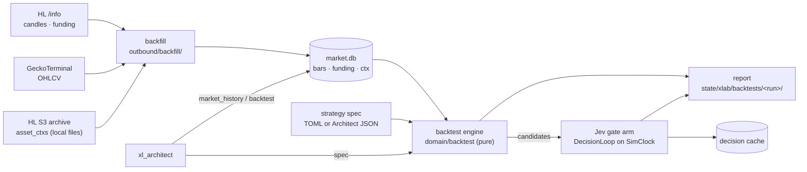

# xlab — history-first adaptive trading harness (2026-10-01)

The operator's PRD v0.5 ("Tengu Adaptive Autonomous Trading Harness": Architect + TypeSafe JEV + deterministic layer + risk + paper, on Robinhood Chain, Hyperliquid / HIP-3 and Solana) as its own sandbox, `sandboxes/xlab`. **History first:** every question is answered by backfilling public history and replaying it, not by waiting for live recording. xmarket / xmarket-weekend stay as they are.

Visual overview (browser): [`xlab-2026-10-02.html`](xlab-2026-10-02.html) — data, engine, gate arm, tools, results; all pages: [`index.html`](index.html).

| Question | Answer |
|---|---|
| Why not wait for the weekend run? | No need. Hourly bars for the xyz stock perps go back to 2026-03-07 (26 of 75 names; the other 49 from their listing, 2026-03-25 … 2026-09-17); rule W runs over ~30 weekends in seconds (`tengu backtest`). The weekend run adds only real Sunday-evening xyz order books, which no archive has (§ 1) — optional |
| What is new | `market.db` warehouse + backfill (§ 4), a strategy-spec DSL = the Architect's level-2 capabilities (§ 5), a deterministic backtest engine with costs, funding, risk caps and bootstrap stats (§ 6), Jev replayed on history with a decision cache (§ 7), tools `market_history` + `backtest` (§ 8), sandbox `xlab` (§ 9) |
| PRD baselines it measures now | A (rules) and C (rules + Jev) on identical history; E-ready (the Architect proposes specs through `backtest`) |

## 1. History that exists (verified 2026-10-01)

| Data | Source | Reach | In xlab |
|---|---|---|---|
| HL candles, every perp incl. HIP-3 `xyz:*` | `POST /info` `candleSnapshot` | the newest 5 000 bars per interval: 1m ≈ 3.5 d · 5m ≈ 17 d · 15m ≈ 52 d · 1h ≈ 208 d (xyz from 2026-03-07) · 4h ≈ 2.3 y · 1d | `bars` |
| HL funding, every perp incl. `xyz:*` | `fundingHistory` (≤ 500 rows / call) | since listing (`xyz:TSLA` from 2025-11-13) | `funding` |
| HL asset contexts per minute (funding, OI, mark, oracle, mid, impact bid / ask) | S3 `hyperliquid-archive/asset_ctxs/<YYYYMMDD>.csv.lz4` (requester pays) | main-dex perps only (234 coins, no `xyz:*`), years, updated daily | `ctx` (importer; download with `aws s3 cp`) |
| HL L2 books | S3 `hyperliquid-archive/market_data/<date>/<hour>/l2Book/<coin>.lz4` | main-dex perps only (178 coins, no `xyz:*`) | not imported yet (§ 12) |
| Solana / Robinhood Chain pool OHLCV (USD) | GeckoTerminal `/networks/{solana,robinhood}/pools/<pool>/ohlcv/<minute,hour,day>` | ≤ 1 000 bars / call, ~30 calls / min free | `bars` (`source = gecko:<network>:<pool>`) |
| xyz order books on a weekend | none | — | the weekend run's recorder / sampler only |

## 2. PRD v0.5 → tengu

| PRD | Tengu piece | State |
|---|---|---|
| §3 core loop, §28 fast path | `[decision_loops.*]` (Jev) + typed tools + `[risk]` gate + paper ledger | have (xmarket) |
| §4 Architect: researcher / analyst / strategist / critic | `xl_architect` agent + skill `xlab-research` + tools `market_history`, `backtest` | new |
| §5–7 dynamic capabilities, levels 1–3 | level 1 = `market_history` (+ skills over `http_request`); level 2 = strategy specs run by `backtest` (typed DSL, no code); level 3 = the existing exec tools only, never generated | new (1, 2) · have (3) |
| §8 ASK_ARCHITECT, §29 slow path | loop terminal action `ask_architect` (counted in replay; live escalation later) | partial |
| §23 deterministic layer | `domain/backtest/` (costs, funding, spread estimate, features as-of t) + `domain/xm/cost.rs` | new |
| §25 risk engine | `[risk]` caps applied inside the simulator (capped arm) + the live gate (paper) | new (sim) · have (live) |
| §30 paper trading | simulator fills (history); `paper_*` tools (forward) | new · have |
| §33 decision audit | backtest run dir: `report.json`, `trades-<arm>.jsonl`, `candidates.jsonl`, `skips.json`, `decisions.jsonl` (§ 6) | new |
| §37 JEV calibration | gate arm: reliability bins + Brier on history | new |
| §38 baselines | A rules · C rules + Jev now; B / D need the info layer; E = Architect specs | A, C new |
| §39 time integrity | bars observable only at close, `data_asof_ms ≤ decided_at_ms` asserted per trade | new |

## 3. Architecture



| Layer | File | Holds |
|---|---|---|
| domain | `src/domain/marketdata.rs` | `Interval`, `Bar`, `FundingPoint`, `CtxPoint`, as-of helpers (time-integrity rule), `StockSplit` (split adjustment of bars / ctx) |
| domain | `src/domain/marketdata_decode.rs` | decoders: HL candle / funding, Gecko OHLCV, archive CSV row, JSON dataset → rows |
| domain | `src/domain/marketdata_stats.rs` | window statistics, bar sample, the `mkt_history/1` row of `market_history` |
| domain | `src/domain/backtest/{mod,spec,kinds,engine,fills,costs,features,stats,report,gate}.rs` | strategy specs, decisions per kind (`kinds`), simulator + arms (`engine`), fills / exits (`fills`), cost model, features as-of t, statistics, report + `backtest/1` row, the gate arm's pure half (`gate`) |
| domain (tests) | `src/domain/backtest/{checks,testkit}.rs` | time-integrity checks across kinds, test fixtures (compiled for tests only) |
| ports | `src/ports/market_data.rs` | `MarketDataStore` |
| config | `src/config/backtest.rs` | `[backtest]` (costs, universes, strategies, gate) → `SandboxSections.backtest` |
| application | `src/application/backtest/{mod,run_dir,gate}.rs` | resolve the spec → load series → candidates → arms → write the run dir; the Jev gate arm |
| domain | `src/domain/canonical.rs` | canonical JSON + sha256 (`spec_sha256`, the decision cache key) |
| application | `src/application/decision_loop/mod.rs` | + `Clock` (replay runs the real loop at simulated time) |
| outbound | `src/adapters/outbound/market_data.rs` | SQLite `<state dir>/market.db` |
| outbound | `src/adapters/outbound/backfill/{mod,hl,gecko,hl_archive,json}.rs` | fetchers + archive importer + JSON dataset importer |
| outbound | `src/adapters/outbound/decision_cache.rs` | `CachedDecisionEngine` (SQLite, replay-deterministic) |
| outbound | `src/adapters/outbound/tools/xlab/{mod,defs,history,run,holdout,rows}.rs` | tools `market_history`, `backtest` (plugin `xlab`): the holdout discipline + ledger (`holdout.rs`), a stored run's rows by run id (`rows.rs`) |
| inbound | `src/adapters/inbound/cli/{history,backtest}.rs` | `tengu history backfill / import-hl-archive / import-json / coverage`, `tengu backtest` |

## 4. Data layer — `market.db`

`<TENGU_HOME>/state/<[xmarket] state>/market.db` (WAL), reserved name in `config/xmarket.rs`; outside every fs root (tools' own state, like `ledger.db`).

| Table | Key | Columns |
|---|---|---|
| `bars` | (instrument, interval, t_open_ms) | o, h, l, c, v, n (trades, nullable), source, fetched_at_ms |
| `funding` | (instrument, t_ms) | rate_1h (HL per-hour rate; > 0 = longs pay), premium, source, fetched_at_ms |
| `ctx` | (instrument, t_ms) | mark, oracle, mid, impact_bid, impact_ask, oi, day_ntl_vlm, funding_1h, premium, source |

| Rule | Value |
|---|---|
| Instrument ids | convention 1: `hyperliquid:xyz:TSLA`, `hyperliquid:SOL`; DEX tokens `solana:<mint>`, `robinhood:<token address>` (new venue `solana`); the pool is the `source` (`gecko:solana:<pool>`), never part of the id. Full ids everywhere |
| Observable at | a bar at `t_open + interval` (its close), a funding row at `t_ms`, a ctx row at `t_ms` — never earlier (§ 39) |
| Partial bars | a bar not closed at fetch time is never stored — nor requested: a fetch ends at the open bar's start |
| Upsert | re-fetch replaces a row (same key); counts returned |
| Resume (as built) | bars from the bar after the last stored one, funding after the last stored `t_ms`; a `from` ≥ one bar (funding: 1 h — HL settles a few ms past the hour) before the first stored row also fetches that head; nothing new ⇒ no request |
| Bad rows (as built) | a row failing `Bar::validate`, off the interval's UTC grid or not a decimal is an error naming its row and time; that page is not written, that instrument stops, the next runs; the CLI exits 1 |
| Gecko `token` (as built) | the instrument's own address (`solana:<mint>` → `<mint>`), not `base`: its USD price whichever side of the pool it is on (verified 2026-10-01 on the USDC / SOL pool `Gf7sXMoP8iRw4iiXmJ1nq4vxcRycbGXy5RL8a8LnTd3v`: SOL ≈ 117.7, not USDC ≈ 1) |
| Budgets | HL: `[rate_limits.hyperliquid]` via `HlInfo` (candles weight 20 + 1 / 60 bars); Gecko: `[rate_limits.geckoterminal]` (xlab: 25 / min) |
| HL budget (as built, review fix) | xlab `per_minute = 600`, `burst = 200`: HL allows 1200 weight / min per IP, shared with xmarket-weekend (peak ≈ 190 / min) and xmarket (≈ 110 / min) on one host; the worst 60 s of xlab's bucket is 800, so 800 + 190 + 110 < 1200 (`config::rate_limits` test). Was 1200: the 1h backfill held ≈ 1 243 / min for 27 min — the whole IP. Now the 75-name 1h backfill (≈ 34 000 weight) takes ≈ 1 h. Budgets are per process: one HL-heavy xlab process at a time |
| Egress | `egress::policy().tool_client` (allow_hosts `api.hyperliquid.xyz`, `api.geckoterminal.com`); audit `hl_info` / `gecko_ohlcv`, attributed `cli` · `history-backfill:<start ms>` · `<instrument>` (`docs/egress-2026-09-16.md` § Market-data backfill hosts) |
| Archive download (operator, infra) | `aws s3 cp --request-payer requester s3://hyperliquid-archive/asset_ctxs/<YYYYMMDD>.csv.lz4 <dir>/` (≈ 2–5 MB / day) |
| Code (as built) | types `domain/marketdata.rs` · decoders `domain/marketdata_decode.rs` (sibling file, not in `marketdata.rs`) · store `outbound/market_data.rs` · `outbound/backfill/{mod,hl,gecko,hl_archive,json}.rs` (+ `json.rs`: the JSON import) · CLI `inbound/cli/history.rs` |

## 5. Strategy specs — the Architect's level-2 capabilities

JSON (tool / `--spec`) or TOML (`[backtest.strategies.<name>]`), `deny_unknown_fields`, validated before any run. No code: a spec selects a kind and its parameters.

| Common field | Meaning |
|---|---|
| `name` | `[a-z0-9_]{1,48}` |
| `kind` | one of the six below |
| `universe` | full instrument ids, or `"@<name>"` = `[backtest.universes.<name>]` |
| `interval` | bars used: `1m 5m 15m 1h 4h 1d` |
| `notional_usd` | per trade (default `[backtest] notional_usd`) |
| `exclude` | ids never traded |
| `min_entry_trades` | optional, 1–1 000 000: a candidate whose entry bar (the bar ending at the decision) counts fewer trades is skipped, reason `thin_entry` — before `top_n` ranking, a cooldown or a position (a bar without a trade count passes). HL keeps a no-trade hour as a flat bar at the previous close (n = 0): a stale price — 1 278 of `xyz:DKNG`'s 4 561 hourly bars are such bars |
| `costs` | override, `CostSpec` (`domain/backtest/costs.rs`): `taker_fee_bps`, `half_spread` (`{ model = "fixed", bps }` \| `{ model = "abdi_ranaldo", window_bars, floor_bps }` \| `{ model = "ctx", fallback_bps }`), `slippage_bps`, `funding` (bool, default true); else `[backtest.costs."<prefix>"]` (longest prefix). An unknown key — also one nested in `half_spread` (`slippage_bps` there) — is refused, in a spec and in `[backtest.costs]` |

| Kind | Decision instants | Signal → side | Exit | Params |
|---|---|---|---|---|
| `weekend_window` | rule W's window (`domain/xm/weekend_fade::fade_window`): entry Sun 18:00 NY (+ `entry_offset_mins`) | s = ln(P_entry / P_anchor), anchor Fri 20:00 (+ `anchor_offset_mins`); `fade` = −sign(s), `follow` = +sign(s) | Mon 09:00 (+ `exit_offset_mins`) | `calendar`, `direction`, `min_abs_signal_bps`, `top_n` |
| `daily_window` | every day in `days` (`all` \| `weekdays` \| `trading` + `calendar`) at `entry` (`HH:MM`, `tz`) | move from `anchor` to `entry` | `exit` time; a time ≤ the previous one = next day (next trading day for `trading`) | `tz`, `anchor`, `entry`, `exit`, `direction`, `min_abs_signal_bps`, `top_n` |
| `move_trigger` | every bar close per instrument | \|ln(c_t / c_{t−lookback})\| ≥ `threshold_bps` (+ volume over the lookback ≥ `min_volume_ratio` × its trailing mean) | after `hold_bars`, or `take_profit_bps` / `stop_loss_bps` at a bar close | `lookback_bars`, `threshold_bps`, `min_volume_ratio`, `volume_baseline_bars`, `direction`, `hold_bars`, `cooldown_bars` |
| `funding_carry` | every funding row | \|rate_1h\| × 24 × 365 ≥ `min_apr_pct`: take the side that receives funding | `hold_hours`, or \|rate\| < `exit_apr_pct` | `min_apr_pct`, `exit_apr_pct`, `hold_hours` |
| `pair_spread` | every bar close of both legs | z of ln(a / b) over `lookback_bars`; \|z\| ≥ `entry_z`: short the rich leg, long the cheap one (`notional_usd` / 2 each) | \|z\| ≤ `exit_z` or `max_hold_bars` | `legs` (2 ids), `lookback_bars`, `entry_z`, `exit_z`, `max_hold_bars` |
| `event_window` | each `events[i].t` + `entry_delay_mins` | move from `t` to entry; `follow` / `fade`, \|move\| ≥ `min_abs_move_bps` | `exit_after_mins`, or `exit_at` (`HH:MM`, `tz`) next after entry | `events` (`{instrument, t, label?}`, publication time), `entry_delay_mins`, `direction`, `exit_after_mins` \| `exit_at` + `tz` |

Example (rule W, as committed in `sandboxes/xlab/config.toml`):

```toml
[backtest.strategies.weekend_fade]
kind = "weekend_window"
universe = "@xyz_stocks"
interval = "1h"
calendar = "us_equity"
direction = "fade"
min_abs_signal_bps = 0
```

`weekend_fade_liquid` = the same + `min_entry_trades = 50` (the feasibility study's "entry bars with ≥ 50 trades" cut).

**Exits and ranking (Phase 9, 2026-10-08, `weekend_window` only).** `stop_loss_bps` (bps, 0 < x ≤ 10 000): the exit becomes the bar-close stop walk of `move_trigger` — the first 1h close that far against the trade, else the window exit. `rank_by = "net_of_cost"` (needs `top_n`): `top_n` ranks by \|s\| − 2 × the instrument's side cost at the decision (fee + half-spread + slippage of its cost model); no cost ⇒ last. Absent ⇒ W1's spec hashes unchanged. Results: `docs/p9-cost-liquidity-2026-10-08.md`.

**Information labels (Phase 7, 2026-10-08, `weekend_window` only — `domain/backtest/labels.rs`).** Optional table `labels = { skip = ["NEWS"], lookback_mins = 240, new_listing_days = 14, forms = [...] }`, `deny_unknown_fields`. Absent ⇒ the spec's canonical JSON and `spec_sha256` are byte-identical to before (every xlab spec keeps its hash: `config::backtest` test `spec_hashes_survive_the_labels_knob`; W1 pins unchanged).

| Field | Default | Rule |
|---|---|---|
| `skip` | `[]` (label only) | classes skipped before `top_n` ranks the rest; distinct, never all three |
| `lookback_mins` | 240 | 0–10 080: window = [anchor − lookback, decision]; 240 reaches from the Fri 20:00 New York anchor back to the 16:00 close (after-close earnings 8-Ks) |
| `new_listing_days` | 14 | 0–365 (0 = off): first stored bar newer than this before the decision ⇒ UNCERTAIN (≤ 1 earlier weekend on the venue: price discovery) |
| `forms` | every filing | 1–32 forms as the source writes them (`8-K`, `10-Q/A`); `split` / `listing` events always count |

| Class (NEWS > UNCERTAIN > NOISE) | When |
|---|---|
| `NEWS` | a material event of the name published in the window (`published_ms` ≤ the decision — observable at publication, never after), or a `[backtest.splits]` split in it |
| `UNCERTAIN` | no NEWS, and no single `event_coverage` row with `covered = true` spans the window (`[from, to)`), or a new listing |
| `NOISE` | covered over the whole window, no event, not a new listing |

First bar = the earliest stored bar at any interval (store coverage): a name stored only at 1h reads as listed at HL's 5 000-bar horizon — UNCERTAIN near it, never NOISE. `sandboxes/xlab-w2`: `weekend_fade_skip_news`, `weekend_fade_noise_only` (skip NEWS + UNCERTAIN), `weekend_fade_top4_skip_news`, `weekend_fade_top4_noise_only` = their bases + `labels`.

## 6. Backtest engine (`domain/backtest`, pure)

| Step | Rule |
|---|---|
| Price at an instant | close of the bar ending exactly there (`t_open = instant − interval`); missing ⇒ the candidate is skipped (`missing_price`), never interpolated |
| As-of view | the engine reads series only through `AsOf { t }`: bars with close ≤ t, funding / ctx with `t_ms ≤ t`. Each trade records `decided_at_ms` and `data_asof_ms` (latest observation used); `data_asof_ms ≤ decided_at_ms` is asserted |
| Fill | entry and exit at that price; cost per side = `taker_fee_bps` + half-spread + `slippage_bps`. Half-spread `abdi_ranaldo` uses only bars closed before the decision; `ctx` uses the latest ctx row ≤ t (`(impact_ask − impact_bid) / 2 / mid`) |
| Funding | Σ over funding rows with entry < `t_ms` ≤ exit of −side × rate_1h × notional; a hold hour without a row ⇒ `funding_complete = false` (counted, not guessed) |
| Arms | `research`: every candidate at `notional_usd`, no caps (the shadow ledger's view); `capped`: `[risk]` caps — `max_order_notional_usd` (size clamp), `max_gross_exposure_usd`, `max_net_exposure_usd`, `daily_loss_limit_usd` (no entries for the rest of the UTC day), `total_loss_limit_usd` (no entries after), on `[paper] initial_cash_usd`, the candidates of one instant taken by descending \|signal\| (ties: instrument key) so the caps keep the highest-conviction trades; a refused entry is recorded with its rule |
| P&L | per trade: gross bps = side × (P_exit / P_entry − 1) × 10⁴ — what a linear USD perp of a fixed size pays (the paper ledger books the same); net bps = gross − costs ± funding bps, all in bps of the entry notional; USD at the filled notional. Signals stay log moves (§ 5) |
| Periods | the strategy's natural bucket: the window (weekend / day) for window kinds, else the UTC day of entry |
| Stats | n, mean / median / sd net bps, t (clustered by period), hit rate, Σ USD, fees, funding, max drawdown (realized equity once per exit instant: USD; research arms + bps of one trade's notional, capped arms + % of their cash), per-period Sharpe (annualised by the observed rate of periods with trades), bootstrap 95 % CI of the mean resampling periods (B = `[backtest] bootstrap`, seeded splitmix64 — reruns are identical), mean without the 5 best trades, share of P&L from the best 2 periods, per-instrument table |
| Share splits | `[backtest.splits."<full id>"] = [{ at = "<RFC 3339>", ratio = <new shares per old> }]`: the run divides that instrument's loaded bars closed at or before `at` by `ratio` (o / h / l / c; volume × ratio; trades kept; ctx prices too, open interest × ratio; funding never) before any decision; a bar opening before `at` and closing after it (KIOXIA's 1d bar of 2026-09-28: open 356.5 pre-split, close 114.12 post) is dropped — its open / high / low / volume mix both share counts, and half-adjusting it booked a fake +10 675 bps trade; one data note per applied split, naming a dropped bar (`report.md`, `skips.json`). Load rule: full id, RFC 3339, ratio finite > 0 ≠ 1, sorted by `at`, each once |
| Split | `--split time:<RFC3339>` (in-sample decided before, holdout from) or `--split instruments:<id,…>` (holdout = listed): both halves reported side by side — the operator's CLI, which counts the read too (`via = "cli"` in `holdout-reads.jsonl`, 2026-10-08, lineage D2); the Architect's `backtest` tool runs the in-sample half only until `holdout = true`, every read counted (§ 8) |

Golden: rule W on `tests/fixtures/xmarket/weekend_2026-09-26_candles.json` (5m) gives `weekend_fade::replay`'s rows — the same 74 names, prices, signals, sides and instants exactly; gross = the replay's log gross g converted, dir × (e^{dir × g / 10⁴} − 1) × 10⁴ (bit for bit = dir × (exit / entry − 1)); mean net +93.9 bps simple (the replay's log mean +95.5), the same 53 positive.

| As built — engine (`domain/backtest/`) | Rule |
|---|---|
| Decision range | only instants in `[from, to)` decide; series reach back / forward for anchors, lookbacks, features and exits (`StrategySpec::data_range`) |
| Funding hour | a row books for the hour nearest its `t_ms` (HL stamps a few ms late); Σ over the hours in (entry, exit] |
| `funding_carry` | decides at the next bar close at or after the funding row; one position per instrument (re-entry only after its own exit) |
| `pair_spread` | one position at a time (re-entry only after its own exit) |
| `move_trigger` volume | the lookback's volume (bars opening in it) ≥ `min_volume_ratio` × the baseline's mean volume per bar × `lookback_bars`; the series must reach the baseline's start; a missing bar counts 0 |
| `daily_window` across DST | a day whose anchor, entry and exit are not in that order in UTC is skipped with a data note: a wall time in a spring-forward gap reads with the standard offset (New York 02:30 on 2026-03-08 = 07:30Z, after a 03:00 = 07:00Z entry — it read a price 30 min past the decision); `data_asof_ms` records the anchor read too |
| Sharpe | per period (Σ net USD), mean / sd over the periods with trades × √(their observed rate: periods with trades ÷ years of the arm's decision range) — √365 over 54 active days of 208 read ≈ 2× too high; `active_periods_per_year` in `report.json` (`periods_per_year` = the calendar's) |
| t | clustered by period (CR1: SE² = G / (G − 1) × Σ_g (Σ_{i∈g} (x_i − x̄))² / n²; ≥ 2 periods): a weekend's 75 names fade one move — not 75 independent trades (rule W: 2.9, the iid t read 6.5). `t_stat_iid` stays in `report.json` for comparison, labelled |
| Capped arm order | the candidates of one instant by descending \|signal\|, ties by instrument key (`seq` unchanged): on `weekend_fade` ($25 orders, $110 gross) the capped arm holds the 4 largest moves of each weekend — the same 116 trades as `weekend_fade_top4` (was: the first 4 names alphabetically) |
| Per candidate | 1. what the decision shows: `future_data`, no leg, `no_costs` ⇒ dropped, never in a book; 2. the capped book as of the decision: exits ≤ it realized, then the caps; 3. the fill (exit plan walked, prices at its exit) |
| Unfilled exits (`missing_exit`) | capped (a ledger): an admitted candidate whose exit has no price — a gap, or still open where the data ends — keeps its exposure until its exit instant, P&L unknown, never booked: no admission depends on whether a later bar exists (a dropped fill used to free its slot for the next-ranked name). Research: a plan whose horizon (planned exit, or the max hold of a TP / SL, funding or z exit) passes the end of a leg's data is dropped even when its path exited earlier — keeping only the early exits at the data's tail picked trades by outcome. Each drop carries its candidate's `seq` (`skips.json`) |
| Total-loss halt | equity read once per exit instant, after every exit of it (a −$6 and a +$6 exiting together at $80 never halt at $74) |
| Drawdown units | realized equity once per exit instant (all of a weekend's exits fill at Monday's close: no equity ever stood between them — per trade, the walk went alphabetically and read 16 118 bps on `weekend_fade`; per instant 13 840 on the old log P&L, 13 413 now). Research arms (`research`, `rules`, `jev`): USD + `max_drawdown_bps` = USD / `notional_usd` × 10⁴ — they trade every candidate and keep no cash book; capped arms: USD + % of `initial_cash_usd`. Row: `max_drawdown_bps`, `capped_max_drawdown_pct` |
| Entry liquidity | `min_entry_trades` (§ 5): `thin_entry` skips are decided at the decision instant from its own entry bar — time-honest |
| Information labels (Phase 7, § 5) | after the price, cost and `thin_entry` checks each `weekend_window` name of a labelled spec is labelled; a class in `skip` ⇒ skip reason `label_skipped` (the class in the skip's `info_label`; counted `label_skipped:<CLASS>`) before `top_n` — a skipped NEWS name frees its slot; every candidate carries `info_label` in `candidates.jsonl` (absent for an unlabelled spec — older run dirs parse; the older `label` field stays `event_window`'s text); `below_min_signal` / `not_top_n` skips carry theirs; one data note counts the classes. Not in the Jev gate event (yet). Time integrity: events after t deleted / moved to t + 1 ms / flooded, coverage ending at t + 1 ms, `cut_after(t)` change nothing at or before t; an event at exactly t counts (`checks.rs`) |
| Time integrity (`checks.rs`) | worlds at 15m across both 2026 spring-forward switches, 1h (every kind), 4h and 1d (the bar kinds), 1h and 1d with a split (the 1d one inside a day bar); after a sampled decision instant t: the next bar × 1.5, every later bar / funding / ctx moved, the bar after t deleted, everything after t cut — candidates and skips at or before t unchanged; per arm, every candidate decided by t admitted / refused / dropped the same, trades closed by t identical (research under the cut: those the cut data can finish); `data_asof_ms ≤ decided_at_ms` everywhere. An exit at hour h books h's funding settlement (stamped a few ms after h) |
| `max_candidates` | `[backtest] max_candidates` (50 000): a run past it stops in `candidates` — before features of the rest, any arm or file — naming the guard and the kind's knobs to tighten |

| As built — use case (`application/backtest/`, `tengu backtest`) | Rule |
|---|---|
| `from` / `to` defaults | the earliest stored bar of the run's instruments at the spec's interval / now |
| Series loaded | `data_range` + the longest `abdi_ranaldo` window of the costs in use; bars at the interval; funding when the cost books it (always for `funding_carry`); ctx when the cost is `half_spread = ctx`; `exclude`d ids never loaded (still counted as `excluded` skips); then `[backtest.splits]` applied (`MarketData::adjust_for_splits`), its notes first among the data notes; a spec with `labels` also loads each instrument's `market.db` events (window − `lookback_mins`), event coverage and earliest stored bar (`load_info`) — `--data-through` cuts events like rows and clips coverage — plus a data note naming every instrument no source covers |
| Arms | `research`; `capped` with `[risk]` + `[paper]`; extra arms (the gate's) over a candidate subset, each compared with its base arm (paired bootstrap: only when each arm traded in ≥ 2 periods and ≥ 99 % of the resamples hold both — § 7) |
| Run dir | `<state dir>/backtests/<YYYYMMDDTHHMMSSZ>-<strategy>[-N]/`: `report.json`, `report.md`, `trades-<arm>.jsonl`, `candidates.jsonl` (features as-of), `skips.json` (one compact object: counts by reason, every skip, drops and refusals per arm, data notes), the gate's `decisions.jsonl`; `.jsonl` and `skips.json` stream through a buffer |
| Guards | `[backtest] max_candidates` (50 000, 1–1 000 000): `prepare` fails past it, nothing written — the always-in 0.01 bps hourly spec on 75 names (244 688 candidates, 392 MiB, 876 MB RSS) is now an error in under 2 s at 113 MB RSS (debug build); a 50 bps hourly fade (30 330) writes 47 MB at 120 MB RSS. `[backtest] keep_runs` (100; 0 = all, else ≥ 10): after a run is written the run dirs beyond the newest 100 go, oldest first by the id's stamp — never the run just written, the decision cache, a run the bound generation's lineage registry cites (`run:<state>/<run id>`, kept and not counted — 2026-10-08, lineage D3), a file, a symlink or a dir not named like a run id (rename one, `keep-<run id>`, to pin it); typical run ≈ 2.9 MB (0.3 GB kept), ≤ ≈ 8 GB if every kept run sat at the cap |
| `spec_sha256` | sha256 (64 hex) of the canonical JSON of the normalized spec (`StrategySpec::to_value`, keys sorted at every depth) |
| `market.db` | read only |

| Live check (2026-10-01, `xlab-integrate`, before `xlab-fix-engine`: log-return P&L — today's figures are § 14's; 1h bars from 2026-03-07 08:00 UTC, 75 xyz names, KIOXIA split-adjusted) | n | mean net bps | 95 % CI |
|---|---:|---:|---|
| `weekend_fade` research (run `20261001T165216Z-weekend_fade`) | 1 500 | +51.33 | +15.5 … +82.5 |
| … `--split time:2026-07-01` in-sample · holdout | 614 · 886 | +57.78 · +46.85 | holdout −7.2 … +96.2 |
| … capped (\|s\|-ranked: the 4 largest moves each weekend, $25; 1 384 `max_gross_exposure_usd` refusals) | 116 | +152.45 | +53.1 … +255.8 |
| `weekend_fade_liquid` (entry bar ≥ 50 trades; 625 `thin_entry`; run `20261001T165231Z-weekend_fade_liquid`) | 875 | +60.27 | +16.9 … +101.7 |
| … in-sample · holdout | 374 · 501 | +40.04 · +75.36 | holdout +7.4 … +136.2 |
| `weekend_fade_top4` (top 4 of all 75, \|s\| ≥ 50) | 116 | +152.45 | +53.1 … +255.8 |
| `weekend_follow` (placebo; run `20261001T165415Z-weekend_follow`) | 1 500 | −58.93 | −90.1 … −23.1 |
| feasibility study, W pooled (`xmarket-feasibility-2026-09-30.md`) | 1 525 | +48.3 | +14.8 … +80.7 |
| before split adjustment (`xlab-backtest-app`): `weekend_fade` · `weekend_fade_top4` · placebo | 1 500 · 116 · 1 500 | +58.65 · +247.16 · −66.25 | — |

KIOXIA's 3-for-1 split (`[backtest.splits]`, 2026-09-28 08:00 UTC, mid-hold of the 2026-09-25 window) booked +11 609 bps on the fade unadjusted (log); adjusted the trade is +594.3 gross / +604.9 net (entry 365.14 / 3 = 121.71, exit 114.48, simple return; +612.7 / +623.3 under the old ln). The research arm's max drawdown: $134.13 = 13 413 bps of a $100 trade (per exit instant; $161.18 walked per trade). The 26-trade gap to the study is its first weekend (anchor Fri 2026-03-06 20:00 ET, before HL's 5 000-bar reach: `missing_anchor` × 75); the other 673 `missing_anchor` skips are names not listed yet. Rule W over 75 names runs in ~1 s.

## 7. Jev on history — the gate arm (PRD §38 C, §37)

| Step | Rule |
|---|---|
| Candidates | the rule's candidates in decision-time order (before caps) |
| Event | `{strategy, instrument, side, signal_bps, decided_at, features}`; features as-of the decision (`domain/backtest/features.rs`): `ret_1h_bps`, `ret_24h_bps`, `ret_168h_bps`, `vol_24h_bps`, `volume_ratio_24h`, `trades_last_bar`, `funding_apr_pct`, `half_spread_bps`, `hour_of_week` |
| Loop | the sandbox's `[decision_loops.<gate>]` — the real `DecisionLoop` on a `SimClock` set to `decided_at`, no tools (terminal actions only), `escalate = false` |
| Actions | `take` = trade; any other terminal action (`skip`, `ask_architect`) = no trade; below `act_at` = `unsure` (no trade, counted) |
| Engine | `CachedDecisionEngine` over `JevClient`: key = sha256 hex of (model, canonical state, questions); hit = stored decision, miss = live call + store (`<state dir>/backtests/decision-cache.db`); `--offline` = a miss fails; `--max-decisions` (default 500) bounds spend (~$0.00004 and 0.3–0.6 s per decision; K = 4 workers decided 116 in 7.8 s) |
| Report | arms `rules` vs `jev` (both research + capped), the difference of mean net bps with a paired bootstrap CI over periods, take rate, calibration (5 bins of p(take) vs hit rate, Brier), `decisions.jsonl` (one line per call, trigger `backtest`) |
| Evaluation (Phase 6, 2026-10-08) | `tengu evidence evaluate <run dir>` joins `candidates.jsonl` + `trades-research.jsonl` + `decisions.jsonl` by `seq`: rules · Jev · HOLD on the same candidates. W1's run `20261001T182905Z-weekend_fade`: per trade jev − rules +28.93 [−23.5, +81.6] (the figure above, reproduced); per candidate −35.79 [−61.9, −6.6] (it skips winners), jev − hold +14.66 [+3.0, +27.5] — Jev UNPROVEN (`docs/p6-decision-evaluation-2026-10-08.md`) |

As built (2026-10-01, `xlab-gate`):

| Piece | Rule |
|---|---|
| Code | pure: `domain/backtest/gate.rs` (`gate_event`, `GateClass`, `p_take`, `GateSummary`) · run: `application/backtest/gate.rs` (`run_gate`, `gate_arms`, `GateArms::add_to_report`) · wiring: `bootstrap::decision::build_gate` (cached engine + K replay loops) |
| Order + cap | candidates by `seq`; the first `--max-decisions` are decided, the rest are `cut`: counted, logged, in `report.md` — never silent |
| Event | numbers rounded to 0.01, whole ones as integers (short, stable cache keys); never the exit, period, anchor, label (free text, may hold hindsight) or outcome; the Phase 7 `info_label` stays out for now (§ 5) |
| Loop | replay loops run with `history = 0`: each decision sees its event alone, so verdicts and cache keys are the same for any `--concurrency` K or cut (tested K = 1 vs 4) |
| Workers | K, each its own loop + `SimClock`, one shared queue; `clock.set(decided_at)` before each call; session `backtest:<strategy>:<seq>` |
| Classes | `take` (trades) · `skip` (any other confident terminal) · `ask_architect` · `unsure` (below `act_at`) · `rejected` (no / unknown label) · `error` (failed call: offline miss, Jev error — counted, the run goes on) |
| p(take) | `probabilities.take`, else the confidence when the action is `take`, else 0; Jev's `confidence` is not p(choice) (live: take p 0.55, confidence 0.33) |
| Calibration · diff | over answered verdicts but `rejected`, joined by `seq` to the rules arm's trade (won = net bps > 0); jev − rules = `paired_diff_ci` over the same decided candidates, research and capped, put first in the report's comparisons (the row's `diff_bps`) — only when each arm traded in ≥ 2 periods and ≥ 99 % of the resamples hold trades of both (else "—": a 1-trade jev arm on `weekend_fade_top4` read −553.8 [−695.4, −412.3], the rules arm's spread alone, from the 1 321 resamples that drew its period) |
| Gate arms' range | with a cut, the `rules` / `jev` arms' decision range ends at the first candidate never asked (what their Sharpe annualises over) |
| Spend | est = cache misses × `COST_PER_DECISION_USD` = $0.00004, the measured price (Σ `usage.cost` $0.000321 over 10 live decisions; 116 more: $0.003790, ≈ $0.000033 each); 0 offline. A cache hit's audit line repeats the stored `usage` — never sum `usage` over replays |
| Model slug | the pinned build `typesafe/jev-1.13-20260917` is accepted (`~typesafe/jev-latest` resolves to it today). Identical requests vary call to call (TSLA p(take) 0.24 vs 0.29): only the cache makes reruns identical. `xl_gate` pins the build — the key names it, and a bump re-decides cleanly instead of mixing builds |
| `act_at` | `xl_gate` `act_at = 0.01` (must be in (0, 1]): Jev's `confidence` is menu-normalised (0.13–0.48 live), so 0.6 made all 22 early live decisions `unsure` and the jev arm empty; at 0.01 the gate acts on Jev's argmax (`take` / `skip` / `ask_architect`) and the calibration reads p(take) |

As built (2026-10-01, `xlab-integrate`): `tengu backtest --gate`.

| Piece | Rule |
|---|---|
| Flags | `--gate [<loop>]` (no value = `[backtest] gate`; neither ⇒ an error) · `--max-decisions <n>` (500) · `--concurrency <k>` (4, 1–16) · `--offline` (cache only: a miss is class `error`, nothing is called, no key) — the last three need `--gate` |
| Flow | `build_gate` before `--fetch` and `prepare` (unknown or tool-calling loop, no key online ⇒ fails before any work) → `prepare` → `run_gate` → `evaluate_gated` = `evaluate` (research, capped) + `gate_arms` → `GateArms::add_to_run` (the report and `trades-<arm>.jsonl` read the same simulations) → `write_run_dir` |
| Report | arms `research` · `capped` (every candidate) + `rules` · `jev` · `rules_capped` · `jev_capped` (the decided ones); comparisons jev − rules first; `## Calibration`; `report.json` `gate` = `GateSummary` (counts, cache, cost) → `report.md` `## Jev gate`, the CLI's two gate lines, the row's `jev_*` (free slots) |
| Audit | the replay loops append to a temp file outside the state dir (`GateAudit`, deleted on drop); its lines, ordered by seq, become the claimed run dir's `decisions.jsonl` — a failed run leaves no file; failed calls are listed on stderr (5 at most) |

| Live gate run (`weekend_fade_top4 --gate xl_gate --max-decisions 200 --concurrency 4`, run `20261001T165239Z-weekend_fade_top4`; before `xlab-fix-engine`: log P&L, no paired-CI guard — § 14) | Value |
|---|---|
| Decided · cut | 116 · 0 (7.8 s); take 37 · skip 79 · ask_architect 0 · unsure 0 · rejected 0 · error 0 (take rate 0.32) |
| Mean net bps (research = capped: four $25 trades fit the caps) | rules +152.45 (n 116) · jev +193.30 (n 37) |
| jev − rules | +40.85 bps, 95 % CI [−77.8, +163.6], 29 periods (research and capped) |
| Calibration (p(take) vs the rules trade winning) | 0.0–0.2: n 18, mean p 0.158, hit 0.778 · 0.2–0.4: n 47, 0.311, 0.617 · 0.4–0.6: n 51, 0.449, 0.686 · above 0.6: none; Brier 0.3408 — not informative (p(take) never passes 0.55; the lowest bin wins most) |
| Spend | 116 misses, est $0.0046; Σ `usage.cost` $0.003790 |
| `--offline` rerun (run `20261001T165311Z-weekend_fade_top4`) | 116 hits · 0 misses; every decision (id, answers, outcome) and `trades-jev.jsonl` identical |

## 8. Tools

Opt-in (`WORKSPACE_TOOLS`), read-only: they cannot move money. Work under every engine (schema lint, bridge conformance cases, engine-matrix set `xlab`).

| Tool | Args | Row | Notes |
|---|---|---|---|
| `market_history` | `instrument`, `interval` (1h), `from` / `to` (RFC3339; default the last 7 days), `fetch` (false), `pool` (Gecko), `points` (48, ≤ 200) | `mkt_history/1:<instrument>:<interval>` — `n_bars`, `first_ms`, `last_ms`, `last_close`, `ret_bps`, `vol_bps`, `max_drawdown_bps`, `avg_volume`, `funding_mean_apr_pct`, `gaps`, `splits_applied`; `data` = ≤ `points` bars + coverage + split notes | `fetch = true` backfills the missing range first (HL or Gecko); `[backtest.splits]` applied as a backtest applies them |
| `backtest` | `strategy` (a `[backtest.strategies]` name) xor `spec` (object), `from` / `to`, `split`, `holdout` (false) — or `run_id` (a run id) + `view` / `arm` / `limit` (+ `holdout`) | `backtest/1:<run id>` — ≤ 32 scalar features (n, mean / CI / t, hit rate, USD, drawdown, Sharpe; a holdout read: the halves + `holdout_reads`), text = summary table; a `run_id` read: text only | rules arms only (the Jev arm is CLI: spend); writes the run dir; a split's holdout hidden until `holdout = true` (counted); `run` reads a stored run's rows |

Scope: `fs_roots` = the workspace (observation store); `net_hosts` = the fetch hosts; `market.db` and `backtests/` are the tools' own state in the state dir — the Architect reads its runs through `backtest` `run_id` (by run id), never by path.

| As built: `market_history` (2026-10-01) | Value |
|---|---|
| Code | `outbound/tools/xlab/{mod,defs,history}.rs` (plugin `xlab`); stats, sample, gaps and the row `domain/marketdata_stats.rs`; row reference `docs/typed-observations-2026-09-24.md` § Market history |
| Args | `from` / `to` also epoch ms or `YYYY-MM-DD`; a window ≤ 100 000 bars; strict (an unknown key is an error); `pool` only on `solana:` / `robinhood:` ids (required with `fetch` there) |
| Row | + features `points`, `from_ms`, `to_ms`, `funding_points`, `fetched_bars` / `fetched_funding`; line 1 `mkt_history <id> <interval> bars=<n> <first> … <last> last_close=<c> ret_bps=<r>`; `ok` · `partial` (a fetch failed: classed error fields, the stored bars still read) · `absent` (no bar in the window) · `error`; ttl 0 |
| Text | the `data` JSON stays out of the text: a table of ≤ 48 of the sampled bars instead (a local model's 8 192-char cap holds it); `points` above 48 widen only `data` |
| Share splits (review fix) | the sandbox's `[backtest.splits]` applied to the window's bars before any number — the same call a backtest makes (`MarketData::adjust_for_splits`): bars before a split ÷ ratio, volume × ratio, funding untouched; one note per applied split in the row (`notes`, `splits_applied`) and the text; `market.db` keeps the raw bars. Was: raw bars — KIOXIA 2026-09-21 → 10-01 read ret −11 177.8 / vol 713.1 / drawdown 7 204.8 bps instead of −191.7 / 77.5 / 1 614.4 |
| Fetch | `outbound/backfill/` as the CLI runs it, with `Retry::TOOL` (2 retries, ≤ 5 s) and the tool's scope: `HL_API_URL` / `GECKO_API_URL` only through `env_reads` |
| Not in `XM_TOOLS` | no workspace rows (ttl 0) and the warehouse is the state dir's: its holders need not share the xmarket workspace |
| Engine parity | schema lint; conformance cases `market_history` (HL fetch → read back), `market_history:gecko`, `market_history:splits` (`[backtest.splits]` reach the bridge), `market_history:no_xmarket`; engine-matrix set `xlab` (not `backtest`; hardened fixtures, warehouse seeded by `tengu history import-json`): live legs green on gemini-2.5-flash-lite, claude-haiku-4.5 (OpenRouter) and the Claude CLI; local offline (`offline_local_xlab`), its live leg on the operator's PC |

| As built: `backtest` (2026-10-01) | Value |
|---|---|
| Code | `outbound/tools/xlab/run.rs` (plugin `xlab`) over the use case `application/backtest/` (`spec_of` → `prepare` → `evaluate` → `write_run_dir`); row `domain/backtest/report.rs`; reference `docs/typed-observations-2026-09-24.md` § Backtest |
| Args | `strategy` xor `spec` (an object, or a string holding one; unnamed ⇒ `architect_spec`); `from` / `to` epoch ms, RFC 3339 or `YYYY-MM-DD` (defaults as `tengu backtest`); `split`; `holdout` (bool, needs `split`) — or `run_id` + `view` / `arm` / `limit` / `holdout` (a read: no run argument with it, and `view` / `arm` / `limit` only with it); strict (an unknown key is an error) |
| Holdout (review fix, `holdout.rs`) | on a read (`holdout: true`) the text shows out-of-sample figures only: line 1 = `backtest <run id> <strategy> <kind> <interval> HOLDOUT of <split> (out-of-sample) research: n · mean · ci95 · hit · net_usd · sharpe`, then `HOLDOUT capped`, the in-sample half as a labelled reference, the holdout's best / worst periods, the read count — no whole-window figure and no features dump (the typed row keeps them): a live Sonnet turn quoted a whole-window line 1 as the holdout's twice, the second time with a labelled holdout line right under it; a `split` without `holdout` runs and shows the **in-sample half only**: a time split decides nothing at or after it (`to` = min(to, split); a `from` at or after it is refused), an instruments split leaves the candidates trading a listed id out after `prepare` (seq renumbered, their skips too) — no holdout trade is simulated or written, the report has no split and a leading data note `holdout hidden (backtest tool): …`; its figures equal the full run's in-sample half — a time split: both arms (tested); an instruments split: the research arm (tested; the capped arm's caps no longer see the left-out ids' positions, so its in-sample trades can differ). `holdout: true` runs both halves (refused when no candidate falls in the holdout) and appends one line to `<state dir>/backtests/holdout-reads.jsonl` (`ts_ms`, `time`, `via`, `run_id`, `spec_sha256`, `strategy`, `split`, `call_id`) before the text shows it — `holdout read #n for this spec · m read(s) of split … every spec`; feature `holdout_reads`; an unrecordable read is refused, never shown. Was: every split call printed the holdout's n / mean / CI (the first live Architect turn tuned 9 runs with the holdout in view). The CLI keeps both halves and records nothing |
| Read mode (review fix, `rows.rs`) | `{"run_id": "<run id>", "view": "periods" \| "instruments" \| "trades" \| "notes", "arm": "research", "limit": 10}`: no run, no network — the run id is a plain name inside `backtests/` (`[A-Za-z0-9_-]`, ≤ 80, a symlink refused, an unknown id names the 5 newest); `periods` / `instruments` / `trades` stream `trades-<arm>.jsonl` (the `limit` best and worst by Σ net USD, 1–25, one self-describing line a row — `#2 decided_at=… gross_bps=-53.02 net_bps=-57.00 …`: live, flash-lite misread a wide aligned table's columns — fitted to 4 000 chars), `notes` reads `report.json` (data notes, skips, refusals). A run with a split (the CLI's, a holdout read) shows its in-sample trades — and `notes` without the arms' refusals and drops, which count holdout trades (a loss limit refuses after holdout losses) — unless `holdout: true`: a read, counted (`via = "rows"`). Was: the text ended `run dir: <path>`, a path outside every fs root (`read_file` refused it: 6 of 31 calls in the live turn) |
| Size (review fix) | after `prepare`, more than `MAX_TOOL_ROWS` = 50 000 candidates or candidate skips is refused before any arm or file, naming the knobs (`threshold_bps`, `min_abs_signal_bps`, `cooldown_bars`, `top_n`, `min_entry_trades`, `min_volume_ratio`) — the library's largest run (`xyz_funding_carry`) has 13 016 candidates, ≈ 22 MB. Was: one in-bounds dense spec wrote 392 MiB (244 688 candidates) |
| Spec errors | before any read, one error naming every problem: `StrategySpec::from_value`'s (fields, bounds, unknown fields), an unknown `@universe`, a calendar that is no exchange row; an unknown `strategy` lists the library. An instrument without a cost entry is not an error: the text names it (`no_costs`, full ids) — it never trades |
| Run | rules arms only (`research`, `capped` with `[risk]` + `[paper]`): no Jev gate (spend: the CLI's `--gate`), no fetch (the Architect runs `market_history` `fetch = true` first); `evaluate` + `write_run_dir` on a blocking thread |
| Row · text | `backtest/1:<run id>`, ttl 0; text = `render_text` line 1 + features + errors, `render_compact`'s other lines (`data notes: N (view notes)`), the best / worst 3 periods by Σ net USD, the hidden-holdout or holdout-read line, the decision window, `no_costs` (ids whole, ≤ 800 chars of them), `spec_sha256`, `rows: backtest {"run_id": "<run id>", "view": "periods"} …` — never the run dir's path (the operator's: an `info` log line) — ≈ 2 KB on 75 names, ≤ 5 120 chars crowded (16k local cap 8 192) |
| Refusals | `state_dir_missing` (no `[xmarket]`), `market_data_unavailable`, `backtest_config_missing` (no `[backtest]`) |
| Run guards (engine, § 6) | a spec past `[backtest] max_candidates` fails in `prepare` with `backtest: strategy `<name>`: more than 50000 candidates (the [backtest] max_candidates guard) — nothing was simulated or written: <the kind's knobs to tighten>…`; every run written prunes the run dirs past `[backtest] keep_runs` |
| Run id in tests | the call's UTC second (`<YYYYMMDDTHHMMSSZ>-<strategy>`): the conformance harness normalises that basic-format stamp like any other time (`<TIME>`) — real runs print the real id; no test knob |
| Not in `XM_TOOLS` | as `market_history`: no workspace rows, state-dir output |
| Engine parity | schema lint (`spec` a free-form object, its format in the description; `view` an enum); conformance cases `backtest` (HL fetch → library move trigger → inline spec, run dirs compared), `backtest:holdout` (a hidden split, then two holdout reads of two specs: the ledger compared), `backtest:rows` (a seeded split run, `tests/fixtures/xlab/run_conf_rows/`: holdout hidden, then read + counted; a path and an unknown id refused), `backtest:bad_spec`, `backtest:no_backtest`; engine-matrix set `xlab` (library `matrix_fade`, inline `matrix_move`) and set `xlab_holdout` (the seeded stored split run's `trades` rows by id with `holdout: true`, `matrix_move` with `split = time:2026-09-27` hidden, then read) on the seeded store; local offline (`offline_local_xlab`, `offline_local_xlab_holdout`). Live 2026-10-01 evening, final code: the Claude CLI (claude-haiku-4-5) and claude-haiku-4.5 (OpenRouter) green on both sets; gemini-2.5-flash-lite runs every call but misquotes numbers in its answer (`xlab` ≈ 1 in 3 green, `xlab_holdout` none of ~10 — hallucinated values such as 18.5 — while the unchanged `hyperliquid` set failed too and the same `xlab` set went 3 / 3 at 18:37 UTC): re-run when the provider settles. Five calls in one set were too many for it (it swapped in the newest run id and mixed results), hence two short sets |
| Live smoke (2026-10-01, real `market.db`, temp config with the tools on `xl_architect`) | `weekend_fade_top4` → `20261001T165153Z-weekend_fade_top4`: n 116, +247.16 bps, CI +68.0 … +538.1 (= § 6), 1.6 KB text; inline weekend follow on `@xyz_stocks`, `split = time:2026-07-01` → `20261001T165206Z-arch_weekend_follow`: n 1 500, −66.25 bps (in-sample −65.38, holdout −66.85, n 886), 2.0 KB |

## 9. Sandbox `xlab`

| Piece | Value |
|---|---|
| State · workspace | `~/.tengu/state/xlab/` (`market.db`, `backtests/`, `ledger.db`) · `~/xlab-ws` |
| Network | `open`, allow_hosts `api.hyperliquid.xyz`, `api.geckoterminal.com` (switchable to Tor) |
| `xl_architect` (default, routable) | `claude_code` `claude-opus-5-5` (the Claude CLI, operator login; `builtin_tools_profile = "none"`; 2026-10-02 — was OpenRouter Sonnet); tools `market_history`, `backtest`, `read_file`, `list_directory`; skill `xlab-research` (hypothesis → split first, `market_history` ending at it → spec → tune on the in-sample half only → ONE holdout read (`"holdout": true`, `holdout read #n`) → robustness on the run's `periods` / `instruments` rows → critic) |
| `[rate_limits]` | `hyperliquid` 600 / min, burst 200 (room for the xmarket runs on the same IP, § 4); `geckoterminal` 25 / min |
| `xl_jev` (private) | owns `[decision_loops.xl_gate]` (`take` / `skip` / `ask_architect`); engine `claude_code` `claude-sonnet-5-5`, never called — Jev (`[decision_loops.xl_gate] model`) is the only OpenRouter model |
| `[risk]` + `[paper]` | the $100 budget (PRD §31) — the capped arm's caps; hardening (no shell, hardened `claude_code`) |
| `[backtest]` | costs per venue prefix, universes (`xyz_stocks` = the weekend sandbox's 75, `crypto` = BTC, ETH, SOL, HYPE), splits (`hyperliquid:xyz:KIOXIA` 3-for-1 at 2026-09-28T08:00:00Z), the run guards at their defaults (`max_candidates` 50 000, `keep_runs` 100), strategies: `weekend_fade` (W), `weekend_fade_liquid` (W, entry bar ≥ 50 trades), `weekend_fade_top4`, `weekend_follow` (placebo), `xyz_overnight_follow`, `xyz_funding_carry`, `crypto_move_fade`, `crypto_funding_carry`, `sol_eth_spread` — every one parsed, its universe, calendar and costs checked at `Config::load` (`config/backtest.rs`) |
| `xl_gate` | pinned `typesafe/jev-1.13-20260917`, `act_at = 0.01`, terminal actions `take` / `skip` / `ask_architect` (§ 7) |

## 10. Commands

| Command | Does |
|---|---|
| `tengu history backfill --sandbox xlab --instruments @xyz_stocks --interval 1h --from 2026-03-01 --funding` | HL bars + funding → `market.db` (resumes, § 4; prints a run table with full ids, clamp notes, errors; exit 1 when a row failed; `--no-bars` = funding only); ≈ 1 h for the 75 names at xlab's HL budget (600 / min, burst 200), which leaves a weekend run on the same IP its share |
| `tengu history backfill --sandbox xlab --source gecko --instruments robinhood:<token>@<pool> --interval 1h --from …` | Gecko OHLCV (`solana:<mint>@<pool>` alike; bars only) |
| `tengu history events --sandbox xlab-w2 --instruments @xyz_stocks --from 2026-03-01 [--to <t>]` | SEC EDGAR filings (8-K, 6-K, 10-Q, 10-K, 20-F, 40-F + amendments) → `market.db` `events` (`source = sec`, id = the accession number, published = the index page's `Accepted`, New York → UTC — the submissions `acceptanceDateTime` is not trusted: per filer it is UTC or UTC + the New York offset, `domain/sec.rs`) + one `event_coverage` row per instrument (no CIK ⇒ not covered); needs `$SEC_USER_AGENT`; reruns read only new filings; exit 1 when a row failed (Phase 7, 2026-10-08) |
| `tengu history import-hl-archive --sandbox xlab --dir <dir>` | archive `*.csv.lz4` / `*.csv` under `<dir>` (recursive) → `ctx` |
| `tengu history import-json --sandbox xlab --file <path>` | JSON datasets `[{instrument, interval, source?, bars?, funding?}]` → `bars` / `funding`; nothing written unless every row checks |
| `tengu history coverage --sandbox xlab [--instrument <id>]` | what is stored, per instrument / interval |
| `tengu backtest --sandbox xlab --strategy weekend_fade [--from <t>] [--to <t>] [--split time:2026-07-01T00:00:00Z \| instruments:<id,…>]` | rules arms (`research`; `capped` with `[risk]` + `[paper]`); `--from` / `--to` default to the earliest stored bar of the run's instruments / now; prints the compact summary + the run dir (§ 6); no LLM |
| `tengu backtest --sandbox xlab --spec spec.json [--format json]` | any spec (the Architect's), named by its `name`, else the file stem; `json` = `report.json` on stdout, the run dir on stderr; a spec past `[backtest] max_candidates` (50 000) fails before writing anything; each run written prunes run dirs past `[backtest] keep_runs` (100) |
| `tengu backtest … --fetch` | first `tengu history backfill` (same code) of the run's Hyperliquid instruments: bars at the spec's interval + funding over the run's data range (from HL's oldest bar without `--from`); a failed row warns, the run goes on. Without `--fetch` a missing `market.db` is an error |
| `tengu backtest --sandbox xlab --strategy weekend_fade_top4 --gate [xl_gate] [--max-decisions 500] [--concurrency 4] [--offline]` | + the Jev gate arm (§ 7): `[decision_loops.<loop>]` (no value = `[backtest] gate`) decides the first `--max-decisions` candidates through the decision cache, K at a time; prints the two gate lines; `decisions.jsonl` in the run dir. `--offline` = cache only (a miss is class `error`; no key, no spend) |
| `tengu backtest --sandbox xlab --strategy weekend_fade_liquid --split time:2026-07-01T00:00:00Z` | rule W on entry bars with ≥ 50 trades (`min_entry_trades`, § 5) |
| `tengu backtest --sandbox xlab --strategy weekend_fade --data-through <t>` | read only the data known at t (bars closed by it, funding / ctx rows stamped by it); every run prints and records `data_through_ms` (the newest row read, `report.json` + `report.md`) — pass it back to rerun on the same data after `market.db` grew (2026-10-08, lineage D1) |
| `cat ~/.tengu/state/xlab/backtests/holdout-reads.jsonl` | every holdout the Architect read (tool `backtest` `holdout: true`, a run or a stored run's rows): time, run id, `spec_sha256`, strategy, split, call id — append-only; the CLI's `--split` runs are not in it |

## 11. Limits

| Limit | Effect |
|---|---|
| Fills at bar closes ± modelled costs, not the L2 fill engine | no historical xyz books exist; the thin-name spread is a model (fixed / Abdi–Ranaldo); the weekend run measures the real one |
| HL keeps 5 000 bars per interval | 1h reaches ~208 days; older or finer windows need recording (`[recorder]`) or 4h / 1d bars |
| Corporate actions | share splits only, and only the configured ones (`[backtest.splits]`; KIOXIA 3-for-1 on 2026-09-28 is set in xlab) — an unconfigured split books the raw jump (KIOXIA unadjusted: +11 609 bps on the fade); dividends, spin-offs and symbol changes are not modelled |
| A split inside a bar | on 1d bars (an 08:00 UTC split) the day bar around it is dropped: a decision priced on that close, or reading it as a lookback / anchor, is skipped as missing |
| Costs in bps of the entry notional | the exit's fee and spread are charged on the entry notional, not the exit's (a difference of cost × r: ≤ 0.1 bps on a 5 % move); funding too |
| The data's end | the research arm drops plans the stored data cannot finish (their horizon passes its end), early exits included; the capped ledger lists positions still open there as `missing_exit` (P&L unknown) — runs to "now" lose their last hold window (`xyz_funding_carry`: 132 of 13 016) |
| Statistics | the clustered t and the period bootstrap treat periods as independent (a weekend is one draw); with ~30 periods both are approximate — read them together |
| No historical OI for `xyz:*` | OI features only where the archive has ctx (main-dex perps) |
| LLM time integrity | an Architect proposing specs over a period inside its training data leaks the future; prefer models whose cutoff predates the test window, judge on holdout |
| Holdout discipline is per call | the tool hides a split's holdout and counts every read, but a run without a split shows the whole window it covers, and `market_history` reads past a split are only a skill rule: the ledger makes peeking visible, it does not stop it. #n is per `spec_sha256` (a renamed or re-tuned spec starts at #1); the line's split count across every spec shows repeated peeks. A sandbox-level holdout (`[backtest]` declaring it, every tool enforcing it) is the stronger follow-up |
| Request budgets are per process | two HL-heavy xlab processes (a backfill and an Architect fetching) each get the 600 / min bucket — run one at a time next to a weekend run |
| Tool run size | ≤ 50 000 candidates (and skips) a run, checked after `prepare`: a denser rule is refused, but its candidates were still built in memory once; run dirs are never pruned (`<state dir>/backtests/`, the operator's) |
| Small samples | ~30 weekends: CIs are wide; the report shows them rather than a point estimate |

## 12. Next

`hl-archive` L2 import (main-dex executable books for crypto rules) · info layer for baselines B / D (news, EDGAR events as `event_window` sources) · live escalation `ask_architect` → Architect → resume (§ 29) · capability lifecycle store (§ 34–35: requested → validated → retired, with backtest evidence) · forward paper of a validated spec through the existing exec tools.
## 13. PRD v0.5 review (2026-10-01)

| Verdict | PRD part | Note |
|---|---|---|
| keep | Architect ↔ JEV split (§ 2–3, § 28–29) | maps 1:1 onto tengu: LLM agent + `[decision_loops]` + typed tools; the gate arm now measures JEV on history |
| keep | capability levels (§ 6) — execution never generated | xlab enforces it by construction: level 1 = data tools / skills over scoped hosts, level 2 = typed specs (no code), level 3 = the audited exec tools behind `[risk]` |
| keep | risk veto + dumb signer (§ 25–27) | already built for xmarket (gate inside every exec tool, kill switch); the simulator applies the same `[risk]` caps |
| keep | baselines A–E (§ 38), calibration (§ 37), time integrity (§ 39) | A and C run now; § 39 is a test (`checks.rs`: no move after t — bars scaled, deleted or cut, funding, ctx — changes a decision, an admission or a closed trade at or before t, on 15m (both DST switches), 1h, 4h, 1d and split worlds) |
| change | stage order (§ 40): evaluation is Stage 9 | evaluation first — every stage is judged by replay on history before it runs live; live recording only where no history exists |
| change | "dynamic tool creation" as code | specs (data) instead of generated code: testable, reviewable, no new attack surface; code-level tools stay a human change |
| risk | economics at ~$100 (§ 31) | feasibility: no profile breaks even at $100 — judge the experiment in bps per trade and decision value, not dollars |
| risk | cross-market convergence family (§ 22) | measured no-go after costs (HL ↔ RH token ↔ underlying); keep RH Chain as observation |
| risk | JEV confidence (§ 37) | confidence is menu-normalised; calibrate per menu size (the gate arm reports bins + Brier) |
| risk | LLM lookahead | an Architect knows events inside its training window; decide on the holdout, prefer models with an earlier cutoff |
| gap | data retention | HL keeps 5 000 bars per interval: record 1m / 5m going forward (`[recorder]`) or lose them; the S3 archive covers main-dex perps only |
| gap | information layer value (§ 18–21) | test it on history first (`event_window` with publication times) before paying for ingestion |

## 14. First results on real history (2026-10-01)

`market.db`: 75 xyz stock perps + BTC / ETH / SOL / HYPE, 1h bars 2026-03-07 → 2026-10-01, funding, KIOXIA split-adjusted. Split `time:2026-07-01T00:00:00Z`. Research arm = every candidate at $100 (a plan the data cannot finish is dropped); capped = the `[risk]` $100 book. Costs per § 6 (xyz 3.8 bps round trip). Figures after `xlab-fix-engine` (simple-return P&L, drawdown per exit instant, t clustered by period, Sharpe by the active-period rate, capped admissions never read a later bar, tail censoring); the earlier figures and run ids are in the second table.

| Strategy (run id) | n | Mean net bps (95 % CI) | In-sample | Holdout | Capped ($100) |
|---|---|---|---|---|---|
| `weekend_fade` (`20261001T182809Z-weekend_fade`) | 1,500 | +50.4 (+15.7 … +81.5) | +57.7 (+25.7 … +94.3) | +45.4 (−7.3 … +93.1) | n 116, +147.6 (+53.0 … +247.6) |
| `weekend_fade_liquid` — entry bar ≥ 50 trades (`20261001T182835Z-weekend_fade_liquid`) | 875 | +58.3 (+15.8 … +98.9) | +39.6 (−3.6 … +88.0) | +72.2 (+6.3 … +130.9) | n 116, +119.6 |
| `weekend_fade_top4` (`20261001T182837Z-weekend_fade_top4`) | 116 | +147.6 (+53.0 … +247.6) | +139.6 | +157.3 (−32.8 … +338.0) | = research |
| `weekend_follow` — placebo (`20261001T182838Z-weekend_follow`) | 1,500 | −58.0 (−89.1 … −23.3) | −65.3 | −53.0 (−100.7 … −0.3) | halted by `total_loss_limit_usd` |
| `xyz_overnight_follow` (`20261001T182840Z-xyz_overnight_follow`) | 1,494 | −29.4 (−69.5 … +8.6) | −33.8 | −25.6 | halted by `total_loss_limit_usd` |
| `xyz_funding_carry` (`20261001T182842Z-xyz_funding_carry`) | 12,884 | −3.0 (−7.6 … +1.7) | +0.5 | −5.4 (−10.3 … −0.6) | −9.3 |
| `crypto_move_fade` (`20261001T182844Z-crypto_move_fade`) | 138 | −33.9 (−95.7 … +25.7) | −28.6 | −41.9 | = research |
| `crypto_funding_carry` (`20261001T182846Z-crypto_funding_carry`) | 68 | +27.8 (−64.8 … +117.3) | +49.9 | −65.8 | n 70, +29.0 |
| `sol_eth_spread` (`20261001T182847Z-sol_eth_spread`) | 38 | −31.6 (−75.4 … +10.8) | −47.6 | −11.9 | = research |

| Before → after `xlab-fix-engine` (research arm unless named) | Before (run id) | After (run id) |
|---|---|---|
| `weekend_fade`: n · mean (CI) · in-sample · holdout (CI) | `20261001T171021Z-weekend_fade`: 1,500 · +51.3 (+15.5 … +82.5) · +57.8 · +46.9 (−7.2 … +96.2) | `20261001T182809Z-weekend_fade`: 1,500 · +50.4 (+15.7 … +81.5) · +57.7 · +45.4 (−7.3 … +93.1) |
| … t · Sharpe · max drawdown | t 6.53 (iid) · 3.94 · $161.18 = 16 118 bps (per trade) | t 2.93 clustered (iid 6.51) · 3.91 · $134.13 = 13 413 bps (per exit instant) |
| … capped: n · mean (CI) · drawdown | 116 · +152.5 (+53.1 … +255.8) · 12.4 % | 116 · +147.6 (+53.0 … +247.6) · 9.4 % |
| `weekend_fade_liquid`: mean (CI) · holdout (CI) · capped | `20261001T171022Z-weekend_fade_liquid`: +60.3 (+16.9 … +101.7) · +75.4 (+7.4 … +136.2) · +124.8 | `20261001T182835Z-weekend_fade_liquid`: +58.3 (+15.8 … +98.9) · +72.2 (+6.3 … +130.9) · +119.6 |
| `weekend_fade_top4`: mean (CI) · holdout | `20261001T171023Z-weekend_fade_top4`: +152.5 (+53.1 … +255.8) · +167.2 | `20261001T182837Z-weekend_fade_top4`: +147.6 (+53.0 … +247.6) · +157.3 |
| `weekend_follow` (placebo): mean (CI) · holdout | `20261001T171024Z-weekend_follow`: −58.9 (−90.1 … −23.1) · −54.5 | `20261001T182838Z-weekend_follow`: −58.0 (−89.1 … −23.3) · −53.0 |
| `xyz_overnight_follow`: mean (CI) · t | `20261001T171024Z-xyz_overnight_follow`: −28.8 (−68.6 … +8.8) · −2.89 (iid: "significant" beside a CI over 0) | `20261001T182840Z-xyz_overnight_follow`: −29.4 (−69.5 … +8.6) · −1.46 clustered |
| `xyz_funding_carry`: n · mean · holdout (CI) | `20261001T171025Z-xyz_funding_carry`: 13,000 (16 `missing_exit`) · −2.1 · −5.0 (−10.0 … −0.0) | `20261001T182842Z-xyz_funding_carry`: 12,884 (132 `missing_exit`: the last 48 h censored) · −3.0 · −5.4 (−10.3 … −0.6) |
| `crypto_move_fade`: mean · Sharpe | `20261001T171027Z-crypto_move_fade`: −31.5 · −2.23 | `20261001T182844Z-crypto_move_fade`: −33.9 · −1.41 |
| `crypto_funding_carry`: n · mean · Sharpe | `20261001T171027Z-crypto_funding_carry`: 70 · +31.0 · 1.82 | `20261001T182846Z-crypto_funding_carry`: 68 (2 censored at the end) · +27.8 · 0.82 |
| `sol_eth_spread`: mean · Sharpe | `20261001T171027Z-sol_eth_spread`: −32.4 · −4.43 | `20261001T182847Z-sol_eth_spread`: −31.6 · −1.83 |
| Jev gate, all 1,500 W candidates: takes · jev / rules · jev − rules (CI) · capped (CI) · Brier | `20261001T170537Z-weekend_fade` (live, ≈ $0.05): 277 · +84.1 / +51.3 · +32.8 (−19.8 … +86.0) · −23.0 (−113.2 … +65.9) · 0.349 | `20261001T182905Z-weekend_fade` (`--offline`: 1,500 cache hits, 0 misses — the events did not change): 277 · +79.4 / +50.4 · +28.9 (−23.5 … +81.6) · −25.4 (−113.5 … +63.8) · 0.349 |

| Check | Result |
|---|---|
| Reproduces the feasibility study | rule W without KIOXIA's split weekend and funding: +49.4 bps over 1,499 vs the study's +48.3 over 1,525 (its first weekend precedes HL's 5 000-bar reach) — log P&L, as the study's |
| Jev gate, all 1,500 W candidates (`20261001T182905Z-weekend_fade`, replayed offline from the cache of `20261001T170537Z-weekend_fade`) | takes 277 (18 %): +79.4 bps vs rules +50.4; jev − rules +28.9 (−23.5 … +81.6); capped −25.4 (−113.5 … +63.8); Brier 0.349 — no evidence yet that Jev adds value; p(take) is uninformative |
| Jev gate, top-4 (`20261001T165239Z-weekend_fade_top4`, before `xlab-fix-engine`) | takes 37 of 116: +193.3 vs +152.5, diff +40.9 (−77.8 … +163.6); `--offline` rerun = the same 116 decisions from cache |
| Architect, one live turn (OpenRouter Sonnet, ≈ $0.37) | ran the library + its own inline spec through `backtest`, reported per the protocol; 14 of 23 calls were argument-shape errors it fixed itself → call shapes added to the skill |
| Architect after the review fixes (3 more live Sonnet turns, ≈ $0.14 each) | holdout hidden while tuning, one counted read, rows by run id: 8 → 5 successful calls. Twice it still reported the whole-window line 1 as the holdout (also with a labelled holdout line under it) → a holdout read now prints out-of-sample figures only (`f554db01379f5bfc82cdf020934710084118c0c0`). Final turn (`split time:2026-08-01`): in-sample `weekend_fade` n 861 +52.6 (CI +19.9 … +87.1) → holdout n 639 +47.6 (CI −17.8 … +106.3) → verdict "not robust: the holdout CI crosses 0" — the protocol's "weak". Its own inline variants were refused for spec-shape errors (the DSL is strict by design) |
| Adversarial review (3 lenses, 19 verifiers) | 17 confirmed (5 major: holdout peeking, split straddling a bar, log-return P&L, drawdown inside an instant, overconfident paired CI), 2 refuted; all 17 fixed (`db96cb25c0ffa1efa13f8d7c388e407dfb107d24`, `dba04d59922ba1922304a41351b1b4431efe9e75`) and re-verified fixed at HEAD by 17 independent read-only checks, each pinned by a named regression test |
| Engine parity, live (xlab + xlab_holdout sets) | haiku-4.5 (OpenRouter) and the Claude CLI (claude-haiku-4-5): 4 / 4 pass on the final build. gemini-2.5-flash-lite: every tool call succeeds, but it misquotes the numbers in its answer (xlab 1 / 3, xlab_holdout 0 / 3 — e.g. repeating the first backtest's mean for the second). local: offline leg only on this Mac |
| Run guards (isolated `TENGU_HOME`, a clone of `market.db`) | the always-in spec (0.01 bps hourly fade on `@xyz_stocks`): error in under 2 s (1.4 – 1.9 s, debug build) at 113 MB RSS, nothing written (was 244 688 candidates, 392 MiB, 876 MB); a 50 bps hourly fade (`fade50`, 30 330 candidates): 47 MB run dir, 120 MB RSS, 2.7 s — research +6.3 bps (+1.1 … +11.3), not yet a finding (no split, in-sample only) |

Verdict: only the weekend fade family survives costs out of sample, and only with liquid entries does its holdout CI exclude 0; at $100 it is worth cents a day (`xmarket-feasibility-2026-09-30.md` § What it is worth). Everything else in the library is a no-go after costs. The engine fixes moved W by about a bp (simple returns) and halved its t (clustering) — the CI, which was already clustered, barely moved.
