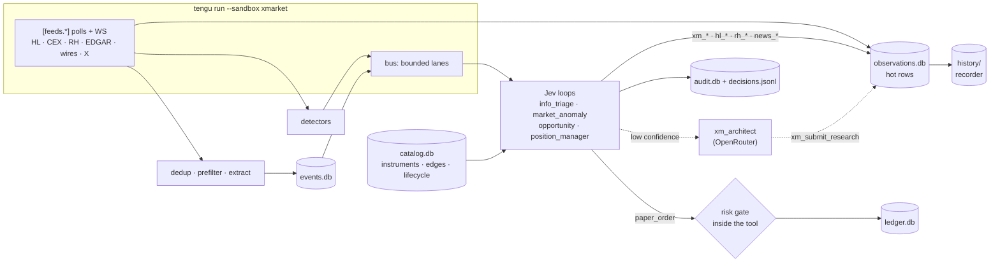

# xmarket — gap tracker (2026-09-29)

What Tengu must add to run [`xmarket-prd-2026-09-29.md`](xmarket-prd-2026-09-29.md) as `sandboxes/xmarket/config.toml`. Per-item detail (files, API shapes, no-Rust options, evidence): [`xmarket-gaps-2026-09-29.md`](xmarket-gaps-2026-09-29.md) — read an item's entry before starting it. Source, 2026-09-29: 8 parallel researchers + a completeness critic (33 code claims spot-checked, live API probes), then a two-lens review (code facts; doctrine + sequencing) whose 33 findings are folded in.

| State | Next |
|---|---|
| Planning only, no code. 185 items in 11 milestones (E0, M0–M8, M3b), 148 of them Rust. Operator decisions recorded 2026-09-30 (§ 7, PRD addendum): build the full scope; every tool works under `openrouter`, `local` and `claude_code` (convention 20). **Execution: [`xmarket-build-plan-2026-09-30.md`](xmarket-build-plan-2026-09-30.md)** (waves, gates, weekend sandbox, kickoff prompt) | **Feasibility study 2026-09-30: verdict re-scope** ([`xmarket-feasibility-2026-09-30.md`](xmarket-feasibility-2026-09-30.md)) — cross-venue convergence fails; two Hyperliquid-only rules to paper-test. **Operator kept the full plan** (report attached as a warning, § 7 #20). Holdout test done: the weekend fade passes on 53 new names (+49.8 bps, same weekends), the post-earnings rule is not confirmed. Weekend order-book recording Fri 2026-10-02 → Mon 10-05, then § 0 |

Legend: ☐ open · 🟡 in progress · ✅ done (append PR / commit) · ✖ dropped (say why). Size: S < 1 day · M 1–3 days · L ≈ 1 week · XL > 1 week. Kind: rust · toml · skill · infra · docs · research · account.

## 0. Start here

For an implementation session: read this section and § 4, then [`xmarket-build-plan-2026-09-30.md`](xmarket-build-plan-2026-09-30.md) (how to execute: waves, parallelism, gates, the weekend sandbox), then each item's entry in [`xmarket-gaps-2026-09-29.md`](xmarket-gaps-2026-09-29.md). The operator's decisions are in the [PRD addendum](xmarket-prd-2026-09-29.md) and § 7.

### Rules for every task

| # | Rule | Defined in |
|---|---|---|
| R1 | Every tool — existing and new — works 100 % under `engine = "openrouter"`, `"local"` and `"claude_code"` (through `tengu mcp-bridge`, exactly as in-process) — no exceptions. A tool is done only when its schema lint, bridge conformance case and live engine-matrix smoke pass | Operator 2026-09-30 · convention 20 · CLAUDE.md / AGENTS.md "How to add a new tool" step 4 · `docs/tools.md` step 5 · build plan § Engine parity |
| R2 | Rust only in the repo; test fixtures are produced outside it and committed as JSON | CLAUDE.md |
| R3 | Hexagonal layers; the first line of every `Tool::execute` is a scope check; one catalog row per tool; opt-in names in `WORKSPACE_TOOLS` | CLAUDE.md · `tests/layering_lint.rs` · `tests/scope_lint.rs` |
| R4 | Behaviour in TOML / SKILL.md before Rust | CLAUDE.md doctrine #2 |
| R5 | Paper first; live only in M3b after an M3 "go". $100 budget: every order tool runs the `[risk]` gate inside the tool (check + fill + ledger in one transaction), fails closed, honours the kill switch; exit rules close positions | Operator 2026-09-30 · § 7 #3, #19 · conventions 9, 10 |
| R6 | A `[risk]` sandbox runs no shell and no foreign MCP servers; `claude_code` agents only hardened (built-in tools off, `--strict-mcp-config`) | convention 12 |
| R7 | Network `open` now, switchable to Tor later: every new HTTP / WS / SSE client goes through `egress.rs` (`check_url` on every call, SOCKS5h for WS) | Operator 2026-09-30 · convention 17 |
| R8 | No legal or regulatory gates; venue questions are technical (reachability, fees, liquidity, latency) | Operator 2026-09-30 |
| R9 | Ids and observation keys per conventions 1–2; never truncate ids, addresses, tickers or hashes | conventions 1–2 · operator's global rule |
| R10 | State under `<TENGU_HOME>/state/xmarket/`, one shared workspace, SQLite behind ports; new top-level config sections are `deny_unknown_fields`, and unknown top-level keys are rejected | conventions 3–6 |
| R11 | One item at a time: build it, test it, prove it works before the next; no parallel tracks or stacked PRs; stage explicit paths (never `git add -A`); squash-merge | operator's working rules |
| R12 | Tests: scoped runs under 30 s (`cargo test --bin tengu <filter>`), never a blind full `cargo test`; no network in tests (replay fixtures); `cargo fmt` | project conventions |
| R13 | Docs change in the same commit that makes them stale (§ 10); CLAUDE.md and AGENTS.md stay mirrored; tick the item here | CLAUDE.md |

### Definition of done (every item)

| Check | How |
|---|---|
| Behaviour | Unit tests (pure domain logic with table-driven vectors) plus the item's own check from its gaps entry |
| Engines | For every tool the item adds or changes (R1): schema lint, bridge conformance case, and the live engine-matrix smoke on `openrouter`, `local` and `claude_code` — from E0 on |
| Lints | `cargo fmt --check`; `cargo test --test layering_lint`, `--test scope_lint`, `--test code_map` |
| Docs | The § 10 rows the item touches |
| Tracker | ☐ → ✅ with the commit hash; "Where to begin" below updated when the next step changes |

### Where to begin

| Step | What |
|---|---|
| 0 | Read [`xmarket-feasibility-2026-09-30.md`](xmarket-feasibility-2026-09-30.md) — the operator kept the full plan with that report attached as a warning (§ 7 #20). Check its follow-ups (holdout test result; weekend order books in `<TENGU_HOME>/state/xmarket/research/weekend-2026-10-02/`) before step 1 |
| 1 | Build plan § "Before the first item": branch `feature/xmarket` from `main`, commit the planning docs, baseline checks, engines ready |
| 2 | Wave W1: E0 (engine parity for every existing tool + the bridge trio), then the weekend-run slice of M0 / M1 — deadline Fri 2026-10-02 18:00 ET for `sandboxes/xmarket-weekend` |
| 3 | Then waves W2–W9 in order (build plan § Waves), each ending at its gate |
| 4 | Operator inputs: build plan § Operator inputs (and § 6 here) |

## 1. Milestones

| M | Goal | PRD | Items (size mix) | Exit check |
|---|---|---|---|---|
| E0 | Engine parity: every existing and new tool works 100 % under `openrouter`, `local` and `claude_code` | operator rule (convention 20) | 7 (5 M · 2 S) | Schema lint green for every catalog tool; a bridge conformance case per catalog tool (CI fails without one); live engine-matrix smoke — a scripted turn per tool set succeeds on OpenRouter (`google/gemini-2.5-flash-lite`, `anthropic/claude-haiku-4.5`), Ollama `gemma4:latest` and the Claude CLI (subscription, built-ins off, `--strict-mcp-config`); config-dependent tools see the sandbox config through the bridge |
| M0 | Thin paper slice, running 24/7 on the operator's server: HL + EDGAR 8-K → one Jev loop → risk gate ($100 budget) → paper fill → exit rules → audit; plus the weekend investigation sandbox | §35 S2 S3 S5 S7 (subset) | 39 (1 L · 21 M · 17 S) | `tengu run --sandbox xmarket` runs 24 h on the operator's Hetzner / Hostinger VPS under Docker (restart policy, `tengu doctor --live` healthcheck); `hyperliquid:xyz:TSLA` allow-listed; a captured Tesla Item 2.02 8-K ⇒ one event whose session id derives from the accession ⇒ `inspect_book` → `compare` → `paper_enter`; an `xm_compare/1` row exists; `ledger.db` has one `risk_decisions` row (allow) and one fill with the same `call_id`; VWAP + fee (fee scale from `mkt_instrument/1`) match the 20-level book; kill-switch file ⇒ next entry `deny` / `kill_switch`; the same accession polled twice ⇒ one event; exit rules close positions (TP / SL / max hold); total exposure never exceeds $100; every M0 tool passes the engine matrix (`openrouter`, `local`, `claude_code`); `sandboxes/xmarket-weekend` has run a weekend (shadow + capped weekend-fade ledgers at executable prices); `x-m0-e2e-test` offline < 30 s |
| M1 | Universe, equivalence, §29 lifecycle, calendars; start recording history | S1 | 20 (2 L · 7 M · 11 S) | `tengu xm sync --venue all`: HL 529 markets / 329 listed on 11 dexes, RH 195 tokens, ~10.4k SEC tickers; `tengu xm show company:tesla` lists `hyperliquid:xyz:TSLA`, `robinhood:0x322F0929c4625eD5bAd873c95208D54E1c003b2d` (ratio 1.000000000000000000), `ref:XNAS:TSLA` as `same`; a DISCOVERED instrument is refused with rule `lifecycle`; history day files grow |
| M2 | 24/7 market observation: bus, WS, detectors, RH quotes, CEX reference, halts, restart-safe dedup | S2 | 25 (5 L · 12 M · 8 S) | 24 h unattended in Docker; ctx rows for every listed HL market ≤ 15 s apart + `rh_quote/1` rows; injected OI +25 % in 5 min ⇒ `anomaly/1:<detector>:<subject>` row + bus event ⇒ `market_anomaly` stub audit line; `tengu doctor --live` goes non-zero within `stale_secs` of blocking the HL host; SIGTERM drains, restart emits no duplicates |
| M3 | **Edge check — go / no-go** before building M4–M6 | S6 (early) | 4 (1 M · 3 S) | `tengu xm research --pair hyperliquid:xyz:TSLA,robinhood:0x322F0929c4625eD5bAd873c95208D54E1c003b2d --since 7d`: edge-after-costs percentiles, AR(1) half-life, venue lead-lag on stablecoin-normalised recorded data + p50 / p95 latency per path. Record the verdict here: go / re-scope / stop |
| M3b | Live pilot on Hyperliquid with $100 — only after an M3 "go"; paper keeps running alongside | S7 (live subset) | 6 (1 L · 2 M · 3 S) | Testnet first, then mainnet: a sub-account funded with $100 and an API wallet approved for it only (trades, cannot withdraw); `tengu xm approve hyperliquid:xyz:TSLA --expires 30d` (TTY); a minimum-size ($10) IOC via `hl_order` `mode = "send"` through the same `[risk]` gate, with exchange-side TP / SL attached; audit, ledger and `orderStatus` agree on the cloid; the kill switch blocks the next order |
| M4 | Information layer: event store, dedup, extraction, evolution, sources, X, spend caps | S3 | 19 (3 L · 10 M · 6 S) | `tengu news tail --min-state credible_report` for one US trading day; 20 syndicated copies ⇒ one event, independent-source count unchanged; `tengu news event <id>` shows rumor → confirmed → official; spend stays under `[spend]`; X stops at `x_reads_per_day` |
| M5 | Event ↔ asset graph, Jev classification, slow path with resume, audit v2 | S4 S5 | 35 (1 L · 20 M · 14 S) | Replayed "Anthropic infrastructure agreement" ⇒ `xm_impact/1:<event_key>` lists `hyperliquid:io:ANTH` direct, AMZN / GOOGL / NVDA as possible / strong with provenance; unknown entity ⇒ `xm_architect` ⇒ `xm_research/1:<event_key>` ⇒ loop resumes once; `tengu audit show <decision_id>` prints the whole chain; rules-baseline shadow answers logged |
| M6 | Opportunity families + full paper execution (funding, RH fills, pairs, relation gate) | S6 S7 | 9 (1 L · 5 M · 3 S) | One week of paper pair trades by `opportunity` + `position_manager`, hourly funding and RH gas in P&L; a `possible`-relation candidate refused with rule `min_relation`; `tengu risk status` shows equity, exposure, loss headroom |
| M7 | Evaluation: HL archive backfill, deterministic replay, 4-arm ablation, calibration, discovery accuracy | S8 | 8 (1 L · 5 M · 2 S) | `tengu xm replay --arms market,market+info,market+jev,market+info+jev` ⇒ report.json with per-arm net P&L, Sharpe, drawdown, bootstrap CIs, Jev reliability / ECE, `act_at` sweep, discovery precision / recall; rerun with the recorded Jev cache is byte-identical |
| M8 | P2 — extensions: Robinhood Chain sends, outcome markets, streams, cold storage, split egress, generic venues | beyond MVP | 13 (2 L · 4 M · 7 S) | `rh_swap` `mode = "send"` of a minimum amount through the same gate; config load still refuses the sandbox with a `claude_code` agent or a shell scope |

M3 is our addition to the critic's plan (its own top-risk mitigation): the core hypothesis (§2) is otherwise first tested at M6 / M7, after most of the build. M3b (operator decision 2026-09-30: paper first, then real) moves the Hyperliquid live path forward from M8 and runs only after an M3 "go".

## 2. Target shape

## 3. Reuse — exists today

| Piece | Where | Role in xmarket |
|---|---|---|
| Decision loops (Jev picks action + enumerated slots; caps, `dry_run`, `requires`, `world`, audit) | `src/application/decision_loop/`, `src/config/decision_loop.rs` | All loops; extended by event templating (M0) |
| Typed observations + `observe()` + SQLite TTL cache | `src/domain/observation.rs`, `src/application/observe.rs`, `src/adapters/outbound/observations.rs` | Hot rows for `world` / `requires`; the recorder decorates `put` (M1) |
| Solana typed-tool family (plugin, defs, pure policy, goldens) | `src/adapters/outbound/tools/solana/`, `src/domain/lp/` | Template for `hl_*`, `rh_*`, `xm_*`, `paper_*`, `news_*` |
| Scoped JSON fetch + JSON-RPC client with `ErrorClass` | `src/adapters/outbound/solana/{http_json,rpc}.rs` | Lift into a shared HTTP classifier + the EVM JSON-RPC transport |
| Install-wide SQLite store pattern (lease, pending record, fence) | `src/adapters/outbound/solana/writes_store.rs` | Runtime lease, ledger, catalog, audit stores |
| Webhook listener → loop endpoint (`auth_header_env`, HMAC) — only with `--features webhooks`, not a default feature or in the default image | `src/adapters/inbound/webhooks.rs` (gated in `src/adapters/inbound/mod.rs`) | Mounted by `tengu run` (feature-gated, or make `axum` / `hmac` non-optional); push vendors |
| Orchestrator escalation (`run_one_shot`, `OrchestratorEscalator`) — same feature gate | `src/adapters/inbound/webhooks.rs` | Moves to `src/bootstrap/`; becomes the architect escalator (M5) |
| Egress policy + per-tool scopes | `src/adapters/outbound/egress.rs`, `src/domain/scope.rs` | Every feed and tool; gains `stream_client` + `ws_connect` (M2) |
| Signing-sandbox load rules | `src/config/solana.rs` | Pattern for the `[risk]` no-shell rules (M0) and live trading (M8) |
| Terminal y/N prompt (reads one stdin line; no TTY check, so a piped `y` is accepted) | `src/application/skills/lifecycle/approval_gate.rs` | Prompt pattern for `tengu xm approve` / `tengu risk resume`, which must add a hard `is_terminal()` refusal |
| Decision audit + TUI decision feed + `MetricsKind::Decision` | `src/application/decision_loop/mod.rs`, `src/adapters/inbound/tui/mod.rs` | Base of audit v2; operator view |
| Crates already in the build: alloy 1.x `full` (sol-types, dyn-abi, k256), reqwest `stream` + `socks`, rusqlite bundled (FTS5, JSON1); tokio-tungstenite + quick-xml transitively | `Cargo.toml`, `Cargo.lock` | WS / SSE / RSS need direct-dependency lines, not new crates (HTML → text adds `html2text`) |
| Pure-policy golden vectors (1027 hedge vectors) | `src/domain/lp/hedge.rs`, `tests/fixtures/hedge-vectors.jsonl` | Pattern for cost / fill / risk goldens (fixtures produced outside the repo) |

## 4. Conventions — decided up front

The critic resolved 22 cross-slice conflicts; the review tightened several. Where an entry in the gaps doc disagrees, this table wins.

| # | Topic | Decision | Why |
|---|---|---|---|
| 1 | Instrument id | `<venue>:<native id verbatim>`; venues `hyperliquid`, `robinhood`, `binance-usdm`, `bybit-linear`, `okx-swap`, `coinbase`, `ref:<MIC>`. E.g. `hyperliquid:xyz:TSLA`, `robinhood:0x322F0929c4625eD5bAd873c95208D54E1c003b2d`, `ref:XNAS:TSLA` | Loops read rows by literal key; a mismatch is a silent `missing` (`world.rs`) |
| 2 | Observation keys | `mkt_instrument/1:<id>`, `mkt_ctx/1:<id>`, `hl_book/1:<id>`, `rh_quote/1:<id>`, `rh_dex_quote/1:<id>`; per event `xm_impact/1:<event_key>`, `xm_ctx/1:<event_key>`, `xm_research/1:<event_key>`. One key table in `docs/typed-observations-2026-09-24.md` | Same |
| 3 | State layout | Every xmarket agent sets the same explicit `workspace` (load error otherwise); install-wide stores `<TENGU_HOME>/state/xmarket/{catalog,events,ledger,audit,spend,runtime}.db` + `history/<YYYYMMDD>.db`; feed cursors, the ingest seen-set, follow-up timers and latency traces live in `runtime.db`; the workspace keeps only `observations.db` | A loop reads its agent's own store (`bootstrap/decision.rs`). `tengu prune` deletes `logs/` and `state/flows/` in every mode, and `--hard --sandbox` empties agent workspaces (`src/adapters/outbound/prune.rs:47-82`), so `state/xmarket/` survives both |
| 4 | Storage engine | SQLite behind a port for every store, including the event store; Postgres adapters only if volume demands | Bundled FTS5 / JSON1; `postgres_memory` is optional and not in the default image |
| 5 | Time series | One `HistoryStore` port (`range` / `asof`), fed by a decorator on `ObservationStore::put` + a hook in `observe()`; recording starts in M1. In-row sample rings only for ≤ 15 min features | Research needs weeks of data; four slices had proposed four homes |
| 6 | Config tables | `[feeds.<n>]` is the only transport / schedule table (`kind` = tick / tool / poll / stream / ws / rows); news metadata in its `news = {…}` sub-table. Spend caps in `[spend]`, request budgets in `[rate_limits.<name>]`. Every new top-level section is `deny_unknown_fields`, and `Config::load` rejects unknown top-level keys (`risk-config-schema`, M0: `deny_unknown_fields` on `Config` after auditing existing configs, or a raw-table key check) | `Config` silently drops unknown top-level tables (`src/config/mod.rs:122-124`); section-level `deny_unknown_fields` cannot catch a misspelled table name, so `[rsik]` would mean no limits |
| 7 | §16 taxonomy | Categories defined once, in the SKILL.md schema (runtime-loaded), stored as validated strings (also in `xm_submit_research`); Rust enums only for §17 info states and §7 strength | §16 must stay extensible without rebuilds |
| 8 | Loop set | M0: one loop, `escalate = false`, plus a deterministic exit tick (`x-exit-rules`, no Jev). M2: `market_anomaly` stub (`dry_run = true`; ignore + read-only `hl_ctx` / `hl_book`). M5: `info_triage` + the full `market_anomaly`, escalation on. M6: `opportunity` + `position_manager` (`dry_run = false`; their agent holds only `paper_*` exec tools). Other slices add actions, not loops | Eleven loop names were proposed. Loops default to `escalate = true`, and until `jev-escalation-guard` (M5) every unsure step — even a terminal one — starts a full planner turn paid from Jev's own key |
| 9 | Risk enforcement | Inside every exec tool: check + fill + ledger write in one SQLite transaction (`BEGIN IMMEDIATE`); no `[risk]` ⇒ refuse `risk_config_missing`; entries need a fresh `xm_compare` row for `min_edge_bps` (M0 compares the HL book with the HL oracle); verdict joined to the decision audit by `call_id` | Neither Jev nor the architect can bypass it; no check-then-act race; no entry without a computed edge |
| 10 | Lifecycle + approvals | §29 state and approvals live only in `catalog.db`, read fail-closed. Gate permission: M0 = `[risk] instruments_allow`; M1 = allow-list AND lifecycle ≥ MAPPED; from M2 (reference quotes can validate) PAPER-TRADABLE, set automatically after VALIDATED, replaces the allow-list. `tengu xm approve / suspend / resume` and `tengu risk resume` refuse without a TTY (`is_terminal()`, new code) | One source of truth; no LLM tool can promote; no dead period while VALIDATED waits for M2 data |
| 11 | Slow path | One routable `xm_architect`, on OpenRouter or `claude_code` (subscription) — both supported (convention 20); its result arrives only via `xm_submit_research` (validated) → `xm_research/1:<event_key>`; free text is never parsed | A structured contract works the same over the bridge; Claude Code is allowed once hardened (convention 12) |
| 12 | No shell | A `[risk]` sandbox runs no shell, enforced at load like `src/config/solana.rs`: no configured `shell_bins`, `no_shell_fallback` forced on every agent (the bridge too), no `[[mcp_servers]]`; `claude_code` agents only with `builtin_tools_profile = "none"` and `--strict-mcp-config` (`x-claude-code-hardening`, which also relaxes the Solana signer's blanket `claude_code` refusal to this rule). The architect ↔ Jev hand-off is in-process (escalate + resume), not `run_command → tengu decide` as in jev-exec | The permissive fallback grants `shell_bins = ["*"]` unless `no_shell_fallback` is set, which today happens only with a Solana signer (`src/config/mod.rs:1024-1027`); `run_command` checks only the first token (`src/adapters/outbound/tools/workspace/run_command.rs`). A shell, Claude Code's built-in tools or the user's global plugin MCP servers could delete the kill-switch file or edit `ledger.db` |
| 13 | EVM transport | One JSON-RPC transport lifted from `solana/rpc.rs` (per-call `check_url`, `net_hosts`, audit); alloy only for types, ABI, signing | alloy's injected-client path skips the per-call scope check and audit |
| 14 | Request budgets | One shared limiter (`rt-backoff-budget`, `[rate_limits.<name>]`) used by feeds, `hl-info-client` and `info-fetch`, with an execution reserve. HL: 1200 weight / min / IP; ctx only for listed dexes (`default`, `xyz`, `para`, `mkts`, `io` = 100 weight) every 15 s; universe via one `allPerpMetas`; books only for the watch set; WS in M2 | An 11-dex sweep = 220 weight; 6 dexes have no listed markets; three slices had designed three buckets |
| 15 | Dedup layers | Ingest computes `dedup_key` and drops repeats; loop `event_key` defaults to it (single-flight + session id, `jev-event-key` in M0); `UNIQUE(source, source_item_id)` in `events.db` is the mention authority | Three layers had three keys; a re-emitted accession must not get new call ids and a second fill |
| 16 | Fill engine seams | Takes `Clock` + `BookSource` ports from M0 (live: sleep latency then a fresh book; replay: `HistoryStore` as-of t + latency) | Replay (M7) reuses the same engine |
| 17 | Network | Operator decision 2026-09-30: `[egress] network = "open"` for now, switchable later. `allow_hosts` ceiling (xmarket is the first sandbox to set one). Switching stays a one-line change (`network = "tor"`, plus `route_llm_api = false` if OpenRouter blocks Tor) only if every new feed / WS / SSE client goes through egress: `check_url` on every call, SOCKS5h for WS. `hl-tor-probe` (M1) records a per-host Tor table and fixes whichever doc is wrong about OpenRouter over Tor; a partial switch is `ops-egress-split-routing` (M8 — pull forward if needed). Live trading never over Tor | Reachable latency (§ 8) and live trading off Tor; venue Tor blocks unverified until `hl-tor-probe`. aura, lping, jev-exec and unlimited already run `open` |
| 18 | Calendars | One pure session evaluator, `[xmarket.calendars.<id>]` | Three evaluators had been proposed |
| 19 | Loop history | Restored from `audit.db`; `lane` = configurable JSON pointer (info loops: event key; market loops: subject) | No separate `loops.db` |
| 20 | Engine parity | **Operator rule 2026-09-30, no exceptions:** every tool — existing and new — works 100 % under `engine = "openrouter"`, `"local"` and `"claude_code"`. In-process engines (OpenRouter, local) and the bridge (Claude Code) see the same sandbox config, agent scopes, stores, secrets + redaction, `no_shell` and call id; schemas stay in the subset all three accept; results fit local context windows. A tool is not done until its schema lint, bridge conformance case (`x-bridge-conformance-test` fails CI for a catalog row without one) and live engine-matrix smoke pass. Also in CLAUDE.md / AGENTS.md step 4, `docs/tools.md` step 5, build plan § Engine parity | The bridge builds tools from `Config::default()` + the default `main` agent, an empty `SecretRegistry` and `no_shell = false` (`src/adapters/inbound/mcp_bridge.rs:427-446, 537-543`); config-dependent tools (`[risk]`, Solana `send`) would silently differ |

## 5. Backlog

Ids are stable — cite them in commits. Merged and dropped ids are listed after M8.

### E0 — engine parity foundation (build order)

| | Id | Item | PRD | Size | Kind |
|---|---|---|---|---|---|
| ☐ | `x-tool-schema-lint` | Test: every catalog tool schema stays in the subset OpenRouter's providers, local OpenAI-compatible servers and Claude accept (name `^[a-zA-Z0-9_-]{1,64}$`, object root, no top-level `$ref` / `oneOf`, bounded description length); CI fails otherwise | addendum | S | rust |
| ☐ | `x-bridge-parity` | `tengu mcp-bridge` runs every catalog tool exactly as in-process: loads the sandbox config (`ClaudeCodeEngine` forwards `TENGU_CONFIG` + the agent name), uses that agent's `AgentConfig` (not the default `main`), the process `SecretRegistry` + `SanitizedToolExecutor`, the agent's `no_shell`, and the MCP request id as `ToolCtx.call_id` | §26 §30 §32 | M | rust |
| ☐ | `x-claude-code-hardening` | `--strict-mcp-config` in `engines/claude_code.rs` (no user plugin MCP servers); load rule: in a `[risk]` or signing sandbox every `claude_code` agent needs `builtin_tools_profile = "none"`; replaces the Solana signer's blanket `claude_code` refusal (`src/config/solana.rs`) with that rule | §26 §28 | M | rust |
| ☐ | `x-bridge-conformance-test` | Conformance harness: each catalog tool runs once in-process and once through a real `tengu mcp-bridge` subprocess on the same fixture config; text + store rows must match; CI fails for a catalog row without a case (convention 20) | §30 §32 | M | rust |
| ☐ | `x-local-model-fit` | Tool results fit a local model's `limits.context_window`: compact `render_text` for typed tools, bounded `data`, per-engine result caps; documented settings for Ollama `gemma4:latest` | addendum | S | rust |
| ☐ | `x-engine-matrix-smoke` | Live smoke harness (`#[ignore]` tests + `tengu doctor --engines`): a scripted turn that calls each tool of a set and reads its result, on OpenRouter (`google/gemini-2.5-flash-lite`, `anthropic/claude-haiku-4.5`), Ollama `gemma4:latest` and the Claude CLI (subscription); one fixture sandbox per engine | addendum | M | rust |
| ☐ | `x-engine-parity-audit` | Run every existing catalog tool (workspace, http, memory, cache, skills, crypto, Solana, agentic memory, …) through the lint, conformance and smoke above and fix every failure; the gap list and fixes are recorded here | addendum | M | rust |

### M0 — thin paper slice (build order)

| | Id | Item | PRD | Size | Kind |
|---|---|---|---|---|---|
| ☐ | `ops-sandbox-config` | `sandboxes/xmarket/config.toml` — one owner, sections staged per milestone (agents, egress, scopes, feeds, secrets list) | §1 §26 §27 | S | toml |
| ☐ | `x-shared-workspace-and-state-layout` | Enforce one xmarket workspace + the `<TENGU_HOME>/state/xmarket/` layout; paths outside every fs root | §30 §32 §36 | S | rust |
| ☐ | `ops-openrouter-budget-key` | Dedicated OpenRouter key with a daily credit limit — hard cap for LLM and Jev calls, which share it (split keys if escalations ever starve Jev) | §27 | S | account |
| ☐ | `rt-daemon` | `tengu run --sandbox <s>`: one process for feeds + loops + webhook router (feature-gated); graceful shutdown; single-runner lease | §3 §13 §20 | M | rust |
| ☐ | `rt-backoff-budget` | Shared backoff per `ErrorClass` (jitter, Retry-After) + the one request limiter, `[rate_limits.<name>]` (token buckets, weights) | §20 §28 | S | rust |
| ☐ | `rt-scheduler` | `[feeds.<n>]` scheduler: `kind = "tick"`, `"tool"`, `"poll"`; M0 feeds name `target = "<loop>"` (direct `handle_event`, one in flight per loop) until `rt-bus-dispatch` adds topics | §19 §20 | M | rust |
| ☐ | `hl-info-client` | Hyperliquid `POST /info` client on the shared limiter; HL error mapping (`500 null` ⇒ not applicable, 403 ⇒ geo / WAF) | §19 §20 | M | rust |
| ☐ | `hl-market-schema` | Cross-venue schemas `mkt_instrument/1` + `mkt_ctx/1`, keyed by instrument id | §19 §20 §23 §25 | M | rust |
| ☐ | `hl-ctx-tool` | `hl_ctx`: mark / oracle / mid / impact / basis / funding / OI / volume; each sweep also reads `perpDexs` + `perpsAtOpenInterestCap` into `mkt_instrument/1` (fee scale, growth mode, OI cap, status) — M0 subset of `kg-sync-hyperliquid` | §12 §14 §20 §23 | M | rust |
| ☐ | `hl-book-tool` | `hl_book`: executable bid / ask, depth, imbalance, VWAP slippage for a notional | §20 §21 §25 §31 | M | rust |
| ☐ | `info-fetch` | Egress-gated feed fetcher on the shared limiter: headers + User-Agent, conditional GET (`[feeds] kind = "poll"`) | §15 | M | rust |
| ☐ | `info-parsers` | Atom parser for EDGAR `getcurrent` (RSS 2.0, JSON mapping, `t.me/s`, HTML → text move to `info-parsers-ext`, M2) | §15 | S | rust |
| ☐ | `info-edgar` | EDGAR adapter: `$SEC_USER_AGENT`, ≤ 10 req/s, accession ids, 8-K item codes, CIK → ticker; M0 feed scoped to the allow-listed CIK (Tesla `0001318605`); Ex-99.1 text in M4 | §15 §16 | S | rust |
| ☐ | `jev-event-key` | Event key ⇒ session id, dedupe window, audit key (M0: EDGAR accession) | §18 §27 §32 | S | rust |
| ☐ | `jev-event-templating` | `{event:/pointer}` in args and world keys + `FromEvent` slots | §22 §23 | M | rust |
| ✅ | `risk-config-schema` | `[risk]` + `[paper]` sections: every limit required, no defaults, fail closed; `Config::load` rejects unknown top-level keys | §28 §29 §31 | S | rust |
| ☐ | `risk-calc-costs` | Pure costs: L2 depth walk, HL tick / lot rounding, fee schedules (HIP-3 scale), funding carry, gas, edge after costs | §21 §25 §28 §31 | M | rust |
| ☐ | `risk-calc-tools` | Store-only compute tools `xm_cost`, `xm_compare` (the row the gate re-reads for `min_edge_bps`; M0: HL book vs HL oracle) | §12 §23 §24 §25 | M | rust |
| ☐ | `risk-paper-ledger-domain` | Pure ledger math: positions, cash, average-cost P&L, mark-to-market, exposure, leverage, funding | §25 §28 §31 | M | rust |
| ☐ | `risk-gate-domain` | Pure policy: every §28 rule as a `Check`, fail closed on missing data | §13 §28 §29 §30 | M | rust |
| ☐ | `risk-paper-ledger-store` | `ledger.db`: one account per sandbox, idempotent `client_order_id`, gate + fill + write in one transaction | §31 §32 | M | rust |
| ☐ | `risk-paper-fill-engine` | Market / IOC orders, L2 depth-walk fills, partial / failed fills, injected latency, HL rejection codes (ALO in P1; AMM / RFQ path in `rh-paper-fill`) | §20 §25 §31 | L | rust |
| ☐ | `risk-exec-idempotency-ids` | `ToolCtx.call_id` + restart-safe loop ids (`{loop}:{session}:{t}`) | §30 §31 §32 | S | rust |
| ☐ | `risk-gate-enforcement` | Gate inside every exec tool, in-process and through the bridge alike + `[risk]` load rules: no shell anywhere, `claude_code` only when hardened (convention 12), no `[[mcp_servers]]` | §26 §28 §30 §36 | M | rust |
| ☐ | `risk-paper-tools` | `paper_order`, `paper_close`, `paper_positions` (typed results) | §22 §30 §31 | M | rust |
| ☐ | `x-exit-rules` | Exit rules for every open position: take-profit / stop-loss (bps) + max holding time, checked by a `kind = "tick"` feed that calls `paper_close` (live entries also carry exchange-side TP / SL, `risk-hl-exchange`) — keeps the $100 budget turning over | §25 §28 §30 | M | rust |
| ☐ | `risk-kill-switch` | Kill switch + daily / total loss trip; `tengu risk status / halt / resume` (TTY only); `risk_status` tool | §28 §29 §32 | M | rust |
| ☐ | `risk-audit-verdicts` | `risk_decisions` table joinable with the decision audit by `call_id` | §28 §31 §32 | S | rust |
| ☐ | `ops-audit-atomic-write` | Decision audit: one write per line, a line for failed Jev calls, ms timestamps | §31 §32 | S | rust |
| ☐ | `jev-xmarket-loops-toml` | `[decision_loops.*]` + planner / executor agents; M0 loop `inspect_book` → `compare` → `paper_enter`, `escalate = false` (loop set per convention 8) | §22 §27 §30 | M | toml |
| ☐ | `rt-health` | Feed / loop health rows, heartbeat, `tengu doctor --live` for the Docker healthcheck | §20 §28 | S | rust |
| ☐ | `x-weekend-fade-strategy` | Deterministic weekend-fade rule (W): at Sun 18:00 ET (last closed day before a trading day) s = ln(HL at 18:00 / HL at Fri 20:00 ET) per name; paper-fade every eligible name in a shadow ledger (no cap, depth-walk fills) and the 4 names with the largest absolute s, at least 50 bps, at $25 each in the capped ledger; exit Mon 09:00 ET; ET clock ticks via `rt-scheduler` | §21 §31 | M | rust |
| ☐ | `x-weekend-sandbox` | `sandboxes/xmarket-weekend/config.toml`: floor profile (no LLM, no X, Jev off), `hl_ctx` every 60 s + `hl_book` every 5 min (60 s around entry and exit) with recording, the W strategy, its own state dir; runbook with `caffeinate`; offline replay of the 2026-09-26 → 09-28 weekend + a 30-min live soak (build plan § weekend sandbox) | §31 §35 | S | toml |
| ☐ | `ops-deploy-compose` | Docker on the operator's Hetzner / Hostinger VPS: `tengu run` service with `restart: unless-stopped`, persistent `<TENGU_HOME>/state/xmarket` + workspace volumes, `webhooks` feature, healthcheck `tengu doctor --live`; operator chat on demand | §35 | M | infra |
| ☐ | `x-m0-e2e-test` | Offline end-to-end test (HL ctx / book / `perpDexs` / OI-cap + EDGAR fixtures, scripted Jev) under `cargo test --bin tengu`, < 30 s | §13 §30 §31 §32 | M | rust |
| ☐ | `rt-docs` | Runtime operator doc + code map / egress / decision-loop plan / webhooks doc / config example | §13 | S | docs |
| ☐ | `hl-docs` | HL tools in typed-observations, code map, tools.md, egress hosts, CLAUDE / AGENTS gotchas | §32 | S | docs |
| ☐ | `x-info-docs` | Information-slice doc (M0 part: EDGAR adapter + tool rows) | §15 §32 | S | docs |
| ☐ | `risk-docs` | Risk + paper operator doc, observation keys, CLAUDE / AGENTS gotchas | §28 §31 §32 | S | docs |

### M1 — universe, lifecycle, recording

| | Id | Item | PRD | Size | Kind |
|---|---|---|---|---|---|
| ☐ | `kg-domain-model` | Pure types: entities, instruments, ext ids, equivalence, edges, §7 strength | §4 §5 §7 §19 | M | rust |
| ☐ | `kg-catalog-store` | `CatalogStore` port + `catalog.db` system of record (instruments, equivalence, edges, lifecycle, approvals) | §12 §19 §29 §32 | L | rust |
| ☐ | `kg-sync-hyperliquid` | HL sync: all 11 dexes via one `allPerpMetas` + spot + annotations, listing diffs, asset-id formula | §4 §14 §19 | M | rust |
| ☐ | `kg-sync-robinhood` | RH stock tokens from `rhj/assets` ∩ StockFactory (chain-only tokens stay DISCOVERED), Chainlink feed map | §4 §8 §19 | S | rust |
| ☐ | `kg-sync-us-reference` | Reference equity master: SEC CIK + tickers, Nasdaq symbol directory, OpenFIGI | §4 §8 §19 | M | rust |
| ☐ | `kg-sync-crypto` | Crypto entity ids (CoinGecko) + HL crypto market mapping | §4 §9 §19 | S | rust |
| ☐ | `hl-cex-universe-tool` | `cex_universe`: Binance / Bybit / OKX / Coinbase instruments incl. TradFi + pre-IPO perps | §4 §8 §10 §19 | M | rust |
| ☐ | `kg-equivalence` | Cross-venue equivalence classes with ratios, relation `same` / `proxy`, quote currency, conflict flags | §4 §8 §19 §21 | M | rust |
| ☐ | `kg-lifecycle` | §29 states, deterministic gates, demotion, audit, fail-closed reads; VALIDATED waits for M2 reference quotes (convention 10) | §28 §29 §32 | M | rust |
| ☐ | `kg-seed-data` | Curated seeds: non-listed entities, equivalence classes, relationship edges | §4 §5 §10 §11 | S | toml |
| ☐ | `kg-calendars` | One session evaluator: NYSE holidays / early closes, trade[XYZ] windows, RH mint window, 24/5, 24/7 | §2 §19 §20 §21 | S | rust |
| ☐ | `kg-sync-schedule` | Syncs + lifecycle evaluation as `[feeds.*] kind = "tool"` rows (no host timers) | §19 §29 | S | toml |
| ☐ | `kg-xm-cli` | `tengu xm sync / seed / status / show / backup` (no LLM) | §19 §29 §32 | S | rust |
| ☐ | `rh-evm-rpc` | EVM JSON-RPC read transport (`eth_call`, `eth_getLogs`, blocks, Multicall3) + `[evm.chains]`; route the existing receipt poll through it | §1 §19 §20 | M | rust |
| ☐ | `ops-history-recorder` | `HistoryStore` + SQLite day files under `state/xmarket/history/` (snapshots, depth, funding, OI, events, universe) | §20 §33 §34 | L | rust |
| ☐ | `hl-tor-probe` | Probe every xmarket host over Arti exits and from the deployment host's own network (Kazakh connections cannot reach Coinbase, OKX and 1,100+ other platforms); per-host table so `network = "tor"` stays a one-line switch | §20 | S | research |
| ☐ | `hl-skill` | `skills/hyperliquid/SKILL.md`: info API over `http_request` for the architect | §4 §19 §26 | S | skill |
| ☐ | `rh-skill` | `skills/robinhood-chain/SKILL.md`: venue knowledge for the architect and planner | §8 §19 §20 §26 | S | skill |
| ☐ | `kg-docs` | Catalog / graph / lifecycle doc + code map, typed-observations, egress, tools | §19 §29 §32 | S | docs |
| ☐ | `rh-docs` | Robinhood Chain operator doc + typed-observations / egress / code map | §32 | S | docs |

### M2 — continuous market observation

| | Id | Item | PRD | Size | Kind |
|---|---|---|---|---|---|
| ☐ | `rt-bus-dispatch` | Event bus + per-loop bounded queues (topics, drop / coalesce, max age, in-flight cap, priority); both discovery paths concurrent | §3 §13 §14 §27 | M | rust |
| ☐ | `rt-dedup-state` | Persistent ingest seen-set + feed cursors + webhook replay protection in `runtime.db` | §17 §18 | M | rust |
| ☐ | `rt-ws-client` | WebSocket feeds through egress (SOCKS5h / CONNECT / direct): subscribe, heartbeat, reconnect + resubscribe | §4 §20 §27 | L | rust |
| ☐ | `rt-obs-batch-writer` | Batched store writes + change feed (`kind = "rows"`): execution → observation → next decision | §20 §30 | S | rust |
| ☐ | `rt-series-detectors` | Deterministic anomaly detectors over series ⇒ `market.anomaly` events (market-first path) | §3 §14 §25 | L | rust |
| ☐ | `hl-ws-stream` | HL WS: `allDexsAssetCtxs` + bbo / l2Book / trades ⇒ stream-sourced `mkt_ctx` rows | §3 §14 §20 | L | rust |
| ☐ | `hl-funding-tool` | `hl_funding`: settled history, current + predicted funding (HL vs Binance vs Bybit) | §14 §20 §21 §23 | M | rust |
| ☐ | `hl-candles-tool` | `hl_candles`: returns, realised vol, volume vs normal | §3 §14 §20 §25 | M | rust |
| ☐ | `hl-cex-ctx-tool` | `cex_ctx`: reference bid / ask / mark / index / funding / OI from Binance, Bybit, OKX, Coinbase | §2 §12 §20 §21 | L | rust |
| ☐ | `hl-cex-liquidations` | CEX liquidation streams ⇒ `liq/1:<instrument id>` | §3 §16 §21 | M | rust |
| ☐ | `risk-calc-market-stats` | Returns, volume z-score, OI change, funding 1h / 8h / APR, realised vol, AR(1) half-life, freshness, alignment, lead-lag | §12 §14 §20 §25 | M | rust |
| ☐ | `rh-quote` | `rh_quote`: RH reference bid / ask, token-equivalent (× uiMultiplier), Chainlink oracle + USD anchors, halt | §8 §12 §20 §25 | M | rust |
| ☐ | `rh-dex-quote-v3` | `rh_dex_quote`: Uniswap v3 QuoterV2 size ladder, buy + sell | §20 §21 §25 §31 | M | rust |
| ☐ | `rh-dex-quote-v4` | Uniswap v4 quoting over a curated pool allowlist (3,415 AAPL pools, mostly spam) | §20 §21 | M | rust |
| ☐ | `rh-lighter` | Lighter Robinhood-domain markets + books (stock-token spot, equity and pre-IPO perps) | §4 §12 §19 §20 | M | rust |
| ☐ | `info-parsers-ext` | RSS 2.0 (incl. `ndaq:` elements), JSON-pointer item mapping, Telegram `t.me/s` preview, HTML → text (`html2text`, new crate) | §15 | M | rust |
| ☐ | `rh-halts` | `[feeds.nasdaq_halts]` poll row (RSS) writing `us_halt/1` rows, shared with `info-sources-mvp`; the gate blocks entries on halted names | §20 §28 | S | toml |
| ☐ | `rh-ref-equities` | `eq_quote` for non-tokenized tickers (Alpaca IEX, SIP later; Massive optional) | §8 §12 §20 | M | rust |
| ☐ | `rh-activity` | `rh_activity`: AP mint / burn, whale transfers, pool swaps, multiplier events | §1 §3 §14 §20 | L | rust |
| ☐ | `rh-corp-actions` | `rh_corp_actions`: splits, dividends, oracle-pause windows, multiplier schedule | §20 §28 | S | rust |
| ☐ | `rh-research-licensing` | Terms + provenance of RHJ API quotes and reference-data licences | §15 §20 §33 | S | research |
| ☐ | `rh-accounts` | RPC provider, LI.FI key, Alpaca (optional Envio / OpenFIGI / Twelve Data) | §20 | S | account |
| ☐ | `x-accounts-secrets` | Accounts + secrets inventory for xmarket | §15 §20 | S | account |
| ☐ | `ops-log-rotation` | Rotation / retention for `logs/*.jsonl` + `tengu.log`; `decisions.jsonl` stays unrotated until `ops-audit-store` (M5) | §32 | S | infra |
| ☐ | `ops-docs` | xmarket ops runbook; fix stale decision-audit docs | §32 | S | docs |

### M3 — edge check (go / no-go)

| | Id | Item | PRD | Size | Kind |
|---|---|---|---|---|---|
| ☐ | `x-quote-ccy-normalization` | → USD rows with named anchors: Chainlink USDC/USD + USDG/USD (read in `rh-quote`), Coinbase `USDT-USD` (`cex_ctx`; Coinbase is blocked from Kazakhstan, so keep a Chainlink USDT/USD fallback), HL spot USDT0/USDC; a missing rate is an error, never 1.0 | §20 §21 §25 | S | rust |
| ☐ | `rt-latency-trace` | Source → ingest → bus → decide → execute trace rows in `runtime.db` + p50 / p95 per path | §31 §32 §34 | S | rust |
| ☐ | `rh-research-weekend` | RH token pricing outside the mint window and US sessions: AMM vs Lighter vs last reference (RFQ after M6) | §2 §21 §34 | S | research |
| ☐ | `risk-s6-research-report` | `tengu xm research`: dislocation distributions after costs, half-life, lead-lag per pair, from `HistoryStore` | §33 §34 | M | rust |

### M3b — live pilot on Hyperliquid ($100, after an M3 go)

| | Id | Item | PRD | Size | Kind |
|---|---|---|---|---|---|
| ☐ | `hl-account-setup` | Hyperliquid sub-account funded with $100 USDC + an API wallet approved for that sub-account only (trades, cannot withdraw); key file 0600 outside every fs root; testnet first | §28 §30 | S | account |
| ☐ | `risk-evm-signer` | secp256k1 / EIP-712 signer port + key file + generalised signing-sandbox rules | §28 §29 §30 | M | rust |
| ☐ | `risk-exec-runner-generic` | Venue-agnostic exec runner (paper / simulate / send) + write-coordination store (lease, pending record, fence) | §28 §30 | M | rust |
| ☐ | `risk-hl-exchange` | HL exchange client: msgpack + phantom-agent signing, nonces, API wallet, orders for the sub-account via `vaultAddress`, exchange-side TP / SL on every entry (`normalTpsl`), `hl_order` / `hl_cancel` | §20 §28 §30 | L | rust |
| ☐ | `kg-live-approval` | LIVE-APPROVED: operator-only (TTY), expiring (30 d), separate live caps (≤ the $100 budget); ships its own `tengu xm approve` | §28 §29 §30 | S | rust |
| ☐ | `jev-live-sandbox-split` | Decide whether live orders need a separate signing sandbox; xmarket already meets the signing rules (convention 12, incl. hardened `claude_code`), so the default is the same sandbox with a private executor agent | §26 §28 §29 | S | research |

### M4 — information layer

| | Id | Item | PRD | Size | Kind |
|---|---|---|---|---|---|
| ☐ | `info-config` | `[feeds.<n>] news = {…}` source metadata (tier, org, reliability prior, mapping) + `[news.filter]`, `[news.dedup]`, `[news.extract]` | §15 §16 §18 | M | rust |
| ☐ | `info-store` | Canonical event store: SQLite `events.db` behind `NewsStore` (`UNIQUE(source, source_item_id)`, simhash64, 48 h cosine) | §16 §17 §18 §32 | L | rust |
| ☐ | `info-dedup` | URL canonicalisation, SimHash, windowed embedding clustering | §17 §18 | M | rust |
| ☐ | `info-prefilter` | Entity / alias dictionary + keyword / form rules (no LLM) | §3 §6 §15 | M | rust |
| ☐ | `info-taxonomy-skill` | SKILL.md: §16 taxonomy, §17 states, §7 levels, extraction schema + evals | §7 §16 §17 | S | skill |
| ☐ | `info-extract` | Batched LLM extraction (strict JSON schema): type, entities, claims, info state, stance | §6 §7 §16 §17 | L | rust |
| ☐ | `info-pipeline` | Use case: poll → parse → store → prefilter → extract (concurrency / rate / timeout caps) → cluster → emit; EDGAR Ex-99.1 text | §3 §13 | M | rust |
| ☐ | `info-evolution` | rumor → credible → confirmed → official; independent confirmations counted by originating org | §17 §18 §24 | M | rust |
| ☐ | `info-tools` | `news_*` typed tools + observation keys for `world` / `requires` | §22 §23 §25 | M | rust |
| ☐ | `info-sources-mvp` | Source rows + ingest scopes: EDGAR, SEC / CFTC / Fed / ECB, Federal Register, PR Newswire, exchange announcements, Nasdaq halts (shared row) | §15 | S | toml |
| ☐ | `info-cli` | `tengu news poll / tail / event / sources / merge / split / backfill` | §32 | S | rust |
| ☐ | `info-webhook-sink` | Webhook → news store sink for push vendors | §15 | S | rust |
| ☐ | `info-alpaca-news` | Pro-news proxy: Alpaca News (Benzinga) source row + account | §15 | S | account |
| ☐ | `info-x-ingest` | X pay-per-use filtered stream + recent search, rule sync, reposts, read cap | §3 §14 §15 §18 | L | rust |
| ☐ | `kg-resolve-entity` | `xm_resolve_entity`: mention → canonical entity; unknown-asset discovery | §13 §18 §26 §29 | M | rust |
| ☐ | `rt-http-stream` | NDJSON / SSE streams through egress (X filtered stream, SSE news) | §14 §15 | M | rust |
| ☐ | `ops-metrics-cost` | Cost in `MetricsRecord` (OpenRouter, Jev, Claude Code) + persisted metrics | §27 | S | rust |
| ☐ | `ops-cost-guard` | `[spend]` guard over `spend.db`: per-kind caps (LLM, X reads, paid search), degrade order | §27 §28 | M | rust |
| ☐ | `x-scheduled-event-calendar` | Macro releases, FOMC, earnings, token unlocks ⇒ pre-event monitors + risk blackout | §16 §17 §21 §28 | M | rust |

### M5 — event ↔ asset, Jev classification, slow path

| | Id | Item | PRD | Size | Kind |
|---|---|---|---|---|---|
| ☐ | `kg-find-instruments` | `xm_find_instruments`: venue discovery + reverse lookup | §3 §14 §19 §23 | S | rust |
| ☐ | `kg-graph-edges` | Relationship graph: seed load, propose tools, statuses, 1–2 hop queries | §5 §6 §11 §24 | M | rust |
| ☐ | `kg-related-assets` | `xm_related_assets` + per-event impact set `xm_impact/1:<event_key>` (top-N, provenance) | §11 §12 §21 §23 | M | rust |
| ☐ | `kg-confirm-reaction` | `xm_confirm_reaction`: measured event-window reactions per instrument (§12) | §12 §14 §20 §23 | M | rust |
| ☐ | `kg-import-public-graph` | Ownership / investor / sector edges from Wikidata, GLEIF Level 2, SEC SIC | §5 §11 | M | rust |
| ☐ | `kg-review-cli` | Operator review of proposed edges / mappings; suspend / resume (TTY only, no LLM surface) | §24 §26 §29 | S | rust |
| ☐ | `x-etf-index-membership` | ETF + index constituent edges (sector ETFs, index perps, SPY / QQQ tokens) | §5 §6 §10 §19 | M | rust |
| ☐ | `x-crypto-relationship-seeds` | Chain ↔ token, LST / LRT ↔ underlying, protocol ↔ token (DefiLlama, CoinGecko) | §5 §9 | M | rust |
| ☐ | `rh-macro-ref` | `macro_quote`: FX, DXY proxy, oil / gold / index proxies for §10 events | §6 §10 §20 | M | rust |
| ☐ | `rh-evm-read-tools` | `evm_call` / `evm_logs` for the architect (unknown tokens + contracts) | §26 §29 | S | rust |
| ☐ | `info-news-search` | `news_search`: reverse-discovery fan-out for Jev's investigate action | §3 §14 §22 | M | rust |
| ☐ | `info-why-moving-skill` | Reverse-discovery skill for the architect ("why is X moving") | §14 §26 §27 | S | skill |
| ☐ | `info-reliability` | Source reliability + lead-time scoring | §24 §33 §34 | M | rust |
| ☐ | `info-jev-gate` | Jev in the pipeline: material? (`noul`), type / state choices, same event? (`noul`) | §17 §18 §22 §34 | M | rust |
| ☐ | `jev-action-kinds` | Tool-then-stop actions + an explicit, chosen `escalate` action | §22 §27 | S | rust |
| ☐ | `jev-triage-state-tool` | `xm_mark`: durable ignore / monitor / reject / candidate state | §17 §22 §29 §32 | M | rust |
| ☐ | `jev-classify-questions` | Config-declared `noul` / `score` / `choice` questions (today loops ask `choice` only) | §7 §16 §17 §27 | M | rust |
| ☐ | `jev-context-composer` | `xm_event_context`: deterministic multi-asset × venue row, ≤ 8 candidates | §12 §20 §23 §24 | L | rust |
| ☐ | `jev-gate-semantics` | Per-action `act_at`, review band; log p(chosen) beside Jev's normalised-peak confidence | §27 §28 §34 | S | rust |
| ☐ | `jev-durable-history` | Per-lane history restored from `audit.db` after restarts / escalations | §27 §30 §32 | M | rust |
| ☐ | `jev-engine-failure-policy` | Jev call failure: retry, audit line, deterministic fallback | §28 §31 | S | rust |
| ☐ | `jev-state-hygiene` | State budget + untrusted-text guard; loops with write actions see structured fields only | §15 §23 §24 | S | rust |
| ☐ | `jev-escalation-guard` | Per-loop escalation budget, single-flight per event, no escalation on unsure terminal picks | §26 §27 | S | rust |
| ☐ | `jev-architect-config` | `xm_architect` (OpenRouter or hardened `claude_code` on the subscription) + skills: entity research, why-moving, research-submit contract | §26 §27 | S | skill |
| ☐ | `jev-architect-escalator` | `Escalator` returns an escalation id; moves out of the `webhooks`-gated module into `src/bootstrap/`; direct dispatch, timeout, post-check, audit link | §26 §27 | M | rust |
| ☐ | `jev-research-submit-tool` | `xm_submit_research`: validated result ⇒ `xm_research/1:<event_key>` | §17 §24 §26 §29 | M | rust |
| ☐ | `jev-loop-resume` | Route the architect's result back into the originating loop + lane ("JEV resumes") | §26 §27 §36 | M | rust |
| ☐ | `jev-obs-prefix` | Prefix listing on the observation store (watch lists, open candidates) | §22 §23 §29 | S | rust |
| ☐ | `x-watch-set` | `monitor` raises data frequency: `watch/1` rows read by feeds + WS subscriptions | §20 §22 | S | rust |
| ☐ | `rt-followup-timers` | `recheck_after_secs` on monitor / hold / paper actions ⇒ delayed lane event (timers in `runtime.db`) | §22 §30 | S | rust |
| ☐ | `ops-audit-record-v2` | Audit v2: event key, state digest, world versions, legal / hidden actions, gate signal, config hash | §22 §23 §31 §32 | M | rust |
| ☐ | `ops-audit-store` | `audit.db` behind a `DecisionAudit` port + link table (risk, paper, escalation, outcome) | §32 §33 | M | rust |
| ☐ | `ops-rules-baseline` | Deterministic rules engine + shadow mode (Jev vs rules on identical states) | §25 §34 | M | rust |
| ☐ | `ops-alerts-telegram` | Push alerts to Telegram: candidates, paper entries, escalations, risk denies, stale feeds, spend | §27 §30 | M | rust |
| ☐ | `jev-docs` | Loops, templating, classify questions, slow path, audit fields | §22 §27 §32 | S | docs |

### M6 — opportunity research + full paper execution

| | Id | Item | PRD | Size | Kind |
|---|---|---|---|---|---|
| ☐ | `risk-opportunity-metrics` | `xm_opportunity`: convergence, information latency, over- / under-reaction, related-asset | §12 §14 §21 §34 | M | rust |
| ☐ | `kg-edge-stats` | Per-edge hit rate, beta, lead-lag over time; deterministic strength evolution | §12 §21 §33 §34 | M | rust |
| ☐ | `ops-outcome-labeller` | Forward returns per venue at {1m, 5m, 15m, 1h, 4h, 24h} ("what happened afterward") | §12 §32 §33 | M | rust |
| ☐ | `ops-report-markets` | Venue lead-lag, source lead-time, relationship stability reports | §14 §33 §34 | L | rust |
| ☐ | `rh-paper-fill` | RH-venue paper fills (owns the AMM / RFQ quote path): AMM quote at size, Lighter book walk, gas incl. L1 data fee, failures | §31 §34 | M | rust |
| ☐ | `rh-agg-quote` | `evm_swap_quote` via LI.FI (keyless; 0x only if bought) | §20 §31 §34 | S | rust |
| ☐ | `risk-paper-funding` | Hourly funding accrual on paper perps (HIP-3 multipliers from market rows) | §25 §31 | S | rust |
| ☐ | `risk-paper-pair-orders` | Two-leg paper orders: hedge availability, leg latency, unwind | §21 §28 §31 | M | rust |
| ☐ | `x-risk-relation-gate` | Gate enforces §7 / §17 on entries (`min_relation`, `min_info_state`) + `xm_tradable/1` rows for the opportunity loop | §7 §17 §24 §28 | S | rust |

### M7 — evaluation

| | Id | Item | PRD | Size | Kind |
|---|---|---|---|---|---|
| ☐ | `x-hl-historical-backfill` | Import the HL public S3 archive (L2 snapshots, asset contexts, fills) into `HistoryStore`; check HIP-3 coverage first; the archive lags ≈ 1 month | §33 §34 | M | rust |
| ☐ | `ops-clock-port` | Injectable clock for decision loops (replay prerequisite) | §35 | S | rust |
| ☐ | `ops-replay-harness` | `tengu xm replay`: recorded data through the loops on a fake clock; recorded-Jev and rules arms | §33 §34 | L | rust |
| ☐ | `ops-ablation-report` | 4-arm report: market-only vs +information vs +JEV vs +information+JEV | §34 | M | rust |
| ☐ | `ops-report-decisions` | Jev calibration (reliability, Brier, `act_at` sweep), strategy P&L after costs | §21 §33 §34 | M | rust |
| ☐ | `info-replay` | Backfill + replay for lead-time and source evaluation | §33 §34 | M | rust |
| ☐ | `x-discovery-eval` | Discovery accuracy: event → affected tradable assets; anomaly → explaining news | §33 §34 | M | rust |
| ☐ | `x-edge-decay-report` | Expected edge at detection / decision / gate vs realised fill + markouts, by latency bucket | §21 §31 §34 | S | rust |

### M8 — P2: live readiness + extensions

| | Id | Item | PRD | Size | Kind |
|---|---|---|---|---|---|
| ☐ | `risk-evm-tx-pipeline` | RH Chain EIP-1559 send pipeline (nonce, simulate, confirm) + `rh_swap` | §8 §30 §31 | L | rust |
| ☐ | `hl-outcome-markets` | `hl_outcomes`: HIP-4 outcome markets as event probabilities | §10 §16 §17 | M | rust |
| ☐ | `x-prediction-markets` | Decide on Polymarket / Kalshi as observation-only probabilities | §4 §10 §17 | S | research |
| ☐ | `hl-liquidation-research` | Detect HL liquidations without a public liquidation feed | §3 §21 | S | research |
| ☐ | `rh-stream` | Streaming chain feed (`eth_subscribe` logs or the sequencer feed) | §1 §34 | L | rust |
| ☐ | `rt-webhook-signatures` | Configurable webhook signature header / encoding + CRC responder (X, Alchemy) | §15 | S | rust |
| ☐ | `x-public-https-ingress` | Public HTTPS ingress for push providers | §15 | S | infra |
| ☐ | `info-pro-news-licensing` | Reuters / LSEG, Bloomberg, FT, Dow Jones licensing | §15 §34 | S | research |
| ☐ | `info-social-extended` | Reddit, Farcaster, Telegram MTProto, YouTube transcripts | §15 §34 | S | research |
| ☐ | `ops-history-cold-tier` | Parquet export or a Postgres / TimescaleDB adapter behind `HistoryStore` | §33 | M | rust |
| ☐ | `ops-egress-split-routing` | Per-host Tor / direct split (research over Tor, venue feeds direct) | §15 | M | rust |
| ☐ | `kg-generic-venue-mapper` | TOML-mapped generic JSON venue source ("other venues added later") | §4 §19 | M | rust |
| ☐ | `kg-wiki-notes` | Entity / relationship notes in the LLM Wiki | §5 §11 §33 | S | skill |

**Merged ids** (old → kept): `hl-universe-tool`→`kg-sync-hyperliquid` · `rh-assets`→`kg-sync-robinhood` · `rh-id-map`→`kg-sync-us-reference` · `hl-session-calendar`, `rh-market-hours`→`kg-calendars` · `kg-slot-from-event`, `kg-world-event-keys`→`jev-event-templating` · `jev-decision-audit`→`ops-audit-record-v2` · `ops-escalation-link`→`jev-architect-escalator` · `rt-escalation-resume`→`jev-loop-resume` · `kg-architect-skill`→`jev-architect-config` · `jev-loop-concurrency`, `jev-loop-dispatch`→`rt-bus-dispatch` · `jev-loop-ticker`→`rt-scheduler` · `rt-loop-lanes-persist`→`jev-durable-history` · `risk-series-store`→`ops-history-recorder` · `hl-oi-history`→`risk-calc-market-stats` · `hl-fee-model`→`risk-calc-costs` · `rh-basis`→`risk-calc-tools` · `risk-paper-rh-costs`→`rh-paper-fill` · `info-budget`→`ops-cost-guard` · `ops-doctor-liveness`→`rt-health` · `rh-webhook-sig`→`rt-webhook-signatures` · `hl-evm-signer`→`risk-evm-signer` · `hl-order-write-tool`, `hl-nonce-lease-store`→`risk-hl-exchange` · `rh-evm-writes`→`risk-evm-tx-pipeline` · `risk-lifecycle-approvals`→`kg-lifecycle` · `risk-live-approval`→`kg-live-approval` · `jev-calibration-report`→`ops-report-decisions` · `jev-state-replay`→`ops-replay-harness` · `rt-xmarket-runtime-toml`, `hl-sandbox-config`, `rh-sandbox-toml`, `kg-sandbox-config`, `risk-xmarket-sandbox-exec`→`ops-sandbox-config` · `rt-http-poll`→`info-fetch` · `rt-llm-stage`→`info-pipeline` (narrowed to extraction concurrency / rate / timeout caps; no agent turn per item). **Dropped:** `rt-interim-cron-ticks` (host timers not needed once `rt-scheduler` lands in M0; its absorbed `kg-sync-schedule` is kept as `[feeds]` rows) · `x-kz-legal-review` (operator decision 2026-09-30: no legal or regulatory gate). **Added:** `x-exit-rules` (2026-09-30, from the $100 budget); `x-bridge-parity`, `x-claude-code-hardening`, `x-bridge-conformance-test` (2026-09-30, operator rule: every tool works under `claude_code`); `x-tool-schema-lint`, `x-local-model-fit`, `x-engine-matrix-smoke`, `x-engine-parity-audit` (2026-09-30, rule widened to `openrouter`, `local` and `claude_code`; the bridge trio moved M0 → E0); `x-weekend-fade-strategy`, `x-weekend-sandbox` (2026-09-30, the weekend investigation run). **Moved 2026-09-30:** `ops-deploy-compose`, `rt-health` M2 → M0; `hl-account-setup`, `risk-evm-signer`, `risk-exec-runner-generic`, `risk-hl-exchange`, `kg-live-approval`, `jev-live-sandbox-split` M8 → M3b. **Split:** `info-parsers-ext` from `info-parsers` (M0 keeps the Atom parser only).

## 6. External data + accounts

| Need | Source (hosts) | Cost (2026) | Auth / limits | From |
|---|---|---|---|---|
| Jev decisions | OpenRouter `/api/alpha/decisions` (`openrouter.ai`) | $0.042 / M input, output free; ≈ $0.00005 avg per decision (82 local) | `OPENROUTER_API_KEY` — dedicated key with a daily limit, shared with LLM calls | M0 |
| LLM extraction + architect | OpenRouter chat | flash-lite $0.10 / $0.40 per M; Haiku 4.5 $1 / $5; Sonnet 4.6 $3 / $15 | same key | M4 / M5 |
| Hyperliquid market data | `api.hyperliquid.xyz` REST + `wss://api.hyperliquid.xyz/ws` | free | 1200 weight / min / IP; WS 10 conns, 30 new / min, 1000 subs per IP | M0 |
| CEX reference | Binance `fapi.binance.com` / `api.binance.com`, Bybit `api.bybit.com`, OKX `www.okx.com`, Coinbase `api.exchange.coinbase.com` | free, keyless | Binance 451 / Bybit 403 from US IPs. Coinbase and OKX hosts are unreachable from Kazakh connections — run the daemon where they resolve (§ 7 #11) | M1 / M2 |
| Robinhood Chain RPC | `rpc.mainnet.chain.robinhood.com` (chain 4663) | free public ("not for production"); Alchemy free 30M CU / mo | `$ROBINHOOD_RPC_URL` override | M1 |
| RH stock tokens + quotes | `api.robinhood.com/rhj/assets`, `/rhj/prices` | free, keyless | terms / provenance unclear → `rh-research-licensing` | M1 / M2 |
| RH executable prices | Uniswap v3 / v4 quoters, Multicall3, Chainlink feeds (on-chain); Lighter (keyless reads); LI.FI (0.25 % fee seen; keyless 75 quotes / 2 h); 0x $1,000 / mo | free except 0x | RPC; `LIFI_API_KEY` for loop use | M2 / M6 |
| US equity reference | Alpaca Basic (IEX, free) → Algo Trader Plus $99 / mo (SIP); Massive Advanced $199; Databento Standard $199 | as listed | API keys | M2 |
| Calendars + halts | NYSE calendar, Nasdaq Trader halts RSS | free | — | M1 / M2 |
| Identifier maps | SEC `company_tickers_exchange.json`, Nasdaq symdir, OpenFIGI, GLEIF, Wikidata, CoinGecko Demo (10k calls / mo) | free | SEC needs `$SEC_USER_AGENT` | M1 |
| Primary news | EDGAR (Atom, submissions, full-text; ≤ 10 req/s, User-Agent or 403), SEC / CFTC / Fed / ECB RSS, Federal Register API, PR Newswire RSS, Binance / OKX / Bybit / Upbit announcements, Hyperliquid via `t.me/s`, DefiLlama hacks, Snapshot | free | — | M0 (EDGAR) / M4 |
| Blocked or gone | GlobeNewswire (tarpit), Business Wire (403), Reddit (403), CryptoPanic RSS (410), CryptoPanic free API (ended 2026-04-01) | — | — | — |
| Pro news | Alpaca News (Benzinga) — plan coverage unverified; Reuters / Bloomberg / FT / Dow Jones contract-only (LSEG ≈ $25k / yr +) | — | — | M4 / M8 |
| X | X API v2 pay-per-use: $0.005 / post read, 3M reads / month cap, 1 stream connection, 1,000 rules; third-party SocialData $0.0002 / tweet (ToS risk) | ≈ $13 / day at 2,000 posts / day | `X_BEARER_TOKEN`; spending limit, auto-recharge off | M4 |
| Reverse-discovery search | Exa $7 / 1k, Brave $5 / 1k, Tavily $0.008 / credit, Perplexity Sonar via OpenRouter $0.005 / request, GDELT free (1 req / 5 s) | as listed | keys | M5 |
| Alerts | Telegram Bot API | free | existing bot token | M5 |
| HL history | public S3 archive (`hyperliquid-archive`, requester pays); updated ≈ monthly, HIP-3 coverage unverified | AWS transfer | AWS requester-pays credentials (add to `x-accounts-secrets`) | M7 |
| Live pilot | Hyperliquid sub-account funded with $100 + an API wallet approved for it only (testnet first) | trading fees only | key file outside every fs root; the API wallet cannot withdraw | M3b |

Budget estimates: ≈ $1.4 / day information layer without X; ≈ $11–75 / day all-in (Opus-class escalations ≈ $0.2–0.5 each dominate). Start with a $40 / day OpenRouter key limit.

### Operator setup for M0

| Step | How | Status |
|---|---|---|
| OpenRouter key for xmarket | OpenRouter dashboard → new key, limit $40, reset daily; `OPENROUTER_API_KEY` for the xmarket deployment | ☐ (decided 2026-09-30) |
| SEC User-Agent | Line `SEC_USER_AGENT="<name> <contact email>"` in the repo `.env` (gitignored) or `tengu secret set SEC_USER_AGENT "<name> <contact email>"`; check: `curl -s -o /dev/null -w '%{http_code}\n' -H "User-Agent: $SEC_USER_AGENT" 'https://www.sec.gov/cgi-bin/browse-edgar?action=getcurrent&type=8-K&count=10&output=atom'` prints `200`. No registration; ≤ 10 requests / s | ✅ 2026-09-30 — set in `.env` (project label + contact email); `www.sec.gov` Atom 200 with 10 entries, `data.sec.gov` submissions OK |
| Server | Pick the Hetzner or Hostinger VPS (§ 7 #11), install Docker, give me an SSH alias for deploys; `hl-tor-probe` runs from it | ☐ (M0 deploy) |
| Live pilot funds | Hyperliquid: create a sub-account, deposit $100 USDC, approve a fresh API wallet for that sub-account only; testnet first | later (M3b, after an M3 go) |

## 7. Open decisions — defaults apply if unanswered

| # | Decision | Answer (**decided**) or default | Needed by |
|---|---|---|---|
| 1 | Operator jurisdiction | **Decided 2026-09-30: Kazakhstan. No legal or regulatory gate in the plan — venue choice is the operator's call.** Only practical effect: Kazakh connections cannot reach some venue hosts (Coinbase, OKX, …), see # 11 | — |
| 2 | Network: Tor (repo default) or open | **Decided 2026-09-30: `open` for now, switchable later** (convention 17) | M0 |
| 3 | Trading budget | **Decided 2026-09-30: $100.** `[paper] initial_cash_usd = 100`, USD, account `xmarket`. `[risk]` defaults, editable in TOML: `max_gross_exposure_usd = 100`, `max_order_notional_usd = 25`, `max_position_notional_usd = 50`, `max_leverage = 1`, `daily_loss_limit_usd = 10`, `total_loss_limit_usd = 25` (HL minimum order is $10). The live pilot uses the same caps and a $100 sub-account | M0 |
| 4 | Daily spend cap | **Decided 2026-09-30:** one OpenRouter key for Jev + LLM at $40 / day, warn at 80 %; X spending limit, auto-recharge off | M0 |
| 5 | SEC User-Agent identity | **Done 2026-09-30:** `SEC_USER_AGENT` set in `.env` and verified (§ 6, operator setup); EDGAR stays disabled wherever it is unset | M0 |
| 6 | HIP-3 scope | observe listed markets of `default`, `xyz`, `para`, `mkts`, `io`; paper-trade `xyz` only until lifecycle allows more | M0 |
| 7 | Stale data or halted account: allow exits? | reduce-only + close allowed, recorded `allow_reduce_degraded` | M0 |
| 8 | Kill-switch reset | daily-loss halt clears 00:00 UTC; total-loss / operator / file only via `tengu risk resume` (TTY) | M0 |
| 9 | PAPER-TRADABLE promotion | automatic after VALIDATED with a direct / strong mapping (from M2); operator can suspend; LIVE-APPROVED operator-only | M2 |
| 10 | Reference price for tokenized names | RH `/rhj/prices`; Alpaca IEX for the rest; SIP once M3 research starts | M2 |
| 11 | Where the daemon runs | **Decided 2026-09-30: the operator's Hetzner or Hostinger VPS** (pick one at the M0 deploy), Docker, ≥ 100 GB volume; outside Kazakhstan, so every venue host resolves; the Mac for development | M0 |
| 12 | RH dislocations outside the mint window (Sat 02:00 – Mon 02:00 Europe/Paris) or US sessions | research only (`enforceable = false`) | M3 |
| 13 | X route + budget | official pay-per-use, author-only rules (~100 accounts), ≤ 3,000 reads / day | M4 |
| 14 | Extraction model | `google/gemini-2.5-flash-lite`, compared on the SKILL.md eval fixtures | M4 |
| 15 | Article retention | headline + lede + URL + hash for licensed / third-party; full text for SEC and regulators; bodies kept 30 days | M4 |
| 16 | Undocumented exchange CMS APIs (Binance, Upbit) | use, monitored via `news_feed/1:<source>`, X accounts as fallback | M4 |
| 17 | Jev gate signal | keep `confidence`, add per-action `act_at`; switch after M7 calibration | M5 |
| 18 | Pin the Jev build during evaluation | pin per evaluation window; the audit already logs the build | M7 |
| 19 | Paper or real money | **Decided 2026-09-30: paper first, then real.** M0–M3 run on paper; the live pilot (M3b) starts only after an M3 "go", with a $100-funded Hyperliquid sub-account | M3b |
| 20 | Response to the feasibility verdict (re-scope) | **Decided 2026-09-30: keep the full plan**; the report stays attached as a warning. Both cheap checks run first: a pre-registered holdout test of the weekend-fade and post-earnings rules on the other xyz stock perps, and order-book recording every 5 min from Fri 2026-10-02 19:30 ET to Mon 2026-10-05 10:00 ET (throwaway sampler in `<TENGU_HOME>/state/xmarket/research/weekend-2026-10-02/`, outside the repo) | before M0 |

## 8. Risks

| Risk | Mitigation |
|---|---|
| Paper overstates edge: 20 visible levels, no queue position, thin HIP-3 books, latency simulated by a sleep | IOC / market only; exhausted depth ⇒ partial fill; book re-read after latency; markouts + edge decay (`x-edge-decay-report`); tiny testnet fills before any LIVE-APPROVED |
| Unit / identity errors fake dislocations: RH `uiMultiplier` (AAPL 1.000566080061092436), HL `k`-prefix × 1000, fractional-share perps, USDT / USDC / USDG quotes (HL sits 6–9 bps under USDT venues), ticker collisions, off-hours HIP-3 EWMA oracles | One equivalence table with ratio + relation + quote currency; convergence only between `same` members; missing FX ⇒ error; session-gated `enforceable`; unit tests pinned to the 2026-09-29 probes |
| Licensing / ToS: RHJ quote provenance unstated, Benzinga storage terms, `t.me/s` scraping, undocumented CMS APIs | `rh-research-licensing` + `info-pro-news-licensing` before evaluation use; store headline + hash + URL for licensed items; per-source storage flag |
| Venue access, geo, Tor: CloudFront (HL), Cloudflare (X), Binance 451, Bybit 403; Kazakh connections cannot reach Coinbase, OKX and 1,100+ other platforms | `network = "open"` from day one; deployment host where every venue resolves (§ 7 #11); `hl-tor-probe` from Arti and from that host; `ErrorClass` separates geo blocks from rate limits; live trading never over Tor (latency, blocked exits) |
| Cost runaway: broad X rules (≈ $4,320 / day), uncapped escalation storms, extraction during news bursts | Dedicated OpenRouter key limit (M0); `escalate = false` until M5; X spending limit + `x_reads_per_day`; prefilter + dedup before any LLM call; `jev-escalation-guard`, `ops-cost-guard` |
| Unmanaged positions: a crashed, halted or offline process leaves positions open, and a full $100 budget blocks every new entry | `x-exit-rules` in M0 (TP / SL / max hold); live entries carry exchange-side TP / SL (M3b); Docker restart policy + healthcheck; the sub-account caps any live loss at its $100 deposit |
| Bridge drift: a tool behaves differently under `claude_code` (default config, no redaction, shell fallback), so a Claude Code agent sees other limits or leaks secrets | `x-bridge-parity` + `x-bridge-conformance-test` in M0; CI fails for a tool without a conformance case (convention 20) |
| Integrity of the paper book: a shell or foreign MCP process could delete the kill-switch file or edit `ledger.db` | `[risk]` load rules (convention 12) in M0; TTY-only operator commands; stores outside every fs root |
| Jev adds no value or is mis-gated: confidence is the normalised peak `(n·p_max − 1)/(n − 1)`, so one `act_at` means a different bar per menu size; loops ask `choice` only; one failed call aborts the event | ≤ 8 ranked candidates; per-action `act_at`; structured-only state for write loops; retry + deterministic fallback; rules-baseline shadow from M5; keep-or-drop at M7 |
| Static loop plumbing blocks dynamic assets: literal world keys, enumerated slots, no resume after escalation | `jev-event-templating` in M0; escalator + resume in M5; everything else stays deterministic tools |
| Silent data loss: latest-row cache with a 7-day purge; `decisions.jsonl` global, removed by `prune`, interleavable, no line for failed calls; unknown config sections ignored | `ops-audit-atomic-write` + state layout + top-level key check in M0; recorder in M1; exec tools refuse without `[risk]` |
| Edge below reachable latency: ≈ 1–3 s event → decision over WS, ≈ 8–10 s at 15 s polling; `/rhj/prices` cached 15 s | Target minute-scale windows; `rt-latency-trace` + the M3 report decide |
| Scope: 175 items; §2 hypothesis otherwise tested only at M6 / M7 | M3 go / no-go on recorded data before M4–M6 |

## 9. Verified facts (2026-09-29)

| Fact | Source |
|---|---|
| HL perp dexes: `default` + 10 HIP-3 (`xyz`, `flx`, `vntl`, `hyna`, `km`, `abcd`, `cash`, `para`, `mkts`, `io`); 529 markets, 329 listed: `default` 178, `xyz` 109, `para` 29, `io` 8, `mkts` 5; the other six dexes have 0 listed | live `meta` per dex |
| `allPerpMetas` returns all 11 dex metas in one call; `hyperliquid:xyz:TSLA`, `hyperliquid:xyz:CL`, `hyperliquid:io:ANTH`, `hyperliquid:io:OAI` are listed | live probe |
| HL limits: 1200 weight / min / IP (`metaAndAssetCtxs` 20, `l2Book` 2); WS 10 connections, 1000 subscriptions per IP; REST 0.35–0.59 s | HL docs + research probes |
| Robinhood Chain: chain id 4663 (`0x1237`) at `rpc.mainnet.chain.robinhood.com`; `rhj/assets` = 195 `ASSET_STATUS_ACTIVE` tokens | live probe |
| TSLA token `0x322F0929c4625eD5bAd873c95208D54E1c003b2d` (multiplier 1.000000000000000000); AAPL token `0xaF3D76f1834A1d425780943C99Ea8A608f8a93f9` (multiplier 1.000566080061092436); Tesla SEC CIK `0001318605` | live `rhj/assets`; SEC ticker file (research probe) |
| StockFactory `0x4783C67b63dE2B358Ac5951a7D41F47A38F3C046`: 204 `Deployed` events = the 195 API tokens + 9 chain-only | research probe |
| AAPL has four prices at once: reference, token-equivalent (× multiplier), Chainlink oracle (updates on 0.5 % or 24 h), executable (Uniswap v3 / Lighter / LI.FI) | research probe |
| Jev: 0.28–0.70 s per decision; gate confidence = `(n·p_max − 1)/(n − 1)` (154 local answers); loops only ask `choice`; loops default to `escalate = true` | local audit + `src/config/decision_loop.rs` |
| No scheduler, no WS / SSE / gRPC client, no risk gate, no graph tables. No general EVM read path: the only EVM read is `wait_for_receipt` (`eth_getTransactionReceipt` to `$EVM_RPC_URL`, no scope check or audit, `src/adapters/outbound/tools/crypto/helpers.rs:155-185`) | `rg` over `src/` (critic, review, own checks) |
| `Config` has no `deny_unknown_fields`; `no_shell_fallback` is set only with a Solana signer and the permissive fallback grants `shell_bins = ["*"]`; the webhook listener + escalator compile only with `--features webhooks` | `src/config/mod.rs:122-124`, `:1024-1027`; `src/bootstrap/tools.rs`; `src/adapters/inbound/mod.rs` |
| MCP bridge today: tools built from `Config::default()` + the default `main` agent, a fresh empty `SecretRegistry` (the CLI's populated registry never reaches it), `no_shell = false`; `ClaudeCodeEngine` passes `--mcp-config` + `--allowedTools` but not `--strict-mcp-config` (the Claude CLI supports it) and does not forward `TENGU_CONFIG` | `src/adapters/inbound/mcp_bridge.rs:427-446, 537-543`; `src/adapters/inbound/cli/mod.rs:319-361`; `src/adapters/outbound/engines/claude_code.rs:592-601`; `claude --help` |
| Observation store = `key TEXT PRIMARY KEY` + 7-day purge; `Escalator::escalate` returns `()`; the decision audit has no event / world / legal-set fields | `src/adapters/outbound/observations.rs:21-27`, `src/ports/decision.rs`, `src/application/decision_loop/mod.rs` |
| Kazakhstan (operator's location): Kazakh connections block Coinbase (since 2023) and 1,100+ other platforms (OKX, HTX, Bitget, MEXC named 2026-04). Robinhood stock tokens (RHJ restricted list) and Hyperliquid (US, Ontario, sanctioned only) do not restrict Kazakhstan. The research probes ran from a DE IP, so they do not show what a Kazakh connection sees | `docs.robinhood.com/rhj/restricted-jurisdictions`, Hyperliquid terms, AFSA notice 2026-04, Cointelegraph (2023) |
| Hyperliquid API wallets sign orders for the master account or a sub-account (`vaultAddress`) and cannot withdraw; use one API wallet per trading process (nonces are per signer); trigger orders `{isMarket, triggerPx, tpsl: "tp" / "sl"}` with grouping `normalTpsl` / `positionTpsl` | Hyperliquid docs: nonces and API wallets; exchange endpoint |
| SEC EDGAR: User-Agent format `Sample Company Name AdminContact@<sample company domain>.com`, ≤ 10 requests / s, no registration or key | `sec.gov` webmaster FAQ |
| EDGAR answers 403 without a User-Agent; OpenRouter-over-Tor docs contradict each other (`docs/egress-2026-09-16.md` vs `docs/lping-2026-09-24.md`); CLAUDE.md / AGENTS.md listed only aura as `open` although lping, jev-exec and unlimited are too (corrected 2026-09-30) | research probes; `sandboxes/*/config.toml` |

## 10. Docs to keep in sync

| When | Update |
|---|---|
| Any new source file | `docs/code-map.md` + `.html` graph (`tests/code_map.rs` fails otherwise) |
| Any new tool | its engine-matrix cases: schema lint, bridge conformance, live smoke on `openrouter` / `local` / `claude_code` (convention 20; CLAUDE.md / AGENTS.md step 4, `docs/tools.md` step 5) |
| New subsystem (`tengu run` runtime, risk / paper, catalog, news pipeline) | `docs/architecture-2026-04-27.{md,svg,html}`; CLAUDE.md + AGENTS.md required-reading list |
| New typed tool / key | `docs/typed-observations-2026-09-24.md` key table (convention 2), `docs/tools.md` |
| New host / transport | `docs/egress-2026-09-16.md` + the `src/adapters/outbound/egress.rs` doc-comment table |
| Webhook or loop-endpoint behaviour | `docs/webhooks-2026-05-11.md` |
| `MetricsRecord` / `MetricsKind` change | `src/domain/metrics.rs` doc-comments |
| New config section | `config.example.toml`, `sandboxes/xmarket/config.toml`, validation tests |
| Loop / audit changes | `docs/decision-loop-plan-2026-09-24.md` |
| Every milestone | this tracker (tick items, record the M3 verdict), `docs/SESSION_HANDOFF.md`, CLAUDE.md + AGENTS.md gotchas |
