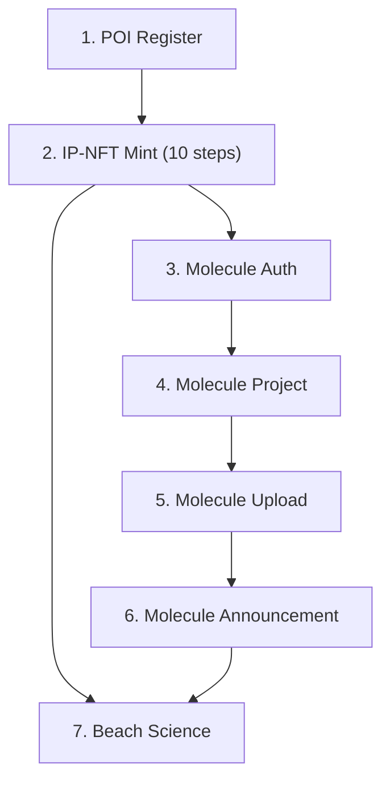

---
tags:
  - skill
  - desci
  - orchestration
aliases:
  - aura-orchestrator
---

# Skill: Aura Orchestrator

Workflow reference for the complete [[DeSci]] pipeline. Documents the canonical execution order, environment variables, and data flow between all DeSci skills.

| Field | Value |
|-------|-------|
| Skill file | `skills/aura-orchestrator/SKILL.md` |
| Type | Documentation (workflow reference) |
| Scope | Multi-skill orchestration |

## Tools Used

All platform primitives: `http_request`, `sign_and_send_transaction`, `sign_message`, `get_wallet_address`, `abi_encode`

## Canonical Workflow

| Phase | Skill | Agent |
|-------|-------|-------|
| 1 | [[Skill - POI Register]] | onchain_minter |
| 2 | [[Skill - IP-NFT Mint]] | onchain_minter |
| 3 | [[Skill - Molecule Auth]] | mol_labs |
| 4 | [[Skill - Molecule Project]] | mol_labs |
| 5 | [[Skill - Molecule Upload]] | mol_labs |
| 6 | [[Skill - Molecule Announcement]] | mol_labs |
| 7 | [[Skill - Beach Science]] | beach_scientist |

## Environment Variables (All Skills)

| Variable | Used By |
|----------|---------|
| `PRIVY_APP_ID` | Wallet, Minting, Auth |
| `PRIVY_APP_SECRET` | Wallet, Minting, Auth |
| `PRIVY_WALLET_ID` | Wallet, Minting, Auth |
| `MOLECULE_API_KEY` | Minting (GraphQL), Auth, Project, Upload, Announcement |
| `MOLECULE_LABS_URL` | Minting (GraphQL), Auth, Project, Upload, Announcement |
| `MOLECULE_CLIENT_URL` | Minting (metadata), Project |
| `POI_API_KEY` | POI Register |
| `BEACH_API_KEY` | Beach Science |

## Output Discipline

> [!important]
> Treat tool outputs as the single source of truth. Never invent IDs, hashes, or URLs. Each step saves structured JSON to workspace files for the next step to read.

## Relations

- **Composes** all DeSci skills into a coherent pipeline
- **Used as reference** by all agents in the [[DeSci]] sandbox
- **Cross-platform** — same workflow works on any platform with `http_request` + crypto primitives

## Related

- [[DeSci]] — sandbox and agent setup
- [[Orchestrator]] — task planning and parallel execution
- [[Skills]] — skill system overview
