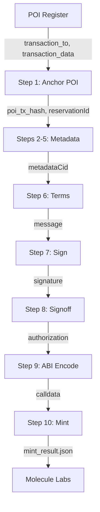

---
tags:
  - skill
  - desci
  - molecule
  - blockchain
aliases:
  - ipnft-mint
---

# Skill: IP-NFT Mint

Full 10-step IP-NFT minting pipeline on Sepolia testnet. Anchors POI on-chain, runs the Molecule GraphQL metadata flow, signs terms, and executes the on-chain mint.

| Field | Value |
|-------|-------|
| Skill file | `skills/ipnft-mint/SKILL.md` |
| Type | Documentation (frontmatter) |
| Contract | `0x152B444e60C526fe4434C721561a077269FcF61a` |
| Chain | Sepolia (11155111) |
| Mint fee | 0.001 ETH |

## Tools Used

- `sign_and_send_transaction` — on-chain POI anchor (step 1) and mint (step 10)
- `http_request` — Molecule GraphQL calls (steps 2-6, 8) and S3 upload (step 4)
- `sign_message` — sign Molecule terms (step 7)
- `abi_encode` — encode `mintReservation` calldata (step 9)
- `get_wallet_address` — resolve minter address

## 10-Step Pipeline

| Step | Tool | Action |
|------|------|--------|
| 1 | `sign_and_send_transaction` | Anchor POI on-chain |
| 2 | `http_request` | GenerateAssignmentAgreement (GraphQL) |
| 3 | `http_request` | GenerateImageUploadUrl (GraphQL) |
| 4 | `http_request` | Upload cover image to presigned S3 URL |
| 5 | `http_request` | UploadMetadataWithImageKey (GraphQL) -> `metadataCid` |
| 6 | `http_request` | GetTermsMessage (GraphQL) |
| 7 | `sign_message` | Sign terms via Privy |
| 8 | `http_request` | SignoffMetadata (GraphQL) -> ==`authorization` bytes== |
| 9 | `abi_encode` | Encode `mintReservation(address,uint256,string,string,bytes)` |
| 10 | `sign_and_send_transaction` | Mint with calldata + 0.001 ETH value |

> [!warning] Steps 2-8 are mandatory
> The `authorization` bytes from step 8 (SignoffMetadata) are required for the mint to succeed. Passing empty bytes (`0x`) causes the contract to revert.

## Data Flow



## Output

Saved to `mint/metadata/mint_result.json`:

```json
{
  "reservation_id": "12345...",
  "token_id": "12345...",
  "poi_tx_hash": "0x...",
  "mint_tx_hash": "0x...",
  "metadata_cid": "Qm...",
  "ipnft_symbol": "VDNA",
  "contract_address": "0x152B444e60C526fe4434C721561a077269FcF61a"
}
```

The `ipnft_uid` for downstream steps is `{contract_address}_{token_id}`.

## Environment Variables

| Variable | Usage |
|----------|-------|
| `MOLECULE_LABS_URL` | Molecule GraphQL endpoint (steps 2-6, 8) |
| `MOLECULE_API_KEY` | x-api-key header for GraphQL |
| `MOLECULE_CLIENT_URL` | Molecule frontend URL (metadata external_url) |

## Relations

- **Requires** [[Skill - POI Register]] output
- **Feeds into** [[Skill - Molecule Project]] (token_id, symbol)
- **Used by agent** `onchain_minter` in [[DeSci]] sandbox

## Related

- [[Skill - POI Register]] — previous step
- [[Skill - Molecule Auth]] — next phase starts here
- [[Tools]] — `abi_encode`, `sign_and_send_transaction` primitives
- [[Wallet]] — Privy wallet setup
