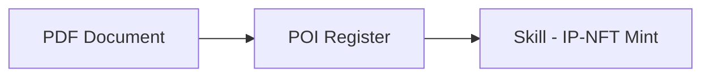

---
tags:
  - skill
  - desci
  - molecule
aliases:
  - poi-register
---

# Skill: POI Register

Register a Proof of Innovation for a research PDF on Molecule testnet. First step in the [[DeSci]] minting pipeline.

| Field | Value |
|-------|-------|
| Skill file | `skills/poi-register/SKILL.md` |
| Type | Documentation (frontmatter) |
| Base URL | `https://testnet.molecule.xyz` |
| Auth | Bearer token (`POI_API_KEY`) |

## Tools Used

- `http_request` — multipart POST with PDF file upload

## Workflow

1. Upload PDF via `http_request` POST to `/api/v1/inventions` with `file_field_name: files`
2. Extract from response: `transaction_to`, `transaction_data`, `merkle_root`
3. Save to `mint/metadata/poi_result.json`

## Output

```json
{
  "transaction_to": "0x...",
  "transaction_data": "0x...",
  "merkle_root": "0x..."
}
```

## Environment Variables

| Variable | Usage |
|----------|-------|
| `POI_API_KEY` | Bearer token for POI API |

## Relations



- **Feeds into** [[Skill - IP-NFT Mint]] (step 1 uses `transaction_to` and `transaction_data`)
- **Used by agent** `onchain_minter` in [[DeSci]] sandbox

## Related

- [[Skill - IP-NFT Mint]] — next step in pipeline
- [[Tools]] — `http_request` primitive
- [[DeSci]] — full pipeline overview
